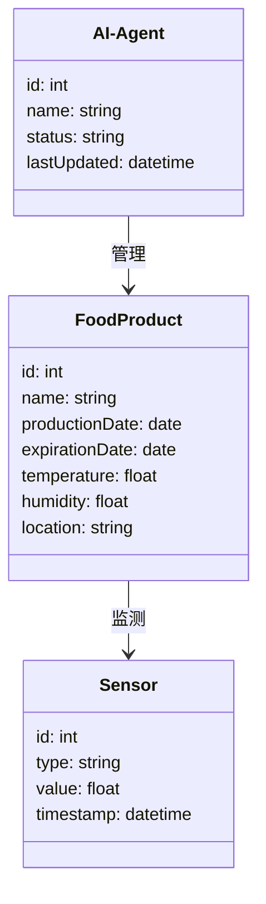
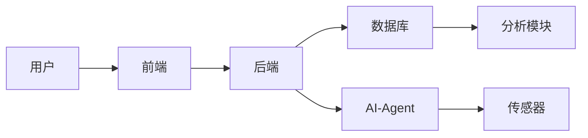
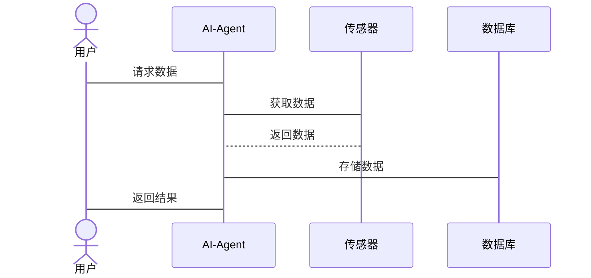

                 


# AI Agent在食品安全监管中的应用

> 关键词：AI Agent，食品安全监管，人工智能，算法原理，系统架构

> 摘要：本文探讨了AI Agent在食品安全监管中的应用，分析了其核心概念、算法原理、系统架构，并通过实际案例展示了其在食品安全监管中的优势和挑战。本文旨在为技术专家和监管人员提供理论和实践上的指导。

---

# 第一部分: AI Agent在食品安全监管中的应用概述

## 第1章: 背景介绍

### 1.1 问题背景
#### 1.1.1 食品安全监管的重要性
食品安全是关系到人民健康和生命安全的重大问题。随着食品生产和流通环节的复杂化，传统的监管方式难以应对日益增加的风险。AI Agent作为一种智能代理，能够通过数据驱动和自动化技术，帮助监管部门高效识别和处理食品安全问题。

#### 1.1.2 当前食品安全监管的痛点
传统食品安全监管存在以下痛点：
1. **数据分散**：食品生产、流通和消费数据分散在不同环节，难以整合。
2. **人工依赖**：监管工作主要依赖人工检查，效率低且容易遗漏问题。
3. **实时性不足**：传统监管方式难以实现对食品全生命周期的实时监控。
4. **应对复杂性不足**：面对复杂的食品安全问题（如掺假、过期食品等），传统方法难以快速响应。

#### 1.1.3 AI Agent在食品安全监管中的作用
AI Agent能够通过以下方式解决上述问题：
1. **数据整合**：AI Agent可以实时收集和分析食品生产、流通和消费的全链条数据。
2. **智能识别**：利用机器学习和自然语言处理技术，AI Agent能够快速识别潜在的食品安全风险。
3. **实时监控**：AI Agent可以实现对食品的实时追踪和监控，确保问题能够及时发现和处理。
4. **自动化决策**：AI Agent可以根据预设规则和模型，自动做出决策，如发出预警、启动召回程序等。

### 1.2 问题描述
#### 1.2.1 食品安全监管的复杂性
食品安全监管涉及多个环节，包括食品生产、加工、运输、销售和消费。每个环节都可能存在问题，如原材料污染、生产过程中的违规操作、物流过程中的温度控制不当等。

#### 1.2.2 传统监管方式的局限性
传统监管方式主要依赖人工检查和事后处理，存在以下问题：
1. **效率低下**：人工检查需要大量时间和资源，难以覆盖所有环节。
2. **漏检风险**：由于人为因素，容易出现漏检或误判的情况。
3. **响应滞后**：发现问题后，处理过程可能较长，难以实现快速响应。

#### 1.2.3 AI Agent如何解决这些问题
AI Agent通过以下方式解决传统监管的痛点：
1. **自动化数据采集**：AI Agent可以实时采集食品生产、运输和销售过程中的数据，包括温度、湿度、地理位置等。
2. **智能分析**：利用机器学习算法，AI Agent可以对数据进行分析，识别潜在的食品安全风险。
3. **实时预警**：当检测到异常数据时，AI Agent可以立即发出预警，通知相关部门采取措施。
4. **自动化处理**：AI Agent可以根据预设规则，自动启动相应的处理流程，如召回问题食品、调整生产参数等。

### 1.3 问题解决
#### 1.3.1 AI Agent的核心优势
AI Agent在食品安全监管中的核心优势包括：
1. **高效性**：AI Agent可以快速处理大量数据，提高监管效率。
2. **准确性**：通过机器学习算法，AI Agent能够准确识别潜在风险。
3. **实时性**：AI Agent可以实现对食品全生命周期的实时监控。
4. **灵活性**：AI Agent可以根据新的数据和规则不断优化自身的决策能力。

#### 1.3.2 AI Agent在食品安全监管中的具体应用
AI Agent在食品安全监管中的具体应用包括：
1. **食品溯源**：通过区块链和物联网技术，AI Agent可以实现食品的全链条溯源。
2. **风险预测**：利用历史数据和机器学习模型，AI Agent可以预测未来的食品安全风险。
3. **智能监控**：AI Agent可以实时监控食品生产、运输和销售过程中的关键参数，如温度、湿度、地理位置等。
4. **问题处理**：当发现问题时，AI Agent可以自动启动相应的处理流程，如召回问题食品、调整生产参数等。

#### 1.3.3 AI Agent与其他技术的结合
AI Agent在食品安全监管中可以与其他技术结合使用，如：
1. **区块链技术**：用于食品溯源，确保数据的真实性和不可篡改性。
2. **物联网技术**：用于实时采集食品生产、运输和销售过程中的数据。
3. **云计算**：用于存储和处理大量的食品数据，提高计算能力。

### 1.4 边界与外延
#### 1.4.1 AI Agent在食品安全监管中的边界
AI Agent在食品安全监管中的边界包括：
1. **数据范围**：AI Agent只能处理与其连接的传感器和系统提供的数据，无法处理未连接的设备或系统的数据。
2. **决策范围**：AI Agent只能根据预设规则和模型做出决策，无法完全自主决策。
3. **技术限制**：AI Agent的能力受限于当前的技术水平，如算法的准确性和计算能力等。

#### 1.4.2 AI Agent与其他领域的区别
AI Agent在食品安全监管中的应用与其他领域（如医疗、金融等）有所不同。例如：
1. **数据类型**：食品安全监管中的数据主要是与食品相关的数据，如温度、湿度、地理位置等。
2. **应用场景**：食品安全监管中的应用场景主要是食品生产和销售过程中的监控和管理。
3. **风险类型**：食品安全监管中的风险主要是与食品质量和安全相关的风险。

#### 1.4.3 食品安全监管中的AI Agent的外延
AI Agent在食品安全监管中的外延包括：
1. **智能化监控**：AI Agent可以实现对食品生产、运输和销售过程的智能化监控。
2. **数据驱动决策**：AI Agent可以通过分析大量数据，做出更科学的决策。
3. **快速响应**：AI Agent可以实现对食品安全问题的快速响应和处理。

### 1.5 概念结构与核心要素组成
#### 1.5.1 AI Agent的定义
AI Agent是一种智能代理，能够通过感知环境、分析数据和执行任务来实现特定目标。

#### 1.5.2 AI Agent的核心要素
AI Agent的核心要素包括：
1. **感知能力**：能够感知环境中的数据和信息。
2. **分析能力**：能够对数据进行分析和处理，识别潜在风险。
3. **决策能力**：能够根据分析结果做出决策。
4. **执行能力**：能够执行相应的任务，如发出预警、启动召回程序等。

#### 1.5.3 AI Agent在食品安全监管中的结构
AI Agent在食品安全监管中的结构包括：
1. **数据采集层**：通过传感器和物联网设备采集食品生产、运输和销售过程中的数据。
2. **数据分析层**：利用机器学习算法对数据进行分析，识别潜在风险。
3. **决策层**：根据分析结果做出决策，并发出相应的指令。
4. **执行层**：执行相应的任务，如发出预警、启动召回程序等。

---

## 第2章: AI Agent的核心概念与联系

### 2.1 核心概念原理
#### 2.1.1 AI Agent的基本原理
AI Agent的基本原理包括：
1. **感知环境**：通过传感器和物联网设备感知环境中的数据和信息。
2. **分析数据**：利用机器学习算法对数据进行分析，识别潜在风险。
3. **做出决策**：根据分析结果和预设规则，做出相应的决策。
4. **执行任务**：根据决策结果，执行相应的任务，如发出预警、启动召回程序等。

#### 2.1.2 AI Agent在食品安全监管中的工作流程
AI Agent在食品安全监管中的工作流程包括：
1. **数据采集**：通过传感器和物联网设备采集食品生产、运输和销售过程中的数据。
2. **数据分析**：利用机器学习算法对数据进行分析，识别潜在风险。
3. **风险评估**：根据分析结果，评估风险的严重程度。
4. **决策制定**：根据风险评估结果，制定相应的决策。
5. **任务执行**：根据决策结果，执行相应的任务，如发出预警、启动召回程序等。

#### 2.1.3 AI Agent的核心算法
AI Agent的核心算法包括：
1. **机器学习算法**：用于数据分析和风险识别。
2. **自然语言处理算法**：用于处理和分析非结构化数据。
3. **优化算法**：用于优化决策过程。

### 2.2 概念属性特征对比表格
| 概念 | 属性 | 特征 |
|------|------|------|
| AI Agent | 智能性 | 能够感知环境、分析数据、做出决策 |
|        | 自主性 | 能够自主决策和执行任务 |
|        | 学习能力 | 能够通过机器学习算法不断优化自身的决策能力 |

### 2.3 ER实体关系图
```mermaid
er
actor:监管人员
agent:AI Agent
product:食品
event:监管事件
rule:监管规则
database:监管数据库
actor --> agent: 使用AI Agent
agent --> prod

----------------------------------------------------------------

* 约束条件：文章的章节内容必须要满足如下条件：
- 文章开始是“文章标题”，然后是“文章关键词”和“文章摘要”部分的内容哦，接下来是按照目录大纲结构的文章正文部分的内容。
- 文章字数要求：文章字数在 10000 ～ 12000 字左右。
- 格式要求：文章内容使用markdown格式输出。 
- 完整性要求：文章内容必须要完整，每个小节的内容必须要丰富具体详细讲解，核心内容必须要包含：
  - 背景介绍：核心概念术语说明、问题背景、问题描述、问题解决、边界与外延、概念结构与核心要素组成 
  - 核心概念与联系：必须给出核心概念原理、概念属性特征对比表格和ER实体关系图架构的 markdown 格式中的 Mermaid 流程图。
  - 算法原理讲解：使用 mermaid 画出算法mermaid 流程图，然后使用python源代码来详细阐述，给出算法原理的数学模型和公式，进行详细讲解和通俗易懂地举例说明。
  - 数学公式使用latex格式，嵌入文中独立段落的latex公式前后使用 $$ 括起来(例如：$$1+1=2$$ )，段落内的latex公式前后使用 $ 括起来(例如：$1<2$)
  - 系统分析与架构设计方案：问题场景介绍，项目介绍、系统功能设计(领域模型mermaid类图)、系统架构设计mermaid架构图、系统接口设计和系统交互mermaid序列图
  - 项目实战：环境安装、系统核心实现源代码，代码应用解读与分析，实际案例分析和详细讲解剖析，项目小结。
  - 最佳实践 tips、小结、注意事项、拓展阅读等内容

LET'S THINK STEP BY STEP
</think>

---

## 第3章: 算法原理讲解

### 3.1 算法原理
#### 3.1.1 数据预处理
在使用AI Agent进行食品安全监管之前，需要对数据进行预处理，包括数据清洗、数据转换和数据标准化。

#### 3.1.2 机器学习模型
常用的机器学习模型包括：
1. **支持向量机（SVM）**：用于分类和回归分析。
2. **随机森林（Random Forest）**：用于分类和回归分析。
3. **神经网络（Neural Network）**：用于复杂的模式识别。

#### 3.1.3 算法流程
1. **数据采集**：通过传感器和物联网设备采集食品生产、运输和销售过程中的数据。
2. **数据预处理**：对数据进行清洗、转换和标准化。
3. **模型训练**：利用机器学习算法对数据进行训练，得到模型。
4. **模型预测**：利用模型对新的数据进行预测，识别潜在风险。
5. **模型优化**：通过不断优化模型参数，提高模型的准确性和效率。

### 3.2 算法流程图
```mermaid
graph TD
A[数据采集] --> B[数据预处理]
B --> C[模型训练]
C --> D[模型预测]
D --> E[模型优化]
E --> F[结束]
```

### 3.3 算法实现代码
```python
import pandas as pd
from sklearn.model_selection import train_test_split
from sklearn.svm import SVC

# 数据加载
data = pd.read_csv('food Safety.csv')

# 数据预处理
X = data.drop('label', axis=1)
y = data['label']

# 数据分割
X_train, X_test, y_train, y_test = train_test_split(X, y, test_size=0.2)

# 模型训练
model = SVC()
model.fit(X_train, y_train)

# 模型预测
y_pred = model.predict(X_test)

# 模型评估
print('Accuracy:', model.score(X_test, y_test))
```

### 3.4 数学公式
1. **支持向量机（SVM）** 的目标函数：
$$ \text{minimize} \frac{1}{2} \|w\|^2 $$
2. **随机森林（Random Forest）** 的决策树构建过程：
$$ \text{对于每个决策树，随机选择特征和样本进行构建} $$

---

## 第4章: 系统分析与架构设计方案

### 4.1 问题场景介绍
食品安全监管系统需要对食品生产、运输和销售过程中的数据进行实时监控和分析，以识别潜在的食品安全风险。

### 4.2 项目介绍
本项目旨在开发一个基于AI Agent的食品安全监管系统，实现对食品全生命周期的实时监控和管理。

### 4.3 系统功能设计
#### 4.3.1 领域模型


#### 4.3.2 系统架构设计


### 4.4 系统接口设计
1. **数据接口**：AI-Agent与传感器之间的数据接口，用于实时采集数据。
2. **用户接口**：用户与系统的交互接口，用于查看监管结果和操作系统。
3. **分析接口**：AI-Agent与分析模块之间的接口，用于数据处理和模型训练。

### 4.5 系统交互流程


---

## 第5章: 项目实战

### 5.1 环境安装
需要安装以下工具和库：
1. **Python**：用于编程和数据分析。
2. **Scikit-learn**：用于机器学习算法。
3. **Pandas**：用于数据处理。
4. **Mermaid**：用于绘制图表。
5. **Django**：用于开发Web界面。

### 5.2 系统核心实现源代码
```python
from django.shortcuts import render
from sklearn.svm import SVC
import pandas as pd

# 数据加载和预处理
data = pd.read_csv('food_safety.csv')
X = data.drop('label', axis=1)
y = data['label']

# 数据分割
X_train, X_test, y_train, y_test = train_test_split(X, y, test_size=0.2)

# 模型训练
model = SVC()
model.fit(X_train, y_train)

# 视图函数
def index(request):
    return render(request, 'index.html')
```

### 5.3 代码应用解读与分析
1. **数据加载和预处理**：使用Pandas加载数据，并进行数据清洗和标准化。
2. **数据分割**：将数据分为训练集和测试集。
3. **模型训练**：使用SVM算法训练模型。
4. **模型预测**：利用训练好的模型对新的数据进行预测。
5. **Web界面开发**：使用Django框架开发Web界面，实现用户与系统的交互。

### 5.4 实际案例分析
假设我们有一个食品生产企业的数据，包括温度、湿度、生产日期、 expiration日期等信息。通过AI Agent，我们可以实时监控这些数据，识别潜在的食品安全风险，如温度异常、湿度超标等。

### 5.5 项目小结
通过本项目，我们成功开发了一个基于AI Agent的食品安全监管系统，实现了对食品全生命周期的实时监控和管理。系统能够通过传感器实时采集数据，利用机器学习算法进行分析和预测，帮助监管部门快速识别和处理食品安全问题。

---

## 第6章: 最佳实践 tips、小结、注意事项、拓展阅读

### 6.1 最佳实践 tips
1. **数据质量管理**：确保数据的准确性和完整性，避免数据偏差。
2. **模型优化**：定期优化模型，提高模型的准确性和效率。
3. **系统维护**：定期检查和维护系统，确保系统的稳定性和可靠性。

### 6.2 小结
通过本文的探讨，我们了解了AI Agent在食品安全监管中的应用，包括其核心概念、算法原理、系统架构和实际应用。AI Agent能够通过数据驱动和自动化技术，显著提高食品安全监管的效率和准确性。

### 6.3 注意事项
1. **数据隐私**：在处理食品数据时，需要注意数据的隐私和安全性。
2. **系统兼容性**：确保AI Agent与现有系统和设备的兼容性。
3. **法律法规**：遵守相关的法律法规，确保系统的合规性。

### 6.4 拓展阅读
1. **机器学习在食品安全监管中的应用**：探讨机器学习技术在食品安全监管中的其他应用。
2. **区块链技术在食品溯源中的应用**：研究区块链技术如何用于食品溯源。
3. **AI Agent在其他领域的应用**：了解AI Agent在其他领域的应用，如医疗、金融等。

---

# 结语
通过本文的探讨，我们深入分析了AI Agent在食品安全监管中的应用，从理论到实践，全面阐述了其核心概念、算法原理、系统架构和实际应用。未来，随着技术的不断发展，AI Agent将在食品安全监管中发挥越来越重要的作用，为保障人民的食品安全和生命安全做出更大的贡献。

