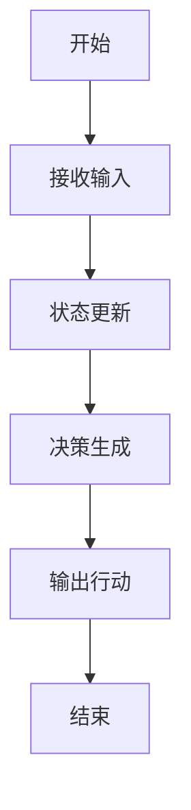
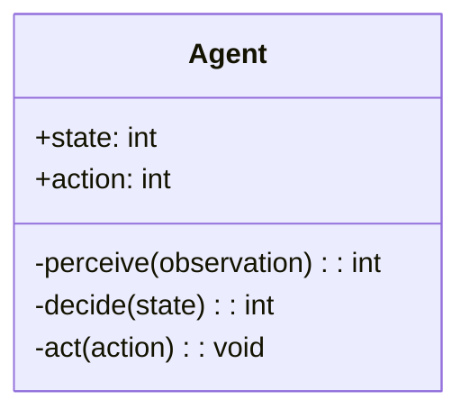
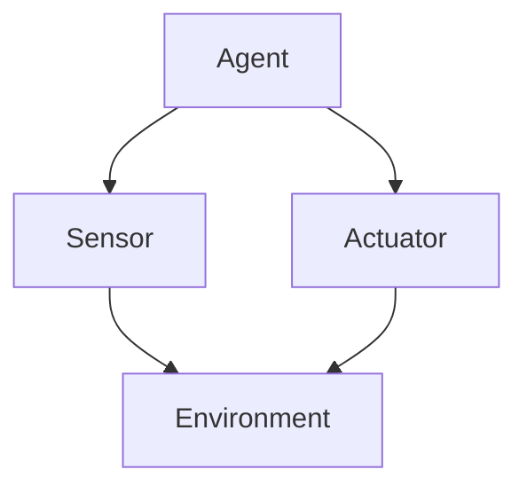

                 


# AI Agent基础概念介绍

> 关键词：AI Agent、人工智能、算法原理、系统架构、项目实战

> 摘要：本文从AI Agent的基本概念出发，详细阐述了AI Agent的核心概念、算法原理、系统架构设计以及实际项目中的应用。通过理论与实践相结合的方式，帮助读者全面理解AI Agent的技术本质和应用场景。

---

# 第一部分: AI Agent基础概念与背景

## 第1章: AI Agent概述

### 1.1 AI Agent的基本概念

#### 1.1.1 什么是AI Agent
AI Agent（人工智能代理）是指能够感知环境、自主决策并采取行动以实现目标的智能实体。它能够根据环境信息做出决策，并通过执行动作与环境交互。

$$
\text{AI Agent的定义可以表示为：} \quad \text{Agent} = \{\text{Perception, Planning, Decision, Action}\}
$$

- **感知（Perception）**：通过传感器或接口获取环境信息。
- **推理（Reasoning）**：基于感知信息进行逻辑推理。
- **决策（Decision）**：根据推理结果制定行动计划。
- **行动（Action）**：执行决策以改变环境或自身状态。

#### 1.1.2 AI Agent的核心特征
AI Agent具有以下核心特征：
1. **自主性**：能够在没有外部干预的情况下自主运行。
2. **反应性**：能够实时感知环境并做出反应。
3. **目标导向性**：具有明确的目标，并通过行动实现目标。
4. **学习能力**：能够通过经验改进性能。

#### 1.1.3 AI Agent的分类与应用场景
AI Agent可以根据功能、智能水平和环境类型进行分类：

| **分类维度** | **分类类型** | **应用场景** |
|--------------|--------------|--------------|
| 智能水平     | 基于规则的代理 | 交通信号灯控制、简单的自动化系统 |
|              | 基于模型的代理 | 复杂环境下的任务规划、博弈论中的策略制定 |
|              | 学习型代理   | 机器人、自动驾驶、智能推荐系统 |
| 环境类型     | 静态环境     | 工厂自动化控制、智能家居 |
|              | 动态环境     | 自动驾驶、智能客服 |
| 功能类型     | 监督代理     | 安全监控系统、医疗诊断辅助 |
|              | 无监督代理   | 数据挖掘、模式识别 |

---

### 1.2 AI Agent的背景与问题背景

#### 1.2.1 人工智能发展的历史与现状
人工智能（AI）的发展可以追溯到20世纪50年代，近年来随着深度学习和大数据技术的突破，AI技术得到了广泛应用。AI Agent作为AI的核心技术之一，逐渐在各个领域展现出强大的潜力。

#### 1.2.2 传统AI与AI Agent的区别
传统AI通常指基于规则的专家系统，而AI Agent更强调自主性和动态性。例如，传统AI可以用于医疗诊断系统，而AI Agent可以用于自动驾驶汽车，能够实时感知环境并做出决策。

#### 1.2.3 当前AI Agent技术面临的挑战
当前AI Agent技术面临以下挑战：
1. **复杂环境下的决策能力**：在动态和不确定的环境中，AI Agent需要更强的推理和学习能力。
2. **多智能体协作**：在多智能体系统中，需要解决通信、协作和冲突问题。
3. **实时性与效率**：在实时应用中，AI Agent需要在极短时间内完成决策和行动。

---

### 1.3 AI Agent的核心问题与边界

#### 1.3.1 AI Agent的目标与任务
AI Agent的目标是通过感知和行动实现预设的目标。例如，自动驾驶汽车的目标是安全地将乘客从起点送到终点。

#### 1.3.2 AI Agent的边界与外延
AI Agent的边界包括：
1. **感知边界**：AI Agent只能感知其传感器或接口可获取的信息。
2. **行动边界**：AI Agent的行动能力受限于其物理或软件接口。
3. **知识边界**：AI Agent的知识来源于预设的模型或经验数据。

#### 1.3.3 AI Agent与相关概念的对比
以下是AI Agent与其他相关概念的对比：

| **概念**       | **定义**                                                                 | **应用场景**                         |
|----------------|--------------------------------------------------------------------------|--------------------------------------|
| 专家系统       | 基于知识库和推理规则的系统，用于解决特定领域的问题。                   | 医疗诊断、金融分析                   |
| 智能体（Agent） | 能够感知环境、自主决策并采取行动的实体。                             | 自动化控制、游戏AI                   |
| 机器学习模型   | 通过数据训练得到的数学模型，能够从经验中改进性能。                   | 图像识别、语音识别                   |

---

# 第二部分: AI Agent的核心概念与联系

## 第2章: AI Agent的核心概念与联系

### 2.1 AI Agent的核心概念原理

#### 2.1.1 知识表示与推理
知识表示是AI Agent的核心技术之一。常见的知识表示方法包括：
1. **谓词逻辑**：用于表示事实和规则。
2. **语义网络**：通过节点和边表示概念及其关系。
3. **描述逻辑**：用于表示复杂概念和属性。

#### 2.1.2 行为规划与决策
行为规划是AI Agent实现目标的关键步骤。常见的规划方法包括：
1. **基于规则的规划**：通过预设规则生成行动。
2. **基于模型的规划**：基于环境模型生成最优行动。
3. **强化学习规划**：通过奖励机制优化行动策略。

#### 2.1.3 感知与交互
AI Agent需要通过传感器或接口与环境交互。例如，自动驾驶汽车通过摄像头、雷达和激光雷达感知环境。

### 2.2 核心概念属性特征对比

| **概念**       | **属性**           | **特征**                                                                 |
|----------------|-------------------|--------------------------------------------------------------------------|
| 知识表示       | 表达方式           | 谓词逻辑、语义网络、描述逻辑                                           |
| 行为规划       | 方法               | 基于规则、基于模型、强化学习                                           |
| 感知与交互     | 传感器类型         | 视觉、听觉、触觉、嗅觉                                                 |
| 决策与行动     | 策略               | 确定性策略、概率策略                                                   |

### 2.3 ER实体关系图架构

```mermaid
er
actor(Agent, "与环境交互")
```

---

## 第3章: AI Agent的算法原理

### 3.1 算法原理概述

#### 3.1.1 AI Agent的基本算法框架
AI Agent的算法框架通常包括感知、推理、决策和行动四个步骤：

1. **感知**：通过传感器获取环境信息。
2. **推理**：基于感知信息进行逻辑推理。
3. **决策**：根据推理结果制定行动计划。
4. **行动**：执行决策以改变环境或自身状态。

#### 3.1.2 常见AI Agent算法类型
常见的AI Agent算法包括：
1. **基于规则的算法**：通过预设规则进行决策。
2. **基于模型的算法**：基于环境模型进行优化决策。
3. **强化学习算法**：通过奖励机制优化行动策略。

### 3.2 算法流程图



### 3.3 Python源代码实现

#### 3.3.1 基于规则的AI Agent实现

```python
class RuleBasedAgent:
    def __init__(self, rules):
        self.rules = rules  # 预设规则，例如：(条件, 动作)

    def perceive(self, observation):
        # 根据观测信息生成决策
        for condition, action in self.rules:
            if condition(observation):
                return action
        return None

    def act(self, observation):
        decision = self.perceive(observation)
        return decision
```

#### 3.3.2 强化学习算法实现

```python
import numpy as np
import random

class QLearningAgent:
    def __init__(self, state_space_size, action_space_size):
        self.q_table = np.zeros((state_space_size, action_space_size))
        self.learning_rate = 0.1
        self.discount_factor = 0.9

    def perceive(self, observation):
        # 将观测转换为状态索引
        state = observation['state']
        return state

    def decide(self, state):
        # 随机选择动作（探索）
        if random.random() < 0.1:
            return random.randint(0, self.q_table.shape[1] - 1)
        # 选择最大Q值的动作（利用）
        return np.argmax(self.q_table[state])

    def update(self, state, action, reward):
        # 更新Q表
        self.q_table[state, action] = self.q_table[state, action] * self.discount_factor + \
                                        self.learning_rate * reward
```

---

## 第4章: AI Agent的系统架构设计

### 4.1 系统功能设计

#### 4.1.1 领域模型设计



#### 4.1.2 系统架构设计



#### 4.1.3 系统接口设计
以下是AI Agent系统的接口设计：

| **接口名称** | **输入**       | **输出**       |
|--------------|----------------|----------------|
| perceive     | observation    | state          |
| decide       | state          | action         |
| act          | action         | -              |

---

## 第5章: AI Agent的项目实战

### 5.1 环境安装与配置

```bash
pip install numpy matplotlib
```

### 5.2 系统核心实现源代码

```python
class Agent:
    def __init__(self, state_space, action_space):
        self.state_space = state_space
        self.action_space = action_space
        self.current_state = 0

    def perceive(self, observation):
        self.current_state = observation['state']
        return self.current_state

    def decide(self):
        # 假设使用随机策略
        return random.randint(0, self.action_space - 1)

    def act(self, action):
        # 假设环境是模拟环境，直接返回奖励
        return random.uniform(0, 1)
```

### 5.3 代码应用解读与分析
1. **初始化**：AI Agent初始化时需要指定状态空间和动作空间。
2. **感知**：通过传感器获取环境状态。
3. **决策**：基于当前状态选择动作。
4. **行动**：执行动作并返回奖励。

### 5.4 实际案例分析
以下是一个简单的AI Agent案例，用于模拟交通灯控制：

```python
class TrafficLightAgent(Agent):
    def __init__(self, state_space, action_space):
        super().__init__(state_space, action_space)
        self.red_light = False

    def decide(self):
        if self.current_state == 0:
            self.red_light = True
            return 0  # 切换红灯
        elif self.current_state == 1:
            self.red_light = False
            return 1  # 切换绿灯
        else:
            return random.randint(0, 1)
```

---

## 第6章: 总结与展望

### 6.1 最佳实践Tips
- **明确目标**：在设计AI Agent时，首先要明确其目标和任务。
- **选择合适的算法**：根据应用场景选择合适的算法。
- **持续优化**：通过数据反馈不断优化AI Agent的性能。

### 6.2 小结
AI Agent作为人工智能的核心技术，正在逐步渗透到各个领域。通过本文的介绍，读者可以全面理解AI Agent的基本概念、算法原理和系统架构设计。

### 6.3 注意事项
- AI Agent的设计需要考虑环境的动态性和不确定性。
- 在实际应用中，需要结合具体场景进行优化。

### 6.4 拓展阅读
- 《AI Agent的强化学习原理》
- 《多智能体系统与协作》
- 《基于模型的AI Agent设计》

---

通过以上内容，我们系统地介绍了AI Agent的基础概念、算法原理和实际应用。希望本文能为读者提供有价值的参考和启发。

