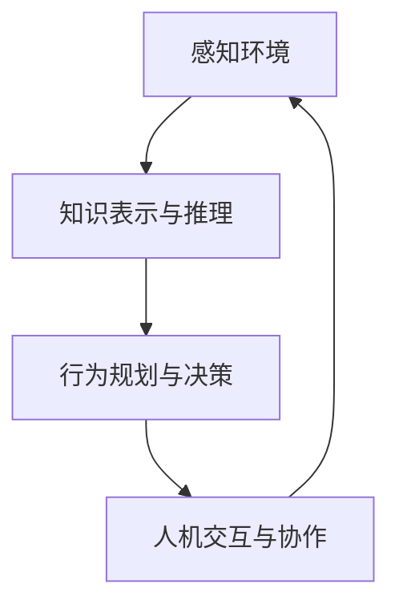
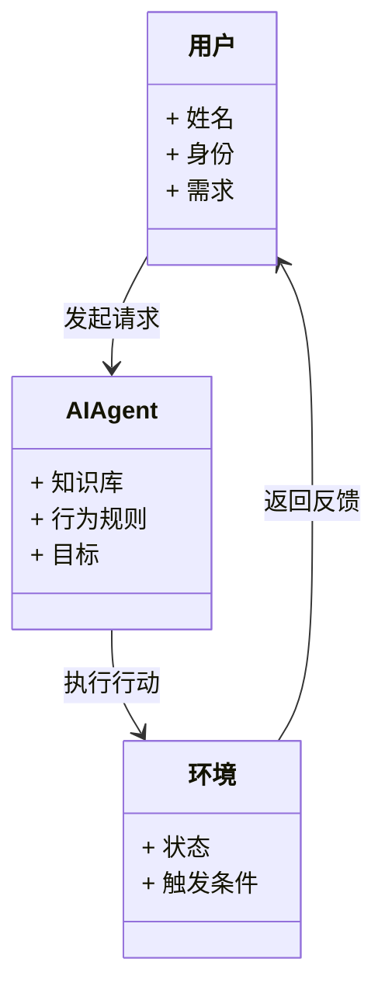
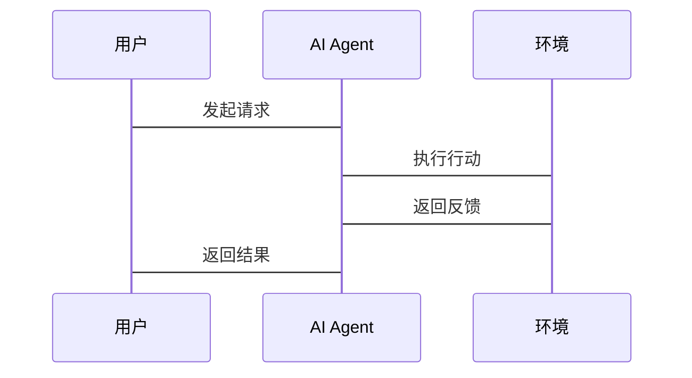

                 


# AI Agent基础：企业应用中的核心概念与重要性

## 关键词：AI Agent，企业应用，核心概念，算法原理，系统架构，项目实战，最佳实践

## 摘要

AI Agent作为一种智能化的软件实体，正在企业应用中发挥越来越重要的作用。本文将从AI Agent的基本概念、核心原理、算法实现、系统架构设计、项目实战等多个方面进行详细讲解。通过实际案例分析和代码实现，帮助读者深入理解AI Agent在企业应用中的重要性，并掌握其核心技术和应用方法。

---

# 第一部分: AI Agent概述

## 第1章: AI Agent的基本概念

### 1.1 什么是AI Agent？

AI Agent（智能体）是指能够感知环境、自主决策并采取行动的实体。它通过传感器获取信息，利用知识库进行推理，并通过执行器与环境交互。AI Agent的核心目标是帮助人类完成复杂任务，提高效率和准确性。

### 1.2 AI Agent的定义与特点

AI Agent的定义可以概括为：一种能够感知环境、自主决策并执行任务的智能实体。其特点包括：

1. **自主性**：能够在没有外部干预的情况下独立运作。
2. **反应性**：能够实时感知环境变化并做出相应反应。
3. **目标导向性**：通过设定目标来指导行为和决策。
4. **学习能力**：能够通过经验改进自身的知识和行为策略。

### 1.3 AI Agent的分类与应用场景

AI Agent可以根据功能和应用场景分为以下几类：

1. **简单反射型AI Agent**：基于预设规则进行反应，适用于简单的自动化任务。
2. **基于模型的反应式AI Agent**：利用内部模型进行决策，适用于复杂环境中的任务。
3. **目标驱动型AI Agent**：以目标为导向，通过规划和推理实现任务。
4. **实用驱动型AI Agent**：通过优化目标函数实现最优决策，常用于复杂问题求解。

AI Agent在企业中的应用场景包括：智能客服、自动化运维、智能推荐、流程自动化优化等。

---

## 第2章: AI Agent的核心概念

### 2.1 AI Agent的核心原理

AI Agent的核心原理包括知识表示与推理、行为规划与决策、人机交互与协作。以下是具体的实现步骤：

1. **知识表示与推理**：将知识以符号或数据结构的形式表示，并通过推理算法得出结论。
2. **行为规划与决策**：根据当前状态和目标，生成行动计划并选择最优行动。
3. **人机交互与协作**：通过自然语言处理等技术与人类进行交互，协作完成任务。

### 2.2 AI Agent的属性特征对比

以下是几种AI Agent的属性特征对比：

| 属性 | 简单反射型AI Agent | 基于模型的反应式AI Agent | 目标驱动型AI Agent | 实用驱动型AI Agent |
|------|---------------------|--------------------------|--------------------|-------------------|
| 知识表示 | 基于规则           | 基于内部模型             | 基于目标           | 基于目标函数     |
| 决策方式 | 简单规则匹配       | 基于模型推理             | 基于目标规划       | 基于优化算法     |
| 学习能力 | 无                 | 无                       | 有                 | 强               |

### 2.3 ER实体关系图的构建

以下是AI Agent的ER实体关系图：

```mermaid
er
actor: 用户
agent: AI Agent
action: 行动
status: 状态
goal: 目标

actor --> action: 发起行动
agent --> action: 执行行动
action --> status: 改变状态
status --> goal: 影响目标
```

---

## 第3章: AI Agent的算法原理

### 3.1 AI Agent的算法流程

以下是AI Agent的算法流程图：



### 3.2 算法的数学模型与公式

知识表示与推理的数学模型可以表示为：

$$
\text{知识库} = \{ (s, a, o) | s \in S, a \in A, o \in O \}
$$

其中，S是状态集合，A是动作集合，O是观察集合。

行为规划与决策的数学公式可以表示为：

$$
\text{最优行动} = \arg\min_{a \in A} (C(a) - V(a))
$$

其中，C(a)是行动a的成本，V(a)是行动a的价值。

---

## 第4章: AI Agent的系统架构设计

### 4.1 系统功能设计

以下是系统功能设计的领域模型：



### 4.2 系统交互设计

以下是系统交互的Mermaid序列图：



---

## 第5章: AI Agent的项目实战

### 5.1 环境安装与配置

安装Python和必要的库：

```bash
pip install numpy matplotlib
```

### 5.2 核心代码实现

以下是Python代码实现：

```python
class AI_Agent:
    def __init__(self, knowledge_base):
        self.knowledge_base = knowledge_base

    def perceive(self, input_data):
        # 感知环境并返回推理结果
        pass

    def decide(self, input_data):
        # 基于推理结果做出决策
        pass

    def interact(self, input_data):
        # 与用户交互
        pass

# 示例使用
knowledge_base = {
    "规则": ["规则1", "规则2"],
    "目标": ["目标1", "目标2"]
}

agent = AI_Agent(knowledge_base)
```

### 5.3 代码解读与分析

上述代码定义了一个AI Agent类，包括知识库初始化、感知、决策和交互方法。通过具体案例分析，可以进一步优化和改进代码，以适应实际应用场景。

---

## 第6章: 最佳实践

### 6.1 小结

AI Agent作为企业智能化转型的重要工具，其核心概念和算法原理需要深入理解。通过实际项目实战，可以更好地掌握其应用方法。

### 6.2 注意事项

1. **数据质量**：确保知识库和训练数据的质量，避免错误推理。
2. **算法选择**：根据具体场景选择合适的算法和模型。
3. **人机协作**：注重人机交互设计，提升用户体验。

### 6.3 拓展阅读

建议进一步阅读相关书籍和文献，深入理解AI Agent的理论和实践应用。

---

通过以上内容，我们可以全面了解AI Agent在企业应用中的核心概念与重要性，并掌握其实际应用方法。希望本文能为读者提供有价值的参考和指导。

