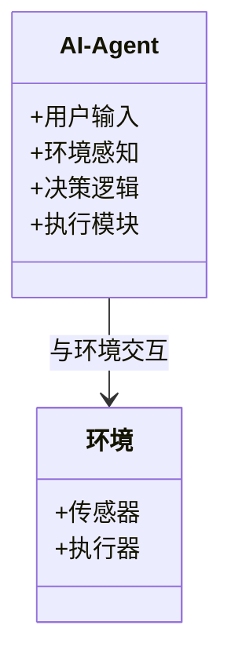
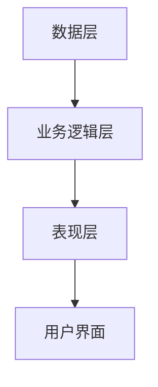
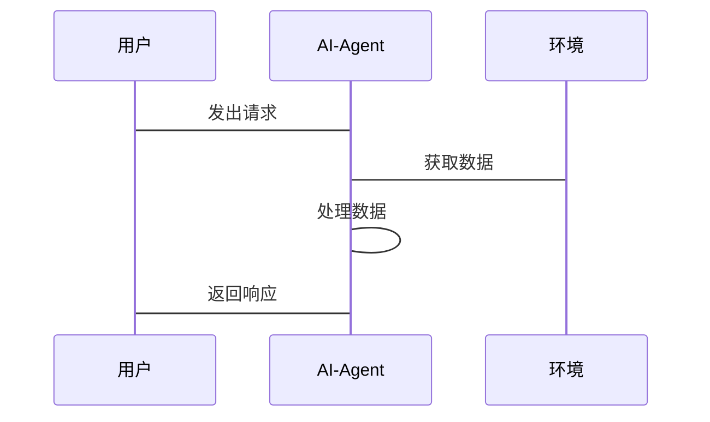

                 

# AI Agent开发中的法律与伦理考量

> 关键词：AI Agent, 法律合规, 伦理设计, 数据隐私, 算法偏见, 系统安全

> 摘要：随着人工智能技术的快速发展，AI Agent（智能体）在各个领域的应用日益广泛。然而，在AI Agent的开发过程中，法律和伦理问题也随之浮现。本文将从法律和伦理两个维度，详细探讨AI Agent开发中的关键问题，包括数据隐私、算法偏见、责任划分等，并提供解决方案和最佳实践。

---

## 第1章 AI Agent开发中的法律与伦理概述

### 1.1 AI Agent的基本概念

#### 1.1.1 AI Agent的定义与核心要素
AI Agent（智能体）是指能够感知环境并采取行动以实现目标的实体。其核心要素包括：
- **感知能力**：通过传感器或数据输入感知环境。
- **决策能力**：基于感知信息做出决策。
- **行动能力**：通过执行器或接口采取行动。
- **学习能力**：通过机器学习算法不断优化性能。

#### 1.1.2 AI Agent的分类与应用场景
AI Agent可以分为以下几类：
- **简单反射型**：基于规则的简单响应。
- **基于模型的反应型**：基于环境模型做出决策。
- **目标驱动型**：为实现特定目标而行动。
- **实用驱动型**：通过效用函数优化行动。

应用场景包括智能助手、自动驾驶、智能客服、机器人等。

#### 1.1.3 AI Agent开发的基本流程
AI Agent的开发流程通常包括：
1. **需求分析**：明确目标和功能。
2. **数据收集**：获取训练数据。
3. **模型训练**：使用机器学习算法训练模型。
4. **系统集成**：将模型集成到系统中。
5. **测试与优化**：测试性能并进行优化。
6. **部署与监控**：部署系统并实时监控。

### 1.2 法律与伦理在AI Agent开发中的重要性

#### 1.2.1 法律合规性的重要性
AI Agent的开发和应用必须遵守相关法律法规，例如：
- **数据隐私**：遵循《通用数据保护条例》（GDPR）等法规。
- **责任划分**：明确AI Agent在错误决策中的法律责任。
- **透明度**：确保用户知情权和选择权。

#### 1.2.2 伦理问题对社会的影响
AI Agent的伦理问题可能引发社会不公或信任危机，例如：
- **算法偏见**：可能导致不公平的决策。
- **隐私侵犯**：未经用户同意收集和使用数据。
- **安全风险**：恶意攻击可能导致系统失控。

#### 1.2.3 法律与伦理的相互关系
法律为AI Agent的开发提供了框架，而伦理则指导开发者在法律之外的行为规范。两者的结合确保了技术的可持续发展。

---

## 第2章 数据隐私与AI Agent

### 2.1 数据隐私的基本概念

#### 2.1.1 数据隐私的定义
数据隐私是指个人对个人数据的控制权，确保数据不被未经授权的第三方访问或使用。

#### 2.1.2 数据隐私的保护原则
- **最小化原则**：只收集必要的数据。
- **目的限制原则**：数据仅用于特定目的。
- **存储限制原则**：数据存储时间不超过必要期限。

### 2.2 AI Agent中的数据收集与处理

#### 2.2.1 数据收集的合法性
- **数据来源**：确保数据来源合法，避免非法爬取。
- **用户同意**：明确获得用户的授权。

#### 2.2.2 数据处理的合规性
- **匿名化处理**：对敏感数据进行匿名化处理，避免识别个人身份。
- **数据加密**：在传输和存储过程中加密数据，防止数据泄露。

#### 2.2.3 数据隐私保护的技术手段
- **联邦学习**：在数据不集中的情况下进行模型训练，保护数据隐私。
- **同态加密**：在加密状态下进行数据计算，确保数据安全。

### 2.3 典型案例分析

#### 2.3.1 GDPR对AI Agent开发的影响
欧盟的《通用数据保护条例》（GDPR）要求AI Agent开发者在数据处理中严格遵守隐私保护规定，例如：
- 用户数据必须明确授权。
- 数据泄露必须及时通知用户。

#### 2.3.2 数据泄露事件的启示
2020年，某社交网络公司因数据泄露事件被罚款5000万欧元，这凸显了数据隐私保护的重要性。

---

## 第3章 偏见与公平性

### 3.1 偏见的定义与表现形式

#### 3.1.1 数据偏见的来源
- **数据样本偏差**：训练数据集中某些群体比例失衡。
- **标签偏差**：数据标注过程中的主观性。

#### 3.1.2 算法偏见的形成机制
- **算法学习数据中的偏见**：算法通过学习数据中的偏见进行分类或预测。
- **决策过程中的偏见放大**：算法在决策过程中放大了数据中的偏见。

### 3.2 公平性在AI Agent中的实现

#### 3.2.1 数据清洗与预处理
- **样本均衡化**：通过过采样或欠采样技术平衡数据分布。
- **去除敏感特征**：在训练数据中去除可能导致偏见的特征，例如种族或性别。

#### 3.2.2 算法优化与调整
- **对抗训练**：通过引入对抗网络消除算法偏见。
- **公平性约束**：在损失函数中加入公平性约束，确保算法决策的公平性。

### 3.3 典型案例

#### 3.3.1 AI招聘工具的偏见问题
某AI招聘工具因算法偏见拒绝了大量女性求职者，后来通过调整算法解决了问题。

---

## 第4章 透明度与可解释性

### 4.1 透明度的基本概念
透明度是指AI Agent的决策过程对用户或开发者公开、可理解。

### 4.2 可解释性的重要性
- **用户信任**：用户信任AI Agent的决策过程。
- **责任追究**：在出现问题时能够追溯原因。

### 4.3 提高透明度的技术手段
- **决策日志**：记录AI Agent的决策过程和原因。
- **可视化工具**：通过图形化界面展示决策逻辑。

---

## 第5章 安全与风险评估

### 5.1 安全的基本概念
AI Agent的安全性包括数据安全、系统安全和网络安全。

### 5.2 风险评估的重要性
- **潜在风险识别**：识别AI Agent可能面临的各类风险。
- **风险缓解策略**：制定应对策略，降低风险影响。

### 5.3 安全设计的关键点
- **身份认证**：确保只有授权用户可以访问系统。
- **访问控制**：限制用户的访问权限，避免越权操作。
- **入侵检测**：实时监控系统，发现异常行为及时报警。

---

## 第6章 系统架构与伦理设计

### 6.1 系统架构设计

#### 6.1.1 领域模型
- **领域模型**：展示系统的功能模块和数据流。

#### 6.1.2 系统架构
- **分层架构**：将系统分为数据层、业务逻辑层和表现层。

#### 6.1.3 系统接口
- **API设计**：定义清晰的API接口，确保数据交互的安全性和合法性。

#### 6.1.4 系统交互
- **交互流程**：展示用户与AI Agent的交互过程。

---

## 第7章 项目实战

### 7.1 项目背景
某公司开发一款智能客服AI Agent，用于自动处理客户咨询。

### 7.2 数据隐私保护
- **数据加密**：对客户咨询内容进行加密存储。
- **访问控制**：限制只有授权员工可以访问数据。

### 7.3 伦理设计
- **透明度**：向用户展示AI Agent的决策逻辑。
- **公平性**：确保不同客户群体的咨询得到平等处理。

### 7.4 安全设计
- **身份认证**：用户需登录后才能使用智能客服。
- **入侵检测**：实时监控系统，防止黑客攻击。

### 7.5 实际案例分析
分析某智能客服系统的成功经验，总结法律与伦理设计的关键点。

---

## 第8章 未来展望

### 8.1 法律与伦理对AI Agent的深远影响
- **法规趋严**：未来可能出台更多关于AI Agent的法律法规。
- **伦理标准统一**：行业可能形成统一的伦理标准。

### 8.2 技术与社会的平衡
- **技术进步**：AI Agent技术的不断进步将推动社会变革。
- **社会接受度**：社会对AI Agent的接受度将影响其发展。

---

## 第9章 总结与建议

### 9.1 关键点总结
- **法律合规**：确保AI Agent开发和应用符合相关法律法规。
- **伦理设计**：从偏见、透明度、安全等方面进行伦理设计。
- **系统架构**：在系统设计中融入法律与伦理考量。

### 9.2 最佳实践
- **团队协作**：法律、伦理和工程技术团队紧密合作。
- **持续优化**：定期检查和优化系统的法律与伦理合规性。

### 9.3 注意事项
- **法律动态更新**：密切关注法律法规的变化。
- **伦理问题预见性**：提前预见可能的伦理问题并制定应对策略。

---

## 第10章 拓展阅读

### 10.1 推荐书籍
- 《人工智能：法律与伦理》
- 《数据隐私与保护》

### 10.2 相关技术博客
- AI-Agent开发中的数据隐私保护技术
- 机器学习中的算法公平性研究

---

通过以上内容，我们可以看到，AI Agent的开发不仅需要强大的技术能力，还需要在法律和伦理层面进行深入考量。只有在合规的前提下，才能真正实现技术的广泛应用和社会价值。

