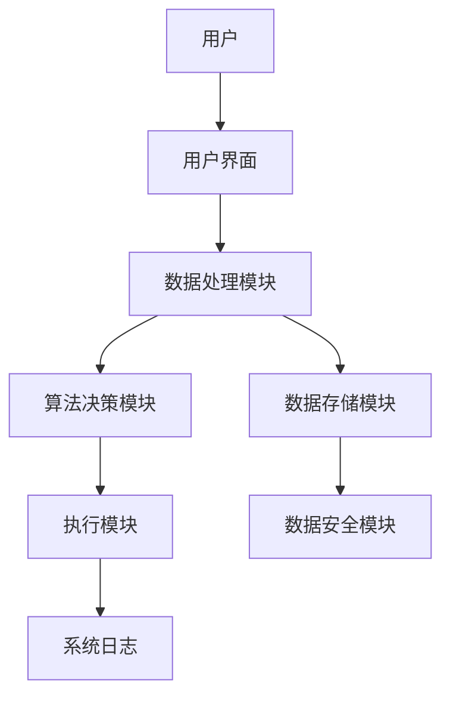

                 


# AI Agent开发中的法律合规与伦理考量

## 关键词：AI Agent、法律合规、伦理考量、技术实现、系统架构、案例分析

## 摘要：
本文探讨了在AI Agent开发过程中需要考虑的法律合规与伦理问题。文章从AI Agent的基本概念出发，分析了相关的法律框架和伦理原则，详细讨论了技术实现中的法律与伦理挑战，并通过实际案例和系统架构设计提供了具体的应对策略。通过本文，读者可以全面了解AI Agent开发中的法律与伦理考量，并掌握如何在实际项目中规避风险、确保合规。

---

## 第1章: 引言

### 1.1 AI Agent的基本概念

#### 1.1.1 AI Agent的定义与特点
AI Agent（人工智能代理）是指能够感知环境、自主决策并执行任务的智能实体。其特点包括自主性、反应性、目标导向性和社交能力。AI Agent广泛应用于自动驾驶、智能助手、机器人等领域。

#### 1.1.2 AI Agent的发展背景
随着AI技术的快速发展，AI Agent的应用场景不断增加，但随之而来的法律和伦理问题也日益凸显。例如，自动驾驶汽车的决策责任归属、智能助手的数据隐私保护等问题亟待解决。

#### 1.1.3 法律合规与伦理考量的重要性
AI Agent的开发和应用涉及数据隐私、责任归属、算法偏见等法律和伦理问题。这些问题不仅关系到企业的合规风险，还可能影响社会的信任度和接受度。

#### 1.1.4 本书的结构安排
本书将从法律框架、伦理考量、技术实现等多个角度展开讨论，并通过案例分析和系统设计提供实践指导。

---

## 第2章: AI Agent的法律框架

### 2.1 法律体系概述

#### 2.1.1 数据隐私与保护的法律框架
数据隐私是AI Agent开发中的核心法律问题。例如，《通用数据保护条例》（GDPR）规定了数据主体的权利，企业需确保数据处理的合法性。

#### 2.1.2 责任归属与法律原则
AI Agent的决策可能引发法律责任问题。例如，在自动驾驶中，若发生事故，责任可能涉及制造商、软件开发者和车主。

#### 2.1.3 AI Agent的法律地位与权利义务
AI Agent本身不具有法律主体地位，其行为需通过其控制者承担法律责任。企业需明确AI Agent的设计、部署和运营中的法律义务。

### 2.2 主要法律原则与条款

#### 2.2.1 数据隐私与GDPR
GDPR要求企业明确数据处理目的，获得数据主体的同意，并采取技术措施保护数据安全。AI Agent的设计需符合这些要求。

#### 2.2.2 透明度与知情同意
AI Agent的用户应被告知其数据的使用方式。企业需通过隐私政策和用户协议明确告知用户。

#### 2.2.3 公平性与反歧视原则
AI Agent的算法可能隐含偏见，需避免歧视性行为。例如，在招聘系统中，算法不应基于种族或性别进行歧视。

### 2.3 跨境法律问题

#### 2.3.1 不同国家与地区的法律差异
不同国家的法律对AI Agent的规制存在差异，例如欧盟的GDPR与美国的州级数据隐私法。

#### 2.3.2 数据跨境传输的合规要求
数据跨境传输需符合目标国家的法律要求，例如《加州消费者隐私法案》（CCPA）。

#### 2.3.3 国际法律协调与合作
跨国企业需协调不同国家的法律要求，确保AI Agent的开发和运营符合所有相关法律。

---

## 第3章: AI Agent的伦理考量

### 3.1 伦理问题概述

#### 3.1.1 透明度与可解释性
AI Agent的决策过程应具备透明度，用户应理解算法的决策依据。例如，在医疗诊断中，医生需要理解AI诊断系统的依据。

#### 3.1.2 公平性与偏见
AI算法可能因训练数据的偏差而产生不公平的结果，例如在信贷评估中对某些群体的歧视。

#### 3.1.3 隐私保护与数据使用
AI Agent的数据使用需尊重用户隐私，避免滥用数据。

### 3.2 伦理框架与评估方法

#### 3.2.1 伦理框架的构建
企业需制定伦理准则，明确AI Agent的伦理目标和行为规范。

#### 3.2.2 伦理评估的步骤与方法
包括风险评估、伦理审查和持续监测。例如，采用伦理评分系统评估AI Agent的行为。

#### 3.2.3 伦理风险的识别与应对
通过案例分析识别潜在风险，并制定应对策略。例如，建立算法审计机制。

---

## 第4章: 技术实现中的法律与伦理问题

### 4.1 数据使用与法律合规

#### 4.1.1 数据收集的合法性
企业需确保数据收集符合法律要求，例如通过明确的用户同意。

#### 4.1.2 数据处理的合规性
数据处理需遵循GDPR等法规，确保数据安全和隐私保护。

#### 4.1.3 数据共享的伦理考量
数据共享需确保不会侵犯用户隐私，例如采用数据匿名化技术。

### 4.2 算法设计的伦理与法律问题

#### 4.2.1 算法偏见的识别与消除
通过数据清洗和算法优化减少偏见。例如，采用公平性约束的机器学习算法。

#### 4.2.2 算法透明度的实现
通过可解释性AI技术提高算法的透明度，例如使用模型解释工具。

#### 4.2.3 算法责任的分配
明确算法设计者、开发者和部署者的责任，例如通过合同明确各方义务。

### 4.3 系统架构与法律合规

#### 4.3.1 数据安全架构设计
采用加密技术、访问控制等措施保护数据安全。

#### 4.3.2 系统日志与审计
记录系统操作日志，便于追溯和审计。

#### 4.3.3 第三方服务的合规性
确保第三方服务提供商符合相关法律要求，例如云服务提供商的数据保护措施。

---

## 第5章: 案例分析

### 5.1 案例1：自动驾驶汽车的法律与伦理问题

#### 5.1.1 案例背景
自动驾驶汽车的决策系统涉及复杂的法律和伦理问题，例如责任归属和紧急情况下的决策。

#### 5.1.2 法律考量
需明确制造商、软件开发者和车主的责任划分。

#### 5.1.3 伦理考量
在紧急情况下，AI Agent的决策应优先保护人类生命，例如采用“最小伤害原则”。

### 5.2 案例2：智能助手的数据隐私问题

#### 5.2.1 案例背景
智能助手的语音交互涉及大量用户数据的收集和处理。

#### 5.2.2 法律考量
需遵守GDPR等数据保护法规，确保数据处理的合法性。

#### 5.2.3 伦理考量
需保护用户隐私，避免数据滥用。

---

## 第6章: 系统架构与法律合规

### 6.1 系统功能设计

#### 6.1.1 领域模型设计
通过领域模型明确系统功能模块及其交互关系。

#### 6.1.2 系统架构设计
采用分层架构，确保各模块的独立性和可扩展性。

#### 6.1.3 系统接口设计
定义清晰的接口规范，确保模块间协作符合法律和伦理要求。

### 6.2 系统架构图



### 6.3 系统交互设计

#### 6.3.1 系统交互流程
通过序列图展示系统交互流程，确保各环节符合法律和伦理要求。

#### 6.3.2 交互日志记录
记录用户操作日志，便于追溯和审计。

---

## 第7章: 项目实战

### 7.1 环境安装

#### 7.1.1 开发工具安装
安装Python、TensorFlow、PyTorch等开发工具。

#### 7.1.2 数据集准备
收集和整理相关数据集，确保数据合法合规。

### 7.2 系统核心实现

#### 7.2.1 数据预处理
对数据进行清洗和标注，确保数据质量。

#### 7.2.2 算法实现
编写AI Agent的核心算法，确保算法的透明性和可解释性。

#### 7.2.3 系统测试
进行功能测试、安全测试和性能测试，确保系统符合法律和伦理要求。

### 7.3 代码实现

#### 7.3.1 数据处理代码
```python
import pandas as pd
# 加载数据集
data = pd.read_csv('dataset.csv')
# 数据清洗
data.dropna(inplace=True)
# 数据标注
data['label'] = data['label'].apply(lambda x: 0 if x == 'negative' else 1)
```

#### 7.3.2 算法实现代码
```python
import tensorflow as tf
# 定义模型
model = tf.keras.Sequential([
    tf.keras.layers.Dense(64, activation='relu'),
    tf.keras.layers.Dense(1, activation='sigmoid')
])
# 编译模型
model.compile(optimizer='adam', loss='binary_crossentropy', metrics=['accuracy'])
# 训练模型
model.fit(X_train, y_train, epochs=10, batch_size=32)
```

#### 7.3.3 系统架构代码
```python
class Agent:
    def __init__(self, model, data_processor):
        self.model = model
        self.data_processor = data_processor

    def process_request(self, request):
        # 数据处理
        processed_data = self.data_processor.process(request)
        # 模型推理
        prediction = self.model.predict(processed_data)
        return prediction
```

### 7.4 案例分析与解读

#### 7.4.1 案例背景
通过具体案例展示AI Agent的开发过程，例如开发一个智能客服系统。

#### 7.4.2 系统实现
详细讲解系统实现过程，包括数据处理、算法设计和系统部署。

#### 7.4.3 项目小结
总结项目经验，提出改进建议。

---

## 第8章: 总结与展望

### 8.1 总结

#### 8.1.1 法律合规总结
AI Agent的开发需严格遵守相关法律法规，确保数据处理和算法设计的合法性。

#### 8.1.2 伦理考量总结
企业需制定伦理准则，确保AI Agent的行为符合社会伦理和道德规范。

#### 8.1.3 技术实现总结
技术实现需结合法律和伦理要求，采用合适的技术手段确保系统合规。

### 8.2 未来展望

#### 8.2.1 法律与伦理的演进
随着技术的发展，相关法律和伦理准则将不断完善。

#### 8.2.2 技术创新与挑战
AI Agent的技术创新将带来新的法律和伦理挑战，例如更复杂的算法和数据处理方式。

#### 8.2.3 未来研究方向
未来研究应聚焦于算法的透明性、数据隐私保护和AI Agent的伦理设计。

---

## 附录: 最佳实践 tips

- 在AI Agent开发中，始终优先考虑法律和伦理问题。
- 定期进行法律和伦理风险评估，及时调整系统设计。
- 与法律和伦理专家合作，确保系统合规。
- 建立完善的监测和应急机制，应对潜在风险。

---

通过本文的系统讲解，读者可以全面了解AI Agent开发中的法律合规与伦理考量，并掌握实际开发中的应对策略。

