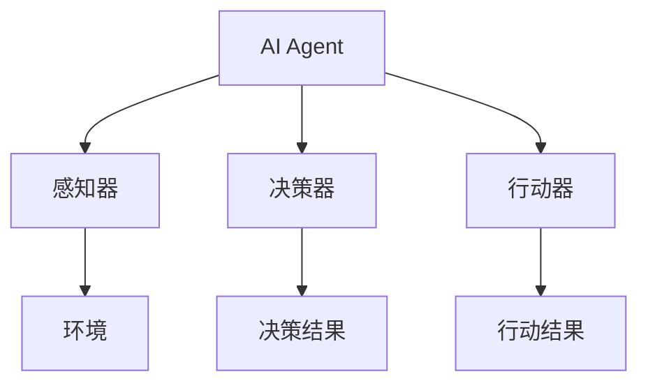

                 


# AI Agent开发实践：关键步骤和最佳实践

---

## 关键词：
AI Agent, 人工智能, 开发实践, 算法原理, 系统架构, 项目实战, 最佳实践

---

## 摘要：
本文将详细介绍AI Agent（人工智能代理）的开发实践，从核心概念到算法原理，再到系统架构设计和项目实战，全面解析AI Agent开发的关键步骤和最佳实践。通过具体案例分析和详细的技术解读，帮助读者掌握AI Agent开发的核心技能。

---

# 第一部分: AI Agent 开发背景与基础

## 第1章: AI Agent 的基本概念与背景

### 1.1 AI Agent 的定义与特点
#### 1.1.1 什么是 AI Agent
AI Agent（人工智能代理）是指能够感知环境并采取行动以实现目标的智能实体。它具备自主性、反应性、目标导向和学习能力等核心特点。

#### 1.1.2 AI Agent 的核心特点
- **自主性**：AI Agent能够在没有外部干预的情况下自主决策。
- **反应性**：能够实时感知环境并做出反应。
- **目标导向**：所有行动都以实现特定目标为导向。
- **学习能力**：通过数据和经验不断优化自身的决策能力。

#### 1.1.3 AI Agent 的分类与应用场景
- **分类**：
  - **简单反应式代理**：基于当前感知做出反应。
  - **基于模型的反应式代理**：利用内部状态模型进行决策。
  - **目标导向代理**：根据目标选择最优行动。
  - **效用导向代理**：通过最大化效用函数实现目标。
- **应用场景**：
  - 智能助手（如 Siri、Alexa）
  - 自动驾驶
  - 游戏AI
  - 智慧城市

---

## 第2章: AI Agent 的核心概念与联系

### 2.1 AI Agent 的结构与功能
#### 2.1.1 智能体的基本结构
AI Agent 的核心结构包括：
- **感知器**：负责从环境中获取信息。
- **决策器**：根据感知信息做出决策。
- **行动器**：执行决策动作。

#### 2.1.2 感知与行动的交互机制
- **输入**：环境中的数据流。
- **处理**：通过算法处理数据，生成决策。
- **输出**：执行行动，影响环境。

#### 2.1.3 决策机制的核心原理
AI Agent 的决策机制基于概率论、逻辑推理和强化学习等技术。

---

### 2.2 AI Agent 的核心概念对比
#### 2.2.1 不同类型 AI Agent 的对比表格

| 类型                  | 特性                  | 适用场景                  |
|-----------------------|-----------------------|---------------------------|
| 简单反应式代理        | 基于当前感知决策       | 简单环境，实时反应需求     |
| 基于模型的反应式代理  | 利用内部模型进行决策   | 复杂环境，需要预测能力     |
| 目标导向代理          | 以目标为导向           | 需要长期规划和优化         |
| 效用导向代理          | 通过最大化效用函数     | 复杂决策，需要权衡多目标   |

#### 2.2.2 实体关系图（ER 图）展示



---

### 2.3 AI Agent 的核心算法原理
#### 2.3.1 强化学习算法（Q-learning）
Q-learning 是一种经典的强化学习算法，通过以下步骤实现决策：
1. **初始化**：设置初始 Q 表。
2. **感知环境**：获取当前状态。
3. **选择行动**：根据 Q 表选择最优行动。
4. **执行行动**：与环境交互，获取奖励。
5. **更新 Q 表**：根据奖励更新 Q 值。

数学模型：
$$ Q(s, a) = Q(s, a) + \alpha (r + \gamma \max Q(s', a') - Q(s, a)) $$
其中：
- $$ \alpha $$ 是学习率
- $$ \gamma $$ 是折扣因子
- $$ r $$ 是奖励值
- $$ s' $$ 是下一个状态

#### 2.3.2 监督学习与无监督学习的区别
- **监督学习**：基于有标签的数据进行训练，目标是预测正确的标签。
- **无监督学习**：基于无标签的数据进行训练，目标是发现数据中的内在结构。

---

## 第3章: AI Agent 的算法原理与实现

### 3.1 强化学习算法（Q-learning）实现
#### 3.1.1 Q-learning 的代码实现

```python
class AI_Agent:
    def __init__(self, state_space, action_space):
        self.state_space = state_space
        self.action_space = action_space
        self.Q = np.zeros((state_space, action_space))
    
    def get_action(self, state):
        if np.random.random() < 0.1:
            return np.random.randint(self.action_space)
        else:
            return np.argmax(self.Q[state])
    
    def update_Q(self, state, action, reward, next_state):
        self.Q[state, action] += 0.1 * (reward + 0.9 * np.max(self.Q[next_state]) - self.Q[state, action])
```

#### 3.1.2 Q-learning 的数学模型
Q-learning 的更新公式为：
$$ Q(s, a) = Q(s, a) + \alpha (r + \gamma \max Q(s', a') - Q(s, a)) $$

---

## 第4章: AI Agent 的系统架构设计

### 4.1 系统分析与架构设计方案
#### 4.1.1 问题场景介绍
以智能助手为例，AI Agent 需要完成以下任务：
1. 接收用户的语音指令。
2. 解析指令并生成响应。
3. 与后端服务交互获取数据。
4. 返回结果给用户。

#### 4.1.2 系统功能设计
- **领域模型**：
  ```mermaid
  classDiagram
  class User {
    - id
    - name
    - query
  }
  class Agent {
    - state
    - action
  }
  class Environment {
    - response
  }
  Agent --> User: receive query
  Agent --> Environment: send action
  ```

- **系统架构设计**：
  ```mermaid
  architecture
  title AI Agent 架构图
  Agent --> Perception: 获取输入
  Agent --> Decision: 处理逻辑
  Agent --> Action: 执行输出
  ```

- **系统接口设计**：
  - 输入接口：接收用户指令。
  - 输出接口：返回处理结果。

- **系统交互流程图**：
  ```mermaid
  sequenceDiagram
  User -> Agent: 发送查询
  Agent -> Perception: 获取环境信息
  Agent -> Decision: 处理逻辑
  Agent -> Action: 执行行动
  ```

---

## 第5章: AI Agent 的项目实战

### 5.1 环境安装与配置
- **安装 Python 和相关库**：
  ```bash
  pip install numpy matplotlib scikit-learn
  ```

### 5.2 核心代码实现
#### 5.2.1 强化学习代码示例

```python
import numpy as np

class QLearningAgent:
    def __init__(self, state_size, action_size):
        self.state_size = state_size
        self.action_size = action_size
        self.Q = np.zeros((state_size, action_size))
    
    def get_action(self, state):
        if np.random.random() < 0.1:
            return np.random.randint(self.action_size)
        else:
            return np.argmax(self.Q[state])
    
    def update_Q(self, state, action, reward, next_state):
        self.Q[state, action] += 0.1 * (reward + 0.9 * np.max(self.Q[next_state]) - self.Q[state, action])

# 示例环境
class Environment:
    def __init__(self):
        self.state = 0
    
    def get_reward(self, action):
        if action == 1:
            return 1
        else:
            return 0

# 示例运行
agent = QLearningAgent(2, 2)
env = Environment()

for _ in range(100):
    state = env.state
    action = agent.get_action(state)
    reward = env.get_reward(action)
    next_state = env.state  # 假设状态不变
    agent.update_Q(state, action, reward, next_state)
```

#### 5.2.2 代码应用解读与分析
- **代码功能**：实现一个简单的Q-learning算法，用于训练AI Agent在特定环境中的决策能力。
- **关键代码解析**：
  - `QLearningAgent` 类：定义了AI Agent 的核心算法。
  - `Environment` 类：定义了环境的交互逻辑。
  - `update_Q` 方法：更新Q 表，实现强化学习的核心步骤。

---

## 第6章: AI Agent 的最佳实践与注意事项

### 6.1 开发注意事项
- **数据质量**：确保训练数据的多样性和代表性。
- **模型解释性**：在复杂场景中，确保模型的决策过程可解释。
- **安全性**：避免AI Agent 的决策对用户或环境造成潜在风险。

### 6.2 小结与总结
AI Agent 的开发需要结合算法、系统架构和实际应用场景，通过不断迭代优化，才能实现高效、可靠的智能代理系统。

### 6.3 拓展阅读
- 《Reinforcement Learning: Theory and Algorithms》
- 《Deep Learning for AI Agents》
- 《Software Architecture for AI Systems》

---

通过本文的详细讲解，读者可以系统地掌握AI Agent 开发的核心技能，从理论到实践，逐步构建高效的AI Agent 系统。

