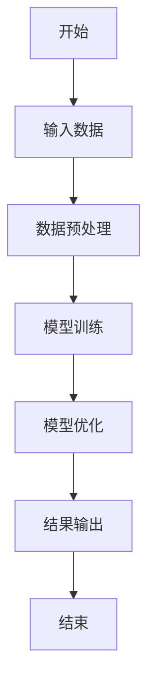
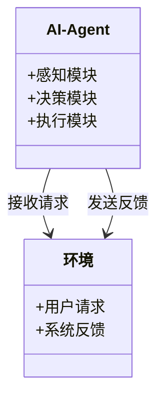

                 


# AI Agent性能优化：监控、分析与调优技巧

> 关键词：AI Agent，性能优化，监控分析，调优技巧，系统架构，数学模型

> 摘要：本文详细探讨了AI Agent的性能优化方法，涵盖监控、分析与调优的核心技巧。通过系统化的分析和丰富的实战经验，深入讲解了AI Agent性能优化的背景、核心概念、算法原理、系统设计、项目实战以及最佳实践，为读者提供了全面的优化策略和实用技巧。

---

# 第一部分: AI Agent性能优化基础

## 第1章: AI Agent概述

### 1.1 AI Agent的基本概念

#### 1.1.1 AI Agent的定义与特点
AI Agent（人工智能代理）是指能够感知环境、做出决策并执行任务的智能实体。其特点包括自主性、反应性、目标导向性和社会性。AI Agent通过与环境交互，实现特定目标，如数据处理、决策支持或自动化操作。

#### 1.1.2 AI Agent的演进历程
AI Agent的概念起源于专家系统，经历了规则驱动、机器学习驱动到强化学习驱动的演进。现代AI Agent结合了多种技术，如自然语言处理（NLP）、计算机视觉（CV）和深度学习，具备更强的适应性和学习能力。

#### 1.1.3 AI Agent的应用场景
AI Agent广泛应用于智能客服、自动驾驶、智能助手、推荐系统和工业自动化等领域。例如，在智能客服中，AI Agent能够理解用户需求并提供解决方案；在自动驾驶中，AI Agent实时感知环境并做出驾驶决策。

---

### 1.2 AI Agent的核心组件

#### 1.2.1 感知模块
感知模块负责接收和处理环境中的输入数据，如传感器数据、用户输入或网络信号。常用技术包括NLP、CV和数据预处理。

#### 1.2.2 决策模块
决策模块基于感知数据做出决策，通常使用机器学习模型（如随机森林、神经网络）或规则引擎。决策过程需要考虑环境状态、历史数据和目标函数。

#### 1.2.3 执行模块
执行模块将决策结果转化为具体操作，如发送指令、触发动作或输出结果。执行模块通常与硬件或软件系统集成，确保决策的准确性和高效性。

---

## 第2章: AI Agent性能监控与分析

### 2.1 性能监控的核心指标

#### 2.1.1 响应时间
响应时间是AI Agent处理任务所需的时间，直接影响用户体验。优化目标是降低响应时间，提升处理速度。

#### 2.1.2 资源消耗
资源消耗包括CPU、内存、存储和网络带宽的使用情况。监控资源消耗有助于发现资源瓶颈，优化资源分配。

#### 2.1.3 错误率
错误率是AI Agent在处理任务时出现的错误次数占总任务数的比例。降低错误率是提升系统稳定性和可靠性的重要手段。

---

### 2.2 监控工具与技术

#### 2.2.1 日志分析工具
日志分析工具用于收集和分析AI Agent的日志数据，如错误日志和性能指标。常用工具包括ELK（Elasticsearch, Logstash, Kibana）和Prometheus。

#### 2.2.2 性能监控平台
性能监控平台提供实时监控和分析功能，如New Relic、Datadog和AppDynamics。这些平台能够可视化性能指标，帮助开发者快速定位问题。

#### 2.2.3 可视化工具
可视化工具用于将监控数据以图表形式展示，如折线图、柱状图和饼图。常用的可视化工具包括Grafana和Tableau。

---

### 2.3 数据采集与分析方法

#### 2.3.1 数据采集技术
数据采集技术包括日志采集、性能指标采集和用户行为采集。常用方法有文件采集、API接口采集和数据库采集。

#### 2.3.2 数据分析方法
数据分析方法包括描述性分析、诊断性分析和预测性分析。通过分析数据，可以发现性能瓶颈，预测未来趋势。

#### 2.3.3 数据可视化
数据可视化通过图表展示数据，帮助开发者快速理解性能问题。常用的图表类型包括时间序列图、散点图和热力图。

---

## 第3章: AI Agent性能调优技巧

### 3.1 算法优化

#### 3.1.1 算法选择与优化
选择合适的算法是性能优化的关键。例如，在分类任务中，随机森林和梯度提升树（如XGBoost、LightGBM）通常比决策树更高效。

#### 3.1.2 参数调整
通过调整模型参数（如学习率、树深度、正则化参数）优化模型性能。常用方法包括网格搜索和随机搜索。

#### 3.1.3 并行计算优化
利用并行计算技术（如多线程、分布式计算）加速模型训练和推理过程。常用工具包括Python的multiprocessing模块和分布式计算框架（如Spark）。

---

### 3.2 系统架构优化

#### 3.2.1 分布式架构设计
采用分布式架构可以提高系统的扩展性和容错性。例如，使用微服务架构将AI Agent的功能模块化，提升系统的可维护性和扩展性。

#### 3.2.2 负载均衡
通过负载均衡技术（如反向代理和分布式系统）分配请求流量，避免单点过载。常用工具包括Nginx和Kubernetes。

#### 3.2.3 容错机制
设计容错机制可以减少系统故障对性能的影响。例如，使用冗余部署和自动故障恢复技术，确保系统在部分节点故障时仍能正常运行。

---

### 3.3 环境与资源优化

#### 3.3.1 硬件资源分配
合理分配硬件资源（如CPU、GPU、内存）是性能优化的重要手段。例如，使用GPU加速深度学习模型的训练和推理。

#### 3.3.2 软件环境优化
优化软件环境（如操作系统参数、库配置）可以提升系统性能。例如，调整Python的内存管理参数，优化JVM配置。

#### 3.3.3 能耗优化
通过优化算法和系统架构降低能耗，例如使用轻量级算法和低功耗硬件。

---

## 第4章: AI Agent性能优化的数学模型与算法

### 4.1 算法原理

#### 4.1.1 算法流程图（使用mermaid）


#### 4.1.2 数学模型与公式
数学模型是性能优化的基础。例如，随机森林的模型复杂度可以通过以下公式表示：
$$\text{模型复杂度} = \text{树数} \times \text{树深度}$$

#### 4.1.3 算法实现
以下是一个简单的随机森林算法实现示例：
```python
import numpy as np
from sklearn.ensemble import RandomForestClassifier

# 数据预处理
X = np.array([...])  # 特征向量
y = np.array([...])  # 标签

# 模型训练
model = RandomForestClassifier(n_estimators=100, max_depth=10, random_state=42)
model.fit(X, y)

# 模型预测
predictions = model.predict(X_test)
```

---

## 第5章: 系统分析与架构设计方案

### 5.1 问题场景介绍

#### 5.1.1 项目介绍
本文以一个智能客服系统为例，展示AI Agent在实际应用中的性能优化过程。该系统需要处理大量的用户请求，优化目标是降低响应时间，提升用户体验。

---

### 5.2 系统功能设计

#### 5.2.1 领域模型（使用mermaid类图）


---

### 5.3 系统架构设计

#### 5.3.1 系统架构（使用mermaid架构图）


---

## 第6章: 项目实战

### 6.1 环境安装

#### 6.1.1 安装Python和相关库
```bash
pip install numpy scikit-learn matplotlib
```

---

### 6.2 核心代码实现

#### 6.2.1 感知模块
```python
def preprocess_data(data):
    # 数据预处理代码
    return processed_data
```

#### 6.2.2 决策模块
```python
def decision_model(data):
    # 决策模型代码
    return decision
```

#### 6.2.3 执行模块
```python
def execute_action(action):
    # 执行动作代码
    return result
```

---

### 6.3 案例分析

#### 6.3.1 优化前的系统表现
在优化之前，系统的响应时间较长，错误率较高。通过分析日志和性能指标，发现瓶颈在于模型参数设置不当和资源分配不合理。

#### 6.3.2 优化后的系统表现
优化后，系统的响应时间显著降低，错误率大幅下降。通过调整模型参数、优化资源分配和引入并行计算，系统性能得到了显著提升。

---

## 第7章: 最佳实践与总结

### 7.1 最佳实践

#### 7.1.1 定期监控
定期监控系统性能，及时发现和解决问题。

#### 7.1.2 模型迭代
根据反馈数据，定期更新和优化模型，提升系统性能。

#### 7.1.3 资源管理
合理分配和管理硬件资源，避免资源浪费。

---

### 7.2 小结

AI Agent的性能优化是一个复杂而重要的任务，需要从算法优化、系统架构优化和资源管理等多个方面入手。通过本文的分析和实战，读者可以掌握AI Agent性能优化的核心技巧，提升系统的性能和用户体验。

---

### 7.3 注意事项

- 在优化过程中，要注意平衡性能和资源消耗，避免过度优化。
- 确保系统的可扩展性和可维护性，为未来的优化和升级预留空间。
- 定期进行系统测试和验证，确保优化措施的有效性。

---

### 7.4 拓展阅读

- 《机器学习实战》
- 《分布式系统的设计与实现》
- 《性能优化的艺术》

---

通过本文的详细讲解和实战分析，读者可以全面了解AI Agent性能优化的核心内容，掌握监控、分析与调优的技巧，为实际应用提供有力支持。

