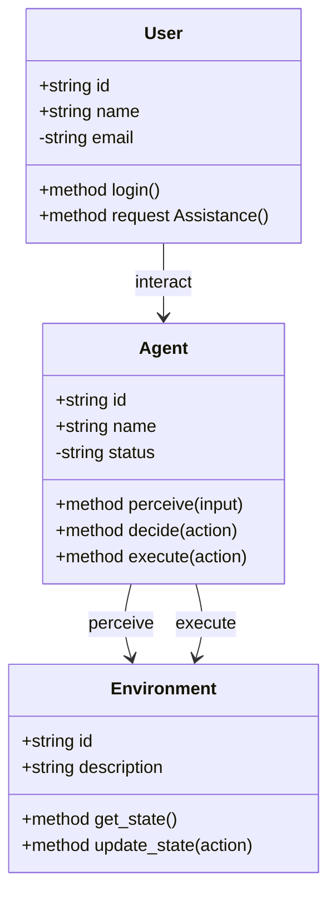
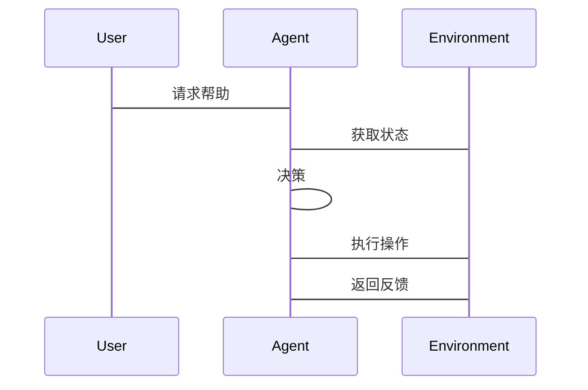

                 


# AI Agent架构设计：从概念到实现

## 关键词：AI Agent, 架构设计, 算法原理, 系统架构, 项目实战, 最佳实践

## 摘要：  
本文将深入探讨AI Agent的架构设计，从概念到实现，系统地分析其核心原理、算法实现、系统架构设计以及项目实战。通过对感知、决策和执行模块的详细讲解，结合数学模型和实际案例，帮助读者全面理解AI Agent的设计与实现过程，提供实用的架构设计方案和最佳实践。

---

## 第一部分: AI Agent架构设计基础

### 第1章: AI Agent的基本概念与背景

#### 1.1 AI Agent的定义与特点
- **1.1.1 AI Agent的定义**  
  AI Agent（人工智能代理）是一种能够感知环境、自主决策并采取行动以实现目标的智能实体。它能够根据输入的信息做出反应，执行任务，并与环境进行交互。

- **1.1.2 AI Agent的核心特点**  
  - **自主性**：能够在没有外部干预的情况下自主运行。  
  - **反应性**：能够实时感知环境并做出反应。  
  - **目标导向**：所有行动都是为了实现特定目标。  
  - **社会性**：能够与其他Agent或人类进行协作或竞争。

- **1.1.3 AI Agent与传统AI的区别**  
  传统AI（如专家系统）依赖于规则和预定义的数据，而AI Agent具有自主性和目标导向，能够在动态环境中适应和调整。

#### 1.2 AI Agent的应用场景
- **1.2.1 问题背景与问题描述**  
  在企业中，复杂的业务流程和动态的市场环境需要一种能够自主决策和执行的智能实体来提高效率和响应速度。

- **1.2.2 AI Agent在企业中的应用前景**  
  - 自动化任务处理：如自动化邮件回复、客户支持。  
  - 智能决策：如供应链优化、风险评估。  
  - 智能交互：如智能助手、虚拟客服。

- **1.2.3 AI Agent的边界与外延**  
  AI Agent的设计需要考虑其能力的边界，例如数据源的限制、计算资源的限制以及与人类的交互方式。

#### 1.3 AI Agent的核心要素组成
- **1.3.1 感知模块**  
  感知模块负责接收环境中的信息，如文本、图像或传感器数据，并将其转化为结构化的数据。

- **1.3.2 决策模块**  
  决策模块基于感知到的信息，结合目标和约束条件，生成行动方案。

- **1.3.3 执行模块**  
  执行模块负责将决策模块生成的行动方案转化为实际操作，如发送邮件、调整参数。

#### 1.4 本章小结  
本章介绍了AI Agent的基本概念、特点及其在企业中的应用场景，为后续章节的深入分析奠定了基础。

---

### 第2章: AI Agent的核心概念与联系

#### 2.1 AI Agent的核心概念原理
- **2.1.1 感知模块的原理**  
  感知模块通过多种传感器或接口获取环境信息，并对其进行解析和处理。

- **2.1.2 决策模块的原理**  
  决策模块基于感知信息和目标，利用算法生成最优或近似最优的决策。

- **2.1.3 执行模块的原理**  
  执行模块将决策转化为实际操作，通常涉及与外部系统的交互。

#### 2.2 AI Agent核心概念的属性特征对比
| 模块       | 属性         | 特征对比                        |
|------------|--------------|---------------------------------|
| 感知模块   | 输入类型     | 文本、图像、语音等              |
|            | 输出类型     | 结构化数据、特征向量            |
| 决策模块   | 输入类型     | 结构化数据、特征向量            |
|            | 输出类型     | 行动策略、决策结果              |
| 执行模块   | 输入类型     | 行动策略、决策结果              |
|            | 输出类型     | 实际操作、反馈信息              |

#### 2.3 AI Agent的ER实体关系图
```mermaid
erDiagram
    actor User {
        +string id
        +string name
    }
    actor Agent {
        +string id
        +string name
    }
    actor Environment {
        +string id
        +string description
    }
    User --> Agent: 请求
    Agent --> Environment: 交互
    Environment --> Agent: 反馈
```

#### 2.4 本章小结  
本章通过对比分析和ER图展示了AI Agent各模块之间的关系，为后续的算法设计和系统架构奠定了基础。

---

### 第3章: AI Agent的算法原理

#### 3.1 AI Agent的感知算法
- **3.1.1 自然语言处理（NLP）**  
  NLP用于处理文本数据，常用算法包括词袋模型、TF-IDF、Word2Vec、BERT等。

- **3.1.2 计算机视觉（CV）**  
  CV用于处理图像数据，常用算法包括边缘检测、目标检测、卷积神经网络（CNN）等。

#### 3.2 AI Agent的决策算法
- **3.2.1 强化学习（Reinforcement Learning）**  
  强化学习通过奖励机制训练Agent在动态环境中做出最优决策。

- **3.2.2 图神经网络（Graph Neural Network）**  
  GNN用于处理图结构数据，适用于复杂关系推理。

#### 3.3 AI Agent的执行算法
- **3.3.1 强化学习**  
  在执行阶段，强化学习用于优化行动策略。

- **3.3.2 自动化控制**  
  自动化控制算法用于实现物理设备的自动化操作。

#### 3.4 算法实现的数学模型
- **3.4.1 自然语言处理的数学模型**  
  例如，BERT模型的注意力机制：
  $$ \text{Attention}(Q, K, V) = \text{softmax}\left(\frac{QK^T}{\sqrt{d_k}}\right)V $$

- **3.4.2 强化学习的数学模型**  
  Q-learning算法的更新公式：
  $$ Q(s, a) = r + \gamma \max_{a'} Q(s', a') $$

#### 3.5 本章小结  
本章详细讲解了AI Agent各模块涉及的算法及其数学模型，为后续的系统设计提供了理论基础。

---

### 第4章: AI Agent的数学模型和公式

#### 4.1 感知模块的数学模型
- **4.1.1 自然语言处理的数学模型**  
  例如，Word2Vec模型的训练目标函数：
  $$ \mathcal{L} = -\sum_{i=1}^{n} \log P(w_i|w_{i-1}) $$

- **4.1.2 计算机视觉的数学模型**  
  例如，卷积神经网络（CNN）的卷积层：
  $$ f(x) = \sigma(w \ast x + b) $$

#### 4.2 决策模块的数学模型
- **4.2.1 强化学习的数学模型**  
  策略梯度方法的优化目标：
  $$ \nabla J = \mathbb{E}[ \nabla \log \pi(a|s) Q(s,a) ] $$

- **4.2.2 图神经网络的数学模型**  
  GAT模型的注意力机制：
  $$ \alpha_{i,j} = \frac{e^{f_{i,j}}}{\sum_{k \neq j} e^{f_{i,k}}} } $$

#### 4.3 执行模块的数学模型
- **4.3.1 自动化控制的数学模型**  
  PID控制器的数学表达式：
  $$ u(t) = K_p e(t) + K_i \int e(t) dt + K_d \frac{de(t)}{dt} $$

#### 4.4 本章小结  
本章通过数学模型和公式深入分析了AI Agent各模块的实现原理。

---

### 第5章: AI Agent的系统分析与架构设计

#### 5.1 问题场景介绍
- 企业中常见的动态任务处理场景，如订单处理、客户支持等。

#### 5.2 系统功能设计
- **领域模型**  
  使用Mermaid类图展示系统中的实体和关系。



- **系统架构设计**  
  使用Mermaid架构图展示系统整体结构。


- **系统接口设计**  
  使用Mermaid序列图展示系统交互流程。



#### 5.3 本章小结  
本章通过系统分析和架构设计，展示了AI Agent在实际应用中的实现方式。

---

### 第6章: AI Agent的项目实战

#### 6.1 环境安装
- 安装Python、TensorFlow、Keras、OpenCV等依赖库。

#### 6.2 核心代码实现
- 感知模块代码示例：
  ```python
  import tensorflow as tf
  model = tf.keras.Sequential([
      tf.keras.layers.Conv2D(32, (3,3), activation='relu', input_shape=(224, 224, 3)),
      tf.keras.layers.MaxPooling2D((2,2)),
      tf.keras.layers.Flatten(),
      tf.keras.layers.Dense(128, activation='relu'),
      tf.keras.layers.Dense(10, activation='softmax')
  ])
  ```

- 决策模块代码示例：
  ```python
  import numpy as np
  from keras.models import load_model

  model = load_model('decision_model.h5')
  action = np.argmax(model.predict(state))
  ```

- 执行模块代码示例：
  ```python
  import requests

  def execute_action(action_id):
      response = requests.post('http://localhost:8080/execute', json={'action_id': action_id})
      return response.json()
  ```

#### 6.3 代码解读与分析
- 感知模块用于处理输入数据，生成特征向量。
- 决策模块基于特征向量生成决策结果。
- 执行模块将决策结果转化为实际操作。

#### 6.4 实际案例分析
- 案例：智能客服系统。
  - 感知模块：解析用户输入的文本。
  - 决策模块：生成回复内容。
  - 执行模块：发送回复邮件或消息。

#### 6.5 本章小结  
本章通过实际项目案例，展示了AI Agent的实现过程。

---

### 第7章: AI Agent的最佳实践、小结与扩展阅读

#### 7.1 最佳实践 tips
- **模块化设计**：确保各模块独立可扩展。  
- **数据质量管理**：确保感知模块的数据输入质量。  
- **算法优化**：根据实际场景调整算法参数。

#### 7.2 小结
本文从概念到实现，系统地分析了AI Agent的架构设计，包括核心概念、算法原理、系统架构设计以及项目实战。

#### 7.3 注意事项
- 确保系统的安全性与稳定性。  
- 定期更新模型以适应环境变化。  
- 处理好与人类用户的交互体验。

#### 7.4 拓展阅读
- 《强化学习（深入理解）》  
- 《图神经网络：理论与应用》  
- 《AI Agent在企业中的应用案例》

---

## 作者简介  
作者是计算机编程和人工智能领域的技术专家，拥有丰富的AI Agent开发经验，擅长通过深入浅出的方式分享技术知识。  

---

## 结语  
希望本文能为读者提供AI Agent架构设计的全面指导，帮助您在实际项目中更好地应用这些技术。如需进一步探讨，欢迎留言交流。

