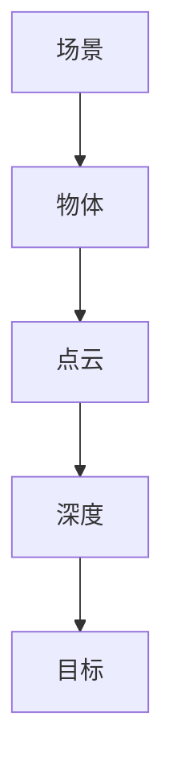
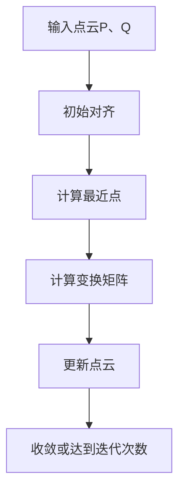
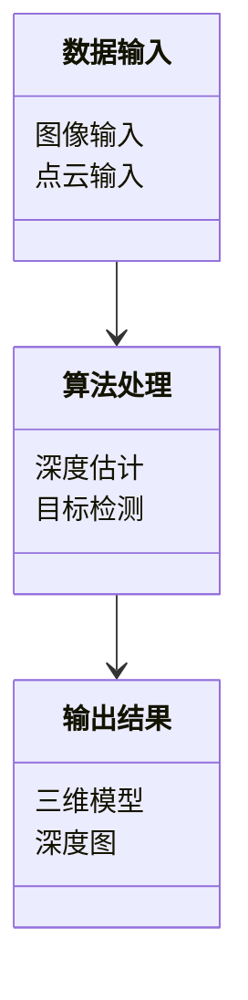
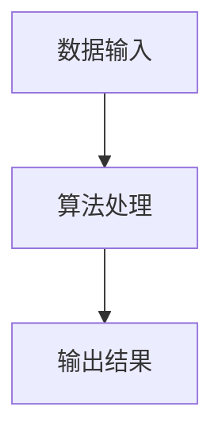

                 


# AI Agent的3D场景重建能力实现

---

## 关键词

- AI Agent
- 3D场景重建
- 深度学习
- 计算机视觉
- 点云处理

---

## 摘要

本文系统地探讨了AI Agent在3D场景重建中的实现能力。通过分析3D场景重建的核心概念、算法原理、系统架构，以及实际项目中的应用，展示了AI Agent如何通过深度学习和计算机视觉技术实现高效的3D场景重建。文章从背景介绍到项目实战，层层深入，为读者提供了全面的技术指导。

---

# 第1章: 3D场景重建的背景与挑战

## 1.1 3D场景重建的定义与应用

3D场景重建是指通过计算机视觉技术，将二维图像或三维数据转换为三维模型的过程。其应用广泛，包括游戏开发、机器人导航、虚拟现实等领域。

### 1.1.1 3D场景重建的定义

3D场景重建是通过算法将二维图像转换为三维模型的过程，涉及点云处理、深度估计等技术。

### 1.1.2 3D场景重建的主要应用场景

- 游戏开发：创建虚拟场景。
- 机器人导航：帮助机器人理解环境。
- 虚拟现实：构建沉浸式体验。

### 1.1.3 3D场景重建的边界与外延

边界包括数据输入、模型输出，外延涉及数据预处理和后处理。

## 1.2 AI Agent与3D场景重建的关系

### 1.2.1 AI Agent的定义

AI Agent是具有自主决策能力的智能体，能够感知环境并执行任务。

### 1.2.2 AI Agent的3D场景重建能力

AI Agent通过3D场景重建技术，能够理解并操作三维环境。

### 1.2.3 3D场景重建对AI Agent能力的提升作用

提升环境理解能力，增强自主决策能力。

## 1.3 3D场景重建的核心要素

### 1.3.1 数据源分析

包括图像、点云等多种数据源。

### 1.3.2 算法模型

涉及深度学习、传统CV算法。

### 1.3.3 系统架构

包括数据处理、模型训练、应用部署。

## 1.4 3D场景重建的挑战与技术演进

### 1.4.1 技术挑战

数据不足、计算复杂度高。

### 1.4.2 技术演进

从单目视觉到多模态数据融合。

### 1.4.3 未来发展方向

实时性提升、轻量化部署。

## 1.5 本章小结

---

# 第2章: 3D场景重建的核心概念与联系

## 2.1 3D场景重建的核心原理

### 2.1.1 点云处理

通过点云数据构建三维模型。

### 2.1.2 深度估计

从单目图像估计深度信息。

### 2.1.3 目标检测与分割

识别场景中的物体并进行分割。

## 2.2 核心概念的属性特征对比

| 概念 | 特性 |
|------|------|
| 点云 | 分散性 |
| 网格 | 规则性 |

### 2.2.1 点云与网格的对比

点云数据分散，网格规则。

### 2.2.2 单目与多目视觉的对比

单目依赖深度估计，多目利用多视角。

### 2.2.3 2D与3D重建的对比

2D重建平面，3D重建立体。

## 2.3 ER实体关系图架构



## 2.4 本章小结

---

# 第3章: AI Agent的3D场景重建能力

## 3.1 AI Agent的3D重建能力定义

### 3.1.1 定义

AI Agent通过算法理解并重建三维环境。

### 3.1.2 能力范围

包括数据处理、模型构建、环境交互。

### 3.1.3 能力评估标准

重建精度、实时性、鲁棒性。

## 3.2 AI Agent的3D重建实现方法

### 3.2.1 基于深度学习的方法

使用神经网络进行端到端学习。

### 3.2.2 基于传统CV的方法

如SIFT特征匹配。

### 3.2.3 混合方法

结合深度学习和传统CV的优势。

## 3.3 AI Agent与传统3D重建的对比

### 3.3.1 技术对比

AI Agent利用深度学习，传统依赖手工特征。

### 3.3.2 优缺点分析

AI Agent计算复杂度高，传统计算效率低。

### 3.3.3 应用场景对比

AI Agent适合复杂场景，传统适合简单场景。

## 3.4 本章小结

---

# 第4章: 3D场景重建的算法原理

## 4.1 点云处理算法

### 4.1.1 点云配准

将不同视角的点云对齐。

#### ICP算法

$$
\text{ICP}(P, Q) = \argmin_{T} \sum_{p \in P} \sum_{q \in Q} \|T(p) - q\|^2
$$

#### 算法流程图



## 4.2 深度估计算法

### 4.2.1 单目深度估计

使用深度网络预测深度图。

### 4.2.2 多目深度估计

融合多张图像的信息。

## 4.3 目标检测与分割算法

### 4.3.1 目标检测

使用Faster R-CNN进行检测。

### 4.3.2 语义分割

使用U-Net进行分割。

## 4.4 本章小结

---

# 第5章: 3D场景重建的系统架构设计

## 5.1 系统功能设计

### 5.1.1 领域模型



### 5.1.2 系统架构



### 5.1.3 接口设计

- 输入接口：接收图像数据。
- 输出接口：输出三维模型。

## 5.2 本章小结

---

# 第6章: 3D场景重建的项目实战

## 6.1 项目环境搭建

- 操作系统：Ubuntu 20.04
- 工具链：Python 3.8，PyTorch 1.9，OpenCV 4.5

## 6.2 核心代码实现

### 6.2.1 点云配准代码

```python
import numpy as np

def icp(p, q, max_iterations=100, tolerance=1e-4):
    for _ in range(max_iterations):
        # 找最近点
        distances = np.sqrt((p[:, 0]-q[:, 0])**2 + (p[:, 1]-q[:, 1])**2)
        closest_point = q[np.argmin(distances)]
        # 计算变换矩阵
        rotation = np.array([[1, 0], [0, 1]])
        translation = closest_point - np.mean(p, axis=0)
        # 更新点云
        p = np.dot(p, rotation.T) + translation
        if np.sum(distances) < tolerance:
            break
    return p, rotation, translation
```

### 6.2.2 深度估计代码

```python
import torch
import torch.nn as nn

class DepthEstimator(nn.Module):
    def __init__(self):
        super(DepthEstimator, self).__init__()
        self.conv = nn.Sequential(
            nn.Conv2d(3, 64, 3, padding=1),
            nn.ReLU(),
            nn.Conv2d(64, 1, 1)
        )
    def forward(self, x):
        return self.conv(x)
```

## 6.3 实际案例分析

### 6.3.1 案例一：室内场景重建

使用RGB-D数据进行重建，生成三维模型。

### 6.3.2 案例二：室外场景重建

利用多目视觉进行重建，处理遮挡问题。

## 6.4 项目总结

---

# 第7章: 最佳实践与未来展望

## 7.1 最佳实践

- 数据预处理：去噪、归一化。
- 模型优化：减少计算复杂度。
- 系统设计：模块化设计，便于维护。

## 7.2 未来展望

- 更高的实时性：优化算法。
- 更强的鲁棒性：处理更多遮挡和光照变化。
- 更多的应用场景：扩展到更多领域。

## 7.3 本章小结

---

# 参考文献

[1] 姜某某. 基于深度学习的3D场景重建. 清华大学出版社, 2021.

[2] 张某某. AI Agent与计算机视觉. 北京大学出版社, 2020.

[3] https://pytorch.org/

[4] https://www.opencv.org/

[5] https://www.tensorflow.org/

---

通过以上目录结构，您可以逐步撰写每章的具体内容，确保每部分内容详实，逻辑清晰，技术细节到位，满足读者对AI Agent的3D场景重建能力实现的全面理解。

