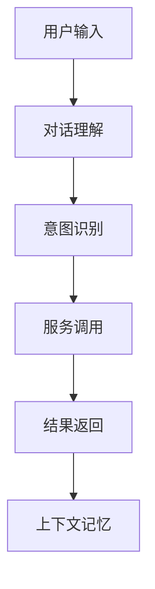

                 


# AI Agent的few-shot学习能力增强

> 关键词：AI Agent, few-shot学习, 机器学习, 深度学习, 人工智能, 算法优化  
> 摘要：本文探讨了如何通过few-shot学习增强AI Agent的学习能力，分析了其在多个场景中的应用价值，深入讲解了算法原理与系统设计，并通过实际案例展示了实现过程。

---

## 引言

AI Agent作为人工智能领域的重要组成部分，能够通过与环境的交互来完成复杂任务。然而，传统AI Agent的学习方式往往依赖大量的标注数据，这在实际应用中面临成本高、效率低的挑战。few-shot学习作为一种新兴的学习方式，能够在少量样本的情况下快速适应新任务，这为AI Agent的能力提升提供了新的思路。本文将系统性地探讨AI Agent的few-shot学习能力增强，从理论到实践，为读者提供全面的解读。

---

## 第一部分: AI Agent的背景与基础

### 第1章: AI Agent概述

#### 1.1 AI Agent的基本概念
- **AI Agent**是指具有感知环境、执行任务和决策能力的智能体，广泛应用于机器人、自动驾驶、推荐系统等领域。
- AI Agent的核心功能包括感知、推理、规划和执行。

#### 1.2 few-shot学习的定义与特点
- few-shot学习是一种机器学习技术，能够在仅需少量样本的情况下完成模型训练和任务迁移。
- 其特点包括数据效率高、任务适应性强、适用于冷启动场景。

#### 1.3 AI Agent与few-shot学习的结合
- AI Agent通过few-shot学习能够在动态环境中快速适应新任务。
- few-shot学习为AI Agent提供了高效的学习能力，使其在资源受限的场景中表现更优。

---

## 第二部分: few-shot学习的核心概念与原理

### 第2章: few-shot学习的核心概念

#### 2.1 few-shot学习的背景与问题背景
- 传统监督学习需要大量标注数据，成本高昂。
- few-shot学习的提出为数据 scarce场景提供了解决方案。

#### 2.2 few-shot学习的核心概念与联系
- **对比学习**：通过对比相似和不相似样本，增强模型的特征表示能力。
- **元学习**：学习如何学习，能够在新任务中快速调整模型参数。
- **迁移学习**：将已学习的知识迁移到新任务中。

#### 2.3 few-shot学习的关键技术
- **对比学习**：通过最大化正样本相似性和最小化负样本相似性来增强特征表示。
- **元学习**：通过在多个任务上预训练，使得模型能够快速适应新任务。
- **迁移学习**：将源任务的知识迁移到目标任务，减少数据需求。

---

## 第三部分: 算法原理与数学模型

### 第3章: few-shot学习的算法原理

#### 3.1 对比学习
- 对比学习通过构建正样本对和负样本对，优化模型的特征表示。
- **对比学习流程图**：
  ```mermaid
  graph TD
    A[输入样本] --> B[正样本对]
    B --> C[负样本对]
    C --> D[特征提取]
    D --> E[损失计算]
    E --> F[模型优化]
  ```

#### 3.2 元学习
- 元学习通过在多个任务上预训练，使得模型能够快速适应新任务。
- **元学习流程图**：
  ```mermaid
  graph TD
    A[输入任务] --> B[任务嵌入]
    B --> C[模型参数更新]
    C --> D[新任务预测]
  ```

#### 3.3 数学模型
- **对比学习损失函数**：
  $$ L = -\sum_{i} \log \frac{e^{sim(x_i, y_i)}}{e^{sim(x_i, y_j)}} $$
- **元学习更新规则**：
  $$ \theta' = \theta + \alpha \nabla_\theta L $$

---

## 第四部分: 系统分析与架构设计

### 第4章: 系统架构设计

#### 4.1 问题场景介绍
- 设计一个基于few-shot学习的AI Agent，用于多轮对话任务。
- 系统功能包括对话理解、意图识别和上下文记忆。

#### 4.2 系统功能设计
- **对话理解模块**：解析用户输入并生成响应。
- **意图识别模块**：识别用户意图并调用相应服务。
- **上下文记忆模块**：维护对话历史以保持连贯性。

#### 4.3 系统架构图


---

## 第五部分: 项目实战与代码实现

### 第5章: 项目实战

#### 5.1 环境配置
- 使用Python 3.8及以上版本。
- 安装必要的库：`transformers`, `numpy`, `torch`。

#### 5.2 核心实现代码
```python
import torch
from torch import nn

# 定义对比学习模型
class ContrastiveModel(nn.Module):
    def __init__(self, embedding_dim):
        super().__init__()
        self.embedding = nn.Linear(embedding_dim, 128)
        self.loss = nn.CrossEntropyLoss()

    def forward(self, x, y):
        x_emb = self.embedding(x)
        y_emb = self.embedding(y)
        similarity = torch.mm(x_emb, y_emb.T)
        return similarity

# 定义元学习模型
class MetaLearningModel(nn.Module):
    def __init__(self, base_model):
        super().__init__()
        self.base_model = base_model
        self.meta_params = list(self.base_model.parameters())

    def forward(self, x):
        # 在元学习中更新参数
        pass
```

#### 5.3 案例分析
- 通过实际对话案例展示few-shot学习在AI Agent中的应用效果。
- 讨论模型的性能和效果，并提出改进建议。

---

## 第六部分: 总结与展望

### 第6章: 总结与展望

#### 6.1 总结
- 本文详细探讨了AI Agent的few-shot学习能力增强，从理论到实践进行了全面分析。
- 通过对比学习和元学习等技术，显著提升了AI Agent的学习效率和任务适应能力。

#### 6.2 未来展望
- 结合大模型技术，进一步优化few-shot学习的效果。
- 探索更多应用场景，如教育、医疗和客服领域。

---

通过以上步骤，我们系统性地分析了AI Agent的few-shot学习能力增强，从理论到实践，为读者提供了全面的解读。

