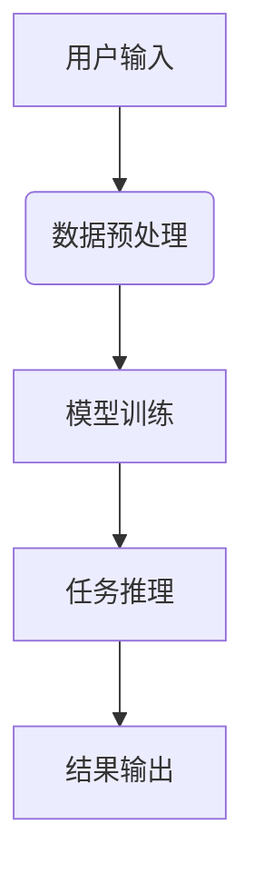

                 


# AI Agent的few-shot学习能力实现

## 关键词：AI Agent, few-shot学习, 机器学习, 智能代理, 小样本学习

## 摘要

本文详细探讨了AI Agent的few-shot学习能力实现，从背景到核心原理，再到系统架构和项目实战，系统地介绍了如何在小样本数据下提升AI Agent的学习和决策能力。文章结合理论分析和实践案例，深入讲解了few-shot学习的算法原理、系统设计和实际应用，为读者提供了全面的知识体系和实践指导。

---

# 第一部分：AI Agent的背景与基础

## 第1章：AI Agent的基本概念

### 1.1 AI Agent的定义与特点

#### 1.1.1 AI Agent的定义

AI Agent（人工智能代理）是指在计算机系统中，能够感知环境、自主决策并执行任务的智能实体。AI Agent具备以下特点：

- **自主性**：能够在没有外部干预的情况下自主运行。
- **反应性**：能够根据环境变化实时调整行为。
- **目标导向性**：以实现特定目标为导向。
- **学习能力**：能够通过经验或数据改进自身性能。

#### 1.1.2 AI Agent的核心特点

AI Agent的核心特点可以归纳为：

- **智能化**：具备问题求解、规划、推理等智能特性。
- **适应性**：能够适应动态变化的环境。
- **协作性**：能够与其他Agent或人类进行有效协作。

#### 1.1.3 AI Agent与传统AI的区别

AI Agent与传统AI的主要区别在于其自主性和适应性。传统AI通常依赖于固定的规则和数据，而AI Agent能够根据环境反馈动态调整行为，并具备学习和适应能力。

### 1.2 AI Agent的应用场景

AI Agent的应用场景广泛，包括：

- **智能助手**：如 Siri、Alexa 等，能够执行语音指令和日常任务。
- **自动驾驶**：如自动驾驶汽车中的决策系统，实时处理环境数据并做出驾驶决策。
- **游戏AI**：在游戏开发中，AI Agent可以用于非玩家角色（NPC）的行为控制和策略制定。

### 1.3 few-shot学习的背景与意义

#### 1.3.1 传统学习方法的局限性

传统机器学习方法通常需要大量标注数据才能训练出有效的模型。然而，在实际应用中，获取大量标注数据往往成本高昂且耗时，尤其是在AI Agent的实时应用场景中，这种依赖大量数据的方法显得效率低下。

#### 1.3.2 few-shot学习的提出

为了解决小样本数据下的学习问题，学术界提出了few-shot学习的概念。其核心思想是在仅使用少量样本的情况下，快速学习并适应新的任务。

#### 1.3.3 few-shot学习在AI Agent中的应用价值

在AI Agent中，few-shot学习能够显著提升其在小样本数据下的学习效率和适应能力，尤其是在动态变化的环境中，能够快速调整策略以应对新任务和挑战。

---

# 第二部分：few-shot学习的核心原理

## 第2章：few-shot学习的基本原理

### 2.1 few-shot学习的定义与分类

#### 2.1.1 few-shot学习的定义

few-shot学习是指在仅使用少量样本（如3-10个样本）的情况下，能够快速学习并完成特定任务的学习方法。

#### 2.1.2 few-shot学习的分类

few-shot学习主要分为以下几类：

- **基于距离的方法**：通过计算样本之间的相似性进行分类。
- **基于概率的方法**：利用概率模型推断样本的类别。
- **基于元学习的方法**：通过元学习框架（如MAML）来优化模型参数。

### 2.2 few-shot学习的关键技术

#### 2.2.1 对比学习

对比学习是一种通过最大化正样本对的相似性和最小化负样本对的相似性来提升模型区分能力的方法。其数学表达式如下：

$$
\text{损失函数} = \log\left(\frac{1}{1 + e^{-d(x_i, x_j)}}\right)
$$

其中，$d(x_i, x_j)$表示样本$x_i$和$x_j$之间的相似度。

#### 2.2.2 元学习

元学习（Meta Learning）是一种通过学习如何快速适应新任务的方法。其核心思想是通过训练模型在多个任务间迁移，从而在小样本任务中也能快速泛化。

元学习的数学模型如下：

$$
\theta = \arg\min_{\theta} \sum_{i=1}^{N} \mathcal{L}_i(\theta)
$$

其中，$\mathcal{L}_i$表示第i个任务的损失函数，$N$表示任务的数量。

#### 2.2.3 小样本数据增强

小样本数据增强是一种通过数据增强技术（如旋转、缩放、噪声添加等）增加训练数据多样性的方法，从而提升模型的泛化能力。

### 2.3 few-shot学习的数学模型

#### 2.3.1 基于距离的分类模型

基于距离的分类模型通过计算测试样本与训练样本之间的距离，选择距离最近的类别作为预测结果。其数学表达式如下：

$$
y = \arg\min_{y \in Y} \sum_{i=1}^{n} (x_i - x)^2
$$

其中，$x$表示测试样本，$x_i$表示训练样本，$Y$表示类别标签。

#### 2.3.2 基于概率的分类模型

基于概率的分类模型通过计算测试样本属于各个类别的概率，选择概率最大的类别作为预测结果。其数学表达式如下：

$$
p(y|x) = \frac{p(x|y)p(y)}{p(x)}
$$

其中，$p(y|x)$表示给定$x$条件下$y$的概率，$p(x|y)$表示给定$y$条件下$x$的概率，$p(y)$表示$y$的先验概率，$p(x)$表示$x$的边缘概率。

---

# 第三部分：AI Agent的few-shot学习实现

## 第3章：AI Agent与few-shot学习的结合

### 3.1 AI Agent的任务模型

#### 3.1.1 任务分解

AI Agent的任务模型通常需要将复杂任务分解为多个子任务，并为每个子任务分配相应的资源和优先级。

#### 3.1.2 任务优先级

任务优先级是AI Agent在多任务环境下，根据任务的重要性和紧迫性进行排序的过程。优先级高的任务通常需要优先处理。

#### 3.1.3 任务动态性

任务动态性是指任务的目标、约束和环境条件可能会发生动态变化。AI Agent需要具备快速调整策略的能力。

### 3.2 few-shot学习在AI Agent中的应用

#### 3.2.1 快速适应新任务

AI Agent在面对新任务时，可以通过few-shot学习快速适应并完成任务，而无需依赖大量的训练数据。

#### 3.2.2 小样本数据下的决策优化

在小样本数据下，AI Agent可以通过few-shot学习优化决策策略，提升任务执行效率。

#### 3.2.3 实时学习与适应

AI Agent需要在动态环境中实时学习和适应，few-shot学习能够帮助其快速调整策略以应对变化。

### 3.3 few-shot学习对AI Agent性能的提升

#### 3.3.1 提高学习效率

few-shot学习能够在小样本数据下快速训练出有效的模型，显著提高AI Agent的学习效率。

#### 3.3.2 提高适应性

通过few-shot学习，AI Agent能够更好地适应动态变化的环境，快速应对新任务和挑战。

#### 3.3.3 提高决策准确性

few-shot学习通过优化模型参数和结构，能够提高AI Agent的决策准确性，尤其是在复杂任务中表现优异。

---

## 第4章：AI Agent的few-shot学习系统架构设计

### 4.1 系统功能设计

AI Agent的few-shot学习系统通常包括以下几个功能模块：

- **数据采集与预处理**：负责采集和处理输入数据。
- **模型训练**：负责训练few-shot学习模型。
- **任务推理与决策**：负责根据任务需求进行推理和决策。
- **结果输出**：负责输出最终结果。

### 4.2 系统架构设计

AI Agent的few-shot学习系统架构如下图所示：



### 4.3 系统接口设计

AI Agent的few-shot学习系统需要设计以下接口：

- **数据输入接口**：用于接收外部输入的数据。
- **模型训练接口**：用于训练few-shot学习模型。
- **任务推理接口**：用于根据任务需求进行推理和决策。
- **结果输出接口**：用于输出最终结果。

### 4.4 系统交互流程

AI Agent的few-shot学习系统交互流程如下：

1. 用户输入任务请求。
2. 数据预处理模块对输入数据进行清洗和转换。
3. 模型训练模块训练few-shot学习模型。
4. 任务推理模块根据任务需求进行推理和决策。
5. 结果输出模块输出最终结果。

---

## 第5章：项目实战

### 5.1 环境安装与配置

#### 5.1.1 安装Python环境

建议使用Python 3.6及以上版本，可以通过以下命令安装：

```bash
python --version
```

#### 5.1.2 安装依赖库

安装必要的依赖库，如TensorFlow、Keras等：

```bash
pip install tensorflow numpy matplotlib
```

### 5.2 核心代码实现

#### 5.2.1 数据加载与预处理

```python
import numpy as np
import tensorflow as tf

# 加载数据
def load_data():
    # 示例数据加载
    X = np.random.rand(100, 10)
    y = np.random.randint(0, 5, 100)
    return X, y

X, y = load_data()
```

#### 5.2.2 模型训练

```python
def few_shot_model():
    model = tf.keras.Sequential([
        tf.keras.layers.Dense(64, activation='relu'),
        tf.keras.layers.Dense(5, activation='softmax')
    ])
    model.compile(optimizer='adam', loss='sparse_categorical_crossentropy', metrics=['accuracy'])
    return model

model = few_shot_model()
model.fit(X, y, epochs=10, batch_size=32)
```

#### 5.2.3 模型推理

```python
def predict_class(model, X_new):
    predictions = model.predict(X_new)
    return np.argmax(predictions, axis=1)

X_new = np.random.rand(1, 10)
y_pred = predict_class(model, X_new)
print("预测结果:", y_pred)
```

### 5.3 案例分析与代码解读

#### 5.3.1 案例分析

以分类任务为例，假设我们有少量样本，AI Agent需要快速学习并完成分类任务。

#### 5.3.2 代码解读

- `load_data()`：用于加载和预处理数据。
- `few_shot_model()`：定义并训练few-shot学习模型。
- `predict_class()`：利用训练好的模型进行预测。

---

## 第6章：最佳实践与总结

### 6.1 小结

通过本文的介绍，我们详细探讨了AI Agent的few-shot学习能力实现，从理论到实践，深入讲解了其核心原理和系统架构。

### 6.2 注意事项

- 在实际应用中，需注意数据质量对模型性能的影响。
- 需合理选择模型参数和优化策略。
- 需关注模型的泛化能力和实时性。

### 6.3 拓展阅读

建议进一步阅读以下内容：

- [《Meta-Learning for Few-Shot Image Classification》](https://arxiv.org/abs/1603.04724)
- [《Learning to Compare: Adaptation via Discriminative Instance Discrimination》](https://arxiv.org/abs/1804.09332)

---

# 结语

通过本文的系统学习，读者可以全面掌握AI Agent的few-shot学习能力实现的核心知识和实际应用。希望本文能够为AI Agent的研究和应用提供有价值的参考和指导。

---

