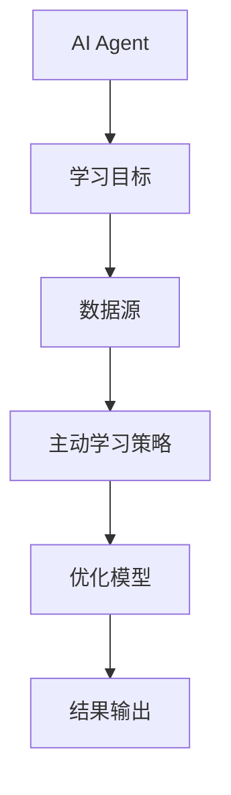
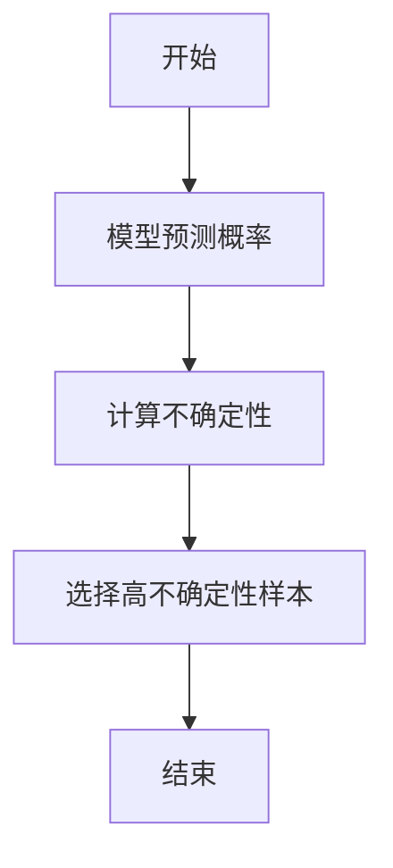
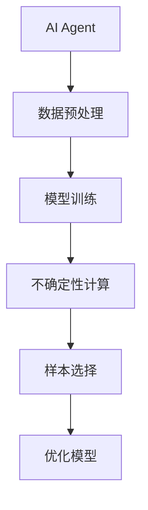
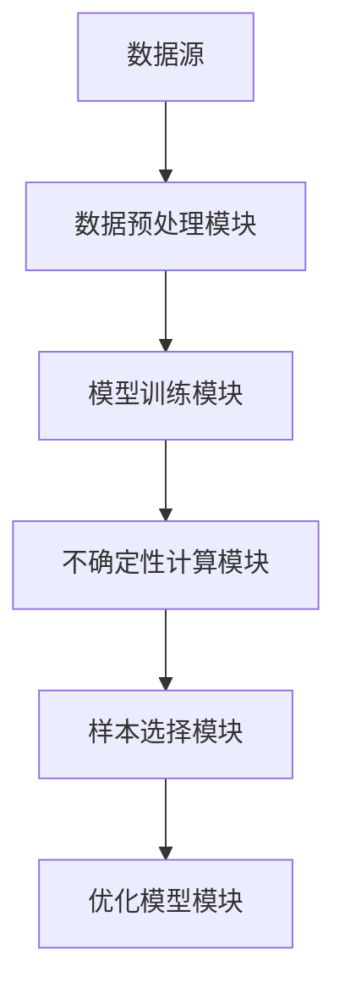

                 


# AI Agent的主动学习策略

## 关键词：
AI Agent, 主动学习, 不确定性采样, 多样性采样, 算法实现, 实体关系图, 系统架构设计

## 摘要：
本文详细探讨了AI Agent在主动学习中的策略设计与实现。通过分析不同主动学习策略的原理和应用场景，结合数学模型和代码示例，介绍了不确定性采样等核心算法。同时，通过系统架构设计和项目实战，展示了如何在实际中应用这些策略，确保AI Agent能够高效地进行主动学习。

---

# 第一部分: AI Agent的主动学习策略背景介绍

## 第1章: AI Agent与主动学习概述

### 1.1 AI Agent的基本概念
#### 1.1.1 AI Agent的定义与特点
AI Agent（智能体）是一种能够感知环境并采取行动以实现目标的实体。它具备以下特点：
- **自主性**：能够在没有外部干预的情况下独立运行。
- **反应性**：能够实时感知环境并做出响应。
- **目标导向性**：所有行动都以实现特定目标为导向。

#### 1.1.2 主动学习的必要性
AI Agent需要主动学习的原因包括：
- 数据不足：在某些场景下，数据可能有限，需要主动获取更多数据以提高模型性能。
- 环境动态变化：AI Agent需要适应不断变化的环境，主动调整学习策略。
- 高效性：通过主动选择最有价值的数据，减少不必要的计算开销。

#### 1.1.3 AI Agent与被动学习的区别
被动学习是基于固定数据集进行训练，而主动学习强调数据的选择和获取过程。AI Agent通过主动学习可以更好地适应动态环境和复杂任务。

### 1.2 主动学习的背景与问题背景
#### 1.2.1 数据驱动学习的局限性
- 数据量不足可能导致模型性能下降。
- 数据分布偏移可能影响模型的泛化能力。

#### 1.2.2 主动学习的核心问题描述
主动学习的核心问题是：如何选择最优的数据样本以最大化模型性能。AI Agent需要在有限的资源条件下，做出最优的数据选择。

#### 1.2.3 AI Agent主动学习的目标与边界
- **目标**：通过主动选择数据，提高模型的准确性和效率。
- **边界**：主动学习不考虑数据以外的因素，如模型的结构和超参数。

#### 1.2.4 AI Agent与主动学习的结合
AI Agent通过主动学习可以实现自我优化和适应性增强，提升其在复杂环境中的表现。

## 第2章: 主动学习的核心概念与联系

### 2.1 主动学习策略的核心原理
主动学习策略通过多种方法选择样本，以优化模型性能。主要策略包括：
- **不确定性采样**：选择模型最不确定的样本。
- **多样性采样**：选择具有代表性的样本。
- **最小化风险采样**：选择能够最小化预测风险的样本。

#### 2.1.1 不确定性采样的原理
- **度量标准**：模型对样本的预测置信度越低，不确定性越高。
- **选择策略**：选择不确定性最高的样本进行标注和训练。

#### 2.1.2 多样性采样的原理
- **度量标准**：样本之间的相似性或差异性。
- **选择策略**：选择能够覆盖数据分布的多样样本。

#### 2.1.3 最小化风险采样的原理
- **度量标准**：预测风险的最小化。
- **选择策略**：选择能够降低整体预测风险的样本。

### 2.2 不同主动学习策略的对比分析

#### 2.2.1 策略属性特征对比表

| 策略类型      | 度量标准       | 选择目标       | 优点                   | 缺点                   |
|---------------|----------------|----------------|------------------------|------------------------|
| 不确定性采样   | 不确定性程度   | 最不确定的样本   | 提高模型泛化能力         | 计算开销较高           |
| 多样性采样     | 样本多样性     | 最多样化的样本   | 覆盖数据分布广           | 易受噪声数据影响       |
| 最小化风险采样 | 预测风险程度   | 风险最小的样本   | 降低整体预测风险         | 需要多次迭代优化       |

#### 2.2.2 策略之间的关系与依赖
不确定性采样和多样性采样可以结合使用，以在保证数据多样性的前提下，选择最具代表性的高不确定性样本。

#### 2.2.3 策略选择的权衡分析
- **计算效率**：不确定性采样需要多次计算模型的置信度，计算开销较高。
- **数据覆盖性**：多样性采样能够更好地覆盖数据分布，但可能选择一些噪声数据。

### 2.3 实体关系图与架构分析

#### 2.3.1 ER实体关系图


---

# 第三部分: 主动学习策略的算法原理

## 第3章: 不确定性采样策略的算法实现

### 3.1 不确定性采样的数学模型

#### 3.1.1 不确定性度量公式
$$ \text{不确定性} = 1 - \text{模型对样本的置信度} $$

#### 3.1.2 样本选择的排序与选择策略
- 对每个样本计算不确定性值。
- 按照不确定性值从高到低排序，选择前K个样本。

### 3.2 不确定性采样算法的Python实现

#### 3.2.1 环境安装与依赖管理
```bash
pip install numpy scikit-learn
```

#### 3.2.2 核心代码实现
```python
import numpy as np
from sklearn.metrics import accuracy_score

def uncertainty_sampling(X, y, model, num_samples=10):
    # 计算模型对每个样本的预测概率
    prob = model.predict_proba(X)
    # 计算不确定性
    uncertainty = np.max(prob, axis=1)
    # 选择不确定性最高的num_samples个样本
    selected_indices = np.argsort(-uncertainty)[:num_samples]
    return selected_indices
```

---

## 第4章: 算法流程图与系统架构图

### 4.1 不确定性采样算法流程图


### 4.2 系统架构图


---

## 第5章: 系统分析与架构设计方案

### 5.1 问题场景介绍
AI Agent需要在一个动态变化的环境中进行目标识别任务，数据有限且分布不均衡。

### 5.2 系统功能设计
- **数据预处理**：清洗和标注数据。
- **模型训练**：使用预处理后的数据训练基础模型。
- **不确定性计算**：计算每个样本的不确定性值。
- **样本选择**：选择高不确定性样本进行标注和训练。

### 5.3 系统架构图


---

## 第6章: 项目实战

### 6.1 环境配置
```bash
pip install numpy scikit-learn
```

### 6.2 核心代码实现
```python
import numpy as np
from sklearn.metrics import accuracy_score

def uncertainty_sampling(X, y, model, num_samples=10):
    prob = model.predict_proba(X)
    uncertainty = np.max(prob, axis=1)
    selected_indices = np.argsort(-uncertainty)[:num_samples]
    return selected_indices
```

### 6.3 案例分析
- **案例背景**：目标识别任务，数据有限。
- **实施步骤**：
  1. 数据预处理。
  2. 初始模型训练。
  3. 计算不确定性，选择样本。
  4. 更新模型。

### 6.4 项目总结
通过主动学习策略，AI Agent能够显著提高模型性能，同时减少数据获取成本。

---

## 第7章: 最佳实践与小结

### 7.1 最佳实践 tips
- **策略选择**：根据任务需求选择合适的主动学习策略。
- **计算效率**：优化不确定性计算的算法，减少计算开销。
- **模型更新**：定期更新模型，以适应数据分布的变化。

### 7.2 小结
本文详细探讨了AI Agent的主动学习策略，从理论到实践，全面分析了不同策略的优缺点，并通过实际案例展示了其应用价值。

### 7.3 注意事项
- 确保数据质量，避免噪声干扰。
- 定期评估模型性能，及时调整学习策略。

### 7.4 拓展阅读
- 《主动学习：理论与实践》
- 《机器学习中的不确定性采样》

---

# 结语
通过本文的分析，读者可以全面理解AI Agent的主动学习策略，并在实际应用中灵活运用这些策略，以提高AI系统的性能和效率。

