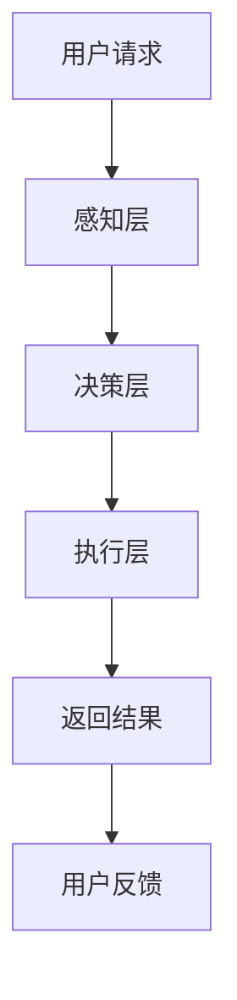
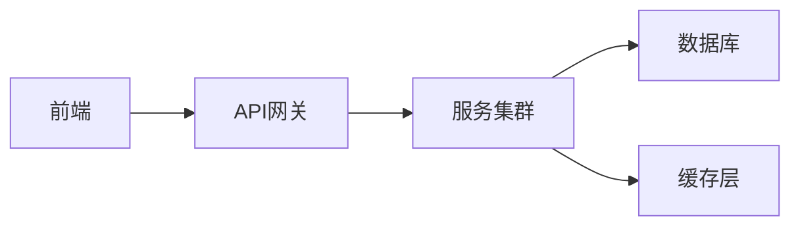

                 


# AI Agent的云端部署与管理

> 关键词：AI Agent，云端部署，管理，系统架构，算法原理，项目实战

> 摘要：本文将详细探讨AI Agent在云端部署与管理的关键技术与实践。通过分析AI Agent的核心概念、算法原理、系统架构设计，结合实际项目案例，为读者提供从理论到实践的全面指导。

---

# 第一部分：AI Agent的基本概念与背景

## 第1章：AI Agent的定义与特点

### 1.1 AI Agent的定义
AI Agent（人工智能代理）是一种能够感知环境、自主决策并执行任务的智能实体。它通过与用户或系统的交互，完成特定的目标。

### 1.2 AI Agent的核心特点
- **自主性**：能够自主决策，无需人工干预。
- **反应性**：能够实时感知环境变化并做出响应。
- **目标导向**：所有行为都以实现特定目标为导向。
- **可扩展性**：能够处理不同类型和规模的任务。

### 1.3 AI Agent与传统AI的区别
| 特性 | AI Agent | 传统AI |
|------|----------|--------|
| 自主性 | 高       | 低     |
| 适应性 | 强       | 弱     |
| 目标导向 | 是      | 否     |

## 第2章：云端部署与管理的背景

### 2.1 云计算的发展与AI Agent的结合
随着云计算技术的成熟，AI Agent能够利用云资源进行弹性扩展和高性能计算。

### 2.2 企业对AI Agent的需求
企业希望通过AI Agent实现智能化转型，提升效率和用户体验。

### 2.3 云端部署的优势与挑战
- **优势**：资源弹性扩展、高可用性、全球覆盖。
- **挑战**：网络延迟、数据隐私、资源成本。

---

# 第二部分：AI Agent的核心概念与原理

## 第3章：AI Agent的核心概念

### 3.1 AI Agent的组成与结构
#### 3.1.1 感知层
负责接收输入并解析任务，例如自然语言处理模块。
#### 3.1.2 决策层
基于感知层的信息，进行任务分解和算法选择。
#### 3.1.3 执行层
根据决策层的指令，调用相应的服务或API完成任务。

### 3.2 AI Agent的交互流程


### 3.3 AI Agent的实体关系图
```mermaid
er
actor: 用户
agent: AI Agent
cloud: 云端平台
```

---

# 第三部分：AI Agent的算法原理与数学模型

## 第4章：AI Agent的算法原理

### 4.1 常见AI算法概述
- **机器学习算法**：如随机森林、神经网络。
- **自然语言处理算法**：如BERT、GPT。
- **强化学习算法**：如Q-Learning、Deep Q-Network。

### 4.2 AI Agent的决策算法
#### 4.2.1 基于规则的决策
通过预定义的规则进行判断，例如简单的if-else逻辑。

#### 4.2.2 基于概率的决策
根据概率模型进行决策，例如贝叶斯网络。

#### 4.2.3 基于强化学习的决策
通过奖励机制优化决策策略，例如深度Q网络。

### 4.3 AI Agent的数学模型
#### 4.3.1 优化目标函数
$$ \text{目标函数} = \argmax_{\theta} \sum_{i=1}^{n} \log P(y_i|x_i,\theta) $$

#### 4.3.2 概率模型与决策树
概率模型用于估计事件发生的可能性，决策树用于结构化决策过程。

---

# 第四部分：AI Agent的系统架构与设计

## 第5章：云端部署的系统架构

### 5.1 系统功能模块划分
#### 5.1.1 用户请求处理模块
负责接收和解析用户的输入。
#### 5.1.2 任务分解模块
将任务分解为可执行的子任务。
#### 5.1.3 执行与反馈模块
调用相应的服务并返回结果。

### 5.2 系统架构设计


### 5.3 接口设计与交互流程
#### 5.3.1 API接口规范
定义清晰的RESTful API接口，例如：
- POST /api/agent/task
- GET /api/agent/status

#### 5.3.2 请求与响应协议
使用JSON格式传递数据，例如：
```json
{
  "input": "用户输入的内容",
  "params": {
    "model": "gpt-3.5",
    "temperature": 0.7
  }
}
```

---

# 第五部分：AI Agent的项目实战

## 第6章：项目实战

### 6.1 环境安装
- 安装Python和必要的库：`pip install requests numpy pandas`
- 配置云服务提供商的API密钥。

### 6.2 核心实现
#### 6.2.1 用户请求处理模块
```python
def handle_request(input_str):
    # 解析输入
    parsed_input = parse(input_str)
    # 调用AI模型
    result = call_ai_model(parsed_input)
    return result
```

#### 6.2.2 任务分解模块
```python
def decompose_task(task):
    sub_tasks = []
    for step in task_steps:
        if step not in sub_tasks:
            sub_tasks.append(step)
    return sub_tasks
```

### 6.3 实际案例分析
以电商客服AI Agent为例，展示如何通过AI Agent实现自动回复和问题解决。

---

# 第六部分：总结与展望

## 第7章：总结与注意事项

### 7.1 本章小结
本文详细介绍了AI Agent的云端部署与管理，从概念到实现，为读者提供了全面的指导。

### 7.2 注意事项
- 确保数据安全和隐私保护。
- 定期优化算法和系统架构，提升性能和用户体验。

### 7.3 拓展阅读
- 推荐阅读《机器学习实战》和《云原生应用开发》。

---

通过本文的讲解，读者可以全面掌握AI Agent的云端部署与管理的关键技术，并能够将其应用到实际项目中。

