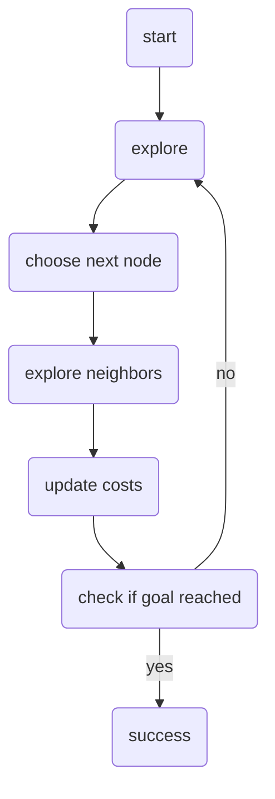
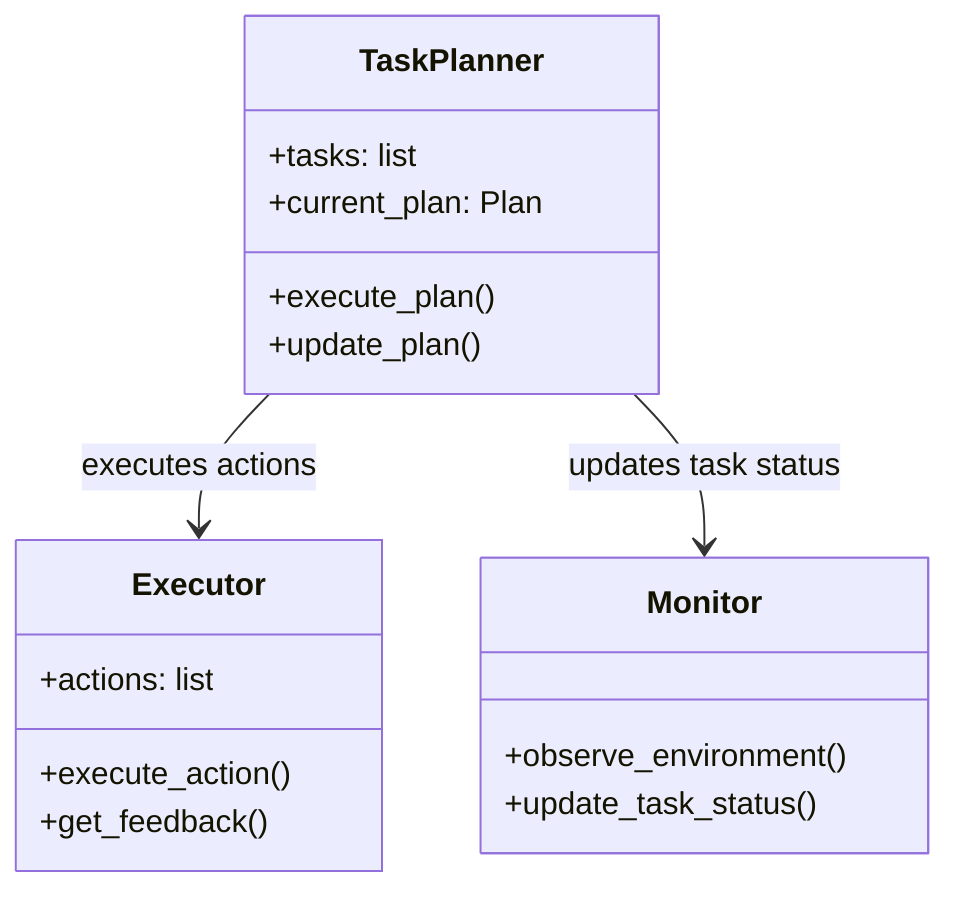
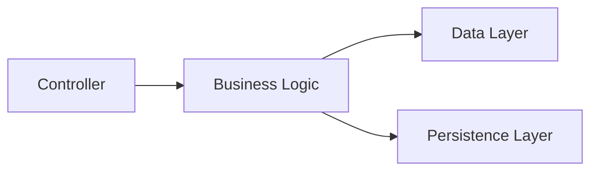

                 


# AI Agent的任务规划与执行模块开发

> 关键词：AI Agent，任务规划，执行模块，算法原理，系统架构，项目实战

> 摘要：AI Agent的任务规划与执行模块是实现智能化系统的核心部分。本文将详细探讨任务规划的核心概念、算法原理、系统架构设计以及项目实战，通过案例分析和数学模型的深入讲解，帮助读者掌握AI Agent任务规划与执行模块的开发方法。

---

# 第1章 AI Agent与任务规划概述

## 1.1 AI Agent的基本概念

### 1.1.1 AI Agent的定义与特点
AI Agent（人工智能代理）是一种能够感知环境、自主决策并执行任务的智能实体。其特点包括自主性、反应性、目标导向性和社会性。

### 1.1.2 任务规划的核心概念
任务规划是指AI Agent根据目标和环境信息，生成一系列行动步骤的过程。它是AI Agent实现复杂任务的关键能力。

### 1.1.3 AI Agent在实际应用中的作用
AI Agent广泛应用于自动驾驶、智能助手、机器人控制等领域，任务规划与执行模块是其实现智能化决策的核心模块。

## 1.2 任务规划与执行的背景与挑战

### 1.2.1 任务规划的背景介绍
随着AI技术的发展，任务规划从简单的规则驱动逐步向复杂的智能规划演进。

### 1.2.2 当前任务规划的主要挑战
任务规划面临动态环境变化、计算复杂度高、多目标冲突等挑战，需要结合多种算法和技术来解决。

### 1.2.3 AI Agent在任务规划中的优势
AI Agent通过感知环境和学习能力，能够动态调整任务规划，提高执行效率和准确性。

## 1.3 任务规划与执行模块的重要性

### 1.3.1 任务规划模块的功能
任务规划模块负责将目标分解为可执行的行动步骤，并制定最优执行计划。

### 1.3.2 执行模块的核心作用
执行模块负责根据规划结果，调用相关资源和接口，完成实际任务。

### 1.3.3 模块化设计的意义
模块化设计使AI Agent的开发和维护更加高效，便于扩展和优化。

## 1.4 本章小结
本章介绍了AI Agent的基本概念，探讨了任务规划的核心概念和实际应用中的挑战，强调了任务规划与执行模块的重要性。

---

# 第2章 任务规划的核心概念与原理

## 2.1 任务规划的基本原理

### 2.1.1 任务分解的基本方法
任务分解是将复杂目标分解为多个子任务，常用方法包括层次分解法和功能分解法。

### 2.1.2 任务优先级的确定
任务优先级根据任务的重要性和紧急性进行排序，常用算法包括贪心算法和动态优先级调整。

### 2.1.3 任务依赖关系的处理
任务依赖关系是指某些任务必须在其他任务完成后才能执行，处理方法包括任务排序和并行执行。

## 2.2 AI Agent中的任务规划模型

### 2.2.1 基于状态空间的规划模型
状态空间模型将问题转化为状态和动作的组合，适用于简单任务的规划。

### 2.2.2 基于逻辑推理的规划模型
逻辑推理模型通过形式化逻辑推理生成规划，适用于复杂任务的处理。

### 2.2.3 基于强化学习的规划模型
强化学习模型通过试错和奖励机制优化规划，适用于动态环境中的任务规划。

## 2.3 任务规划与执行的协同机制

### 2.3.1 规划与执行的接口设计
规划模块与执行模块之间需要通过明确的接口进行通信，确保任务执行的准确性和高效性。

### 2.3.2 动态任务调整的实现
动态任务调整需要根据执行反馈实时调整规划，确保任务执行的灵活性和适应性。

### 2.3.3 执行反馈对规划的影响
执行反馈能够为规划模块提供环境变化的信息，帮助优化后续任务规划。

## 2.4 本章小结
本章详细讲解了任务规划的核心概念，分析了不同任务规划模型的优缺点，并探讨了规划与执行协同机制的设计。

---

# 第3章 任务规划的算法原理与实现

## 3.1 常见的任务规划算法

### 3.1.1 A*算法
A*算法是一种经典的路径规划算法，适用于静态环境中的任务规划。



### 3.1.2 Dijkstra算法
Dijkstra算法用于找到从起点到目标的最短路径，适用于权重相同的任务节点。

### 3.1.3 蒙特卡洛树搜索(MCTS)
MCTS算法通过模拟多个可能的行动路径，选择最优的任务执行路径。

## 3.2 基于强化学习的规划算法

### 3.2.1 Q-Learning算法
Q-Learning是一种基于值函数的强化学习算法，适用于动态环境中的任务规划。

### 3.2.2 Deep Q-Network (DQN)
DQN通过深度神经网络近似值函数，提升任务规划的效率和准确性。

### 3.2.3 Policy Gradient方法
Policy Gradient方法直接优化策略，适用于复杂任务的规划。

## 3.3 算法实现的数学模型

### 3.3.1 A*算法的数学表达
$$f(n) = g(n) + h(n)$$
其中，$g(n)$表示从起点到节点n的已知成本，$h(n)$表示从节点n到目标的启发式估计成本。

### 3.3.2 DQN的数学模型
$$Q(s, a) = r + \gamma \max_{a'} Q(s', a')$$
其中，$s$是当前状态，$a$是动作，$r$是奖励，$\gamma$是折扣因子。

## 3.4 算法实现的代码示例

```python
def a_star(start, goal):
    open_set = {start}
    came_from = {}
    g_score = {start: 0}
    f_score = {start: heuristic(start, goal)}
    while open_set:
        current = node_with_min_f_score(open_set)
        if current == goal:
            break
        open_set.remove(current)
        neighbors = get_neighbors(current)
        for neighbor in neighbors:
            tentative_g_sc

```

---

# 第4章 任务规划与执行的系统架构设计

## 4.1 系统功能设计

### 4.1.1 领域模型
领域模型是任务规划与执行的核心逻辑，通过类图展示各个模块之间的关系。



### 4.1.2 系统架构设计
系统架构设计通过分层架构实现模块化开发，包括数据层、业务逻辑层和控制层。



### 4.1.3 系统接口设计
系统接口设计通过REST API实现模块之间的通信，确保各模块协作高效。

### 4.1.4 系统交互设计
系统交互设计通过序列图展示模块之间的调用流程，确保任务规划与执行的协同。

---

# 第5章 项目实战：任务规划与执行模块开发

## 5.1 环境安装

### 5.1.1 安装Python
安装Python 3.8及以上版本。

### 5.1.2 安装依赖库
安装numpy、pandas、scikit-learn等依赖库。

## 5.2 核心代码实现

### 5.2.1 任务分解算法
实现任务分解的代码，将复杂目标分解为多个子任务。

### 5.2.2 任务优先级排序
实现任务优先级排序的代码，根据任务的重要性和紧急性进行排序。

### 5.2.3 任务依赖关系处理
实现任务依赖关系处理的代码，确保任务执行的顺序和并行性。

## 5.3 代码应用解读与分析

### 5.3.1 任务分解算法的应用
通过具体案例展示任务分解算法的实现和效果。

### 5.3.2 任务优先级排序的应用
通过具体案例展示任务优先级排序的实现和优化。

### 5.3.3 任务依赖关系处理的应用
通过具体案例展示任务依赖关系处理的实现和效果。

## 5.4 项目小结
总结项目开发的经验和教训，提出改进建议。

---

# 第6章 最佳实践与小结

## 6.1 最佳实践

### 6.1.1 任务规划算法的选择
根据任务复杂度和环境动态性选择合适的任务规划算法。

### 6.1.2 系统架构设计的优化
通过模块化设计和分层架构提高系统的可维护性和扩展性。

### 6.1.3 代码实现的优化
通过代码复用和性能优化提高任务规划与执行的效率。

## 6.2 小结
总结全书内容，强调任务规划与执行模块开发的重要性，鼓励读者深入学习和实践。

## 6.3 注意事项
在实际开发中，需要注意任务动态变化、环境不确定性以及系统资源限制等问题。

## 6.4 拓展阅读
推荐阅读相关领域的书籍和论文，进一步提升任务规划与执行模块开发的能力。

---

# 附录

## 附录A 任务规划算法的数学模型

$$f(n) = g(n) + h(n)$$

## 附录B 系统架构设计图


## 附录C 项目核心代码示例

```python
def a_star(start, goal):
    open_set = {start}
    came_from = {}
    g_score = {start: 0}
    f_score = {start: heuristic(start, goal)}
    while open_set:
        current = node_with_min_f_score(open_set)
        if current == goal:
            break
        open_set.remove(current)
        neighbors = get_neighbors(current)
        for neighbor in neighbors:
            tentative_g_sc

```

