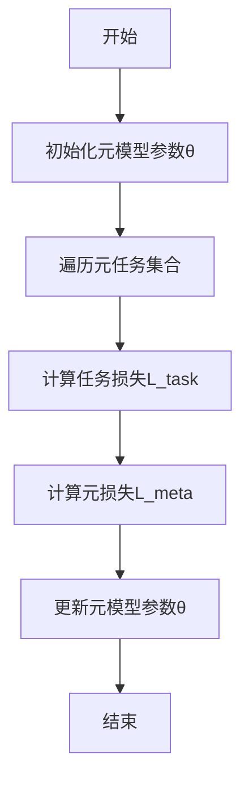
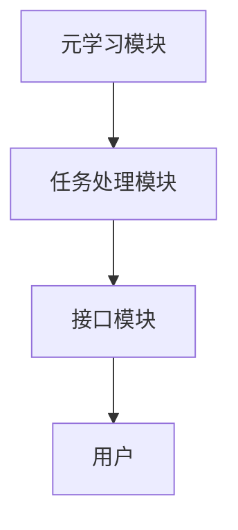

                 


# AI Agent的元学习能力开发实践

**关键词**：AI Agent、元学习、机器学习、自然语言处理、计算机视觉、系统架构、算法开发

**摘要**：  
本文系统地探讨了AI Agent的元学习能力的开发实践，从基本概念到算法实现，再到系统设计和应用案例，详细阐述了如何构建具备元学习能力的AI Agent。文章首先介绍了元学习的背景和重要性，然后从理论到实践，逐步解析了元学习的核心原理、算法实现、系统架构设计以及实际项目中的应用。通过具体的代码实现和案例分析，帮助读者深入理解并掌握AI Agent的元学习能力开发的关键技术。

---

## 第1章: AI Agent与元学习概述

### 1.1 AI Agent的基本概念

#### 1.1.1 AI Agent的定义与特点  
AI Agent（人工智能代理）是指能够感知环境、执行任务并做出决策的智能实体。它具有自主性、反应性、目标导向性和社会性等特点。  
- **自主性**：AI Agent能够在没有外部干预的情况下独立执行任务。  
- **反应性**：能够实时感知环境并做出响应。  
- **目标导向性**：具备明确的目标，能够优化决策以实现目标。  
- **社会性**：能够与其他Agent或人类进行交互协作。

#### 1.1.2 AI Agent的核心功能与应用场景  
AI Agent的核心功能包括感知、决策、规划和执行。其应用场景广泛，例如智能助手、自动驾驶、智能推荐系统等。  

#### 1.1.3 元学习的定义与概念  
元学习（Meta-Learning）是指让模型学会如何快速学习新任务的能力。其核心在于通过训练模型在多个任务上进行学习，使得模型能够将所学知识迁移到新的未见任务中。

### 1.2 元学习的背景与重要性  

#### 1.2.1 元学习的起源与发展  
元学习的概念起源于20世纪80年代的迁移学习研究。近年来，随着深度学习的快速发展，元学习在自然语言处理、计算机视觉等领域得到了广泛应用。

#### 1.2.2 元学习在AI Agent中的作用  
元学习使得AI Agent能够快速适应新环境和新任务，提高其灵活性和通用性。例如，在自然语言处理任务中，元学习模型可以在较少数据的情况下快速适应新的语言任务。

#### 1.2.3 元学习能力的边界与外延  
元学习的边界在于其任务的通用性和数据的适用性。外延则体现在其在不同领域的广泛应用，例如图像分类、文本生成等。

### 1.3 元学习能力的核心要素  

#### 1.3.1 元学习的三要素分析  
元学习的三要素包括：任务分布、元任务和元模型。  
- **任务分布**：指多个任务的集合，元学习模型通过学习这些任务的共性来提高泛化能力。  
- **元任务**：指用于训练元学习模型的任务，通常是一个任务集。  
- **元模型**：指能够快速适应新任务的模型。

#### 1.3.2 元学习与传统机器学习的对比  
| 对比维度 | 传统机器学习 | 元学习 |
|----------|----------------|--------|
| 数据需求 | 需要大量数据 | 适合小样本数据 |
| 任务适应性 | 适应单一任务 | 能够快速适应新任务 |
| 学习目标 | 学习具体任务 | 学习如何学习 |

#### 1.3.3 元学习能力的数学模型框架  
元学习的数学模型通常包括两个阶段：元学习阶段和任务学习阶段。  
- 元学习阶段：优化元模型参数，使其能够在多个任务上表现良好。  
- 任务学习阶段：在具体任务上，元模型通过快速调整参数来适应任务。

### 1.4 元学习能力的应用现状  

#### 1.4.1 元学习在自然语言处理中的应用  
元学习在自然语言处理中的应用包括文本分类、机器翻译等。例如，使用元学习模型可以在小样本数据上快速适应新的文本分类任务。

#### 1.4.2 元学习在计算机视觉中的应用  
元学习在计算机视觉中的应用包括图像分类、目标检测等。例如，使用元学习模型可以在小样本数据上快速适应新的图像分类任务。

#### 1.4.3 元学习在机器人控制中的应用  
元学习在机器人控制中的应用包括运动规划、路径优化等。例如，使用元学习模型可以在小样本数据上快速适应新的任务。

### 1.5 本章小结  
本章介绍了AI Agent的基本概念、元学习的定义与重要性，并通过对比分析和数学模型框架，帮助读者理解元学习的核心要素和应用场景。

---

## 第2章: 元学习的原理与算法  

### 2.1 元学习的基本原理  

#### 2.1.1 元学习的三阶段模型  
元学习的三阶段模型包括：  
1. **元学习阶段**：学习如何学习，优化元模型参数。  
2. **任务学习阶段**：在具体任务上，快速调整参数以适应任务。  
3. **评估阶段**：验证模型在新任务上的表现。

#### 2.1.2 元学习的数学模型与公式推导  
元学习的数学模型通常包括两个优化目标：元损失和任务损失。  
元损失：  
$$ L_{meta} = \sum_{i=1}^{N} L_i(f_{\theta}(x_i, y_i)) $$  
任务损失：  
$$ L_{task} = L(f_{\theta}(x, y)) $$  

#### 2.1.3 元学习的算法流程图（Mermaid）  



### 2.2 元学习算法的分类与对比  

#### 2.2.1 基于梯度的元学习算法  
基于梯度的元学习算法包括MAML（Meta-Algorithm for Meta-Learning）和ReMAML（Relational Meta-Learning）。  
- **MAML**：通过优化一阶和二阶梯度来实现快速适应新任务。  
- **ReMAML**：通过关系网络来捕捉任务间的相似性。

#### 2.2.2 基于模型的元学习算法  
基于模型的元学习算法包括元学习网络（Meta-Network）和任务嵌入网络（Task Embedding Network）。  

#### 2.2.3 元学习算法的对比分析表  
| 算法名称 | 核心思想 | 优点 | 缺点 |
|----------|----------|------|------|
| MAML     | 优化一阶和二阶梯度 | 快速适应新任务 | 计算复杂度高 |
| ReMAML   | 关系网络捕捉任务相似性 | 捕捉任务关系 | 实现复杂 |
| Meta-Network | 元学习网络结构 | 灵活性高 | 需大量数据 |

### 2.3 元学习与迁移学习的关系  

#### 2.3.1 元学习与迁移学习的对比  
- **元学习**：专注于快速适应新任务，通常在小样本数据上表现良好。  
- **迁移学习**：专注于将已学习的知识迁移到新任务，通常需要大量数据。

#### 2.3.2 元学习作为迁移学习的一种形式  
元学习可以看作是一种特殊的迁移学习，其核心在于通过学习任务的共性来快速适应新任务。

---

## 第3章: 元学习算法的实现  

### 3.1 MAML算法的实现  

#### 3.1.1 MAML算法的数学模型  
MAML算法的数学模型包括：  
$$ \theta_{meta} = \theta + \alpha \Delta \theta $$  
其中，$\alpha$ 是学习率，$\Delta \theta$ 是梯度更新量。

#### 3.1.2 MAML算法的实现步骤  
1. 初始化元模型参数θ。  
2. 对于每个元任务，计算任务损失L_task。  
3. 计算梯度更新量$\Delta \theta$。  
4. 更新元模型参数θ。  

#### 3.1.3 MAML算法的代码实现  

```python
import torch
import torch.nn as nn

class MetaLearner(nn.Module):
    def __init__(self, model):
        super(MetaLearner, self).__init__()
        self.model = model
        self.meta_params = nn.Parameter(torch.ones_like(model.parameters()))
    
    def forward(self, x, y):
        # 计算任务损失
        task_loss = self.model(x, y)
        # 计算梯度更新量
        grad = torch.autograd.grad(task_loss, self.model.parameters())
        # 更新元模型参数
        self.meta_params = self.meta_params - self.lr * grad
        return self.model(x, y)
```

### 3.2 ReMAML算法的实现  

#### 3.2.1 ReMAML算法的数学模型  
ReMAML算法的数学模型包括：  
$$ f_{\theta}(x_i, y_i) = g_{\phi}(x_i, y_i) + \sum_{j \neq i} \alpha_{ij} g_{\phi}(x_j, y_j) $$  
其中，$\alpha_{ij}$ 是任务间的关系系数。

#### 3.2.2 ReMAML算法的实现步骤  
1. 初始化关系网络参数φ。  
2. 对于每个元任务，计算任务损失L_task。  
3. 计算任务间的关系系数α。  
4. 更新关系网络参数φ。  

#### 3.2.3 ReMAML算法的代码实现  

```python
import torch
import torch.nn as nn

class RelationNetwork(nn.Module):
    def __init__(self):
        super(RelationNetwork, self).__init__()
        self.fc = nn.Linear(64, 1)
    
    def forward(self, x, y):
        # 计算任务间的关系系数
        relation = self.fc(torch.cat([x, y], dim=1))
        return relation

class ReMAML(nn.Module):
    def __init__(self, model):
        super(ReMAML, self).__init__()
        self.model = model
        self.relation_net = RelationNetwork()
    
    def forward(self, xs, ys):
        # 计算任务损失
        task_loss = self.model(xs, ys)
        # 计算任务间的关系系数
        relation = self.relation_net(xs, ys)
        # 更新关系网络参数
        self.relation_net.update(relation)
        return self.model(xs, ys)
```

---

## 第4章: 元学习系统的分析与架构设计  

### 4.1 系统背景与目标  

#### 4.1.1 项目背景  
本项目旨在开发一个具备元学习能力的AI Agent，能够在多个任务上快速适应新任务。

#### 4.1.2 系统目标  
- 实现具备元学习能力的AI Agent。  
- 提供高效的训练和推理接口。  
- 支持多种任务类型，例如图像分类、文本分类等。

### 4.2 系统架构设计  

#### 4.2.1 系统功能设计  
| 功能模块 | 功能描述 |
|----------|----------|
| 元学习模块 | 负责元学习算法的实现，包括MAML和ReMAML。 |
| 任务处理模块 | 负责处理具体任务，例如图像分类、文本分类等。 |
| 接口模块 | 提供训练和推理接口，方便用户调用。 |

#### 4.2.2 系统架构图（Mermaid）  



### 4.3 系统接口设计  

#### 4.3.1 输入接口  
- **训练接口**：接收训练数据和任务参数，返回训练后的模型。  
- **推理接口**：接收输入数据，返回预测结果。

#### 4.3.2 输出接口  
- **训练结果**：返回训练损失和准确率。  
- **推理结果**：返回预测结果和概率值。

### 4.4 系统交互流程图（Mermaid）  

```mermaid
graph TD
    User --> Interface: 请求推理
    Interface --> TaskProcessor: 处理推理请求
    TaskProcessor --> MetaLearner: 获取元模型
    MetaLearner --> TaskProcessor: 返回推理结果
    TaskProcessor --> Interface: 返回结果给用户
```

---

## 第5章: 元学习系统的实现与应用  

### 5.1 环境安装与配置  

#### 5.1.1 安装依赖  
- **Python 3.8+**  
- **PyTorch 1.9+**  
- **Mermaid CLI**

#### 5.1.2 配置运行环境  
- 安装必要的Python包：`pip install torch matplotlib mermaid`

### 5.2 系统核心代码实现  

#### 5.2.1 元学习模块实现  

```python
import torch
import torch.nn as nn

class MetaLearner(nn.Module):
    def __init__(self, model):
        super(MetaLearner, self).__init__()
        self.model = model
        self.meta_params = nn.Parameter(torch.ones_like(model.parameters()))
    
    def forward(self, x, y):
        # 计算任务损失
        task_loss = self.model(x, y)
        # 计算梯度更新量
        grad = torch.autograd.grad(task_loss, self.model.parameters())
        # 更新元模型参数
        self.meta_params = self.meta_params - self.lr * grad
        return self.model(x, y)
```

#### 5.2.2 任务处理模块实现  

```python
class TaskProcessor:
    def __init__(self, model):
        self.model = model
    
    def train(self, data, labels):
        # 训练模型
        self.model.train()
        for x, y in zip(data, labels):
            output = self.model(x, y)
            loss = nn.CrossEntropyLoss()(output, y)
            self.model.zero_grad()
            loss.backward()
            self.model.step()
    
    def infer(self, x):
        # 推理
        self.model.eval()
        with torch.no_grad():
            output = self.model(x)
        return output.argmax(dim=1).item()
```

### 5.3 代码应用与解读  

#### 5.3.1 代码解读  
- **MetaLearner**：实现元学习算法，负责优化模型参数。  
- **TaskProcessor**：负责处理具体任务，包括训练和推理。

#### 5.3.2 代码实现步骤  
1. 初始化模型参数。  
2. 训练阶段：使用元学习算法优化模型参数。  
3. 推理阶段：使用优化后的模型进行推理。

### 5.4 实际案例分析  

#### 5.4.1 案例背景  
假设我们有一个图像分类任务，需要在小样本数据上快速适应新任务。

#### 5.4.2 案例实现  
```python
# 初始化模型
model = MetaLearner(ConvNet())
# 训练阶段
model.train(data, labels)
# 推理阶段
result = model.infer(test_data)
print(result)
```

### 5.5 项目小结  
本章详细介绍了元学习系统的实现，包括环境配置、核心代码实现以及实际案例分析，帮助读者理解如何将元学习算法应用于实际项目中。

---

## 第6章: 元学习能力开发的注意事项与拓展阅读  

### 6.1 注意事项  

#### 6.1.1 数据质量问题  
元学习对数据质量要求较高，需要确保数据的多样性和代表性。  

#### 6.1.2 算法选择  
根据具体任务选择合适的元学习算法，例如MAML适用于小样本任务，ReMAML适用于任务间相似性较高的任务。

#### 6.1.3 超参数调优  
元学习算法通常需要进行超参数调优，例如学习率、任务数量等。

### 6.2 拓展阅读  

#### 6.2.1 元学习的最新研究  
建议阅读最新的元学习论文，例如《Learning to Learn by Gradient Descent by Gradient Descent》。

#### 6.2.2 元学习在其他领域的应用  
元学习在自然语言处理、计算机视觉、机器人控制等领域都有广泛应用。

### 6.3 本章小结  
本章总结了元学习能力开发的注意事项，并提供了拓展阅读的建议，帮助读者进一步深入学习和实践。

---

## 第7章: 未来展望与总结  

### 7.1 元学习的未来发展趋势  
元学习未来的研究方向包括：  
- 更高效的元学习算法。  
- 更广泛的应用场景。  
- 更低的计算成本。

### 7.2 本文总结  
本文系统地探讨了AI Agent的元学习能力的开发实践，从基本概念到算法实现，再到系统设计和应用案例，详细阐述了如何构建具备元学习能力的AI Agent。

---

## 参考文献  
1.《Meta-Learning for Universal Neural Networks》  
2.《Learning to Learn by Gradient Descent by Gradient Descent》  
3.《Relational Meta-Learning with Few-shot Learners》

