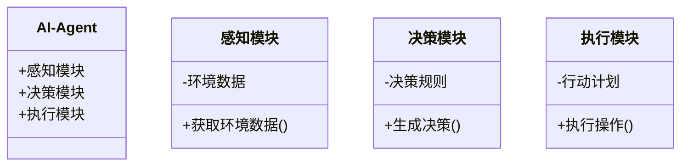
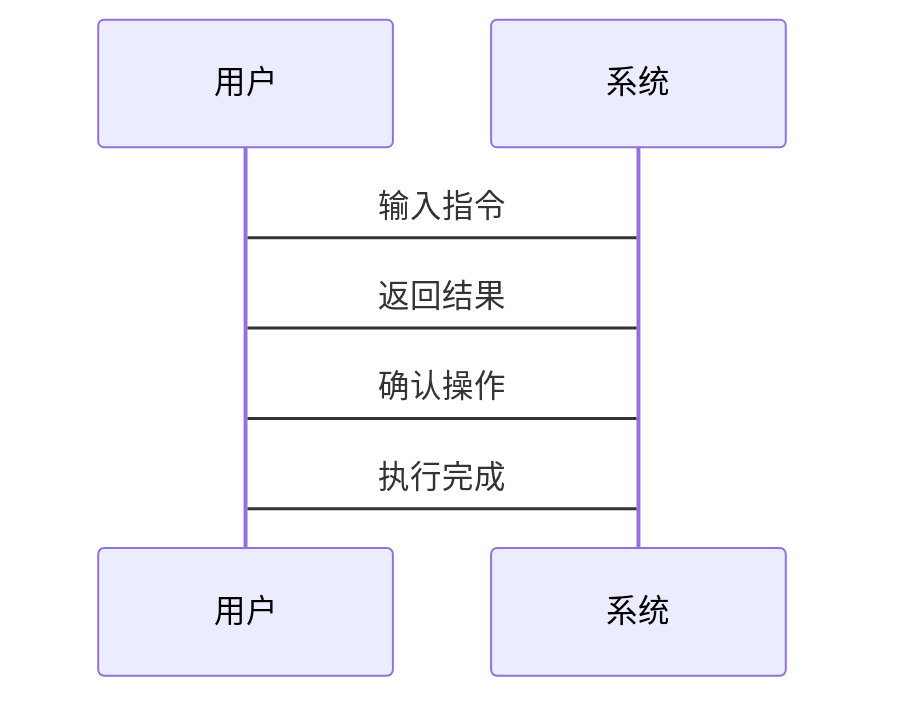

                 


# AI Agent的可解释性设计与实现

> 关键词：AI Agent, 可解释性, 人工智能, 系统设计, 算法原理, 项目实战

> 摘要：本文深入探讨了AI Agent的可解释性设计与实现，从背景概述、核心概念到算法原理、系统架构，再到项目实战和最佳实践，全面分析了如何在AI Agent中实现可解释性，帮助用户理解和信任AI系统。

---

# 正文

## 第一章: AI Agent的概述与背景

### 1.1 AI Agent的基本概念

AI Agent，即人工智能代理，是指能够感知环境、自主决策并执行任务的智能实体。它具备以下特点：
- **自主性**：能够在没有外部干预的情况下独立运作。
- **反应性**：能实时感知环境并做出响应。
- **目标导向**：以实现特定目标为导向进行决策和行动。

### 1.2 可解释性的重要性

在AI Agent的应用中，可解释性是关键因素。它不仅影响用户对系统的信任，还关系到系统的合法性和合规性。解释性是指系统能够清晰地解释其决策过程和结果，使得用户能够理解并验证系统的运作逻辑。

### 1.3 当前AI Agent的挑战与机遇

尽管AI Agent在多个领域展现出巨大潜力，但其可解释性仍然是主要挑战。复杂的算法往往导致“黑箱”效应，用户难以理解决策过程。然而，随着技术进步，通过可解释性设计，AI Agent正逐步克服这一障碍，迎来更广泛的应用。

---

## 第二章: 可解释性与AI Agent的关系

### 2.1 可解释性的核心概念

可解释性在AI Agent中的作用至关重要。它不仅帮助用户理解系统行为，还能提升系统的透明度和信任度。解释性是指系统能够用人类可理解的方式描述其决策过程。

### 2.2 可解释性与AI Agent的关联

AI Agent的决策过程需要通过可解释性与用户建立联系。用户对系统决策的理解直接影响其接受度和使用体验。因此，设计可解释的AI Agent是实现人机交互信任的基础。

### 2.3 可解释性与AI Agent的边界

可解释性的范围和应用在AI Agent中具有明确的边界。例如，在医疗诊断中，系统需要详细解释诊断依据，而在推荐系统中，则需解释推荐理由。这些场景中的可解释性要求各不相同，需在设计时予以考虑。

---

## 第三章: AI Agent的可解释性设计原则

### 3.1 明确性原则

明确性是可解释性设计的基础。AI Agent的决策过程必须清晰明确，避免模糊和歧义。例如，在金融风险评估中，系统应明确说明评分依据。

### 3.2 简洁性原则

简洁性有助于用户快速理解系统行为。复杂的解释可能让用户感到困惑，因此设计简洁明了的解释方式是关键。

### 3.3 可关联性原则

可关联性确保系统的解释与用户的行为和需求相关联。例如，在自动驾驶系统中，解释应与驾驶员的操控和路况相关联，帮助驾驶员理解系统决策。

---

## 第四章: AI Agent的可解释性实现方法

### 4.1 基于规则的解释方法

基于规则的解释方法通过明确的规则集来描述系统行为。例如，医疗诊断系统可以通过预定义的症状规则向用户解释诊断结果。

### 4.2 基于模型的解释方法

基于模型的解释方法通过数学模型展示系统决策过程。例如，线性回归模型可以通过权重展示各个因素对决策的影响程度。

### 4.3 基于案例的解释方法

基于案例的解释方法通过类似场景的案例来解释系统决策。例如，推荐系统可以通过展示类似用户的案例来解释推荐理由。

---

## 第五章: AI Agent的可解释性算法与实现

### 5.1 解释性模型的数学基础

解释性模型的数学基础包括线性回归、决策树等。例如，线性回归模型的公式为：
$$ y = \beta_0 + \beta_1x_1 + \beta_2x_2 + ... + \beta_nx_n $$

### 5.2 解释性算法的实现

以下是基于LIME算法的Python实现示例：
```python
import lime
from lime import lime_explainer

explainer = lime_explainer.LimeExplainer()
explanation = explainer.explain_instance(X, y, model.predict)
print(explanation.as_list())
```

### 5.3 可视化解释工具

可视化工具如LIME和SHAP通过图形化方式展示模型解释。例如，LIME可以通过权重图展示每个特征对预测结果的影响。

---

## 第六章: AI Agent的系统架构与设计

### 6.1 系统功能设计

AI Agent的系统功能包括感知环境、决策推理和执行操作。以下是系统功能模块的类图：


### 6.2 系统架构设计

AI Agent的系统架构采用分层设计，包括感知层、决策层和执行层。以下是系统架构的架构图：


### 6.3 系统接口设计

系统接口设计包括输入接口、输出接口和交互接口。以下是接口交互的序列图：


---

## 第七章: 项目实战与最佳实践

### 7.1 项目背景与目标

项目背景：开发一个可解释的AI客服助手，帮助用户解决问题并提升用户体验。

### 7.2 系统实现

以下是系统的Python核心代码：
```python
class AIAssistant:
    def __init__(self):
        self.rules = {}  # 存储解释规则
    
    def explain_decision(self, input_data):
        # 根据预定义规则生成解释
        explanation = []
        for rule in self.rules:
            if rule.match(input_data):
                explanation.append(rule.explain())
        return explanation
```

### 7.3 实际案例分析

案例分析：在医疗诊断系统中，AI Agent通过可解释性算法解释诊断结果，帮助医生理解系统决策。

### 7.4 项目小结

通过可解释性设计，AI Agent在提高用户信任和系统透明度方面展现出巨大潜力。未来，随着技术进步，可解释性将成为AI Agent设计的核心要素。

---

## 第八章: 总结与展望

### 8.1 本章总结

本文详细探讨了AI Agent的可解释性设计与实现，从理论基础到算法实现，再到系统架构和项目实战，全面分析了可解释性的重要性及其在AI Agent中的应用。

### 8.2 未来展望

随着AI技术的发展，可解释性设计将更加重要。未来的研究方向包括开发更高效的解释算法和优化系统架构，以实现更高级的可解释性。

---

## 第九章: 最佳实践与注意事项

### 9.1 小结

可解释性设计是AI Agent实现信任和透明度的关键。通过明确的设计原则和高效的算法实现，可解释性将推动AI Agent的广泛应用。

### 9.2 注意事项

在实际应用中，需注意可解释性设计的复杂性和场景适应性，避免过度简化或忽视用户需求。

### 9.3 拓展阅读

推荐阅读《可解释的人工智能：理论、算法和应用》以深入了解可解释性设计的前沿研究。

---

通过以上章节的详细分析和具体实施，AI Agent的可解释性设计与实现将更加完善，为未来的智能化系统发展奠定坚实基础。

