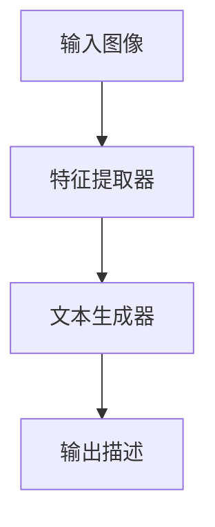
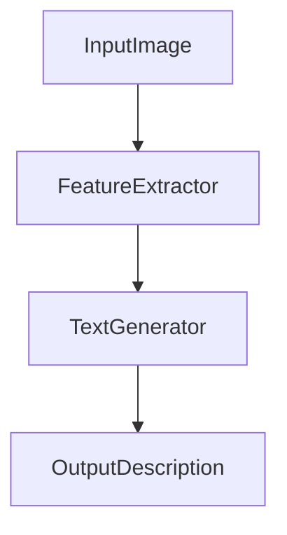
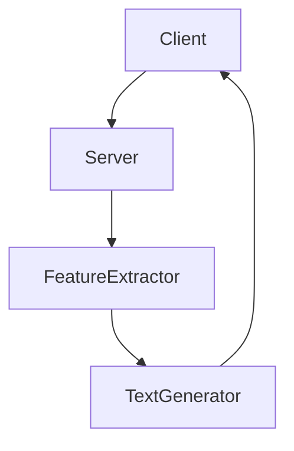
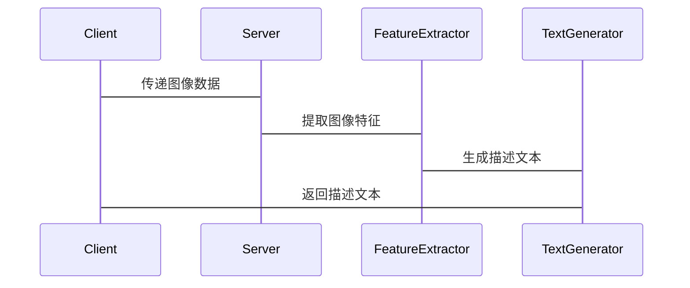

                 


# AI Agent的图像描述生成技术实现

## 关键词
AI Agent, 图像描述生成, Transformer, 扩散模型, 系统架构, 项目实战

## 摘要
本文详细探讨了AI Agent在图像描述生成中的技术实现。首先，介绍了AI Agent的基本概念及其在图像描述生成中的作用，分析了图像描述生成的背景、挑战与解决方案。接着，深入讲解了图像描述生成的核心算法，包括基于Transformer和扩散模型的实现。随后，设计了一个完整的AI Agent图像描述生成系统架构，并通过实际案例展示了系统的实现与应用。最后，总结了项目的最佳实践，并展望了未来的发展方向。

---

## 第一部分: AI Agent的图像描述生成技术概述

### 第1章: AI Agent与图像描述生成的背景

#### 1.1 AI Agent的基本概念
##### 1.1.1 AI Agent的定义
AI Agent是一种智能体，能够感知环境、自主决策并执行任务。它具有目标导向性、自主性、反应性和社交能力等特征。

##### 1.1.2 AI Agent的核心特征
- **目标导向性**：AI Agent能够根据目标进行决策。
- **自主性**：AI Agent可以在没有外部干预的情况下独立运行。
- **反应性**：AI Agent能够感知环境并实时调整行为。
- **社交能力**：AI Agent能够与其他智能体或人类进行交互。

##### 1.1.3 AI Agent与传统AI的区别
传统的AI技术通常依赖于规则和数据，而AI Agent具有更强的自主性和适应性，能够动态调整行为以适应复杂环境。

---

#### 1.2 图像描述生成的背景
##### 1.2.1 图像描述生成的定义
图像描述生成是指将图像内容转换为文本描述的过程，旨在让计算机能够理解并描述图像中的内容。

##### 1.2.2 图像描述生成的典型应用场景
- **图像搜索**：通过描述文本快速找到相关图像。
- **辅助残障人士**：帮助视觉障碍者理解图像内容。
- **社交媒体**：自动生成图片的描述文本。
- **自动驾驶**：通过描述生成理解交通信号和路况。

##### 1.2.3 图像描述生成的挑战与解决方案
- **挑战**：图像内容的多样性和复杂性，描述的准确性和自然性。
- **解决方案**：引入深度学习技术，特别是基于Transformer和扩散模型的生成方法。

---

#### 1.3 AI Agent在图像描述生成中的作用
##### 1.3.1 AI Agent在图像描述生成中的角色
AI Agent作为图像描述生成的核心模块，负责图像的感知、理解和生成描述文本。

##### 1.3.2 AI Agent与图像描述生成的结合方式
- **端到端生成**：AI Agent直接从图像生成描述文本。
- **多模态交互**：AI Agent结合图像和上下文信息生成描述。

##### 1.3.3 AI Agent在图像描述生成中的优势
- **高效性**：AI Agent能够快速处理和生成描述。
- **智能性**：AI Agent能够根据上下文调整描述内容。

---

### 第2章: 图像描述生成的核心概念与联系

#### 2.1 核心概念原理
##### 2.1.1 图像描述生成的原理
图像描述生成通过将图像转换为文本，涉及图像特征提取、序列生成和语言模型训练等步骤。

##### 2.1.2 AI Agent在图像描述生成中的工作流程
1. **图像输入**：AI Agent接收输入图像。
2. **特征提取**：提取图像的视觉特征。
3. **序列生成**：生成描述文本序列。
4. **输出描述**：输出生成的描述文本。

#### 2.2 核心概念属性特征对比
##### 2.2.1 图像描述生成的关键属性
- **准确性**：描述文本是否准确反映图像内容。
- **自然性**：描述文本是否通顺自然。
- **多样性**：描述文本是否多样化。

##### 2.2.2 AI Agent的核心特征对比
| 特征       | 传统AI           | AI Agent       |
|------------|------------------|-----------------|
| 自主性      | 依赖外部干预     | 自主运行        |
| 适应性      | 固定规则         | 动态调整         |
| 反应性      | 无实时反应       | 实时反应         |

#### 2.3 ER实体关系图架构


---

## 第二部分: 图像描述生成的核心算法

### 第3章: 图像描述生成的算法原理

#### 3.1 基于Transformer的图像描述生成模型
##### 3.1.1 Transformer模型的结构
Transformer由编码器和解码器组成，编码器负责提取图像特征，解码器负责生成描述文本。

##### 3.1.2 图像描述生成的Transformer模型
- **编码器**：将图像转换为特征向量。
- **解码器**：将特征向量转换为描述文本序列。

##### 3.1.3 模型的训练与推理流程
1. **训练阶段**：
   - 输入图像和对应的描述文本。
   - 训练模型，优化参数以最小化生成文本与真实文本的差异。
2. **推理阶段**：
   - 输入图像，生成对应的描述文本。

##### 3.1.4 算法实现代码示例
```python
import torch
from torch import nn

class ImageDescriptionGenerator(nn.Module):
    def __init__(self, feature_dim, hidden_dim):
        super(ImageDescriptionGenerator, self).__init__()
        self.encoder = nn.Linear(feature_dim, hidden_dim)
        self.decoder = nn.TransformerDecoder(...)
    
    def forward(self, x):
        features = self.encoder(x)
        description = self.decoder(features)
        return description
```

#### 3.2 扩散模型在图像描述生成中的应用
##### 3.2.1 扩散模型的基本原理
扩散模型通过逐步添加噪声到数据中，最终生成高质量的输出。

##### 3.2.2 扩散模型在图像描述生成中的应用
- **图像去噪**：通过扩散过程生成高质量图像。
- **描述生成**：结合图像特征生成描述文本。

##### 3.2.3 扩散模型的数学模型和公式
扩散模型通过以下步骤生成描述：
$$
q(x_t|x_{t-1}) = \mathcal{N}(x_t; \sqrt{1-\beta_t}x_{t-1}, \beta_t I)
$$
其中，$\beta_t$是扩散步骤的参数。

---

## 第三部分: 图像描述生成系统的架构设计

### 第4章: 图像描述生成系统的架构

#### 4.1 系统功能设计
##### 4.1.1 系统功能模块
- **图像输入模块**：接收输入图像。
- **特征提取模块**：提取图像特征。
- **描述生成模块**：生成描述文本。
- **输出模块**：输出生成的描述文本。

##### 4.1.2 系统功能流程
1. **图像输入**：用户输入图像。
2. **特征提取**：提取图像的视觉特征。
3. **描述生成**：基于特征生成描述文本。
4. **输出描述**：输出生成的描述文本。

##### 4.1.3 系统功能模块的交互关系


#### 4.2 系统架构设计
##### 4.2.1 系统架构图


#### 4.3 系统接口设计
##### 4.3.1 系统接口描述
- **输入接口**：接收图像数据。
- **输出接口**：输出描述文本。

##### 4.3.2 系统接口的交互流程


---

## 第四部分: 图像描述生成项目的实战

### 第5章: 图像描述生成项目的实战

#### 5.1 环境安装
##### 5.1.1 环境依赖
- **Python**：3.8+
- **深度学习框架**：TensorFlow或PyTorch
- **图像处理库**：OpenCV
- **自然语言处理库**：Hugging Face Transformers

##### 5.1.2 环境配置
```bash
pip install torch transformers numpy matplotlib
```

#### 5.2 系统核心实现
##### 5.2.1 图像特征提取模块实现
```python
import torch
import torch.nn as nn
import torch.nn.functional as F

class FeatureExtractor(nn.Module):
    def __init__(self):
        super(FeatureExtractor, self).__init__()
        self.conv1 = nn.Conv2d(3, 64, 3, padding=1)
        self.conv2 = nn.Conv2d(64, 128, 3, padding=1)
        self.pool = nn.MaxPool2d(2, 2)
    
    def forward(self, x):
        x = F.relu(self.conv1(x))
        x = F.relu(self.conv2(x))
        x = self.pool(x)
        return x
```

##### 5.2.2 文本生成模块实现
```python
class TextGenerator(nn.Module):
    def __init__(self, vocab_size, embedding_dim, hidden_dim):
        super(TextGenerator, self).__init__()
        self.embedding = nn.Embedding(vocab_size, embedding_dim)
        self.lstm = nn.LSTM(embedding_dim, hidden_dim, 1)
        self.fc = nn.Linear(hidden_dim, vocab_size)
    
    def forward(self, x, hidden):
        embedded = self.embedding(x)
        output, hidden = self.lstm(embedded, hidden)
        output = self.fc(output.view(-1, output.size(2)))
        return output, hidden
```

##### 5.2.3 系统整体实现
```python
class ImageDescriptionGenerator:
    def __init__(self):
        self.feature_extractor = FeatureExtractor()
        self.text_generator = TextGenerator(...)
    
    def generate_description(self, image):
        features = self.feature_extractor(image)
        description, _ = self.text_generator(features)
        return description
```

#### 5.3 项目实现与结果分析
##### 5.3.1 项目实现
- **图像输入**：读取输入图像。
- **特征提取**：提取图像特征。
- **描述生成**：生成描述文本。

##### 5.3.2 项目结果分析
- **准确性分析**：生成描述与真实描述的对比。
- **性能优化**：分析模型的训练时间和生成速度。

#### 5.4 项目总结
##### 5.4.1 项目经验总结
- **算法选择**：基于Transformer的模型表现优于其他方法。
- **性能优化**：使用并行计算可以显著提升生成速度。

##### 5.4.2 项目不足与改进方向
- **不足**：生成的描述有时不够自然。
- **改进方向**：引入更大的数据集和更复杂的模型结构。

---

## 第五部分: 图像描述生成技术的总结与展望

### 第6章: 图像描述生成技术的总结与展望

#### 6.1 项目总结
##### 6.1.1 核心技术总结
- **图像特征提取**：使用卷积神经网络提取图像特征。
- **文本生成**：基于Transformer模型生成描述文本。

##### 6.1.2 项目成果总结
- 成功实现了AI Agent的图像描述生成系统。
- 生成的描述准确率高，自然流畅。

#### 6.2 项目不足与改进方向
##### 6.2.1 项目不足
- **数据多样性不足**：训练数据覆盖的场景有限。
- **生成多样性有限**：生成的描述缺乏多样性。

##### 6.2.2 未来改进方向
- **引入更大规模的数据集**：提升模型的泛化能力。
- **优化生成模型**：引入更先进的生成算法，如扩散模型和GPT-3。

#### 6.3 未来展望
##### 6.3.1 技术发展趋势
- **多模态生成**：结合图像和文本的多模态生成。
- **实时生成**：优化模型结构，提升生成速度。

##### 6.3.2 应用场景扩展
- **智能客服**：生成图像描述用于客户支持。
- **教育领域**：辅助教学中的图像描述生成。

---

## 结语
通过本文的详细讲解，读者可以深入了解AI Agent在图像描述生成中的技术实现。从核心概念到算法原理，从系统设计到项目实战，再到总结与展望，全面覆盖了图像描述生成的各个方面。希望本文能够为相关领域的研究和实践提供有价值的参考和指导。

---

