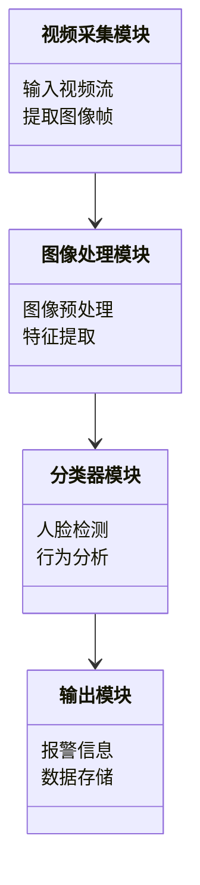
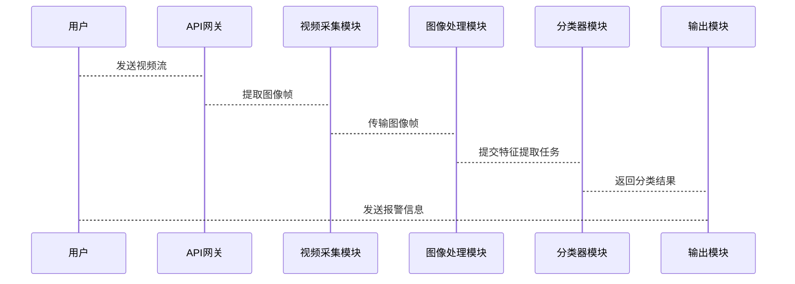

                 


# AI Agent的图像识别与处理技术

---

## 关键词  
AI Agent, 图像识别, 深度学习, 卷积神经网络, 目标检测, 图像处理, 机器学习

---

## 摘要  
本文将深入探讨AI Agent在图像识别与处理技术中的应用。从基础概念到高级算法，从系统设计到实际项目，我们将全面解析AI Agent如何利用图像识别技术实现智能感知与决策。文章内容涵盖AI Agent的核心概念、图像识别的算法原理、基于深度学习的图像处理技术、系统架构设计以及实际项目案例分析。通过本文，读者将能够全面理解AI Agent在图像识别领域的应用及其技术实现的细节。

---

# 第1章 AI Agent与图像识别概述

## 1.1 AI Agent的基本概念

### 1.1.1 AI Agent的定义与特点  
AI Agent（人工智能代理）是指能够感知环境、自主决策并执行任务的智能体。其特点包括自主性、反应性、目标导向和学习能力。  

### 1.1.2 图像识别技术的定义与作用  
图像识别技术是通过计算机算法对图像进行分析和理解，以识别图像中的物体、场景或文字。它是实现AI Agent智能感知的核心技术之一。  

### 1.1.3 AI Agent与图像识别的结合  
AI Agent通过图像识别技术可以实现对周围环境的感知，从而做出更智能的决策和行动。例如，在智能安防系统中，AI Agent通过图像识别技术可以实时监测并识别异常情况。

---

## 1.2 图像识别技术的发展历程

### 1.2.1 图像识别技术的起源  
图像识别技术起源于20世纪60年代，早期主要依赖于模式识别和计算机视觉技术。

### 1.2.2 传统图像识别技术的局限性  
传统图像识别技术依赖于手工特征提取，存在泛化能力差、计算效率低等问题。

### 1.2.3 深度学习对图像识别的推动  
随着深度学习的兴起，图像识别技术取得了突破性进展，尤其是在目标检测、图像分割等领域。

---

## 1.3 AI Agent在图像识别中的应用场景

### 1.3.1 智能安防中的图像识别  
AI Agent可以通过图像识别技术实现人脸识别、行为分析等功能，提升安防系统的智能化水平。

### 1.3.2 医疗影像分析中的应用  
AI Agent可以辅助医生进行疾病诊断，例如通过X光片识别病变区域。

### 1.3.3 智能驾驶中的图像识别  
AI Agent通过图像识别技术实现对道路、车辆、行人的识别与跟踪，从而实现自动驾驶功能。

---

## 1.4 本章小结  
本章介绍了AI Agent的基本概念、图像识别技术的发展历程及其在AI Agent中的应用场景，为后续章节的学习奠定了基础。

---

# 第2章 图像识别的核心概念与原理

## 2.1 图像处理的基本概念

### 2.1.1 图像的表示与特征  
图像通常以像素矩阵的形式表示，每个像素具有颜色和亮度特征。  

### 2.1.2 图像分辨率与颜色空间  
图像分辨率决定了图像的清晰度，颜色空间描述了图像中颜色的表示方式。

### 2.1.3 图像变换与增强  
图像变换（如傅里叶变换）用于分析图像频域特性，图像增强技术用于改善图像质量。

---

## 2.2 图像分类的核心原理

### 2.2.1 什么是图像分类  
图像分类是将图像按照预定义的类别进行划分的过程，是图像识别的重要任务之一。

### 2.2.2 分类器的构建与训练  
分类器是图像分类的核心，常见的分类器包括支持向量机（SVM）和随机森林等。

### 2.2.3 分类算法的评估指标  
评估指标包括准确率、召回率、F1分数等，用于衡量分类器的性能。

---

## 2.3 图像分割与目标检测

### 2.3.1 图像分割的定义与应用  
图像分割是将图像划分为多个区域的过程，常用于医学图像分析和目标识别。

### 2.3.2 目标检测的基本原理  
目标检测不仅需要识别图像中的物体，还需要定位物体的位置。

### 2.3.3 常见的目标检测算法  
包括基于区域的检测方法（如Faster R-CNN）和基于回归的方法（如YOLO）。

---

## 2.4 本章小结  
本章详细介绍了图像处理的基本概念、图像分类的核心原理以及目标检测的基本方法，为后续章节的深入学习提供了理论基础。

---

# 第3章 基于深度学习的图像识别算法

## 3.1 深度学习的基本原理

### 3.1.1 什么是深度学习  
深度学习是一种基于人工神经网络的机器学习方法，通过多层非线性变换提取数据特征。

### 3.1.2 神经网络的基本结构  
神经网络由输入层、隐藏层和输出层组成，各层之间通过权重和激活函数连接。

### 3.1.3 深度学习与传统机器学习的区别  
深度学习能够自动提取特征，而传统机器学习依赖于人工特征提取。

---

## 3.2 卷积神经网络（CNN）原理

### 3.2.1 卷积层的定义与作用  
卷积层通过滑动窗口提取局部特征，常用于图像识别任务。

### 3.2.2 池化层的作用与类型  
池化层用于降低计算复杂度和防止过拟合，常见的池化方式包括最大池化和平均池化。

### 3.2.3 全连接层与输出层的作用  
全连接层用于特征的非线性变换，输出层用于分类或回归任务。

---

## 3.3 常见的图像识别算法及其优缺点

### 3.3.1 AlexNet  
AlexNet是第一个在ImageNet比赛中取得优异成绩的深度学习模型，但其计算复杂度较高。

### 3.3.2 VGGNet  
VGGNet通过使用更深的网络结构提升了模型的性能，但参数量较大。

### 3.3.3 ResNet  
ResNet通过引入跳跃连接解决了深层网络中的梯度消失问题，模型性能显著提升。

### 3.3.4 YOLO系  
YOLO是一种实时目标检测算法，具有速度快、易于部署的特点。

---

## 3.4 本章小结  
本章重点介绍了深度学习的基本原理和卷积神经网络的结构，以及常见图像识别算法的优缺点，为后续章节的算法实现提供了理论基础。

---

# 第4章 图像识别系统的分析与设计

## 4.1 系统功能设计

### 4.1.1 问题场景介绍  
以智能安防监控系统为例，系统需要实现对视频流中的人脸识别和行为分析。

### 4.1.2 领域模型设计  
通过Mermaid类图展示系统的功能模块及其交互关系。



---

## 4.2 系统架构设计

### 4.2.1 系统架构图  
通过Mermaid架构图展示系统的整体架构，包括前端、后端和数据库模块。


---

## 4.3 接口设计与交互流程

### 4.3.1 系统接口设计  
系统需要提供视频流输入接口、图像处理接口和结果输出接口。

### 4.3.2 交互流程  
通过Mermaid序列图展示系统的交互流程。



---

## 4.4 本章小结  
本章从系统设计的角度出发，详细介绍了图像识别系统的功能设计、架构设计和交互流程，为后续章节的项目实现提供了指导。

---

# 第5章 项目实战：基于AI Agent的智能安防监控系统

## 5.1 项目环境安装

### 5.1.1 安装Python与深度学习框架  
安装Python 3.8及以上版本，安装TensorFlow或PyTorch框架。

### 5.1.2 安装图像处理库  
安装OpenCV、 Pillow等图像处理库。

---

## 5.2 核心代码实现

### 5.2.1 视频采集模块  
代码示例：

```python
import cv2

def capture_video():
    cap = cv2.VideoCapture(0)
    while True:
        ret, frame = cap.read()
        if not ret:
            break
        yield frame
    cap.release()
```

### 5.2.2 图像处理模块  
代码示例：

```python
import cv2

def preprocess_image(image):
    gray = cv2.cvtColor(image, cv2.COLOR_BGR2GRAY)
    return gray
```

### 5.2.3 分类器模块  
代码示例：

```python
import tensorflow as tf
from tensorflow.keras import layers

model = tf.keras.Sequential([
    layers.Conv2D(32, (3,3), activation='relu', input_shape=(64, 64, 3)),
    layers.MaxPooling2D((2,2)),
    layers.Conv2D(64, (3,3), activation='relu'),
    layers.MaxPooling2D((2,2)),
    layers.Flatten(),
    layers.Dense(128, activation='relu'),
    layers.Dense(1, activation='sigmoid')
])

model.compile(optimizer='adam', loss='binary_crossentropy', metrics=['accuracy'])
model.fit(X_train, y_train, epochs=10, batch_size=32)
```

---

## 5.3 案例分析与代码解读  
通过实际运行代码，展示系统在智能安防中的应用效果，分析模型的性能优化方法。

---

## 5.4 项目小结  
本章通过实际案例展示了AI Agent在智能安防中的应用，详细讲解了项目的实现过程和代码细节。

---

# 第6章 高级主题与应用扩展

## 6.1 模型优化与部署

### 6.1.1 模型压缩与轻量化  
通过剪枝、知识蒸馏等技术降低模型的计算复杂度。

### 6.1.2 模型部署与实时推理  
将模型部署到边缘计算设备，实现低延迟的实时推理。

---

## 6.2 多模态融合与边缘计算

### 6.2.1 多模态数据的融合方法  
结合图像、文本、语音等多种数据源，提升系统的感知能力。

### 6.2.2 边缘计算的应用场景  
在智能安防、智能制造等领域，边缘计算能够显著提升系统的实时性和响应速度。

---

## 6.3 本章小结  
本章探讨了图像识别技术的高级应用，包括模型优化、多模态融合和边缘计算，展示了技术的前沿发展方向。

---

# 第7章 总结与展望

## 7.1 全书总结  
总结全书内容，回顾AI Agent在图像识别与处理技术中的核心概念、算法原理和实际应用。

## 7.2 未来展望  
探讨图像识别技术的未来发展方向，包括更高效的算法、更强大的模型和更广泛的应用场景。

## 7.3 学习与实践建议  
为读者提供学习和实践的建议，鼓励读者深入研究和动手实践。

---

## 参考文献  
列出本文中引用的文献和参考资料。

---

## 致谢  
感谢在撰写过程中提供帮助和支持的人员和机构。

---

通过以上目录结构，我们可以系统地学习AI Agent的图像识别与处理技术，从基础理论到实际应用，逐步深入，全面掌握这一领域的核心技术与实践方法。

