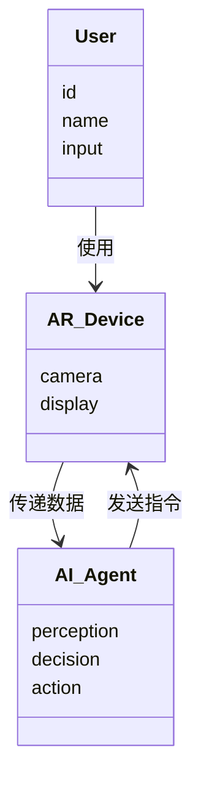
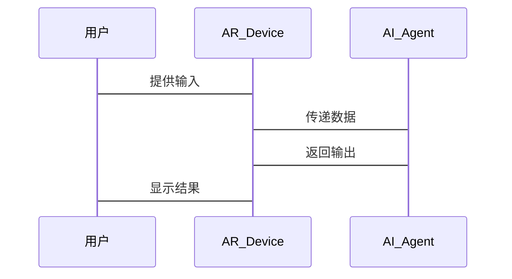

                 


# AI Agent的增强现实交互能力开发

## 关键词
- AI Agent
- 增强现实
- 交互能力
- 虚拟现实
- 人工智能

## 摘要
本文将详细探讨AI Agent在增强现实交互能力开发中的应用，从基础概念到高级算法，再到系统架构设计和实际项目实现，全面解析如何将AI技术与增强现实技术相结合，实现高效的交互体验。

---

## 第1章: 增强现实与AI Agent概述

### 1.1 增强现实的基本概念
#### 1.1.1 增强现实的定义与特点
增强现实（Augmented Reality，AR）是一种将数字信息叠加在真实世界上的技术，其特点包括实时性、交互性、沉浸性和叠加性。通过摄像头、传感器和算法，AR能够在真实环境中叠加虚拟信息，为用户创造丰富的视觉体验。

#### 1.1.2 增强现实的核心技术
AR的核心技术包括：
1. **图像识别与跟踪**：通过摄像头捕捉环境信息，识别并跟踪目标物体。
2. **三维建模与渲染**：将虚拟对象准确叠加到真实环境中。
3. **人机交互**：实现用户与虚拟对象之间的互动。

#### 1.1.3 增强现实的应用领域
AR技术广泛应用于游戏、教育、医疗、军事和商业等领域。例如，Pokémon Go是一款经典的AR游戏，而医疗领域则利用AR进行手术模拟和训练。

### 1.2 AI Agent的基本概念
#### 1.2.1 AI Agent的定义与分类
AI Agent是一种智能体，能够感知环境并采取行动以实现目标。根据智能水平，AI Agent可以分为反应式、基于模型和混合式智能体。

#### 1.2.2 AI Agent的核心能力
AI Agent的核心能力包括感知能力（如视觉、听觉）、推理能力（如逻辑推理、问题解决）和行动能力（如执行动作、与环境互动）。

#### 1.2.3 AI Agent与传统程序的区别
AI Agent能够自主决策和学习，而传统程序则基于预设规则运行。AI Agent具备适应性和灵活性，能够处理复杂和动态的环境。

### 1.3 增强现实与AI Agent的结合
#### 1.3.1 增强现实交互的定义
增强现实交互是指用户通过AR设备与虚拟对象进行互动，AI Agent负责处理用户的输入并生成相应的输出。

#### 1.3.2 AI Agent在增强现实中的作用
AI Agent在增强现实中的作用包括：
1. **用户行为理解**：通过自然语言处理和计算机视觉技术，理解用户的意图。
2. **环境建模**：实时构建和更新虚拟环境模型。
3. **智能交互**：根据用户需求，动态调整交互策略。

#### 1.3.3 增强现实交互能力开发的必要性
随着AR技术的普及，开发具备智能交互能力的AR系统已成为趋势。AI Agent能够显著提升AR系统的用户体验和功能性。

### 1.4 本章小结
本章介绍了增强现实和AI Agent的基本概念，并探讨了它们的结合与应用。增强现实为AI Agent提供了丰富的交互场景，而AI Agent则为增强现实带来了智能化和个性化。

---

## 第2章: AI Agent增强现实交互的核心概念

### 2.1 增强现实交互的核心要素
#### 2.1.1 用户输入与输出
AR交互中的用户输入包括手势、语音和眼动追踪等，输出则通过AR设备呈现虚拟对象。

#### 2.1.2 场景建模与渲染
场景建模是将真实环境数字化，渲染则是将虚拟对象叠加到真实环境中。

#### 2.1.3 实时交互与反馈
实时交互要求系统能够快速响应用户输入，并提供即时反馈。

### 2.2 AI Agent的感知与理解能力
#### 2.2.1 视觉感知与目标识别
AI Agent通过摄像头捕捉图像，利用深度学习模型进行目标识别和场景分割。

#### 2.2.2 语音识别与自然语言处理
语音识别技术将用户语音转化为文本，自然语言处理则理解用户意图并生成回复。

#### 2.2.3 环境建模与空间理解
AI Agent利用SLAM算法构建环境的三维模型，并理解空间关系。

### 2.3 增强现实交互中的AI Agent行为模型
#### 2.3.1 行为决策的基本原理
基于用户输入和环境信息，AI Agent通过决策算法选择最优动作。

#### 2.3.2 基于上下文的交互策略
根据上下文信息（如用户历史行为、环境状态）动态调整交互策略。

#### 2.3.3 行为模型的优化与改进
通过强化学习和反馈机制，不断优化AI Agent的行为模型。

### 2.4 核心概念对比分析
#### 2.4.1 增强现实与虚拟现实的对比
增强现实叠加在真实环境中，而虚拟现实则是完全虚拟的世界。

#### 2.4.2 AI Agent与传统交互系统的对比
AI Agent具备自主决策能力，而传统系统依赖预设规则。

#### 2.4.3 增强现实交互中的技术挑战
包括实时性、准确性和稳定性问题，需要在硬件和算法上进行优化。

### 2.5 本章小结
本章深入探讨了增强现实交互的核心要素和AI Agent的行为模型，分析了相关技术的优缺点和挑战。

---

## 第3章: 增强现实交互中的关键算法原理

### 3.1 增强现实中的SLAM算法
#### 3.1.1 SLAM算法的基本原理
SLAM（Simultaneous Localization and Mapping）通过传感器数据实时构建环境地图，并确定自身位置。

#### 3.1.2 基于视觉的SLAM实现
使用ORB-SLAM算法，通过特征点匹配实现视觉SLAM。

#### 3.1.3 SLAM算法的优缺点分析
优点包括实时性和鲁棒性，缺点是计算资源消耗大。

### 3.2 目标识别与跟踪算法
#### 3.2.1 基于深度学习的目标识别
使用YOLO或Faster R-CNN等模型进行目标检测。

#### 3.2.2 增强现实中的目标跟踪技术
采用卡尔曼滤波或深度学习模型进行目标跟踪。

#### 3.2.3 算法实现的数学模型
目标检测损失函数：
$$ \mathcal{L} = \alpha \mathcal{L}_{cls} + \beta \mathcal{L}_{loc} $$

### 3.3 语音交互与自然语言处理
#### 3.3.1 语音识别算法原理
基于CTC的语音识别模型，将语音信号转化为文本。

#### 3.3.2 基于Transformer的自然语言处理
使用BERT模型进行意图理解和文本生成。

#### 3.3.3 语音交互中的上下文理解
通过注意力机制捕捉上下文信息，提升交互准确性。

### 3.4 算法实现的数学模型
#### 3.4.1 基于点云的三维变换公式
$$ \mathbf{R} \cdot \mathbf{p} + \mathbf{t} $$

#### 3.4.2 基于深度学习的目标检测损失函数
$$ \mathcal{L} = \alpha \mathcal{L}_{cls} + \beta \mathcal{L}_{loc} $$

#### 3.4.3 语音识别的CTC损失函数
$$ \mathcal{L}_{CTC} = -\sum_{t=1}^{T} \log P(y_t) $$

---

## 第4章: 系统架构设计与实现

### 4.1 系统功能设计
#### 4.1.1 领域模型
使用Mermaid类图展示系统中的实体和关系：


#### 4.1.2 系统架构
使用Mermaid架构图展示系统结构：
```mermaid
archiecture
    组件1 --> 组件2
    组件2 --> 组件3
    组件3 --> 组件4
```

### 4.2 系统接口设计
定义系统接口，如：
- `AR_Device.request(input)`
- `AI_Agent.process(data)`
- `AR_Device.render(output)`

### 4.3 系统交互设计
使用Mermaid序列图展示用户与系统交互过程：


---

## 第5章: 项目实战

### 5.1 项目背景
开发一个简单的增强现实应用，实现用户与虚拟助手的交互。

### 5.2 核心代码实现
#### 5.2.1 环境搭建
安装必要的库，如OpenCV、TensorFlow和PyTorch。

#### 5.2.2 核心代码
```python
import cv2
import numpy as np

def detect_objects(image):
    # 目标识别代码
    return boxes

def track_objects(previous_boxes, current_image):
    # 目标跟踪代码
    return tracked_boxes

def main():
    cap = cv2.VideoCapture(0)
    while cap.isOpened():
        ret, frame = cap.read()
        boxes = detect_objects(frame)
        tracked_boxes = track_objects(previous_boxes, frame)
        # 渲染结果
        cv2.imshow('AR Interface', frame)
        if cv2.waitKey(1) & 0xFF == ord('q'):
            break
    cap.release()
    cv2.destroyAllWindows()

if __name__ == '__main__':
    main()
```

#### 5.2.3 代码解读
- `detect_objects`函数使用深度学习模型进行目标检测。
- `track_objects`函数跟踪目标的位置和状态。
- 主函数读取摄像头数据，处理并渲染结果。

### 5.3 案例分析
分析项目中的关键问题，如实时性优化和错误处理。

### 5.4 项目小结
总结项目实现过程中的经验和教训，提出改进建议。

---

## 第6章: 高级应用与未来展望

### 6.1 增强现实交互的高级应用
探讨AI Agent在教育、医疗和工业等领域的高级应用。

### 6.2 未来趋势
分析增强现实和AI技术的结合趋势，如元宇宙和脑机接口。

### 6.3 注意事项与最佳实践
提供开发中的注意事项和最佳实践建议。

### 6.4 本章小结
总结全文，展望未来发展方向。

---

## 第7章: 结语

### 7.1 再次强调核心内容
回顾本文的核心内容，强调AI Agent在增强现实交互中的重要性。

### 7.2 感谢读者
感谢读者的耐心阅读，并鼓励读者积极参与技术研究和实践。

### 7.3 联系方式
提供作者联系方式，便于读者进一步交流。

---

通过以上结构，您可以逐步展开每一章的内容，结合详细的代码示例和图表，深入讲解AI Agent的增强现实交互能力开发。希望这份大纲对您有所帮助！

