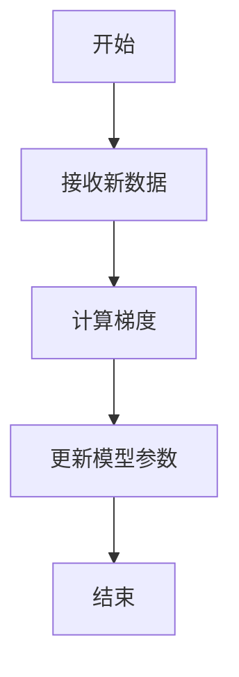
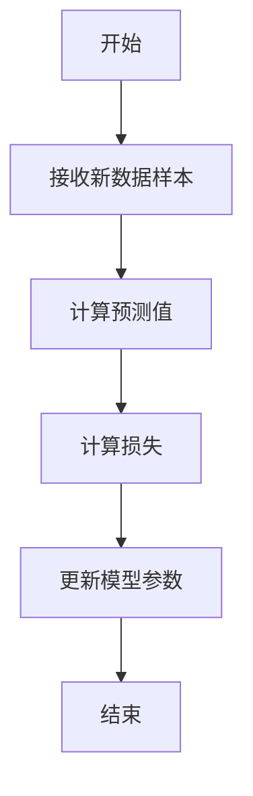
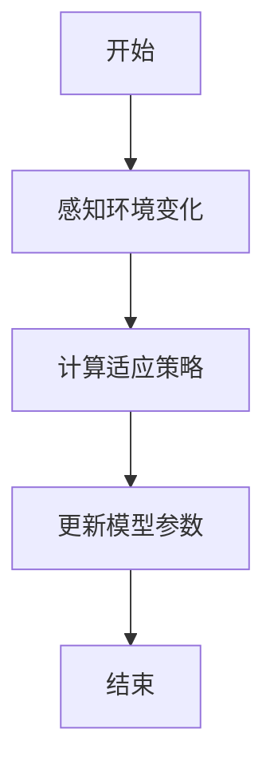
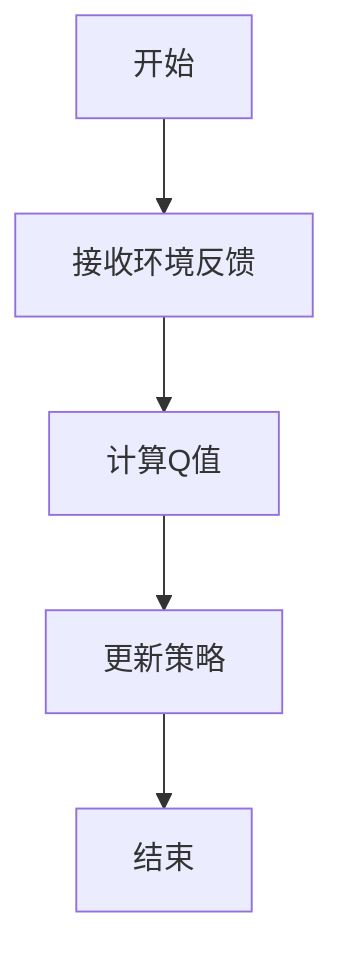
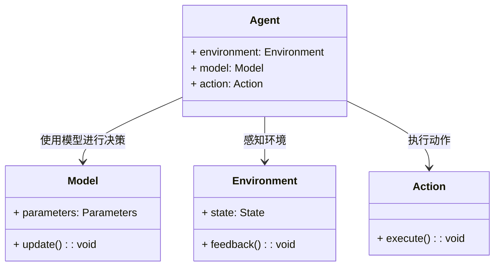
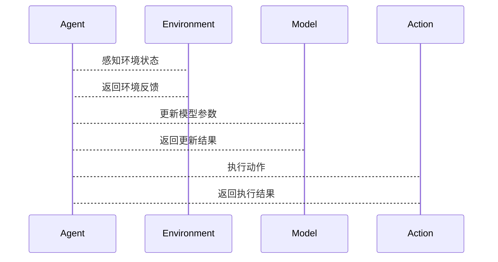

                 


# AI Agent的增量学习与持续适应

## 关键词：AI Agent, 增量学习, 持续适应, 机器学习, 算法优化, 系统架构

## 摘要：  
在人工智能快速发展的今天，AI Agent（智能体）作为实现智能化系统的核心技术，其增量学习和持续适应能力是决定其性能和应用范围的关键因素。本文将从AI Agent的基本概念出发，深入探讨增量学习与持续适应的核心原理、算法实现、系统架构设计以及实际应用中的挑战与解决方案。通过系统化的分析与实践，本文旨在为读者提供一个全面理解AI Agent增量学习与持续适应的框架，帮助他们在实际项目中更好地设计和优化AI Agent系统。

---

## 第1章: AI Agent的基本概念与背景

### 1.1 AI Agent的定义与核心概念  
#### 1.1.1 AI Agent的基本定义  
AI Agent（人工智能代理）是指能够感知环境、自主决策并执行任务的智能系统。它具备目标导向性、自主性和社会性等核心特征，广泛应用于自动驾驶、智能助手、机器人控制等领域。  

#### 1.1.2 增量学习的核心概念  
增量学习（Incremental Learning）是一种机器学习方法，允许模型在新数据流不断输入的情况下逐步学习和更新模型。其核心在于处理动态变化的数据和任务，避免重新训练整个模型的高昂成本。  

#### 1.1.3 持续适应的机制与特点  
持续适应（Continuous Adaptation）是指AI Agent在动态环境中能够实时调整自身行为和模型，以应对环境变化和新任务的要求。其特点是实时性、在线性和高效性。  

---

### 1.2 AI Agent的应用场景与挑战  
#### 1.2.1 AI Agent在实际应用中的场景  
AI Agent广泛应用于自动驾驶、智能客服、智能家居、机器人控制等领域。例如，在自动驾驶中，AI Agent需要实时感知环境并做出决策。  

#### 1.2.2 增量学习面临的挑战  
增量学习面临数据稀疏性、概念漂移、计算资源限制等挑战。特别是在动态环境中，模型需要快速适应新数据的变化。  

#### 1.2.3 持续适应的重要性与意义  
持续适应是AI Agent在复杂环境中生存和发展的关键能力。它能够使AI Agent在任务变化时快速调整策略，保持高性能。  

---

## 第2章: 增量学习与持续适应的背景  

### 2.1 增量学习的背景与问题背景  
#### 2.1.1 增量学习的定义与问题背景  
增量学习是一种在线学习方法，允许模型在新数据流中逐步更新。其核心问题在于如何高效地更新模型以适应新数据。  

#### 2.1.2 增量学习的核心问题与边界  
增量学习的核心问题包括：如何处理概念漂移、如何高效更新模型、如何平衡在线学习的计算成本。  

#### 2.1.3 增量学习的外延与应用范围  
增量学习的外延包括在线学习、流学习、增量分类等。其应用范围涵盖金融、医疗、自动驾驶等领域。  

---

### 2.2 持续适应的背景与问题描述  
#### 2.2.1 持续适应的定义与问题背景  
持续适应是指AI Agent在动态环境中实时调整自身行为和模型的能力。其核心问题在于如何快速响应环境变化。  

#### 2.2.2 持续适应的核心问题与边界  
持续适应的核心问题包括：如何实时感知环境变化、如何快速更新模型、如何保持系统稳定性。  

#### 2.2.3 持续适应的外延与应用范围  
持续适应的外延包括实时反馈、在线优化、自适应控制等。其应用范围涵盖智能机器人、智能家居、智能助手等领域。  

---

## 第3章: 增量学习与持续适应的核心概念  

### 3.1 增量学习的核心概念与原理  
#### 3.1.1 增量学习的基本原理  
增量学习通过逐个样本或小批量数据更新模型，避免了重新训练整个模型的高昂成本。其核心是在线更新模型参数。  

#### 3.1.2 增量学习的核心要素  
- 数据流：增量学习的核心输入是动态数据流。  
- 更新策略：包括参数更新、模型重训练等方法。  
- 适应机制：模型更新的触发条件和策略。  

#### 3.1.3 增量学习的数学模型与公式  
增量学习的数学模型可以表示为：  
$$ \theta_{t+1} = \theta_t + \eta_t (y_t - f(x_t; \theta_t)) $$  
其中，$\theta_t$ 是模型参数，$\eta_t$ 是学习率，$y_t$ 是目标值，$f(x_t; \theta_t)$ 是模型预测值。  

---

### 3.2 持续适应的核心概念与原理  
#### 3.2.1 持续适应的基本原理  
持续适应通过实时感知环境变化，动态调整模型和行为策略。其核心是在线自适应机制。  

#### 3.2.2 持续适应的核心要素  
- 环境感知：实时感知环境变化。  
- 自适应机制：动态调整模型和策略。  
- 反馈机制：根据环境反馈优化行为。  

#### 3.2.3 持续适应的数学模型与公式  
持续适应的数学模型可以表示为：  
$$ \theta_{t+1} = \theta_t + \alpha (r_t - Q(\theta_t, a_t)) $$  
其中，$\alpha$ 是自适应率，$r_t$ 是奖励值，$Q(\theta_t, a_t)$ 是Q值函数。  

---

## 第4章: 增量学习与持续适应的核心概念联系  

### 4.1 核心概念原理对比  
#### 4.1.1 增量学习与持续适应的原理对比  
- 增量学习关注数据流的逐步更新，持续适应关注环境变化的实时调整。  

#### 4.1.2 增量学习与持续适应的优缺点对比  
| 特性       | 增量学习                     | 持续适应                     |
|------------|------------------------------|------------------------------|
| 优缺点     | 优点：高效更新；缺点：可能忽略全局优化 | 优点：实时适应；缺点：计算成本高 |

#### 4.1.3 增量学习与持续适应的适用场景对比  
- 增量学习适用于数据流场景，如实时数据处理。  
- 持续适应适用于动态环境，如自动驾驶中的实时决策。  

---

### 4.2 核心概念属性特征对比表格  
| 属性       | 增量学习                     | 持续适应                     |
|------------|------------------------------|------------------------------|
| 输入形式   | 数据流                      | 环境变化和反馈              |
| 更新频率   | 周期性更新                  | 实时更新                    |
| 计算成本   | 较低                       | 较高                        |
| 应用场景   | 数据流处理、在线分类        | 自动驾驶、智能助手          |

---

### 4.3 ER实体关系图架构  
```mermaid
erd
    title 增量学习与持续适应的实体关系
    Agent: AI Agent
    DataStream: 数据流
    Environment: 环境
    ModelUpdate: 模型更新
    Adaptation: 自适应
    Agent --> DataStream: 接收数据
    Agent --> Environment: 感知环境
    DataStream --> ModelUpdate: 更新模型
    Adaptation --> Agent: 调整行为
```

---

## 第5章: 增量学习与持续适应的算法原理  

### 5.1 增量学习算法原理  
#### 5.1.1 增量学习的基本算法原理  
增量学习算法的核心是逐步更新模型参数。以下是增量学习的算法流程：  


#### 5.1.2 增量学习的数学模型与公式  
增量学习的更新公式为：  
$$ \theta_{t+1} = \theta_t + \eta (y_t - f(x_t; \theta_t)) $$  
其中，$\eta$ 是学习率，$f(x_t; \theta_t)$ 是模型预测值。  

#### 5.1.3 增量学习的算法流程图  


---

### 5.2 持续适应算法原理  
#### 5.2.1 持续适应的基本算法原理  
持续适应算法的核心是实时感知环境变化并动态调整模型。以下是持续适应的算法流程：  


#### 5.2.2 持续适应的数学模型与公式  
持续适应的更新公式为：  
$$ \theta_{t+1} = \theta_t + \alpha (r_t - Q(\theta_t, a_t)) $$  
其中，$\alpha$ 是自适应率，$r_t$ 是奖励值，$Q(\theta_t, a_t)$ 是Q值函数。  

#### 5.2.3 持续适应的算法流程图  


---

## 第6章: 系统架构设计与实现  

### 6.1 问题场景介绍  
在动态环境中，AI Agent需要实时感知环境变化并调整自身行为。例如，在自动驾驶中，道路状况和交通规则可能会实时变化。  

### 6.2 系统功能设计  
AI Agent的系统功能包括：  
- 数据采集与处理  
- 模型更新与优化  
- 行为决策与执行  

### 6.3 系统架构设计  
以下是AI Agent的系统架构图：  


---

### 6.4 系统接口设计  
AI Agent的系统接口包括：  
- 数据接口：接收新数据流。  
- 环境接口：感知环境变化。  
- 模型接口：更新模型参数。  

---

### 6.5 系统交互设计  
以下是AI Agent的系统交互图：  


---

## 第7章: 项目实战与案例分析  

### 7.1 环境安装与配置  
以下是项目所需的环境配置：  
- Python 3.8+  
- TensorFlow 2.0+  
- NumPy 1.20+  

### 7.2 系统核心实现源代码  
以下是AI Agent的增量学习与持续适应的核心代码示例：  

#### 7.2.1 增量学习实现  
```python
class IncrementalLearner:
    def __init__(self, model, learning_rate=0.01):
        self.model = model
        self.learning_rate = learning_rate

    def update_model(self, x, y):
        # 计算预测值
        y_pred = self.model.predict(x)
        # 计算损失
        loss = (y - y_pred).sum()
        # 更新模型参数
        self.model.theta += self.learning_rate * (y - y_pred)
```

#### 7.2.2 持续适应实现  
```python
class ContinuousAdapter:
    def __init__(self, agent, adaptation_rate=0.1):
        self.agent = agent
        self.adaptation_rate = adaptation_rate

    def adapt(self, feedback):
        # 根据反馈调整模型参数
        self.agent.model.theta += self.adaptation_rate * (feedback - self.agent.model.predict(feedback))
```

---

### 7.3 代码应用解读与分析  
上述代码展示了增量学习和持续适应的核心实现。增量学习通过逐步更新模型参数，适应新数据的变化。持续适应则通过实时反馈调整模型参数，保持系统的适应性。  

---

### 7.4 案例分析与详细讲解  
以自动驾驶中的路径规划为例，AI Agent需要实时感知环境变化（如障碍物、交通信号灯）并调整路径规划策略。通过增量学习和持续适应，AI Agent能够快速适应新的环境条件，确保行驶安全。  

---

## 第8章: 总结与展望  

### 8.1 核心内容总结  
本文详细探讨了AI Agent的增量学习与持续适应的核心概念、算法原理和系统架构设计。通过理论分析和实际案例，展示了如何实现高效的AI Agent系统。  

### 8.2 未来展望  
未来，随着AI技术的不断发展，增量学习和持续适应将在更多领域得到应用。特别是结合大模型和边缘计算，AI Agent的性能和适应能力将得到进一步提升。  

### 8.3 最佳实践与注意事项  
- 在增量学习中，注意平衡模型的更新频率和计算成本。  
- 在持续适应中，确保系统的实时性和稳定性。  
- 在实际应用中，结合具体场景优化算法和系统架构。  

---

通过本文的系统分析与实践，读者可以全面理解AI Agent的增量学习与持续适应的实现原理，并在实际项目中加以应用。

