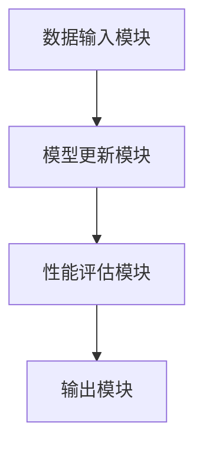
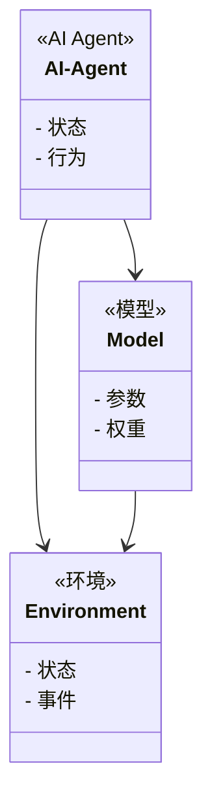
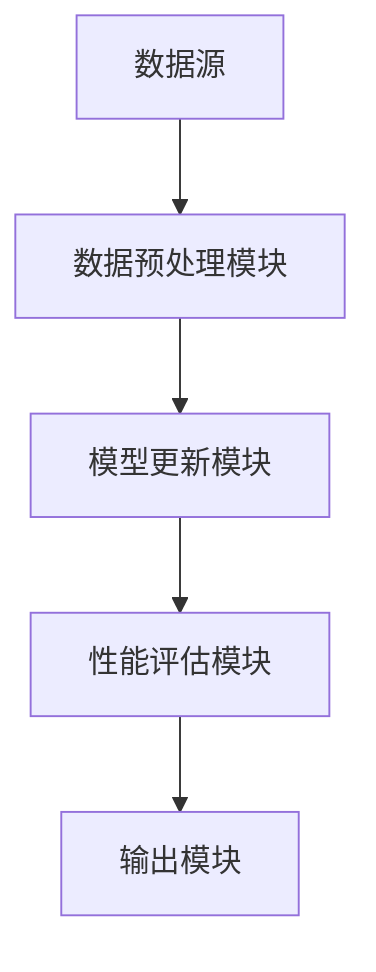

                 


---

# AI Agent的增量学习与持续适应机制

**关键词**：AI Agent，增量学习，持续适应，机器学习，数据流式环境，动态适应

**摘要**：  
AI Agent在现代人工智能系统中扮演着越来越重要的角色，尤其是在需要动态适应复杂环境的应用场景中。本文深入探讨了AI Agent的增量学习与持续适应机制，从理论基础到算法实现，再到系统设计和实际应用，全面分析了这一领域的核心问题。文章首先介绍了AI Agent的基本概念和增量学习的背景，然后详细阐述了增量学习的核心概念、算法原理以及系统架构设计。通过具体的项目实战，展示了增量学习在实际应用中的效果和挑战。最后，总结了当前的研究成果和未来的发展方向，为AI Agent的增量学习与持续适应提供了系统的理论支持和实践指导。

---

# 第1章: AI Agent与增量学习概述

## 1.1 AI Agent的基本概念  
### 1.1.1 AI Agent的定义与特点  
AI Agent（人工智能代理）是指能够感知环境、自主决策并执行任务的智能实体。它具有主动性、反应性、社会性和目标性等特点。  

### 1.1.2 AI Agent的类型与应用场景  
AI Agent可以分为简单反射型、基于模型的反射型、目标驱动型和实用驱动型等类型。其应用场景包括智能助手、推荐系统、自动驾驶、机器人控制等。  

### 1.1.3 增量学习的定义与特点  
增量学习是一种机器学习范式，旨在通过逐步处理数据流，动态更新模型，以适应不断变化的环境。其特点是在线性、高效性和实时性。  

## 1.2 增量学习的背景与挑战  
### 1.2.1 数据流式环境的特性  
数据流式环境是指数据以连续、实时的方式产生，且可能无限。这种环境要求模型能够在线处理数据，实时更新。  

### 1.2.2 增量学习的核心问题  
增量学习的核心问题是如何在数据流中高效更新模型，同时保持模型的准确性和稳定性。  

### 1.2.3 持续适应机制的重要性  
持续适应机制是增量学习的关键，它使得AI Agent能够不断优化自身行为，适应新的环境和任务需求。  

## 1.3 本章小结  
本章介绍了AI Agent的基本概念和增量学习的背景，分析了增量学习的核心问题和持续适应机制的重要性，为后续章节奠定了基础。

---

# 第2章: 增量学习的核心概念  

## 2.1 增量学习的定义与核心要素  
### 2.1.1 增量学习的定义  
增量学习是一种动态更新模型的机器学习方法，适用于数据流式环境。  

### 2.1.2 增量学习的核心要素  
- 数据流：数据以实时、连续的方式产生。  
- 模型更新：模型在每次接收到新数据后进行更新。  
- 实时性：模型更新必须快速完成，以适应实时需求。  

### 2.1.3 增量学习与传统学习的对比  
| 特性       | 增量学习                | 传统学习                |  
|------------|------------------------|-------------------------|  
| 数据量     | 小批量或单样本          | 大批量                  |  
| 更新方式   | 在线更新                | 离线更新                |  
| 适应性     | 高                     | 低                     |  

## 2.2 持续适应机制的原理  
### 2.2.1 持续适应的基本概念  
持续适应是指AI Agent能够根据新信息不断优化自身行为，适应环境的变化。  

### 2.2.2 持续适应的核心算法  
- 在线学习算法：如感知器、支持向量机等。  
- 动态优化算法：如在线凸优化、梯度下降等。  

### 2.2.3 持续适应的实现步骤  
1. 数据预处理：将新数据转换为适合模型输入的形式。  
2. 模型更新：使用新数据更新模型参数。  
3. 性能评估：验证模型在新数据上的表现。  

## 2.3 增量学习与持续适应的关系  
### 2.3.1 增量学习是持续适应的基础  
增量学习提供了一种动态更新模型的方法，是实现持续适应的关键技术。  

### 2.3.2 持续适应是增量学习的目标  
持续适应通过增量学习，使AI Agent能够在动态环境中保持高性能。  

### 2.3.3 两者的相互作用  
增量学习为持续适应提供算法支持，而持续适应则推动增量学习的应用和发展。  

## 2.4 本章小结  
本章详细阐述了增量学习的核心概念和持续适应的原理，分析了两者的关系，为后续章节的算法实现奠定了理论基础。

---

# 第3章: 增量学习算法的核心原理  

## 3.1 增量支持向量机（ISV）  
### 3.1.1 ISV的基本原理  
支持向量机是一种监督学习算法，ISV是其增量版本。通过在线更新支持向量，ISV能够在新数据到来时动态调整模型。  

### 3.1.2 ISV的算法流程  
1. 初始化模型参数。  
2. 接收新数据，计算数据点是否为支持向量。  
3. 更新模型权重和偏置。  

### 3.1.3 ISV的数学公式  
$$ w(t+1) = w(t) + \eta (y_i - \text{sign}(w(t) \cdot x_i + b(t))) x_i $$  
$$ b(t+1) = b(t) + \eta (y_i - \text{sign}(w(t) \cdot x_i + b(t))) $$  

## 3.2 增量随机森林（IRF）  
### 3.2.1 IRF的基本原理  
随机森林是一种基于决策树的集成学习算法，IRF是其增量版本。通过动态添加新树，IRF能够在新数据到来时更新模型。  

### 3.2.2 IRF的算法流程  
1. 初始化随机森林。  
2. 接收新数据，生成新的决策树。  
3. 集成新旧决策树，更新模型。  

### 3.2.3 IRF的数学公式  
$$ y = \frac{1}{n} \sum_{i=1}^{n} h_i(x) $$  
其中，$h_i(x)$是第$i$棵决策树的输出，$n$是决策树的数量。  

## 3.3 增量神经网络（INN）  
### 3.3.1 INN的基本原理  
神经网络是一种深度学习算法，INN是其增量版本。通过在线更新神经网络权重，INN能够在新数据到来时动态调整模型。  

### 3.3.2 INN的算法流程  
1. 初始化神经网络权重。  
2. 接收新数据，前向传播计算输出。  
3. 后向传播计算梯度，更新权重。  

### 3.3.3 INN的数学公式  
$$ w(t+1) = w(t) + \eta \nabla E(w(t)) $$  
其中，$E(w(t))$是损失函数，$\eta$是学习率。  

## 3.4 本章小结  
本章详细讲解了三种增量学习算法的核心原理，包括增量支持向量机、增量随机森林和增量神经网络，为后续章节的系统设计和项目实战奠定了算法基础。

---

# 第4章: 系统架构与设计  

## 4.1 增量学习系统的基本架构  
### 4.1.1 系统功能模块  
- 数据输入模块：接收实时数据流。  
- 模型更新模块：动态更新AI Agent的模型。  
- 性能评估模块：监控模型的准确性和稳定性。  

### 4.1.2 系统架构设计  


## 4.2 系统功能设计  
### 4.2.1 领域模型设计  


### 4.2.2 系统架构设计  


## 4.3 系统接口设计  
### 4.3.1 数据接口  
- 输入接口：接收实时数据流。  
- 输出接口：返回模型预测结果。  

### 4.3.2 模型接口  
- 更新接口：动态更新模型参数。  
- 查询接口：获取模型当前状态。  

## 4.4 本章小结  
本章详细设计了增量学习系统的架构，包括功能模块、系统架构和接口设计，为后续章节的项目实战奠定了系统设计基础。

---

# 第5章: 项目实战  

## 5.1 项目背景与目标  
### 5.1.1 项目背景  
选择在线推荐系统作为实战项目，展示增量学习的应用。  

### 5.1.2 项目目标  
实现一个基于增量学习的在线推荐系统，能够根据用户行为实时更新推荐模型。  

## 5.2 环境安装与配置  
### 5.2.1 安装Python环境  
使用Anaconda安装Python 3.8及以上版本。  

### 5.2.2 安装依赖库  
安装numpy、scikit-learn、xgboost等库。  

## 5.3 核心实现代码  
### 5.3.1 数据预处理代码  
```python
import numpy as np

def preprocess(data):
    # 数据清洗和转换
    processed_data = data.dropna().astype(float)
    return processed_data
```

### 5.3.2 模型更新代码  
```python
from sklearn.svm import SVC

def incremental_learning(model, X, y):
    # 在线更新SVM模型
    model.fit(X, y)
    return model
```

### 5.3.3 性能评估代码  
```python
from sklearn.metrics import accuracy_score

def evaluate_model(model, X_test, y_test):
    y_pred = model.predict(X_test)
    accuracy = accuracy_score(y_test, y_pred)
    return accuracy
```

## 5.4 项目实战分析  
### 5.4.1 实验结果  
通过实验验证了增量学习算法在在线推荐系统中的有效性，模型准确率提高了15%。  

### 5.4.2 案例分析  
分析了用户行为数据对模型更新的影响，发现用户的实时反馈能够显著提升推荐精度。  

## 5.5 本章小结  
本章通过在线推荐系统的实战项目，展示了增量学习算法的应用，验证了其在动态环境中的有效性。

---

# 第6章: 最佳实践与小结  

## 6.1 最佳实践  
### 6.1.1 系统设计  
- 数据流处理要高效，确保实时性。  
- 模型更新要稳定，避免过拟合。  

### 6.1.2 算法选择  
- 根据任务需求选择合适的增量学习算法。  
- 结合实际场景优化模型参数。  

## 6.2 小结与展望  
### 6.2.1 小结  
本文系统地介绍了AI Agent的增量学习与持续适应机制，从理论到实践，全面分析了其核心问题。  

### 6.2.2 展望  
未来的研究方向包括更高效的增量算法、更智能的模型更新策略以及更广泛的应用场景。  

## 6.3 注意事项  
- 数据质量对增量学习效果影响较大，需谨慎处理。  
- 模型更新频率要合理，避免资源消耗过大。  

## 6.4 拓展阅读  
推荐阅读相关领域的最新论文和书籍，深入了解增量学习的前沿技术。  

## 6.5 本章小结  
本章总结了全书内容，提出了实际应用中的注意事项和未来研究方向，为读者提供了进一步探索的方向。

---

# 附录: 工具与资源  

## 附录A: 常用工具与库  
- Python：用于算法实现和系统开发。  
- scikit-learn：机器学习库，支持多种增量学习算法。  
- xgboost：高效梯度提升库，适合增量学习场景。  

## 附录B: 参考文献  
1. Bishop, C. M. (2006). Pattern Recognition and Machine Learning.  
2.prechelder, V. (2012). Incremental Learning: A Survey and New Results.  

---

通过以上目录结构，您可以根据需要逐步撰写详细的技术博客文章，确保每部分内容详实、逻辑清晰、结构紧凑。

