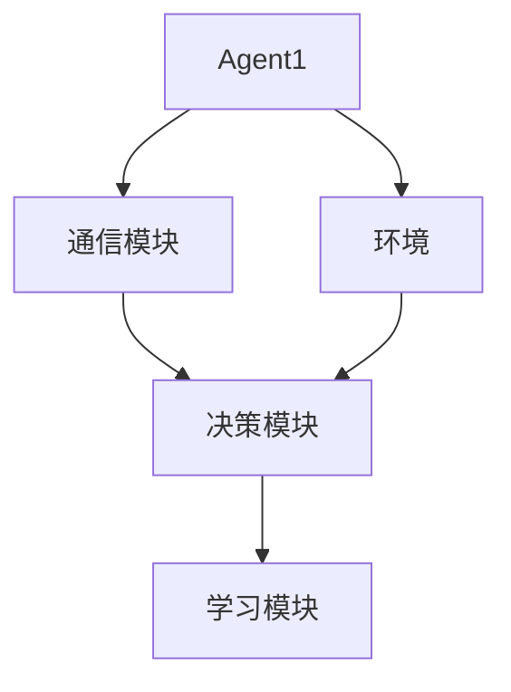
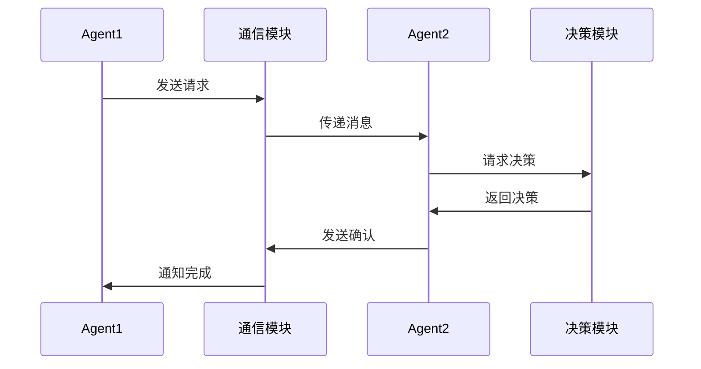

                 


# AI Agent的多Agent协作与竞争框架

> 关键词：AI Agent, 多Agent系统, 协作与竞争, 分布式计算, 博弈论, 系统架构设计

> 摘要：本文系统地探讨了AI Agent在多Agent协作与竞争框架中的核心概念、算法原理、数学模型和系统设计。通过理论分析和实际案例，详细阐述了多Agent系统中的协作与竞争机制，并提供了丰富的代码示例和系统架构图，帮助读者深入理解这一领域的关键技术。

---

## 第1章: AI Agent的基本概念与背景

### 1.1 AI Agent的定义与特点

#### 1.1.1 AI Agent的定义
AI Agent（人工智能代理）是指能够感知环境、自主决策并采取行动以实现特定目标的智能实体。Agent可以是软件程序、机器人或其他智能系统。

#### 1.1.2 AI Agent的核心特点
- **自主性**：能够在没有外部干预的情况下自主运作。
- **反应性**：能够根据环境变化实时调整行为。
- **社会性**：能够与其他Agent或人类进行交互和协作。
- **学习性**：通过经验或数据不断优化自身的决策能力。

#### 1.1.3 AI Agent与传统AI的区别
AI Agent不仅仅是静态的知识库或规则集，而是具备动态适应性和主动性，能够在复杂的环境中解决问题。

### 1.2 多Agent系统的发展历程

#### 1.2.1 多Agent系统的起源
多Agent系统起源于分布式人工智能（DAI）领域，20世纪80年代开始出现。

#### 1.2.2 多Agent系统的发展阶段
1. **早期阶段**：基于规则的简单协作。
2. **发展阶段**：引入分布式计算和通信技术。
3. **当前阶段**：结合机器学习和博弈论的复杂系统。

#### 1.2.3 当前多Agent系统的应用现状
- **分布式计算**：如云服务中的资源分配。
- **智能交通**：如自动驾驶汽车的协同决策。
- **游戏开发**：如多人在线游戏中的AI对手。

### 1.3 多Agent协作与竞争的背景与意义

#### 1.3.1 协作与竞争的基本概念
- **协作**：多个Agent共同完成任务，追求整体目标的实现。
- **竞争**：多个Agent争夺有限资源，追求个体目标的最大化。

#### 1.3.2 多Agent协作与竞争的背景
随着AI技术的进步，多Agent系统在复杂环境中的应用越来越广泛，协作与竞争成为其核心机制。

#### 1.3.3 多Agent协作与竞争的意义
- **提高效率**：通过协作实现更高效的资源利用。
- **增强适应性**：通过竞争机制提高系统的鲁棒性和适应性。

---

## 第2章: 多Agent系统的模型与框架

### 2.1 多Agent系统的模型

#### 2.1.1 个体模型
- **理性模型**：基于理性决策的Agent。
- **基于效用的模型**：通过效用函数来评估行动的收益。

#### 2.1.2 环境模型
- **静态环境**：环境不变，Agent只需适应一次。
- **动态环境**：环境不断变化，Agent需持续调整策略。

#### 2.1.3 交互模型
- **直接交互**：Agent之间直接通信。
- **间接交互**：通过中间媒介进行通信。

### 2.2 多Agent协作与竞争的框架

#### 2.2.1 协作框架
- **分布式协作**：Agent在不同节点上协作完成任务。
- **集中式协作**：由中央控制节点协调各Agent的行动。

#### 2.2.2 竞争框架
- **零和博弈**：Agent之间的竞争总和为零。
- **非零和博弈**：竞争结果不一定总和为零。

#### 2.2.3 协作与竞争的混合框架
- **动态切换**：根据环境变化在协作与竞争之间切换。
- **混合机制**：结合协作和竞争的优势。

### 2.3 多Agent系统的关键技术

#### 2.3.1 通信与协调
- **通信协议**：定义Agent之间的信息交换规则。
- **协调机制**：确保各Agent行动一致。

#### 2.3.2 任务分配与调度
- **任务分配算法**：如遗传算法、粒子群优化。
- **调度策略**：确保任务按时完成。

#### 2.3.3 决策与规划
- **决策树**：用于选择最优行动路径。
- **规划算法**：如A*算法用于路径规划。

---

## 第3章: 多Agent协作与竞争的核心算法

### 3.1 协作算法

#### 3.1.1 分布式协调算法
- **分布式一致性算法**：如Raft协议用于保证系统一致性。
- **分布式任务分配**：通过协商机制分配任务。

#### 3.1.2 基于博弈论的协作算法
- **纳什均衡**：确保协作策略的稳定性。
- **合作博弈**：通过收益共享实现协作。

#### 3.1.3 基于规则的协作算法
- **简单规则**：如“优先帮助最近的Agent”。

### 3.2 竞争算法

#### 3.2.1 基于博弈论的竞争算法
- **纳什均衡**：确保竞争策略的稳定性。
- **非合作博弈**：通过竞争实现个体目标。

#### 3.2.2 基于学习的竞争算法
- **强化学习**：通过试错优化竞争策略。
- **深度学习**：通过神经网络模拟竞争行为。

#### 3.2.3 基于规则的竞争算法
- **优先级规则**：根据优先级分配资源。

### 3.3 协作与竞争的混合算法

#### 3.3.1 协作与竞争的动态平衡
- **动态调整机制**：根据环境变化实时调整协作与竞争比例。

#### 3.3.2 基于情境的协作与竞争切换
- **情境感知**：根据当前情境选择协作或竞争策略。

#### 3.3.3 基于反馈的协作与竞争优化
- **反馈机制**：通过反馈优化协作与竞争策略。

---

## 第4章: 多Agent协作与竞争的数学模型

### 4.1 协作模型的数学表示

#### 4.1.1 协作收益函数
$$ R_{collaboration} = \sum_{i=1}^{n} r_i $$
其中，$r_i$ 表示第i个Agent的协作收益。

#### 4.1.2 协作成本函数
$$ C_{collaboration} = \sum_{i=1}^{n} c_i $$
其中，$c_i$ 表示第i个Agent的协作成本。

#### 4.1.3 协作效果的评估指标
- **总收益**：协作收益总和。
- **效率比**：协作效率与单个效率的比值。

### 4.2 竞争模型的数学表示

#### 4.2.1 竞争收益函数
$$ R_{competition} = \sum_{i=1}^{n} r_i $$
其中，$r_i$ 表示第i个Agent的竞争收益。

#### 4.2.2 竞争成本函数
$$ C_{competition} = \sum_{i=1}^{n} c_i $$
其中，$c_i$ 表示第i个Agent的竞争成本。

#### 4.2.3 竞争效果的评估指标
- **总收益**：竞争收益总和。
- **公平性指标**：衡量竞争结果的公平程度。

### 4.3 协作与竞争的综合模型

#### 4.3.1 综合收益函数
$$ R_{total} = \alpha R_{collaboration} + (1-\alpha) R_{competition} $$
其中，$\alpha$ 表示协作权重，$1-\alpha$ 表示竞争权重。

#### 4.3.2 综合成本函数
$$ C_{total} = \alpha C_{collaboration} + (1-\alpha) C_{competition} $$

#### 4.3.3 综合效果的评估指标
- **综合收益比**：综合收益与单个收益的比值。
- **综合效率比**：综合效率与单个效率的比值。

---

## 第5章: 多Agent协作与竞争的系统设计

### 5.1 系统架构设计

#### 5.1.1 分层架构
- **感知层**：负责环境感知。
- **决策层**：负责策略制定。
- **执行层**：负责具体行动。

#### 5.1.2 分布式架构
- **对等网络**：各节点地位平等。
- **中心服务器**：协调各Agent的行动。

### 5.2 系统功能设计

#### 5.2.1 通信模块
- **信息传递**：通过消息队列实现通信。
- **协议处理**：解析和处理通信协议。

#### 5.2.2 决策模块
- **决策算法**：如强化学习算法。
- **策略选择**：根据环境选择最优策略。

#### 5.2.3 学习模块
- **在线学习**：实时更新策略。
- **离线学习**：定期优化模型。

### 5.3 系统架构图



### 5.4 系统交互图



---

## 第6章: 项目实战

### 6.1 环境安装

#### 6.1.1 安装Python
```bash
python --version
pip install --upgrade pip
```

#### 6.1.2 安装依赖库
```bash
pip install numpy matplotlib
```

### 6.2 核心代码实现

#### 6.2.1 协作算法实现

```python
import numpy as np

def collaboration_algorithm(agents):
    total = sum(agent.value for agent in agents)
    return total / len(agents)

# 示例用法
agents = [Agent(value=10), Agent(value=20), Agent(value=30)]
result = collaboration_algorithm(agents)
print(result)  # 输出：20.0
```

#### 6.2.2 竞争算法实现

```python
import numpy as np

def competition_algorithm(agents):
    return max(agent.value for agent in agents)

# 示例用法
agents = [Agent(value=10), Agent(value=20), Agent(value=30)]
result = competition_algorithm(agents)
print(result)  # 输出：30
```

### 6.3 实际案例分析

#### 6.3.1 案例背景
在一个智能交通系统中，多个自动驾驶汽车需要协作与竞争来优化交通流量。

#### 6.3.2 系统设计
- **通信模块**：处理车辆之间的信息传递。
- **决策模块**：根据实时数据调整行驶策略。
- **学习模块**：通过强化学习优化决策模型。

#### 6.3.3 实施效果
- **效率提升**：减少了交通拥堵。
- **安全性提高**：降低了交通事故的发生率。

---

## 第7章: 总结与展望

### 7.1 总结
本文详细探讨了AI Agent在多Agent协作与竞争框架中的核心概念、算法原理、数学模型和系统设计。通过理论分析和实际案例，深入阐述了多Agent系统中的协作与竞争机制。

### 7.2 展望
未来，随着AI技术的不断发展，多Agent系统将在更多领域得到应用，协作与竞争框架也将更加复杂和智能。建议读者持续关注相关领域的最新进展，积极参与到多Agent系统的开发和研究中。

### 7.3 最佳实践Tips
- **合理选择架构**：根据实际需求选择合适的系统架构。
- **持续优化算法**：定期更新和优化协作与竞争算法。
- **注重安全性**：确保系统在协作与竞争中的安全性。

---

通过以上内容，读者可以系统地理解AI Agent的多Agent协作与竞争框架，并将其应用于实际项目中。希望本文能为相关领域的研究和实践提供有价值的参考。

