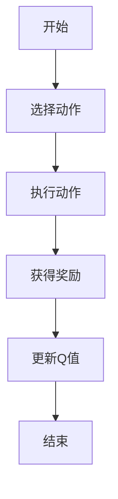
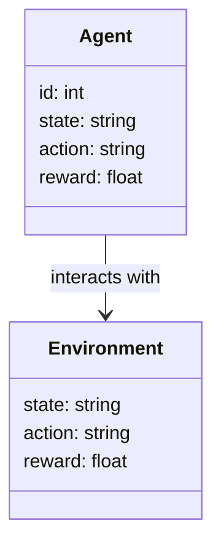
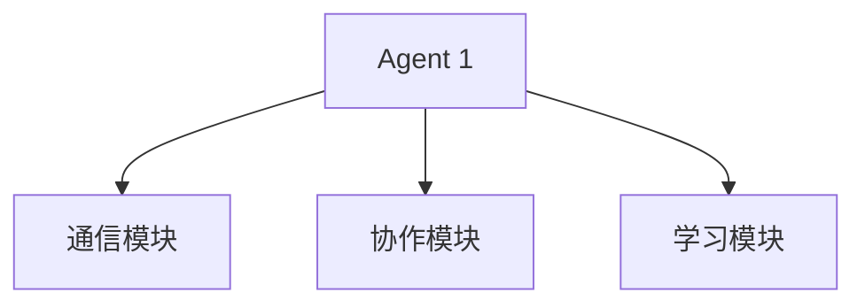
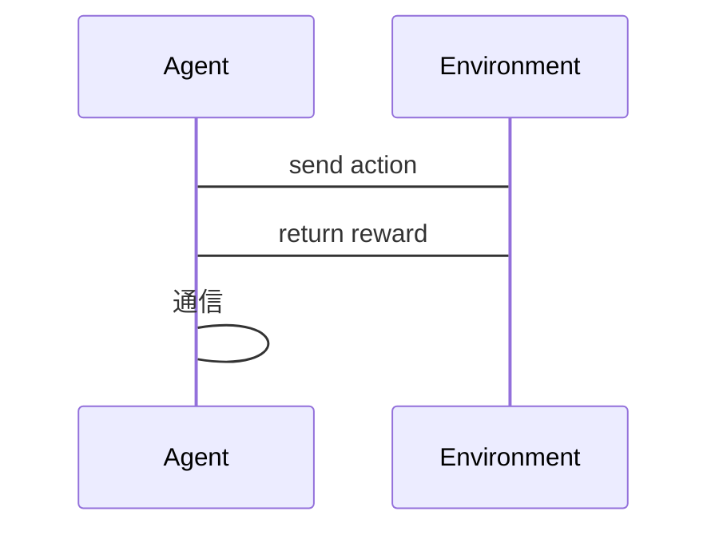

                 


# AI Agent的多Agent协作学习系统

## 关键词：AI Agent, 多Agent系统, 协作学习, 分布式人工智能, 强化学习

## 摘要：本文系统地介绍了AI Agent的多Agent协作学习系统的背景、核心概念、算法原理、系统架构设计以及实际应用案例。文章从基本概念出发，逐步深入分析多Agent协作学习的理论基础、算法实现、系统架构，并通过实际案例展示其在分布式人工智能中的应用。文章旨在帮助读者全面理解AI Agent的多Agent协作学习系统，为实际应用提供参考。

---

# 第一部分: AI Agent的多Agent协作学习系统概述

## 第1章: AI Agent的基本概念与背景

### 1.1 AI Agent的定义与特点

#### 1.1.1 AI Agent的定义
AI Agent（人工智能代理）是指在计算机系统中，能够感知环境、自主决策并采取行动以实现特定目标的实体。AI Agent可以是软件程序、机器人或其他智能系统。

#### 1.1.2 AI Agent的核心特点
- **自主性**：AI Agent能够自主决策，无需外部干预。
- **反应性**：能够实时感知环境并做出反应。
- **目标导向性**：所有行为都以实现目标为导向。
- **社会性**：能够与其他Agent或人类进行交互和协作。

#### 1.1.3 AI Agent与传统AI的区别
| 属性 | 传统AI | AI Agent |
|------|--------|----------|
| 行为方式 | 静态计算，依赖外部指令 | 自主决策，主动采取行动 |
| 应用场景 | 数据分析、模式识别 | 自动化控制、智能交互 |
| 复杂性 | 单任务为主 | 多任务、多环境 |

### 1.2 多Agent协作学习系统的背景

#### 1.2.1 分布式人工智能的发展背景
随着AI技术的发展，单点AI逐渐向分布式AI转型，多个AI Agent协同工作成为趋势。

#### 1.2.2 多Agent协作学习的必要性
- **任务复杂性**：单个Agent难以完成复杂任务，需要协作。
- **资源分配**：通过协作优化资源使用。
- **动态环境**：多个Agent协作能够更好地应对动态变化的环境。

#### 1.2.3 当前AI Agent协作学习的研究现状
- **强化学习**：基于Q-learning的多Agent协作学习。
- **分布式计算**：基于分布式计算的多Agent协作。
- **博弈论**：基于博弈论的多Agent协作。

---

## 第2章: 多Agent协作学习系统的背景

### 2.1 多Agent协作学习的核心概念

#### 2.1.1 多Agent系统的基本构成
多Agent系统由多个AI Agent组成，通过协作完成任务。

#### 2.1.2 协作学习的基本原理
协作学习是多个Agent通过共享信息、分工合作来共同完成任务。

#### 2.1.3 多Agent协作学习的理论基础
- **分布式计算**：任务分解到多个Agent。
- **协作机制**：通过通信和协作完成任务。
- **学习机制**：通过强化学习不断优化协作策略。

---

## 第3章: 多Agent协作学习系统的算法原理

### 3.1 基础算法原理

#### 3.1.1 分布式问题求解的算法框架
分布式计算框架，如MapReduce。

#### 3.1.2 协作学习的基本算法
基于Q-learning的协作学习。

#### 3.1.3 多Agent协作学习的数学模型
数学模型：$$ Q(s,a) = r + \gamma \max Q(s',a') $$

### 3.2 基于强化学习的协作算法

#### 3.2.1 强化学习的基本原理
通过奖励机制优化策略。

#### 3.2.2 多Agent强化学习的挑战
- **策略同步**：多个Agent的策略协调。
- **通信机制**：如何高效通信。

#### 3.2.3 基于Q-learning的多Agent协作学习算法
流程图：


### 3.3 分布式协作学习的实现方法

#### 3.3.1 分布式计算的基本原理
分布式计算将任务分解到多个节点。

#### 3.3.2 多Agent协作学习的通信机制
通信机制：通过消息传递协议进行通信。

#### 3.3.3 分布式协作学习的同步与异步策略
同步策略：所有Agent同时更新。
异步策略：Agent轮流更新。

---

## 第4章: 多Agent协作学习系统的系统架构设计

### 4.1 系统功能需求分析

#### 4.1.1 系统目标与功能模块划分
- **目标**：实现多Agent协作学习。
- **模块**：通信模块、协作模块、学习模块。

#### 4.1.2 系统输入输出的定义
- **输入**：任务目标、环境信息。
- **输出**：协作结果。

#### 4.1.3 系统性能指标
- **响应时间**：系统处理任务的时间。
- **正确性**：任务完成的正确率。

### 4.2 系统架构设计

#### 4.2.1 系统功能设计
领域模型图：


#### 4.2.2 系统架构设计
系统架构图：


### 4.3 系统接口设计

#### 4.3.1 系统接口设计
- **输入接口**：接收任务目标。
- **输出接口**：输出协作结果。

#### 4.3.2 系统交互序列图
系统交互序列图：


---

## 第5章: 多Agent协作学习系统的项目实战

### 5.1 环境安装

#### 5.1.1 环境要求
- Python 3.8+
- 安装库：numpy, gym, matplotlib。

### 5.2 系统核心实现源代码

#### 5.2.1 代码实现
```python
import numpy as np

class Agent:
    def __init__(self, state_space, action_space, gamma=0.99):
        self.state_space = state_space
        self.action_space = action_space
        self.gamma = gamma
        self.q_table = np.zeros((state_space, action_space))

    def choose_action(self, state, epsilon=0.1):
        if np.random.random() < epsilon:
            return np.random.randint(self.action_space)
        return np.argmax(self.q_table[state])

    def update_q_table(self, state, action, reward, next_state):
        self.q_table[state, action] = reward + self.gamma * np.max(self.q_table[next_state])

def main():
    import gym
    env = gym.make('CartPole-v1')
    state_space = env.observation_space.shape[0]
    action_space = env.action_space.n
    agent = Agent(state_space, action_space)
    
    episodes = 1000
    for episode in range(episodes):
        state = env.reset()
        for _ in range(1000):
            action = agent.choose_action(state)
            next_state, reward, done, _ = env.step(action)
            agent.update_q_table(state, action, reward, next_state)
            if done:
                break
            state = next_state
        env.close()

if __name__ == "__main__":
    main()
```

### 5.3 案例分析与详细讲解

#### 5.3.1 案例分析
通过实现多Agent协作学习，优化任务完成效率。

#### 5.3.2 代码解读
- `Agent`类：实现Q-learning算法。
- `main`函数：初始化环境并训练。

---

## 第6章: 总结与展望

### 6.1 总结
本文系统地介绍了AI Agent的多Agent协作学习系统的背景、核心概念、算法原理、系统架构设计以及实际应用案例。通过详细讲解，帮助读者全面理解该系统的实现与应用。

### 6.2 展望
未来，多Agent协作学习系统将在分布式人工智能、机器人协作等领域发挥重要作用。

### 6.3 注意事项
- **通信效率**：优化Agent之间的通信。
- **任务分配**：合理分配任务以提高效率。

### 6.4 拓展阅读
推荐阅读相关论文和书籍，深入理解多Agent协作学习的理论与实践。

---

通过以上步骤，您可以系统地理解和实现AI Agent的多Agent协作学习系统。

