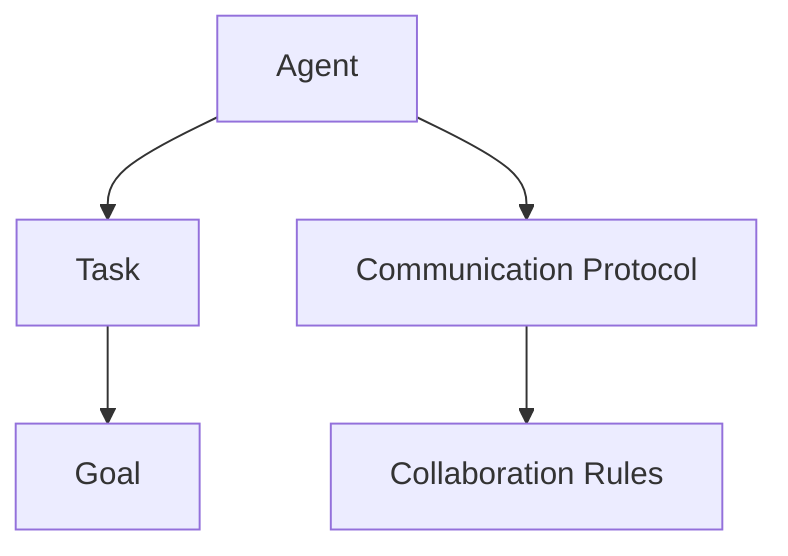
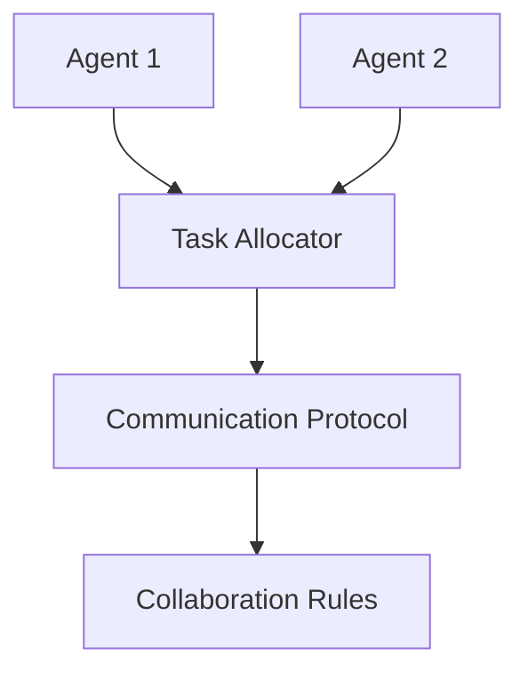
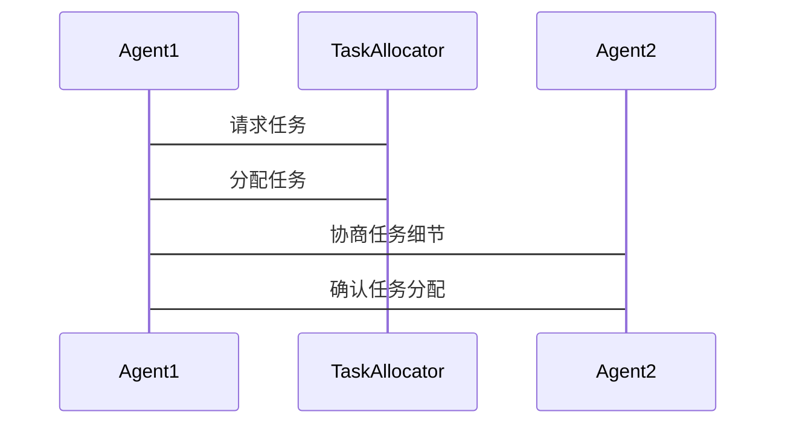

                 


# AI Agent的多Agent协作系统设计

> 关键词：AI Agent、多Agent协作系统、协作机制、系统架构、算法原理、通信协议

> 摘要：多Agent协作系统是人工智能领域的重要研究方向，旨在通过多个智能体的协作完成复杂任务。本文将详细介绍多Agent协作系统的设计，包括其核心概念、算法原理、系统架构、项目实战以及最佳实践。通过本篇文章，读者将能够深入了解多Agent协作系统的原理和实现方法。

---

# 第一章：多Agent协作系统概述

## 1.1 多Agent协作系统的背景与问题背景

### 1.1.1 多Agent协作系统的定义与概念
多Agent协作系统（Multi-Agent Collaboration System）是由多个智能体（Agent）组成的系统，这些智能体能够通过协作完成复杂的任务。每个智能体都有自己的目标和行为，能够在动态环境中自主决策并与其他智能体进行通信和协调。

### 1.1.2 多Agent协作系统的核心问题与挑战
- **任务分配**：如何将任务分配给合适的智能体。
- **通信与协调**：智能体之间的通信机制和协调策略。
- **冲突解决**：智能体之间的目标冲突和资源分配问题。
- **动态环境适应**：系统在动态环境中的自适应能力。

### 1.1.3 多Agent协作系统的边界与外延
多Agent协作系统的边界包括智能体的通信机制、任务分配算法以及协作规则。其外延涉及分布式计算、群体智能和分布式人工智能等领域。

## 1.2 多Agent协作系统的概念结构与核心要素

### 1.2.1 多Agent协作系统的组成要素
- **智能体**：具有感知和决策能力的个体。
- **任务**：需要通过协作完成的目标。
- **通信协议**：智能体之间的通信规则。
- **协作规则**：智能体协作的约束条件。

### 1.2.2 多Agent协作系统的属性特征
- **自主性**：智能体能够自主决策。
- **反应性**：能够根据环境变化调整行为。
- **协作性**：通过协作完成任务。
- **动态性**：环境和任务可能动态变化。

### 1.2.3 多Agent协作系统的功能模块与交互关系
- **任务分配模块**：将任务分配给合适的智能体。
- **通信模块**：实现智能体之间的信息交换。
- **协作控制模块**：协调智能体的行为。

## 1.3 本章小结
本章介绍了多Agent协作系统的背景、核心问题以及概念结构，为后续章节的深入分析奠定了基础。

---

# 第二章：多Agent协作系统的核心概念与联系

## 2.1 多Agent协作系统的核心概念

### 2.1.1 单个Agent的结构与功能
- **感知**：通过传感器获取环境信息。
- **决策**：基于感知信息做出决策。
- **执行**：通过执行机构完成动作。

### 2.1.2 多Agent协作的基本原理
多Agent协作系统通过智能体之间的通信和协调，实现任务的分解和执行。

### 2.1.3 多Agent协作系统的层次结构
- **物理层**：智能体的硬件和执行机构。
- **通信层**：智能体之间的通信协议。
- **协作层**：任务分配和协作规则。

## 2.2 多Agent协作系统的概念属性对比

### 2.2.1 Agent的属性对比表格
| 属性       | 单个Agent       | 多个Agent       |
|------------|-----------------|-----------------|
| 自主性      | 高              | 中              |
| 反应性      | 高              | 高              |
| 协作性      | 无              | 有              |
| 通信需求    | 无              | 有              |

### 2.2.2 多Agent协作系统的属性对比
- **自主性**：多Agent系统中，智能体的自主性较高，但需要通过协作完成任务。
- **反应性**：系统整体的反应性较高，能够适应环境变化。
- **协作性**：协作性是多Agent系统的核心特征。

## 2.3 多Agent协作系统的ER实体关系图

### 2.3.1 实体关系图的Mermaid流程图


## 2.4 本章小结
本章通过对比和图形化的方式，详细阐述了多Agent协作系统的核心概念及其相互关系。

---

# 第三章：多Agent协作系统的算法原理

## 3.1 多Agent协作系统的算法概述

### 3.1.1 分布式协调算法
分布式协调算法用于在多Agent系统中实现任务分配和资源管理。

### 3.1.2 多Agent协商机制
协商机制用于解决智能体之间的目标冲突和资源分配问题。

### 3.1.3 多Agent路径规划算法
路径规划算法用于智能体在协作过程中寻找最优路径。

## 3.2 多Agent协作算法的数学模型

### 3.2.1 分布式协调算法的数学模型
$$f(x) = \sum_{i=1}^{n} x_i$$

### 3.2.2 多Agent协商机制的数学模型
$$g(x) = \max_{i} x_i$$

## 3.3 多Agent协作算法的实现

### 3.3.1 分布式协调算法的实现
通过数学公式展示算法实现步骤。

### 3.3.2 多Agent协商机制的实现
通过协商规则和数学模型展示协作过程。

### 3.3.3 多Agent路径规划算法的实现
通过路径规划算法实现智能体的最优路径选择。

## 3.4 本章小结
本章详细讲解了多Agent协作系统的算法原理及其数学模型，为后续的系统设计奠定了基础。

---

# 第四章：多Agent协作系统的系统分析与架构设计

## 4.1 多Agent协作系统的功能设计

### 4.1.1 问题场景介绍
介绍一个多Agent协作系统的应用场景，例如智能交通系统。

### 4.1.2 系统功能需求
- **任务分配**：将任务分配给合适的智能体。
- **通信与协调**：智能体之间的通信和协调。
- **协作控制**：实现智能体行为的协调控制。

### 4.1.3 系统功能模块设计
- **任务分配模块**：实现任务的分解和分配。
- **通信模块**：实现智能体之间的信息交换。
- **协作控制模块**：协调智能体的行为。

## 4.2 多Agent协作系统的架构设计

### 4.2.1 系统架构设计
- **通信层**：智能体之间的通信协议。
- **协作层**：任务分配和协作规则。
- **执行层**：智能体的执行机构。

### 4.2.2 系统架构的Mermaid架构图


## 4.3 多Agent协作系统的接口设计

### 4.3.1 系统接口设计
- **任务分配接口**：实现任务的分解和分配。
- **通信接口**：实现智能体之间的信息交换。

### 4.3.2 系统交互的Mermaid序列图


## 4.4 本章小结
本章通过系统分析和架构设计，详细阐述了多Agent协作系统的实现过程。

---

# 第五章：多Agent协作系统的项目实战

## 5.1 项目实战环境安装

### 5.1.1 环境安装说明
介绍如何安装多Agent协作系统的开发环境。

### 5.1.2 工具链配置
配置开发工具和依赖库。

## 5.2 系统核心实现源代码

### 5.2.1 多Agent协作系统的任务分配代码
```python
def task_allocator(agents, tasks):
    # 简单的任务分配算法
    return {agent: tasks[i] for i, agent in enumerate(agents)}
```

### 5.2.2 多Agent协作系统的通信协议代码
```python
def communication_protocol(sender, receiver, message):
    # 简单的通信协议实现
    pass
```

## 5.3 实际案例分析

### 5.3.1 案例分析
通过具体案例分析多Agent协作系统的实现过程。

### 5.3.2 案例实现代码解读
解读实现代码，分析其工作原理。

## 5.4 本章小结
本章通过实际项目案例，展示了多Agent协作系统的实现过程。

---

# 第六章：多Agent协作系统的最佳实践与小结

## 6.1 多Agent协作系统的最佳实践

### 6.1.1 开发注意事项
- **任务分配**：确保任务分配合理，避免资源浪费。
- **通信机制**：选择合适的通信协议，确保信息传递的高效性。

### 6.1.2 系统优化建议
- **算法优化**：优化协作算法，提高系统效率。
- **系统扩展性**：设计可扩展的系统架构。

## 6.2 小结

## 6.3 注意事项

## 6.4 拓展阅读
建议读者阅读相关领域的书籍和论文，深入学习多Agent协作系统的知识。

---

# 附录：工具与API使用说明

## 附录A：多Agent协作系统开发工具

## 附录B：相关API接口说明

---

通过以上目录结构，读者可以系统地学习和理解多Agent协作系统的设计与实现。

