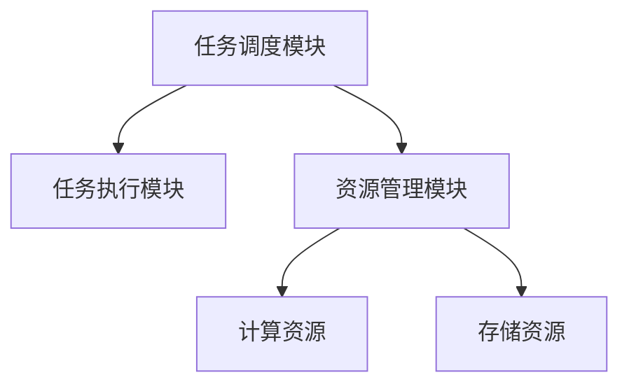

                 


# AI Agent的多任务并行处理能力

> 关键词：AI Agent，多任务处理，并行计算，任务调度，资源分配，算法设计

> 摘要：AI Agent的多任务并行处理能力是其核心能力之一，能够同时执行多个任务并高效利用资源。本文将从AI Agent的基本概念出发，深入探讨多任务并行处理的核心概念、算法原理、系统架构设计以及实际项目实现，帮助读者全面理解AI Agent的多任务并行处理能力。

---

# 第1章: AI Agent与多任务并行处理概述

## 1.1 AI Agent的基本概念
### 1.1.1 AI Agent的定义与特点
AI Agent（人工智能代理）是指能够感知环境、自主决策并执行任务的智能实体。AI Agent的核心特点包括：
- **自主性**：能够自主决策，无需外部干预。
- **反应性**：能够实时感知环境并做出响应。
- **目标导向性**：以实现特定目标为导向执行任务。

### 1.1.2 多任务并行处理的定义
多任务并行处理是指AI Agent在同一时间或同一周期内执行多个任务的能力。这些任务可以是相互独立的，也可以是相互依赖的。

### 1.1.3 多任务并行处理的意义与价值
多任务并行处理能够提高AI Agent的效率和响应速度，使其能够更好地适应复杂的现实环境。例如，在自动驾驶系统中，AI Agent需要同时处理路径规划、障碍物检测、速度控制等多个任务。

---

## 1.2 AI Agent的多任务处理场景
### 1.2.1 多任务处理的典型场景
- **自动驾驶**：同时处理环境感知、路径规划、决策控制等多个任务。
- **智能助手**：同时处理用户请求、信息检索、结果反馈等任务。
- **机器人控制**：同时处理运动控制、物体识别、任务执行等任务。

### 1.2.2 多任务处理的挑战与难点
- **任务优先级管理**：如何确定任务的执行顺序和优先级。
- **资源分配问题**：如何高效分配计算资源以支持多个任务。
- **任务之间的依赖关系**：如何处理任务之间的依赖关系以确保任务的正确执行。

### 1.2.3 多任务处理的未来发展趋势
随着AI技术的不断进步，多任务并行处理将更加智能化和高效化。未来的AI Agent将能够更好地理解和处理复杂的任务组合，实现更高效的资源利用。

---

## 1.3 本章小结
本章介绍了AI Agent的基本概念及其多任务并行处理的重要性和应用场景。通过理解这些内容，读者可以为后续章节的学习打下坚实的基础。

---

# 第2章: AI Agent的多任务并行处理核心概念

## 2.1 多任务并行处理的背景与问题背景
### 2.1.1 多任务并行处理的背景介绍
在现代计算环境中，单任务处理已经无法满足复杂应用的需求。多任务并行处理能够提高系统的效率和性能，因此在AI Agent中得到了广泛应用。

### 2.1.2 问题背景分析
多任务并行处理的核心问题包括：
- 如何高效调度任务。
- 如何优化资源分配。
- 如何处理任务之间的冲突和依赖关系。

### 2.1.3 问题解决的必要性
解决多任务并行处理的问题能够显著提升AI Agent的性能，使其能够更好地服务于复杂的现实场景。

---

## 2.2 多任务并行处理的核心概念
### 2.2.1 多任务处理的定义与特点
多任务处理是指在同一时间或同一周期内执行多个任务的能力。其特点包括：
- **并发性**：任务可以同时执行。
- **独立性**：任务之间可以相互独立。
- **资源共享**：任务可以共享计算资源。

### 2.2.2 多任务处理的边界与外延
- **边界**：多任务处理的边界在于任务之间的独立性和资源分配的限制。
- **外延**：多任务处理的外延包括任务调度算法、资源分配策略等。

### 2.2.3 多任务处理的核心要素组成
- **任务调度算法**：用于确定任务的执行顺序。
- **资源分配策略**：用于优化资源的使用。
- **任务队列管理**：用于管理待执行的任务。

---

## 2.3 多任务并行处理的系统架构
### 2.3.1 系统架构的定义
系统架构是指AI Agent的多任务并行处理系统的整体结构和组成部分。

### 2.3.2 系统架构的组成部分
- **任务调度模块**：负责任务的调度和分配。
- **资源管理模块**：负责资源的分配和监控。
- **任务执行模块**：负责具体任务的执行。

### 2.3.3 系统架构的优缺点对比
- **优点**：提高了系统的效率和响应速度。
- **缺点**：增加了系统的复杂性和资源消耗。

---

## 2.4 本章小结
本章详细讲解了多任务并行处理的核心概念和系统架构，为后续章节的学习奠定了理论基础。

---

# 第3章: 多任务并行处理的核心概念与联系

## 3.1 多任务并行处理的核心概念原理
### 3.1.1 多任务处理的基本原理
多任务处理的基本原理是通过任务调度和资源分配来实现多个任务的并行执行。

### 3.1.2 并行处理的数学模型
并行处理的数学模型可以用以下公式表示：
$$
T_{\text{total}} = \frac{T_1 + T_2 + \cdots + T_n}{P}
$$
其中，$T_{\text{total}}$ 是总处理时间，$T_i$ 是各个任务的处理时间，$P$ 是并行处理的进程数。

### 3.1.3 多任务处理的算法原理
多任务处理的算法原理包括任务调度和资源分配两个主要部分。

---

## 3.2 多任务并行处理的概念属性特征对比
### 3.2.1 任务独立性对比
任务独立性是指任务之间是否相互依赖。独立的任务可以并行处理，而相互依赖的任务需要顺序处理。

### 3.2.2 任务依赖性对比
任务依赖性是指任务之间是否存在依赖关系。例如，任务A必须在任务B完成后才能执行。

### 3.2.3 任务优先级对比
任务优先级是指任务的重要性，优先级高的任务应优先执行。

---

## 3.3 多任务并行处理的ER实体关系图
以下是多任务并行处理的ER实体关系图：

```mermaid
erDiagram
    actor TaskScheduler : 任务调度器
    actor ResourceManager : 资源管理器
    actor TaskExecutor : 任务执行器
    TaskScheduler -> ResourceManager : 调度资源
    TaskScheduler -> TaskExecutor : 分配任务
    TaskExecutor -> ResourceManager : 使用资源
```

---

## 3.4 本章小结
本章通过对比和分析多任务并行处理的核心概念和系统架构，帮助读者更好地理解其内在联系和实现原理。

---

# 第4章: 多任务并行处理的算法原理

## 4.1 多任务并行处理的算法概述
### 4.1.1 多任务处理算法的基本类型
多任务处理算法的基本类型包括：
- **轮转调度算法**：按顺序轮流分配任务。
- **优先级调度算法**：根据任务优先级进行调度。
- **负载平衡调度算法**：根据系统负载进行调度。

### 4.1.2 并行处理算法的基本类型
并行处理算法的基本类型包括：
- **静态并行算法**：任务固定分配给特定的处理单元。
- **动态并行算法**：任务可以根据系统负载动态分配。

### 4.1.3 多任务并行处理算法的特点
多任务并行处理算法的特点包括：
- **高效性**：能够快速调度任务。
- **灵活性**：能够根据系统负载动态调整任务分配。

---

## 4.2 多任务并行处理的调度算法
### 4.2.1 调度算法的定义
调度算法是指用于确定任务执行顺序的算法。

### 4.2.2 调度算法的分类
调度算法的分类包括：
- **公平调度算法**：保证每个任务都能获得公平的资源。
- **优先级调度算法**：根据任务优先级进行调度。
- **负载平衡调度算法**：根据系统负载进行调度。

### 4.2.3 调度算法的优缺点对比
以下是几种常见调度算法的优缺点对比：

| 算法类型       | 优点                         | 缺点                           |
|----------------|------------------------------|--------------------------------|
| 公平调度        | 确保每个任务都能获得资源      | 可能会导致高优先级任务等待     |
| 优先级调度      | 高优先级任务优先执行          | 低优先级任务可能被延迟处理     |
| 负载平衡调度    | 资源利用均衡                  | 调度逻辑复杂，实现难度较高     |

---

## 4.3 多任务并行处理的资源分配算法
### 4.3.1 资源分配算法的定义
资源分配算法是指用于分配计算资源的算法。

### 4.3.2 资源分配算法的分类
资源分配算法的分类包括：
- **静态资源分配算法**：资源固定分配给特定的任务。
- **动态资源分配算法**：资源可以根据任务需求动态分配。

### 4.3.3 资源分配算法的优缺点对比
以下是几种常见资源分配算法的优缺点对比：

| 算法类型       | 优点                         | 缺点                           |
|----------------|------------------------------|--------------------------------|
| 静态分配        | 实现简单，资源分配稳定        | 无法适应任务负载的变化         |
| 动态分配        | 资源利用灵活，适应性强        | 实现复杂，需要实时监控资源状态 |

---

## 4.4 本章小结
本章详细分析了多任务并行处理的调度算法和资源分配算法，帮助读者理解其工作原理和实现方法。

---

# 第5章: 多任务并行处理的数学模型与公式

## 5.1 多任务并行处理的数学模型
多任务并行处理的数学模型可以用以下公式表示：

$$
\text{总处理时间} = \frac{\text{总任务数}}{\text{并行处理数}}
$$

---

## 5.2 多任务并行处理的公式推导
### 5.2.1 任务调度算法的公式推导
任务调度算法的公式推导如下：

$$
\text{任务优先级} = \frac{\text{任务权重}}{\text{任务执行时间}}
$$

### 5.2.2 资源分配算法的公式推导
资源分配算法的公式推导如下：

$$
\text{资源分配比例} = \frac{\text{任务负载}}{\text{总负载}}
$$

---

## 5.3 本章小结
本章通过数学模型和公式推导，深入分析了多任务并行处理的实现原理。

---

# 第6章: 系统分析与架构设计

## 6.1 系统分析
### 6.1.1 问题场景介绍
在多任务并行处理中，常见的问题包括任务调度冲突、资源分配不均等。

### 6.1.2 系统需求分析
系统需求包括：
- 高效的任务调度能力。
- 灵活的资源分配策略。
- 实时的任务状态监控。

---

## 6.2 系统设计
### 6.2.1 系统功能设计
系统的功能设计包括：
- 任务调度模块：负责任务的分配和调度。
- 资源管理模块：负责资源的分配和监控。
- 任务执行模块：负责具体任务的执行。

### 6.2.2 系统架构设计
以下是系统的架构设计：



---

## 6.3 本章小结
本章通过系统分析与架构设计，帮助读者理解多任务并行处理的实现方式。

---

# 第7章: 项目实战

## 7.1 项目介绍
### 7.1.1 项目背景
本项目旨在实现一个多任务并行处理的AI Agent系统。

### 7.1.2 项目目标
项目的目標是实现高效的任务调度和资源分配。

---

## 7.2 环境安装
### 7.2.1 环境需求
- 操作系统：Linux或Windows。
- 开发工具：Python、Jupyter Notebook。
- 依赖库：numpy、pandas、scikit-learn。

---

## 7.3 核心实现
### 7.3.1 任务调度算法的实现
以下是任务调度算法的Python代码：

```python
def task_scheduler(tasks, priorities):
    for i in range(len(tasks)):
        if priorities[i] == 'high':
            print(f'执行任务{tasks[i]}，优先级高')
        elif priorities[i] == 'medium':
            print(f'执行任务{tasks[i]}，优先级中等')
        else:
            print(f'执行任务{tasks[i]}，优先级低')
```

### 7.3.2 资源分配算法的实现
以下是资源分配算法的Python代码：

```python
def resource_allocator(resources, tasks):
    for i in range(len(tasks)):
        allocated_resources = resources[i] / len(tasks)
        print(f'任务{i+1}分配的资源为{allocated_resources}')
```

---

## 7.4 代码应用解读与分析
### 7.4.1 代码解读
上述代码实现了任务调度和资源分配的核心功能。

### 7.4.2 代码实现分析
- **任务调度算法**：根据任务优先级进行调度。
- **资源分配算法**：根据任务需求动态分配资源。

---

## 7.5 实际案例分析
### 7.5.1 案例背景
假设我们有三个任务，分别是任务1、任务2和任务3，优先级分别为高、中、低。

### 7.5.2 代码实现
```python
tasks = ['任务1', '任务2', '任务3']
priorities = ['high', 'medium', 'low']

task_scheduler(tasks, priorities)
resource_allocator([10, 20, 30], tasks)
```

### 7.5.3 分析结果
- 任务1优先级高，将首先执行。
- 任务2和任务3按优先级顺序执行。
- 资源分配比例根据任务需求动态调整。

---

## 7.6 本章小结
本章通过实际案例分析，帮助读者理解多任务并行处理的实现过程。

---

# 第8章: 总结与扩展

## 8.1 本章总结
本文详细探讨了AI Agent的多任务并行处理能力，包括核心概念、算法原理、系统架构设计以及实际项目实现。

## 8.2 最佳实践 tips
- **任务调度**：优先级高的任务应优先处理。
- **资源分配**：根据任务需求动态分配资源。
- **系统优化**：定期监控和优化系统性能。

## 8.3 小结
通过本文的学习，读者可以全面理解AI Agent的多任务并行处理能力，并能够将其应用于实际项目中。

## 8.4 注意事项
- **任务优先级管理**：确保任务优先级设置合理。
- **资源分配策略**：根据系统负载动态调整资源分配。

## 8.5 拓展阅读
- **推荐书籍**：《Parallel Computing》
- **推荐论文**：《Efficient Task Scheduling in Parallel Systems》
- **推荐网站**：[IEEE Xplore](https://ieeeexlore.ieee.org/)

---

# 附录: AI Agent多任务并行处理的常用算法

## 附录1: 任务调度算法
### 1. 轮转调度算法
```python
def round_robin_scheduler(tasks):
    while tasks:
        for task in tasks[:]:
            if task['status'] == '未完成':
                task['status'] = '完成'
                tasks.remove(task)
```

### 2. 优先级调度算法
```python
def priority_scheduler(tasks):
    tasks.sort(key=lambda x: x['priority'])
    for task in tasks:
        if task['status'] == '未完成':
            task['status'] = '完成'
```

## 附录2: 资源分配算法
### 1. 静态资源分配算法
```python
def static_resource_allocator(tasks, resources):
    for i in range(len(tasks)):
        resources[i] = resources[i] / len(tasks)
```

### 2. 动态资源分配算法
```python
def dynamic_resource_allocator(tasks, resources, load):
    for i in range(len(tasks)):
        resources[i] = resources[i] * (load[i] / sum(load))
```

---

# 结语

通过本文的学习，读者可以全面理解AI Agent的多任务并行处理能力，并能够将其应用于实际项目中。希望本文能够为读者提供有价值的参考和启发。

