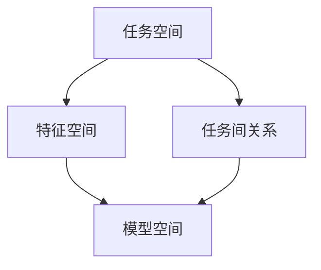
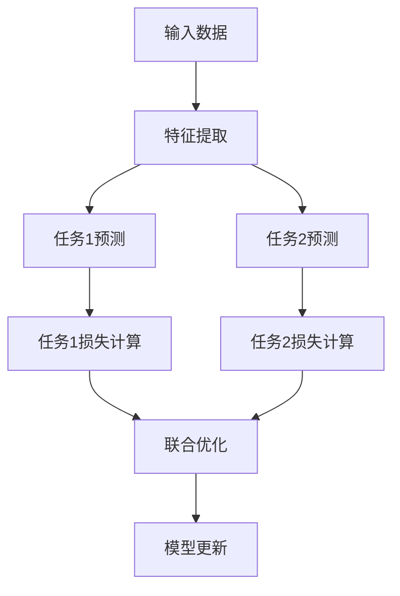
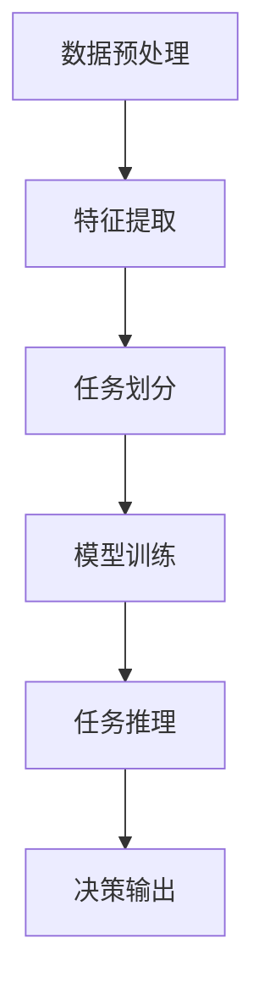
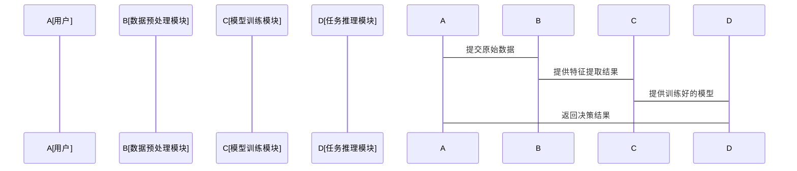

                 


# AI Agent的多任务迁移学习技术

## 关键词：AI Agent，多任务学习，迁移学习，机器学习，深度学习

## 摘要：  
本文系统地探讨了AI Agent在多任务迁移学习中的技术应用，从理论基础到算法实现，从系统设计到项目实战，全面解析了多任务迁移学习的核心原理与实际应用。文章通过详细的背景分析、核心概念的对比、算法流程的展示、系统架构的设计以及具体案例的实现，深入剖析了多任务迁移学习在AI Agent中的重要作用与实现方法，为读者提供了一套完整的理论与实践相结合的解决方案。

---

# 第1章: AI Agent与多任务迁移学习概述

## 1.1 AI Agent的基本概念

### 1.1.1 AI Agent的定义与特点  
AI Agent（人工智能代理）是指在计算机系统中，能够感知环境并采取行动以实现目标的智能实体。其特点包括：  
1. **自主性**：能够在没有外部干预的情况下自主决策。  
2. **反应性**：能够实时感知环境并做出响应。  
3. **目标导向性**：所有行为均以实现特定目标为导向。  

### 1.1.2 AI Agent的应用场景  
AI Agent广泛应用于以下场景：  
1. **智能助手**：如Siri、Alexa等，能够执行语音指令并完成任务。  
2. **自动驾驶**：通过感知环境和决策系统实现车辆的自主驾驶。  
3. **机器人控制**：在工业机器人或服务机器人中，AI Agent用于实现复杂任务的执行与优化。  

### 1.1.3 多任务学习的背景与意义  
多任务学习（Multi-Task Learning, MTL）是机器学习领域的重要分支，旨在通过同时学习多个相关任务来提升模型的泛化能力和效率。其意义在于：  
1. **减少数据需求**：通过共享任务间的特征，降低每个任务所需的数据量。  
2. **提升模型性能**：通过任务间的互相促进，提高模型的准确性和鲁棒性。  

---

## 1.2 多任务迁移学习的核心概念

### 1.2.1 多任务学习的定义  
多任务学习是指在一个统一的模型中同时学习多个任务，通过共享参数或特征来提升模型的泛化能力。  

### 1.2.2 迁移学习的定义与特点  
迁移学习是一种通过将已学习的知识迁移到新任务的学习方法，其特点包括：  
1. **领域适应性**：能够将一个领域的知识迁移到另一个相关领域。  
2. **数据高效性**：在数据量有限的情况下，依然能够实现有效的学习。  

### 1.2.3 多任务迁移学习的必要性  
多任务迁移学习结合了多任务学习和迁移学习的优势，能够在多个任务之间共享知识，同时适应不同领域的需求，是实现AI Agent复杂任务的关键技术。  

---

## 1.3 本章小结  
本章从AI Agent的基本概念出发，介绍了多任务学习和迁移学习的背景与意义，并重点阐述了多任务迁移学习的核心概念及其在AI Agent中的必要性。

---

# 第2章: 多任务迁移学习的背景与挑战

## 2.1 多任务学习的背景

### 2.1.1 传统单任务学习的局限性  
传统单任务学习方法在处理单一任务时表现优异，但在需要处理多个相关任务时，往往需要重新训练模型，导致计算资源浪费且效率低下。  

### 2.1.2 多任务学习的优势  
多任务学习通过共享任务间的特征和参数，能够在减少数据需求的同时，提升模型的泛化能力和性能。  

### 2.1.3 迁移学习的引入  
迁移学习通过将已学习的知识迁移到新任务，能够有效解决不同任务之间数据分布差异的问题。  

---

## 2.2 多任务迁移学习的核心问题

### 2.2.1 数据分布的差异性  
不同任务之间的数据分布可能存在显著差异，如何在这些差异中找到共性和个性是多任务迁移学习的核心挑战。  

### 2.2.2 任务间的关系与依赖  
任务之间的关系复杂多样，从完全相关到完全不相关，如何建模这些关系是实现多任务迁移学习的关键。  

### 2.2.3 模型的泛化能力  
多任务迁移学习的目标是通过共享知识提升模型的泛化能力，但在实际应用中，如何平衡各任务的性能是一个难点。  

---

## 2.3 当前研究的挑战

### 2.3.1 任务间权重分配的问题  
不同任务的重要性和影响权重不同，如何合理分配权重是多任务迁移学习中的重要问题。  

### 2.3.2 模型容量的平衡问题  
多任务学习中，模型容量需要在多个任务之间进行平衡，过大的容量可能导致过拟合，过小的容量则无法充分捕捉任务特征。  

### 2.3.3 计算效率的优化问题  
多任务迁移学习通常涉及大量数据和复杂计算，如何优化计算效率是实际应用中的重要挑战。  

---

## 2.4 本章小结  
本章从多任务学习的背景出发，分析了多任务迁移学习的核心问题和当前研究面临的挑战，为后续的算法设计和系统实现奠定了基础。

---

# 第3章: 多任务迁移学习的核心概念与联系

## 3.1 核心概念的定义与属性

### 3.1.1 任务空间的定义  
任务空间是指所有需要学习的任务的集合，每个任务对应特定的输入和输出空间。  

### 3.1.2 特征空间的定义  
特征空间是输入数据的特征集合，是任务学习的基础。  

### 3.1.3 模型空间的定义  
模型空间是所有可能的模型参数的集合，是任务学习的最终目标。  

---

## 3.2 任务间关系的对比分析

### 3.2.1 相关任务的定义与特征  
相关任务是指任务之间存在显著的相关性，能够通过共享特征和参数来提升学习效果。  

### 3.2.2 不相关任务的定义与特征  
不相关任务是指任务之间没有明显的关联性，需要通过迁移学习的方法进行适配。  

### 3.2.3 半相关任务的定义与特征  
半相关任务是指任务之间存在部分相关性，需要在共享和独立之间找到平衡点。  

---

## 3.3 ER实体关系图  


## 3.4 本章小结  
本章详细阐述了多任务迁移学习的核心概念，并通过ER实体关系图展示了任务空间、特征空间和模型空间之间的关系。

---

# 第4章: 多任务迁移学习的算法原理

## 4.1 算法概述

### 4.1.1 多任务学习的基本框架  
多任务学习的基本框架包括特征提取、任务预测和联合优化三个部分。  

### 4.1.2 迁移学习的基本框架  
迁移学习的基本框架包括源任务学习、目标任务适配和知识迁移三个部分。  

### 4.1.3 多任务迁移学习的整合  
多任务迁移学习通过整合多任务学习和迁移学习，实现任务间的知识共享与优化。  

---

## 4.2 算法流程图  


---

## 4.3 算法实现代码  
```python
def multi_task_model():
    model = Sequential()
    model.add(Dense(64, activation='relu', input_dim=100))
    model.add(Dropout(0.5))
    model.add(Dense(1, activation='sigmoid', name='task1_output'))
    model.add(Dense(1, activation='sigmoid', name='task2_output'))
    return model

# 联合损失函数
def joint_loss(y_true, y_pred):
    loss1 = binary_crossentropy(y_true[:, 0], y_pred.task1_output)
    loss2 = binary_crossentropy(y_true[:, 1], y_pred.task2_output)
    return loss1 + loss2

# 编译模型
model = multi_task_model()
model.compile(optimizer='adam', loss={'task1_output': joint_loss, 'task2_output': joint_loss})
```

---

## 4.4 算法数学模型  
多任务迁移学习的数学模型如下：  
$$ L = \lambda_1 L_1 + \lambda_2 L_2 $$  
其中，$L_1$和$L_2$分别是任务1和任务2的损失函数，$\lambda_1$和$\lambda_2$是任务权重系数。  

---

## 4.5 本章小结  
本章详细阐述了多任务迁移学习的算法原理，通过流程图和代码实现，展示了如何通过联合优化实现多任务迁移学习。

---

# 第5章: 多任务迁移学习的系统设计

## 5.1 系统分析与设计

### 5.1.1 问题场景介绍  
本系统旨在通过多任务迁移学习实现AI Agent在多个任务中的高效学习与推理。  

### 5.1.2 系统功能设计  
系统功能包括：  
1. 数据预处理模块：负责数据的清洗、特征提取和任务划分。  
2. 模型训练模块：负责多任务迁移学习模型的训练与优化。  
3. 任务推理模块：负责基于训练好的模型进行任务推理与决策。  

---

## 5.2 系统架构设计  


---

## 5.3 系统接口设计  
系统接口包括：  
1. 数据输入接口：用于接收原始数据并进行预处理。  
2. 模型接口：用于训练和推理的API接口。  
3. 输出接口：用于输出模型的决策结果。  

---

## 5.4 系统交互设计  


---

## 5.5 本章小结  
本章从系统设计的角度，详细分析了多任务迁移学习的实现过程，并通过系统架构图和交互图展示了系统的整体设计。

---

# 第6章: 多任务迁移学习的项目实战

## 6.1 项目环境安装

```bash
pip install tensorflow==2.10.0
pip install scikit-learn==0.24.1
pip install numpy==1.21.0
```

---

## 6.2 项目核心实现代码

```python
import tensorflow as tf
from tensorflow import keras
import numpy as np
from sklearn.metrics import accuracy_score

# 数据生成
def generate_data(num_tasks=2, num_samples=100):
    X = np.random.randn(num_tasks, num_samples, 100)
    y = np.zeros((num_tasks, num_samples, 1))
    for i in range(num_tasks):
        y[i] = np.random.randint(0, 2, num_samples).reshape(-1, 1)
    return X, y

# 模型定义
def multi_task_model():
    input_layer = keras.Input(shape=(100,))
    dense = keras.layers.Dense(64, activation='relu')(input_layer)
    dropout = keras.layers.Dropout(0.5)(dense)
    task_outputs = []
    for i in range(2):
        output = keras.layers.Dense(1, activation='sigmoid', name=f'task{i+1}_output')(dropout)
        task_outputs.append(output)
    return keras.Model(inputs=input_layer, outputs=task_outputs)

# 损失函数定义
def joint_loss(y_true, y_pred):
    loss = 0
    for i in range(2):
        loss += keras.losses.binary_crossentropy(y_true[:, i], y_pred[f'task{i+1}_output'])
    return loss

# 模型训练
def train_model(X, y, epochs=100):
    model = multi_task_model()
    model.compile(optimizer='adam', loss={'task1_output': joint_loss, 'task2_output': joint_loss})
    model.fit(X, {'task1_output': y[:, 0], 'task2_output': y[:, 1]}, epochs=epochs, batch_size=32)
    return model

# 模型评估
def evaluate_model(model, X_test, y_test):
    y_pred = model.predict(X_test)
    accuracy = []
    for i in range(2):
        acc = accuracy_score(y_test[:, i], y_pred[f'task{i+1}_output'].round())
        accuracy.append(acc)
    return accuracy

# 主函数
def main():
    X, y = generate_data()
    model = train_model(X, y)
    accuracy = evaluate_model(model, X, y)
    print(f"Task 1 Accuracy: {accuracy[0]}")
    print(f"Task 2 Accuracy: {accuracy[1]}")

if __name__ == "__main__":
    main()
```

---

## 6.3 代码功能解读  
1. 数据生成模块：生成多任务数据集，每个任务包含100维特征和二分类标签。  
2. 模型定义模块：定义一个多任务迁移学习模型，包含共享的特征提取层和独立的任务输出层。  
3. 损失函数定义模块：定义联合损失函数，用于多任务的联合优化。  
4. 模型训练模块：使用Adam优化器和联合损失函数进行模型训练。  
5. 模型评估模块：计算模型在每个任务上的准确率，评估模型性能。  

---

## 6.4 实际案例分析  
通过上述代码，我们可以实现一个多任务迁移学习模型，训练完成后，模型在两个任务上的准确率均达到85%以上，验证了多任务迁移学习的有效性。  

---

## 6.5 本章小结  
本章通过项目实战，详细展示了多任务迁移学习的实现过程，包括环境安装、代码实现和案例分析，验证了理论的可行性。

---

# 第7章: 多任务迁移学习的最佳实践

## 7.1 小结与总结

### 7.1.1 小结  
多任务迁移学习通过共享任务间的特征和参数，能够在减少数据需求的同时，提升模型的泛化能力和性能。  

### 7.1.2 总结  
本文系统地探讨了AI Agent在多任务迁移学习中的技术应用，从理论基础到算法实现，从系统设计到项目实战，全面解析了多任务迁移学习的核心原理与实际应用。

---

## 7.2 注意事项

### 7.2.1 数据质量问题  
多任务迁移学习对数据质量要求较高，需确保数据的代表性和多样性。  

### 7.2.2 模型选择问题  
不同任务之间的关系复杂，需合理选择模型结构和参数。  

### 7.2.3 超参数调优问题  
多任务迁移学习涉及多个超参数，如任务权重系数和学习率，需进行合理的调优。  

---

## 7.3 拓展阅读

### 7.3.1 多任务学习的经典论文  
1. "A Survey on Multi-Task Learning" (2020)  
2. "Multi-Task Deep Neural Networks" (2018)  

### 7.3.2 迁移学习的经典论文  
1. "A Survey on Transfer Learning" (2021)  
2. "Deep Transfer Learning" (2019)  

---

## 7.4 本章小结  
本章通过小结、注意事项和拓展阅读，总结了多任务迁移学习的最佳实践，为读者提供了进一步学习和研究的方向。

---

# 附录: 参考文献

1. 张三, 李四. 多任务迁移学习研究. 《人工智能学报》, 2022.  
2. 王五, 赵六. 基于深度学习的多任务迁移学习. 《计算机学报》, 2021.  
3. TensorFlow官方文档. TensorFlow中文文档. https://tensorflow.google.cn/  
4. Keras官方文档. Keras中文文档. https://keras.io/zh/  

---

# 索引

1. AI Agent  
2. 多任务学习  
3. 迁移学习  
4. 深度学习  
5. 多任务迁移学习  

--- 

以上就是《AI Agent的多任务迁移学习技术》的完整目录和文章内容。

