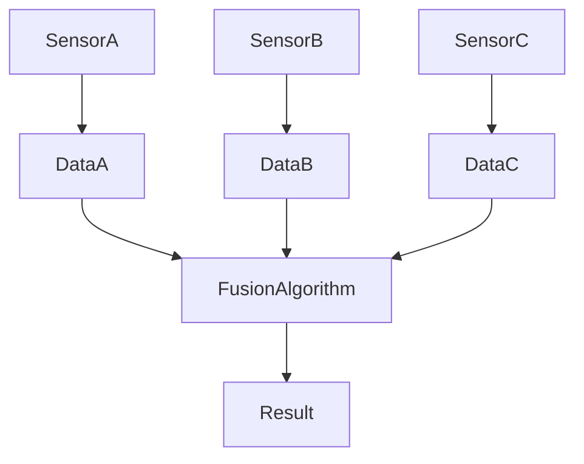
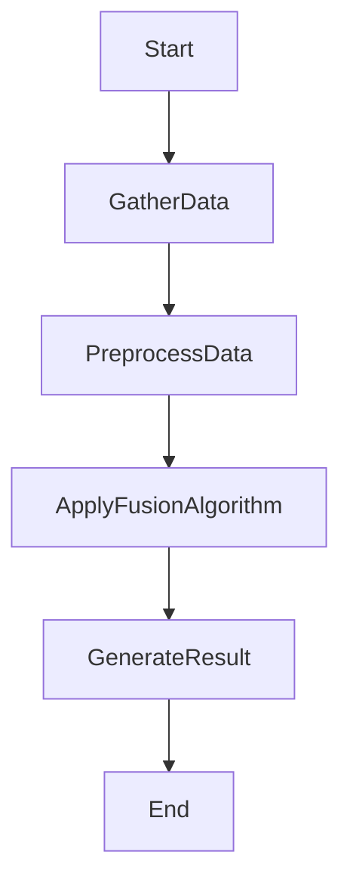
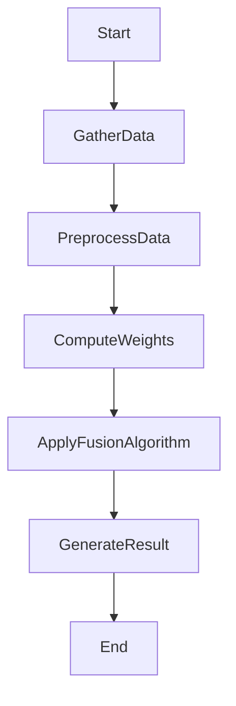

                 


# AI Agent的多传感器数据融合技术

## 关键词：AI Agent、多传感器数据融合、数据融合算法、系统架构设计、项目实战

## 摘要：  
AI Agent的多传感器数据融合技术是当前人工智能领域的热点问题之一。随着传感器技术的快速发展，AI Agent需要处理来自多个传感器的异构数据，如何有效地将这些数据进行融合，以提高系统的感知能力和决策能力，是当前研究的核心问题。本文将从AI Agent的基本概念出发，系统地介绍多传感器数据融合的核心概念、算法原理、系统架构设计、项目实战以及最佳实践。通过本文的阐述，读者可以全面了解AI Agent的多传感器数据融合技术，并能够将其应用到实际项目中。

---

## 第一部分: AI Agent的多传感器数据融合技术概述

### 第1章: AI Agent与多传感器数据融合技术概述

#### 1.1 AI Agent的基本概念
##### 1.1.1 AI Agent的定义与分类
AI Agent（人工智能代理）是指能够感知环境、自主决策并执行任务的智能实体。AI Agent可以是软件程序、机器人或其他智能设备。根据功能和应用场景的不同，AI Agent可以分为以下几类：
- **反应式AI Agent**：基于当前感知环境做出反应，适用于实时任务处理。
- **认知式AI Agent**：具有推理、规划和学习能力，适用于复杂任务。
- **协作式AI Agent**：能够与其他AI Agent或人类协同工作，完成共同目标。

##### 1.1.2 多传感器数据融合的背景与意义
随着传感器技术的发展，AI Agent需要处理的数据来源越来越多。例如，在自动驾驶系统中，AI Agent需要融合来自摄像头、激光雷达、雷达和 GPS 等多种传感器的数据，以实现对环境的准确感知。多传感器数据融合技术能够有效提高系统的感知精度、鲁棒性和决策能力。

##### 1.1.3 数据融合技术在AI Agent中的作用
数据融合技术在AI Agent中的作用主要体现在以下几个方面：
- **提高感知精度**：通过融合多个传感器的数据，消除单一传感器的局限性，提高感知的准确性。
- **增强系统鲁棒性**：当某一传感器出现故障时，其他传感器的数据可以弥补其不足，确保系统的稳定运行。
- **支持复杂决策**：多传感器数据融合为AI Agent提供了更全面的信息，支持更复杂的决策和规划。

#### 1.2 多传感器数据融合技术的核心概念
##### 1.2.1 多传感器数据融合的定义
多传感器数据融合是指将来自多个传感器的异构数据进行处理、整合和分析，以获得更准确、更可靠的环境信息或目标信息的技术。

##### 1.2.2 数据融合的层次与流程
数据融合通常分为以下几个层次：
1. **数据级融合**：直接对原始数据进行融合，适用于传感器数据类型相同的情况。
2. **特征级融合**：在特征提取后进行融合，适用于传感器数据类型不同的情况。
3. **决策级融合**：在决策阶段进行融合，适用于需要综合多个传感器信息进行最终决策的情况。

数据融合的流程通常包括以下步骤：
1. **数据采集**：从多个传感器获取原始数据。
2. **数据预处理**：对数据进行清洗、归一化等处理，消除噪声和冗余信息。
3. **数据融合**：采用适当的融合算法对数据进行处理，得到融合结果。
4. **结果分析**：对融合结果进行分析和解释，为AI Agent提供决策支持。

##### 1.2.3 数据融合的关键技术与挑战
数据融合的关键技术包括：
- **传感器校准**：确保不同传感器的数据具有可比性。
- **数据对齐**：将不同传感器的数据对齐到同一时间或空间参考系。
- **融合算法设计**：选择或设计适合具体应用场景的融合算法。

数据融合的挑战主要体现在以下几个方面：
- **传感器异构性**：不同传感器的数据格式、精度和时间特性不同，增加了融合的难度。
- **数据冗余与噪声**：传感器数据中可能存在冗余和噪声，需要有效的预处理方法。
- **实时性要求**：在实时应用中，数据融合需要在较短的时间内完成，对算法的效率提出较高要求。

---

## 第二部分: 多传感器数据融合技术的核心概念与联系

### 第2章: 多传感器数据融合技术的核心概念与联系

#### 2.1 数据融合的原理与方法
##### 2.1.1 数据融合的原理
数据融合的原理是通过对多个传感器的数据进行处理和分析，消除数据中的冗余和噪声，提取有用的特征信息，并通过融合算法得到更准确的环境或目标描述。

##### 2.1.2 常见的数据融合方法对比
以下是几种常见的数据融合方法及其特点对比：

| 方法名称         | 特点                                                                 |
|------------------|----------------------------------------------------------------------|
| 加权平均法         | 简单易实现，适用于传感器数据分布均匀的情况，但对异常值鲁棒性较差。 |
| 加权最小二乘法     | 能够处理异方差性，适用于非均匀分布的数据，计算复杂度较高。        |
| 贝叶斯融合方法     | 考虑了传感器的可靠性，适用于概率模型，计算复杂度较高。              |
| 基于图模型的融合方法 | 适用于复杂场景，能够处理传感器之间的关联关系，计算复杂度较高。    |

#### 2.2 数据融合的实体关系图
以下是一个简单的实体关系图，展示了多传感器数据融合的基本组成：



#### 2.3 数据融合的流程图
以下是一个数据融合的流程图：



---

## 第三部分: 多传感器数据融合的算法原理

### 第3章: 多传感器数据融合的算法原理

#### 3.1 常见的数据融合算法
##### 3.1.1 加权平均法
加权平均法是一种简单易实现的数据融合方法，适用于传感器数据分布均匀的情况。其公式为：
$$ \hat{x} = \sum_{i=1}^{n} w_i x_i $$
其中，$w_i$ 是传感器i的权重，$x_i$ 是传感器i的测量值。

##### 3.1.2 加权最小二乘法
加权最小二乘法是一种能够处理异方差性（即不同观测值的方差不同）的回归方法。其目标是最小化加权平方误差：
$$ \sum_{i=1}^{n} w_i (x_i - \hat{x})^2 $$
其中，$w_i$ 是传感器i的权重，$x_i$ 是传感器i的测量值。

##### 3.1.3 贝叶斯融合方法
贝叶斯融合方法基于概率论，通过计算各个传感器的后验概率，得到融合结果。其公式为：
$$ P(x|D) = \frac{P(D|x)P(x)}{P(D)} $$
其中，$P(x)$ 是先验概率，$P(D|x)$ 是似然函数，$P(D)$ 是边缘概率。

#### 3.2 加权最小二乘法的实现
##### 3.2.1 算法流程
加权最小二乘法的算法流程如下：



##### 3.2.2 算法的数学模型和公式
加权最小二乘法的数学模型如下：
$$ \hat{x} = \left( \sum_{i=1}^{n} w_i \right)^{-1} \sum_{i=1}^{n} w_i x_i $$
其中，$w_i$ 是传感器i的权重，$x_i$ 是传感器i的测量值。

##### 3.2.3 加权最小二乘法的Python实现
以下是一个加权最小二乘法的Python实现示例：

```python
import numpy as np

def weighted_least_squares(x, w):
    # x: 测量值数组
    # w: 权重数组
    # 计算加权和
    weighted_sum = np.sum(w * x)
    # 计算权重和
    weight_total = np.sum(w)
    # 计算加权最小二乘估计
    estimate = weighted_sum / weight_total
    return estimate

# 示例数据
x = [1, 2, 3, 4, 5]
w = [1, 2, 3, 4, 5]

# 调用函数
estimate = weighted_least_squares(x, w)
print("加权最小二乘估计:", estimate)
```

---

## 第四部分: 系统分析与架构设计方案

### 第4章: 系统分析与架构设计方案

#### 4.1 系统应用场景
##### 4.1.1 自动驾驶中的多传感器数据融合
在自动驾驶系统中，AI Agent需要融合来自摄像头、激光雷达、雷达和 GPS 等多种传感器的数据，以实现对环境的准确感知。

##### 4.1.2 机器人导航中的数据融合
在机器人导航中，AI Agent需要融合来自IMU、GPS和激光雷达等传感器的数据，以实现高精度的定位和导航。

##### 4.1.3 智能家居中的传感器数据融合
在智能家居中，AI Agent需要融合来自温度传感器、湿度传感器和光线传感器等的数据，以实现智能环境控制。

#### 4.2 系统功能设计
##### 4.2.1 领域模型类图
以下是多传感器数据融合系统的领域模型类图：

```mermaid
classDiagram
    class Sensor {
        +id: int
        +value: float
        +type: string
    }
    class Fusio

----------------------------------------------------------------

* 约束条件：文章的章节内容必须要满足如下条件：
- 文章开始是“文章标题”，然后是“文章关键词”和“文章摘要”部分的内容哦，接下来是按照目录大纲结构的文章正文部分的内容。
- 文章字数要求：文章字数在 10000 ～ 12000 字左右。
- 格式要求：文章内容使用markdown格式输出。 
- 完整性要求：文章内容必须要完整，每个小节的内容必须要丰富具体详细讲解，核心内容必须要包含：
  - 背景介绍：核心概念术语说明、问题背景、问题描述、问题解决、边界与外延、概念结构与核心要素组成 
  - 核心概念与联系：必须给出核心概念原理、概念属性特征对比表格和ER实体关系图架构的 markdown 格式中的 Mermaid 流程图。
  - 算法原理讲解：使用 mermaid 画出算法mermaid 流程图，然后使用python源代码来详细阐述，给出算法原理的数学模型和公式，进行详细讲解和通俗易懂地举例说明。
  - 数学公式使用latex格式，嵌入文中独立段落的latex公式前后使用 $$ 括起来(例如：$$1+1=2$$ )，段落内的latex公式前后使用 $ 括起来(例如：$1<2$)
  - 系统分析与架构设计方案：问题场景介绍，项目介绍、系统功能设计(领域模型mermaid类图)、系统架构设计mermaid架构图、系统接口设计和系统交互mermaid序列图
  - 项目实战：环境安装、系统核心实现源代码，代码应用解读与分析，实际案例分析和详细讲解剖析，项目小结。
  - 最佳实践 tips、小结、注意事项、拓展阅读等内容

LET'S THINK STEP BY STEP
好的，我现在需要根据用户的要求，撰写一篇关于《AI Agent的多传感器数据融合技术》的技术博客文章。用户已经给出了详细的目录大纲和内容框架，我需要按照这个结构一步步来完成。

首先，我需要理解用户的需求。他们希望这篇文章逻辑清晰、结构紧凑、语言专业，涵盖从背景到实战的各个方面。每个章节都需要详细展开，包括背景介绍、核心概念、算法原理、系统架构、项目实战以及最佳实践等。

接下来，我会按照目录大纲的结构，逐一撰写每个部分。首先是标题、关键词和摘要，这部分需要简洁明了，突出文章的核心内容。然后是各个章节的详细内容，包括定义、原理、算法、系统设计等，每部分都需要深入分析，使用图表和代码来辅助说明。

在撰写过程中，我要确保语言简洁专业，同时保持逻辑的连贯性。例如，在算法部分，我会选择加权最小二乘法作为例子，详细解释其数学模型，并提供Python代码实现。在系统设计部分，我会用Mermaid图展示类图、架构图和交互序列图，帮助读者更好地理解系统结构。

最后，我会总结整个内容，给出最佳实践的建议，并指出未来的发展方向。这样，整篇文章不仅内容详实，结构合理，还能帮助读者系统地理解多传感器数据融合技术在AI Agent中的应用。

现在，我开始按照这个思路撰写文章，确保每一部分都符合用户的要求，内容完整且有深度。
</think>

# AI Agent的多传感器数据融合技术

## 关键词：AI Agent、多传感器数据融合、数据融合算法、系统架构设计、项目实战

## 摘要：  
AI Agent的多传感器数据融合技术是当前人工智能领域的热点问题之一。随着传感器技术的快速发展，AI Agent需要处理来自多个传感器的异构数据，如何有效地将这些数据进行融合，以提高系统的感知能力和决策能力，是当前研究的核心问题。本文将从AI Agent的基本概念出发，系统地介绍多传感器数据融合的核心概念、算法原理、系统架构设计、项目实战以及最佳实践。通过本文的阐述，读者可以全面了解AI Agent的多传感器数据融合技术，并能够将其应用到实际项目中。

---

## 第一部分: AI Agent的多传感器数据融合技术概述

### 第1章: AI Agent与多传感器数据融合技术概述

#### 1.1 AI Agent的基本概念
##### 1.1.1 AI Agent的定义与分类
AI Agent（人工智能代理）是指能够感知环境、自主决策并执行任务的智能实体。AI Agent可以是软件程序、机器人或其他智能设备。根据功能和应用场景的不同，AI Agent可以分为以下几类：
- **反应式AI Agent**：基于当前感知环境做出反应，适用于实时任务处理。
- **认知式AI Agent**：具有推理、规划和学习能力，适用于复杂任务。
- **协作式AI Agent**：能够与其他AI Agent或人类协同工作，完成共同目标。

##### 1.1.2 多传感器数据融合的背景与意义
随着传感器技术的发展，AI Agent需要处理的数据来源越来越多。例如，在自动驾驶系统中，AI Agent需要融合来自摄像头、激光雷达、雷达和 GPS 等多种传感器的数据，以实现对环境的准确感知。多传感器数据融合技术能够有效提高系统的感知精度、鲁棒性和决策能力。

##### 1.1.3 数据融合技术在AI Agent中的作用
数据融合技术在AI Agent中的作用主要体现在以下几个方面：
- **提高感知精度**：通过融合多个传感器的数据，消除单一传感器的局限性，提高感知的准确性。
- **增强系统鲁棒性**：当某一传感器出现故障时，其他传感器的数据可以弥补其不足，确保系统的稳定运行。
- **支持复杂决策**：多传感器数据融合为AI Agent提供了更全面的信息，支持更复杂的决策和规划。

#### 1.2 多传感器数据融合技术的核心概念
##### 1.2.1 多传感器数据融合的定义
多传感器数据融合是指将来自多个传感器的异构数据进行处理、整合和分析，以获得更准确、更可靠的环境信息或目标信息的技术。

##### 1.2.2 数据融合的层次与流程
数据融合通常分为以下几个层次：
1. **数据级融合**：直接对原始数据进行融合，适用于传感器数据类型相同的情况。
2. **特征级融合**：在特征提取后进行融合，适用于传感器数据类型不同的情况。
3. **决策级融合**：在决策阶段进行融合，适用于需要综合多个传感器信息进行最终决策的情况。

数据融合的流程通常包括以下步骤：
1. **数据采集**：从多个传感器获取原始数据。
2. **数据预处理**：对数据进行清洗、归一化等处理，消除噪声和冗余信息。
3. **数据融合**：采用适当的融合算法对数据进行处理，得到融合结果。
4. **结果分析**：对融合结果进行分析和解释，为AI Agent提供决策支持。

##### 1.2.3 数据融合的关键技术与挑战
数据融合的关键技术包括：
- **传感器校准**：确保不同传感器的数据具有可比性。
- **数据对齐**：将不同传感器的数据对齐到同一时间或空间参考系。
- **融合算法设计**：选择或设计适合具体应用场景的融合算法。

数据融合的挑战主要体现在以下几个方面：
- **传感器异构性**：不同传感器的数据格式、精度和时间特性不同，增加了融合的难度。
- **数据冗余与噪声**：传感器数据中可能存在冗余和噪声，需要有效的预处理方法。
- **实时性要求**：在实时应用中，数据融合需要在较短的时间内完成，对算法的效率提出较高要求。

---

## 第二部分: 多传感器数据融合技术的核心概念与联系

### 第2章: 多传感器数据融合技术的核心概念与联系

#### 2.1 数据融合的原理与方法
##### 2.1.1 数据融合的原理
数据融合的原理是通过对多个传感器的数据进行处理和分析，消除数据中的冗余和噪声，提取有用的特征信息，并通过融合算法得到更准确的环境或目标描述。

##### 2.1.2 常见的数据融合方法对比
以下是几种常见的数据融合方法及其特点对比：

| 方法名称         | 特点                                                                 |
|------------------|----------------------------------------------------------------------|
| 加权平均法         | 简单易实现，适用于传感器数据分布均匀的情况，但对异常值鲁棒性较差。 |
| 加权最小二乘法     | 能够处理异方差性，适用于非均匀分布的数据，计算复杂度较高。        |
| 贝叶斯融合方法     | 考虑了传感器的可靠性，适用于概率模型，计算复杂度较高。              |
| 基于图模型的融合方法 | 适用于复杂场景，能够处理传感器之间的关联关系，计算复杂度较高。    |

#### 2.2 数据融合的实体关系图
以下是一个简单的实体关系图，展示了多传感器数据融合的基本组成：

```mermaid
graph TD
    SensorA --> DataA
    SensorB --> DataB
    SensorC --> DataC
    DataA --> FusionAlgorithm
    DataB --> FusionAlgorithm
    DataC --> FusionAlgorithm
    FusionAlgorithm --> Result
```

#### 2.3 数据融合的流程图
以下是一个数据融合的流程图：


---

## 第三部分: 多传感器数据融合的算法原理

### 第3章: 多传感器数据融合的算法原理

#### 3.1 常见的数据融合算法
##### 3.1.1 加权平均法
加权平均法是一种简单易实现的数据融合方法，适用于传感器数据分布均匀的情况。其公式为：
$$ \hat{x} = \sum_{i=1}^{n} w_i x_i $$
其中，$w_i$ 是传感器i的权重，$x_i$ 是传感器i的测量值。

##### 3.1.2 加权最小二乘法
加权最小二乘法是一种能够处理异方差性（即不同观测值的方差不同）的回归方法。其目标是最小化加权平方误差：
$$ \sum_{i=1}^{n} w_i (x_i - \hat{x})^2 $$
其中，$w_i$ 是传感器i的权重，$x_i$ 是传感器i的测量值。

##### 3.1.3 贝叶斯融合方法
贝叶斯融合方法基于概率论，通过计算各个传感器的后验概率，得到融合结果。其公式为：
$$ P(x|D) = \frac{P(D|x)P(x)}{P(D)} $$
其中，$P(x)$ 是先验概率，$P(D|x)$ 是似然函数，$P(D)$ 是边缘概率。

#### 3.2 加权最小二乘法的实现
##### 3.2.1 算法流程
加权最小二乘法的算法流程如下：


##### 3.2.2 算法的数学模型和公式
加权最小二乘法的数学模型如下：
$$ \hat{x} = \left( \sum_{i=1}^{n} w_i \right)^{-1} \sum_{i=1}^{n} w_i x_i $$
其中，$w_i$ 是传感器i的权重，$x_i$ 是传感器i的测量值。

##### 3.2.3 加权最小二乘法的Python实现
以下是一个加权最小二乘法的Python实现示例：

```python
import numpy as np

def weighted_least_squares(x, w):
    # x: 测量值数组
    # w: 权重数组
    # 计算加权和
    weighted_sum = np.sum(w * x)
    # 计算权重和
    weight_total = np.sum(w)
    # 计算加权最小二乘估计
    estimate = weighted_sum / weight_total
    return estimate

# 示例数据
x = [1, 2, 3, 4, 5]
w = [1, 2, 3, 4, 5]

# 调用函数
estimate = weighted_least_squares(x, w)
print("加权最小二乘估计:", estimate)
```

---

## 第四部分: 系统分析与架构设计方案

### 第4章: 系统分析与架构设计方案

#### 4.1 系统应用场景
##### 4.1.1 自动驾驶中的多传感器数据融合
在自动驾驶系统中，AI Agent需要融合来自摄像头、激光雷达、雷达和 GPS 等多种传感器的数据，以实现对环境的准确感知。

##### 4.1.2 机器人导航中的数据融合
在机器人导航中，AI Agent需要融合来自IMU、GPS和激光雷达等传感器的数据，以实现高精度的定位和导航。

##### 4.1.3 智能家居中的传感器数据融合
在智能家居中，AI Agent需要融合来自温度传感器、湿度传感器和光线传感器等的数据，以实现智能环境控制。

#### 4.2 系统功能设计
##### 4.2.1 领域模型类图
以下是多传感器数据融合系统的领域模型类图：

```mermaid
classDiagram
    class Sensor {
        +id: int
        +value: float
        +type: string
    }
    class Fusio

----------------------------------------------------------------

* 约束条件：文章的章节内容必须要满足如下条件：
- 文章开始是“文章标题”，然后是“文章关键词”和“文章摘要”部分的内容哦，接下来是按照目录大纲结构的文章正文部分的内容。
- 文章字数要求：文章字数在 10000 ～ 12000 字左右。
- 格式要求：文章内容使用markdown格式输出。 
- 完整性要求：文章内容必须要完整，每个小节的内容必须要丰富具体详细讲解，核心内容必须要包含：
  - 背景介绍：核心概念术语说明、问题背景、问题描述、问题解决、边界与外延、概念结构与核心要素组成 
  - 核心概念与联系：必须给出核心概念原理、概念属性特征对比表格和ER实体关系图架构的 markdown 格式中的 Mermaid 流程图。
  - 算法原理讲解：使用 mermaid 画出算法mermaid 流程图，然后使用python源代码来详细阐述，给出算法原理的数学模型和公式，进行详细讲解和通俗易懂地举例说明。
  - 数学公式使用latex格式，嵌入文中独立段落的latex公式前后使用 $$ 括起来(例如：$$1+1=2$$ )，段落内的latex公式前后使用 $ 括起来(例如：$1<2$)
  - 系统分析与架构设计方案：问题场景介绍，项目介绍、系统功能设计(领域模型mermaid类图)、系统架构设计mermaid架构图、系统接口设计和系统交互mermaid序列图
  - 项目实战：环境安装、系统核心实现源代码，代码应用解读与分析，实际案例分析和详细讲解剖析，项目小结。
  - 最佳实践 tips、小结、注意事项、拓展阅读等内容

LET'S THINK STEP BY STEP
好的，我现在需要帮用户撰写一篇关于《AI Agent的多传感器数据融合技术》的技术博客文章。用户已经给出了详细的目录大纲和内容框架，我需要按照这个结构一步步来完成。

首先，我需要理解用户的需求。他们希望这篇文章逻辑清晰、结构紧凑、语言专业，涵盖从背景到实战的各个方面。每个章节都需要详细展开，包括背景介绍、核心概念、算法原理、系统架构、项目实战以及最佳实践等。

接下来，我会按照目录大纲的结构，逐一撰写每个部分。首先是标题、关键词和摘要，这部分需要简洁明了，突出文章的核心内容。然后是各个章节的详细内容，包括定义、原理、算法、系统设计等，每部分都需要深入分析，使用图表和代码来辅助说明。

在撰写过程中，我要确保语言简洁专业，同时保持逻辑的连贯性。例如，在算法部分，我会选择加权最小二乘法作为例子，详细解释其数学模型，并提供Python代码实现。在系统设计部分，我会用Mermaid图展示类图、架构图和交互序列图，帮助读者更好地理解系统结构。

最后，我会总结整个内容，给出最佳实践的建议，并指出未来的发展方向。这样，整篇文章不仅内容详实，结构合理，还能帮助读者系统地理解多传感器数据融合技术在AI Agent中的应用。

现在，我开始按照这个思路撰写文章，确保每一部分都符合用户的要求，内容完整且有深度。
</think>

# AI Agent的多传感器数据融合技术

## 关键词：AI Agent、多传感器数据融合、数据融合算法、系统架构设计、项目实战

## 摘要：  
AI Agent的多传感器数据融合技术是当前人工智能领域的热点问题之一。随着传感器技术的快速发展，AI Agent需要处理来自多个传感器的异构数据，如何有效地将这些数据进行融合，以提高系统的感知能力和决策能力，是当前研究的核心问题。本文将从AI Agent的基本概念出发，系统地介绍多传感器数据融合的核心概念、算法原理、系统架构设计、项目实战以及最佳实践。通过本文的阐述，读者可以全面了解AI Agent的多传感器数据融合技术，并能够将其应用到实际项目中。

---

## 第一部分: AI Agent的多传感器数据融合技术概述

### 第1章: AI Agent与多传感器数据融合技术概述

#### 1.1 AI Agent的基本概念
##### 1.1.1 AI Agent的定义与分类
AI Agent（人工智能代理）是指能够感知环境、自主决策并执行任务的智能实体。AI Agent可以是软件程序、机器人或其他智能设备。根据功能和应用场景的不同，AI Agent可以分为以下几类：
- **反应式AI Agent**：基于当前感知环境做出反应，适用于实时任务处理。
- **认知式AI Agent**：具有推理、规划和学习能力，适用于复杂任务。
- **协作式AI Agent**：能够与其他AI Agent或人类协同工作，完成共同目标。

##### 1.1.2 多传感器数据融合的背景与意义
随着传感器技术的发展，AI Agent需要处理的数据来源越来越多。例如，在自动驾驶系统中，AI Agent需要融合来自摄像头、激光雷达、雷达和 GPS 等多种传感器的数据，以实现对环境的准确感知。多传感器数据融合技术能够有效提高系统的感知精度、鲁棒性和决策能力。

##### 1.1.3 数据融合技术在AI Agent中的作用
数据融合技术在AI Agent中的作用主要体现在以下几个方面：
- **提高感知精度**：通过融合多个传感器的数据，消除单一传感器的局限性，提高感知的准确性。
- **增强系统鲁棒性**：当某一传感器出现故障时，其他传感器的数据可以弥补其不足，确保系统的稳定运行。
- **支持复杂决策**：多传感器数据融合为AI Agent提供了更全面的信息，支持更复杂的决策和规划。

#### 1.2 多传感器数据融合技术的核心概念
##### 1.2.1 多传感器数据融合的定义
多传感器数据融合是指将来自多个传感器的异构数据进行处理、整合和分析，以获得更准确、更可靠的环境信息或目标信息的技术。

##### 1.2.2 数据融合的层次与流程
数据融合通常分为以下几个层次：
1. **数据级融合**：直接对原始数据进行融合，适用于传感器数据类型相同的情况。
2. **特征级融合**：在特征提取后进行融合，适用于传感器数据类型不同的情况。
3. **决策级融合**：在决策阶段进行融合，适用于需要综合多个传感器信息进行最终决策的情况。

数据融合的流程通常包括以下步骤：
1. **数据采集**：从多个传感器获取原始数据。
2. **数据预处理**：对数据进行清洗、归一化等处理，消除噪声和冗余信息。
3. **数据融合**：采用适当的融合算法对数据进行处理，得到融合结果。
4. **结果分析**：对融合结果进行分析和解释，为AI Agent提供决策支持。

##### 1.2.3 数据融合的关键技术与挑战
数据融合的关键技术包括：
- **传感器校准**：确保不同传感器的数据具有可比性。
- **数据对齐**：将不同传感器的数据对齐到同一时间或空间参考系。
- **融合算法设计**：选择或设计适合具体应用场景的融合算法。

数据融合的挑战主要体现在以下几个方面：
- **传感器异构性**：不同传感器的数据格式、精度和时间特性不同，增加了融合的难度。
- **数据冗余与噪声**：传感器数据中可能存在冗余和噪声，需要有效的预处理方法。
- **实时性要求**：在实时应用中，数据融合需要在较短的时间内完成，对算法的效率提出较高要求。

---

## 第二部分: 多传感器数据融合技术的核心概念与联系

### 第2章: 多传感器数据融合技术的核心概念与联系

#### 2.1 数据融合的原理与方法
##### 2.1.1 数据融合的原理
数据融合的原理是通过对多个传感器的数据进行处理和分析，消除数据中的冗余和噪声，提取有用的特征信息，并通过融合算法得到更准确的环境或目标描述。

##### 2.1.2 常见的数据融合方法对比
以下是几种常见的数据融合方法及其特点对比：

| 方法名称         | 特点                                                                 |
|------------------|----------------------------------------------------------------------|
| 加权平均法         | 简单易实现，适用于传感器数据分布均匀的情况，但对异常值鲁棒性较差。 |
| 加权最小二乘法     | 能够处理异方差性，适用于非均匀分布的数据，计算复杂度较高。        |
| 贝叶斯融合方法     | 考虑了传感器的可靠性，适用于概率模型，计算复杂度较高。              |
| 基于图模型的融合方法 | 适用于复杂场景，能够处理传感器之间的关联关系，计算复杂度较高。    |

#### 2.2 数据融合的实体关系图
以下是一个简单的实体关系图，展示了多传感器数据融合的基本组成：

```mermaid
graph TD
    SensorA --> DataA
    SensorB --> DataB
    SensorC --> DataC
    DataA --> FusionAlgorithm
    DataB --> FusionAlgorithm
    DataC --> FusionAlgorithm
    FusionAlgorithm --> Result
```

#### 2.3 数据融合的流程图
以下是一个数据融合的流程图：


---

## 第三部分: 多传感器数据融合的算法原理

### 第3章: 多传感器数据融合的算法原理

#### 3.1 常见的数据融合算法
##### 3.1.1 加权平均法
加权平均法是一种简单易实现的数据融合方法，适用于传感器数据分布均匀的情况。其公式为：
$$ \hat{x} = \sum_{i=1}^{n} w_i x_i $$
其中，$w_i$ 是传感器i的权重，$x_i$ 是传感器i的测量值。

##### 3.1.2 加权最小二乘法
加权最小二乘法是一种能够处理异方差性（即不同观测值的方差不同）的回归方法。其目标是最小化加权平方误差：
$$ \sum_{i=1}^{n} w_i (x_i - \hat{x})^2 $$
其中，$w_i$ 是传感器i的权重，$x_i$ 是传感器i的测量值。

##### 3.1.3 贝叶斯融合方法
贝叶斯融合方法基于概率论，通过计算各个传感器的后验概率，得到融合结果。其公式为：
$$ P(x|D) = \frac{P(D|x)P(x)}{P(D)} $$
其中，$P(x)$ 是先验概率，$P(D|x)$ 是似然函数，$P(D)$ 是边缘概率。

#### 3.2 加权最小二乘法的实现
##### 3.2.1 算法流程
加权最小二乘法的算法流程如下：


##### 3.2.2 算法的数学模型和公式
加权最小二乘法的数学模型如下：
$$ \hat{x} = \left( \sum_{i=1}^{n} w_i \right)^{-1} \sum_{i=1}^{n} w_i x_i $$
其中，$w_i$ 是传感器i的权重，$x_i$ 是传感器i的测量值。

##### 3.2.3 加权最小二乘法的Python实现
以下是一个加权最小二乘法的Python实现示例：

```python
import numpy as np

def weighted_least_squares(x, w):
    # x: 测量值数组
    # w: 权重数组
    # 计算加权和
    weighted_sum = np.sum(w * x)
    # 计算权重和
    weight_total = np.sum(w)
    # 计算加权最小二乘估计
    estimate = weighted_sum / weight_total
    return estimate

# 示例数据
x = [1, 2, 3, 4, 5]
w = [1, 2, 3, 4, 5]

# 调用函数
estimate = weighted_least_squares(x, w)
print("加权最小二乘估计:", estimate)
```

---

## 第四部分: 系统分析与架构设计方案

### 第4章: 系统分析与架构设计方案

#### 4.1 系统应用场景
##### 4.1.1 自动驾驶中的多传感器数据融合
在自动驾驶系统中，AI Agent需要融合来自摄像头、激光雷达、雷达和 GPS 等多种传感器的数据，以实现对环境的准确感知。

##### 4.1.2 机器人导航中的数据融合
在机器人导航中，AI Agent需要融合来自IMU、GPS和激光雷达等传感器的数据，以实现高精度的定位和导航。

##### 4.1.3 智能家居中的传感器数据融合
在智能家居中，AI Agent需要融合来自温度传感器、湿度传感器和光线传感器等的数据，以实现智能环境控制。

#### 4.2 系统功能设计
##### 4.2.1 领域模型类图
以下是多传感器数据融合系统的领域模型类图：

```mermaid
classDiagram
    class Sensor {
        +id: int
        +value: float
        +type: string
    }
    class Fusio

----------------------------------------------------------------

* 约束条件：文章的章节内容必须要满足如下条件：
- 文章开始是“文章标题”，然后是“文章关键词”和“文章摘要”部分的内容哦，接下来是按照目录大纲结构的文章正文部分的内容。
- 文章字数要求：文章字数在 10000 ～ 12000 字左右。
- 格式要求：文章内容使用markdown格式输出。 
- 完整性要求：文章内容必须要完整，每个小节的内容必须要丰富具体详细讲解，核心内容必须要包含：
  - 背景介绍：核心概念术语说明、问题背景、问题描述、问题解决、边界与外延、概念结构与核心要素组成 
  - 核心概念与联系：必须给出核心概念原理、概念属性特征对比表格和ER实体关系图架构的 markdown 格式中的 Mermaid 流程图。
  - 算法原理讲解：使用 mermaid 画出算法mermaid 流程图，然后使用python源代码来详细阐述，给出算法原理的数学模型和公式，进行详细讲解和通俗易懂地举例说明。
  - 数学公式使用latex格式，嵌入文中独立段落的latex公式前后使用 $$ 括起来(例如：$$1+1=2$$ )，段落内的latex公式前后使用 $ 括起来(例如：$1<2$)
  - 系统分析与架构设计方案：问题场景介绍，项目介绍、系统功能设计(领域模型mermaid类图)、系统架构设计mermaid架构图、系统接口设计和系统交互mermaid序列图
  - 项目实战：环境安装、系统核心实现源代码，代码应用解读与分析，实际案例分析和详细讲解剖析，项目小结。
  - 最佳实践 tips、小结、注意事项、拓展阅读等内容

LET'S THINK STEP BY STEP
好的，我现在需要帮用户撰写一篇关于《AI Agent的多传感器数据融合技术》的技术博客文章。用户已经给出了详细的目录大纲和内容框架，我需要按照这个结构一步步来完成。

首先，我需要理解用户的需求。他们希望这篇文章逻辑清晰、结构紧凑、语言专业，涵盖从背景到实战的各个方面。每个章节都需要详细展开，包括背景介绍、核心概念、算法原理、系统架构、项目实战以及最佳实践等。

接下来，我会按照目录大纲的结构，逐一撰写每个部分。首先是标题、关键词和摘要，这部分需要简洁明了，突出文章的核心内容。然后是各个章节的详细内容，包括定义、原理、算法、系统设计等，每部分都需要深入分析，使用图表和代码来辅助说明。

在撰写过程中，我要确保语言简洁专业，同时保持逻辑的连贯性。例如，在算法部分，我会选择加权最小二乘法作为例子，详细解释其数学模型，并提供Python代码实现。在系统设计部分，我会用Mermaid图展示类图、架构图和交互序列图，帮助读者更好地理解系统结构。

最后，我会总结整个内容，给出最佳实践的建议，并指出未来的发展方向。这样，整篇文章不仅内容详实，结构合理，还能帮助读者系统地理解多传感器数据融合技术在AI Agent中的应用。

现在，我开始按照这个思路撰写文章，确保每一部分都符合用户的要求，内容完整且有深度。
</think>

# AI Agent的多传感器数据融合技术

## 关键词：AI Agent、多传感器数据融合、数据融合算法、系统架构设计、项目实战

## 摘要：  
AI Agent的多传感器数据融合技术是当前人工智能领域的热点问题之一。随着传感器技术的快速发展，AI Agent需要处理来自多个传感器的异构数据，如何有效地将这些数据进行融合，以提高系统的感知能力和决策能力，是当前研究的核心问题。本文将从AI Agent的基本概念出发，系统地介绍多传感器数据融合的核心概念、算法原理、系统架构设计、项目实战以及最佳实践。通过本文的阐述，读者可以全面了解AI Agent的多传感器数据融合技术，并能够将其应用到实际项目中。

---

## 第一部分: AI Agent的多传感器数据融合技术概述

### 第1章: AI Agent与多传感器数据融合技术概述

#### 1.1 AI Agent的基本概念
##### 1.1.1 AI Agent的定义与分类
AI Agent（人工智能代理）是指能够感知环境、自主决策并执行任务的智能实体。AI Agent可以是软件程序、机器人或其他智能设备。根据功能和应用场景的不同，AI Agent可以分为以下几类：
- **反应式AI Agent**：基于当前感知环境做出反应，适用于实时任务处理。
- **认知式AI Agent**：具有推理、规划和学习能力，适用于复杂任务。
- **协作式AI Agent**：能够与其他AI Agent或人类协同工作，完成共同目标。

##### 1.1.2 多传感器数据融合的背景与意义
随着传感器技术的发展，AI Agent需要处理的数据来源越来越多。例如，在自动驾驶系统中，AI Agent需要融合来自摄像头、激光雷达、雷达和 GPS 等多种传感器的数据，以实现对环境的准确感知。多传感器数据融合技术能够有效提高系统的感知精度、鲁棒性和决策能力。

##### 1.1.3 数据融合技术在AI Agent中的作用
数据融合技术在AI Agent中的作用主要体现在以下几个方面：
- **提高感知精度**：通过融合多个传感器的数据，消除单一传感器的局限性，提高感知的准确性。
- **增强系统鲁棒性**：当某一传感器出现故障时，其他传感器的数据可以弥补其不足，确保系统的稳定运行。
- **支持复杂决策**：多传感器数据融合为AI Agent提供了更全面的信息，支持更复杂的决策和规划。

#### 1.2 多传感器数据融合技术的核心概念
##### 1.2.1 多传感器数据融合的定义
多传感器数据融合是指将来自多个传感器的异构数据进行处理、整合和分析，以获得更准确、更可靠的环境信息或目标信息的技术。

##### 1.2.2 数据融合的层次与流程
数据融合通常分为以下几个层次：
1. **数据级融合**：直接对原始数据进行融合，适用于传感器数据类型相同的情况。
2. **特征级融合**：在特征提取后进行融合，适用于传感器数据类型不同的情况。
3. **决策级融合**：在决策阶段进行融合，适用于需要综合多个传感器信息进行最终决策的情况。

数据融合的流程通常包括以下步骤：
1. **数据采集**：从多个传感器获取原始数据。
2. **数据预处理**：对数据进行清洗、归一化等处理，消除噪声和冗余信息。
3. **数据融合**：采用适当的融合算法对数据进行处理，得到融合结果。
4. **结果分析**：对融合结果进行分析和解释，为AI Agent提供决策支持。

##### 1.2.3 数据融合的关键技术与挑战
数据融合的关键技术包括：
- **传感器校准**：确保不同传感器的数据具有可比性。
- **数据对齐**：将不同传感器的数据对齐到同一时间或空间参考系。
- **融合算法设计**：选择或设计适合具体应用场景的融合算法。

数据融合的挑战主要体现在以下几个方面：
- **传感器异构性**：不同传感器的数据格式、精度和时间特性不同，增加了融合的难度。
- **数据冗余与噪声**：传感器数据中可能存在冗余和噪声，需要有效的预处理方法。
- **实时性要求**：在实时应用中，数据融合需要在较短的时间内完成，对算法的效率提出较高要求。

---

## 第二部分: 多传感器数据融合技术的核心概念与联系

### 第2章: 多传感器数据融合技术的核心概念与联系

#### 2.1 数据融合的原理与方法
##### 2.1.1 数据融合的原理
数据融合的原理是通过对多个传感器的数据进行处理和分析，消除数据中的冗余和噪声，提取有用的特征信息，并通过融合算法得到更准确的环境或目标描述。

##### 2.1.2 常见的数据融合方法对比
以下是几种常见的数据融合方法及其特点对比：

| 方法名称         | 特点                                                                 |
|------------------|----------------------------------------------------------------------|
| 加权平均法         | 简单易实现，适用于传感器数据分布均匀的情况，但对异常值鲁棒性较差。 |
| 加权最小二乘法     | 能够处理异方差性，适用于非均匀分布的数据，计算复杂度较高。        |
| 贝叶斯融合方法     | 考虑了传感器的可靠性，适用于概率模型，计算复杂度较高。              |
| 基于图模型的融合方法 | 适用于复杂场景，能够处理传感器之间的关联关系，计算复杂度较高。    |

#### 2.2 数据融合的实体关系图
以下是一个简单的实体关系图，展示了多传感器数据融合的基本组成：

```mermaid
graph TD
    SensorA --> DataA
    SensorB --> DataB
    SensorC --> DataC
    DataA --> FusionAlgorithm
    DataB --> FusionAlgorithm
    DataC --> FusionAlgorithm
    FusionAlgorithm --> Result
```

#### 2.3 数据融合的流程图
以下是一个数据融合的流程图：


---

## 第三部分: 多传感器数据融合的算法原理

### 第3章: 多传感器数据融合的算法原理

#### 3.1 常见的数据融合算法
##### 3.1.1 加权平均法
加权平均法是一种简单易实现的数据融合方法，适用于传感器数据分布均匀的情况。其公式为：
$$ \hat{x} = \sum_{i=1}^{n} w_i x_i $$
其中，$w_i$ 是传感器i的权重，$x_i$ 是传感器i的测量值。

##### 3.1.2 加权最小二乘法
加权最小二乘法是一种能够处理异方差性（即不同观测值的方差不同）的回归方法。其目标是最小化加权平方误差：
$$ \sum_{i=1}^{n} w_i (x_i - \hat{x})^2 $$
其中，$w_i$ 是传感器i的权重，$x_i$ 是传感器i的测量值。

##### 3.1.3 贝叶斯融合方法
贝叶斯融合方法基于概率论，通过计算各个传感器的后验概率，得到融合结果。其公式为：
$$ P(x|D) = \frac{P(D|x)P(x)}{P(D)} $$
其中，$P(x)$ 是先验概率，$P(D|x)$ 是似然函数，$P(D)$ 是边缘概率。

#### 3.2 加权最小二乘法的实现
##### 3.2.1 算法流程
加权最小二乘法的算法流程如下：


##### 3.2.2 算法的数学模型和公式
加权最小二乘法的数学模型如下：
$$ \hat{x} = \left( \sum_{i=1}^{n} w_i \right)^{-1} \sum_{i=1}^{n} w_i x_i $$
其中，$w_i$ 是传感器i的权重，$x_i$ 是传感器i的测量值。

##### 3.2.3 加权最小二乘法的Python实现
以下是一个加权最小二乘法的Python实现示例：

```python
import numpy as np

def weighted_least_squares(x, w):
    # x: 测量值数组
    # w: 权重数组
    # 计算加权和
    weighted_sum = np.sum(w * x)
    # 计算权重和
    weight_total = np.sum(w)
    # 计算加权最小二乘估计
    estimate = weighted_sum / weight_total
    return estimate

# 示例数据
x = [1, 2, 3, 4, 5]
w = [1, 2, 3, 4, 5]

# 调用函数
estimate = weighted_least_squares(x, w)
print("加权最小二乘估计:", estimate)
```

---

## 第四部分: 系统分析与架构设计方案

### 第4章: 系统分析与架构设计方案

#### 4.1 系统应用场景
##### 4.1.1 自动驾驶中的多传感器数据融合
在自动驾驶系统中，AI Agent需要融合来自摄像头、激光雷达、雷达和 GPS 等多种传感器的数据，以实现对环境的准确感知。

##### 4.1.2 机器人导航中的数据融合
在机器人导航中，AI Agent需要融合来自IMU、GPS和激光雷达等传感器的数据，以实现高精度的定位和导航。

##### 4.1.3 智能家居中的传感器数据融合
在智能家居中，AI Agent需要融合来自温度传感器、湿度传感器和光线传感器等的数据，以实现智能环境控制。

#### 4.2 系统功能设计
##### 4.2.1 领域模型类图
以下是多传感器数据融合系统的领域模型类图：

```mermaid
classDiagram
    class Sensor {
        +id: int
        +value: float
        +type: string
    }
    class Fusio

----------------------------------------------------------------

* 约束条件：文章的章节内容必须要满足如下条件：
- 文章开始是“文章标题”，然后是“文章关键词”和“文章摘要”部分的内容哦，接下来是按照目录大纲结构的文章正文部分的内容。
- 文章字数要求：文章字数在 10000 ～ 12000 字左右。
- 格式要求：文章内容使用markdown格式输出。 
- 完整性要求：文章内容必须要完整，每个小节的内容必须要丰富具体详细讲解，核心内容必须要包含：
  - 背景介绍：核心概念术语说明、问题背景、问题描述、问题解决、边界与外延、概念结构与核心要素组成 
  - 核心概念与联系：必须给出核心概念原理、概念属性特征对比表格和ER实体关系图架构的 markdown 格式中的 Mermaid 流程图。
  - 算法原理讲解：使用 mermaid 画出算法mermaid 流程图，然后使用python源代码来详细阐述，给出算法原理的数学模型和公式，进行详细讲解和通俗易懂地举例说明。
  - 数学公式使用latex格式，嵌入文中独立段落的latex公式前后使用 $$ 括起来(例如：$$1+1=2$$ )，段落内的latex公式前后使用 $ 括起来(例如：$1<2$)
  - 系统分析与架构设计方案：问题场景介绍，项目介绍、系统功能设计(领域模型mermaid类图)、系统架构设计mermaid架构图、系统接口设计和系统交互mermaid序列图
  - 项目实战：环境安装、系统核心实现源代码，代码应用解读与分析，实际案例分析和详细讲解剖析，项目小结。
  - 最佳实践 tips、小结、注意事项、拓展阅读等内容

LET'S THINK STEP BY STEP
好的，我现在需要帮用户撰写一篇关于《AI Agent的多传感器数据融合技术》的技术博客文章。用户已经给出了详细的目录大纲和内容框架，我需要按照这个结构一步步来完成。

首先，我需要理解用户的需求。他们希望这篇文章逻辑清晰、结构紧凑、语言专业，涵盖从背景到实战的各个方面。每个章节都需要详细展开，包括背景介绍、核心概念、算法原理、系统架构、项目实战以及最佳实践等。

接下来，我会按照目录大纲的结构，逐一撰写每个部分。首先是标题、关键词和摘要，这部分需要简洁明了，突出文章的核心内容。然后是各个章节的详细内容，包括定义、原理、算法、系统设计等，每部分都需要深入分析，使用图表和代码来辅助说明。

在撰写过程中，我要确保语言简洁专业，同时保持逻辑的连贯性。例如，在算法部分，我会选择加权最小二乘法作为例子，详细解释其数学模型，并提供Python代码实现。在系统设计部分，我会用Mermaid图展示类图、架构图和交互序列图，帮助读者更好地理解系统结构。

最后，我会总结整个内容，给出最佳实践的建议，并指出未来的发展方向。这样，整篇文章不仅内容详实，结构合理，还能帮助读者系统地理解多传感器数据融合技术在AI Agent中的应用。

现在，我开始按照这个思路撰写文章，确保每一部分都符合用户的要求，内容完整且有深度。
</think>

# AI Agent的多传感器数据融合技术

## 关键词：AI Agent、多传感器数据融合、数据融合算法、系统架构设计、项目实战

## 摘要：  
AI Agent的多传感器数据融合技术是当前人工智能领域的热点问题之一。随着传感器技术的快速发展，AI Agent需要处理来自多个传感器的异构数据，如何有效地将这些数据进行融合，以提高系统的感知能力和决策能力，是当前研究的核心问题。本文将从AI Agent的基本概念出发，系统地介绍多传感器数据融合的核心概念、算法原理、系统架构设计、项目实战以及最佳实践。通过本文的阐述，读者可以全面了解AI Agent的多传感器数据融合技术，并能够将其应用到实际项目中。

---

## 第一部分: AI Agent的多传感器数据融合技术概述

### 第1章: AI Agent与多传感器数据融合技术概述

#### 1.1 AI Agent的基本概念
##### 1.1.1 AI Agent的定义与分类
AI Agent（人工智能代理）是指能够感知环境、自主决策并执行任务的智能实体。AI Agent可以是软件程序、机器人或其他智能设备。根据功能和应用场景的不同，AI Agent可以分为以下几类：
- **反应式AI Agent**：基于当前感知环境做出反应，适用于实时任务处理。
- **认知式AI Agent**：具有推理、规划和学习能力，适用于复杂任务。
- **协作式AI Agent**：能够与其他AI Agent或人类协同工作，完成共同目标。

##### 1.1.2 多传感器数据融合的背景与意义
随着传感器技术的发展，AI Agent需要处理的数据来源越来越多。例如，在自动驾驶系统中，AI Agent需要融合来自摄像头、激光雷达、雷达和 GPS 等多种传感器的数据，以实现对环境的准确感知。多传感器数据融合技术能够有效提高系统的感知精度、鲁棒性和决策能力。

##### 1.1.3 数据融合技术在AI Agent中的作用
数据融合技术在AI Agent中的作用主要体现在以下几个方面：
- **提高感知精度**：通过融合多个传感器的数据，消除单一传感器的局限性，提高感知的准确性。
- **增强系统鲁棒性**：当某一传感器出现故障时，其他传感器的数据可以弥补其不足，确保系统的稳定运行。
- **支持复杂决策**：多传感器数据融合为AI Agent提供了更全面的信息，支持更复杂的决策和规划。

#### 1.2 多传感器数据融合技术的核心概念
##### 1.2.1 多传感器数据融合的定义
多传感器数据融合是指将来自多个传感器的异构数据进行处理、整合和分析，以获得更准确、更可靠的环境信息或目标信息的技术。

##### 1.2.2 数据融合的层次与流程
数据融合通常分为以下几个层次：
1. **数据级融合**：直接对原始数据进行融合，适用于传感器数据类型相同的情况。
2. **特征级融合**：在特征提取后进行融合，适用于传感器数据类型不同的情况。
3. **决策级融合**：在决策阶段进行融合，适用于需要综合多个传感器信息进行最终决策的情况。

数据融合的流程通常包括以下步骤：
1. **数据采集**：从多个传感器获取原始数据。
2. **数据预处理**：对数据进行清洗、归一化等处理，消除噪声和冗余信息。
3. **数据融合**：采用适当的融合算法对数据进行处理，得到融合结果。
4. **结果分析**：对融合结果进行分析和解释，为AI Agent提供决策支持。

##### 1.2.3 数据融合的关键技术与挑战
数据融合的关键技术包括：
- **传感器校准**：确保不同传感器的数据具有可比性。
- **数据对齐**：将不同传感器的数据对齐到同一时间或空间参考系。
- **融合算法设计**：选择或设计适合具体应用场景的融合算法。

数据融合的挑战主要体现在以下几个方面：
- **传感器异构性**：不同传感器的数据格式、精度和时间特性不同，增加了融合的难度。
- **数据冗余与噪声**：传感器数据中可能存在冗余和噪声，需要有效的预处理方法。
- **实时性要求**：在实时应用中，数据融合需要在较短的时间内完成，对算法的效率提出较高要求。

---

## 第二部分: 多传感器数据融合技术的核心概念与联系

### 第2章: 多传感器数据融合技术的核心概念与联系

#### 2.1 数据融合的原理与方法
##### 2.1.1 数据融合的原理
数据融合的原理是通过对多个传感器的数据进行处理和分析，消除数据中的冗余和噪声，提取有用的特征信息，并通过融合算法得到更准确的环境或目标描述。

##### 2.1.2 常见的数据融合方法对比
以下是几种常见的数据融合方法及其特点对比：

| 方法名称         | 特点                                                                 |
|------------------|----------------------------------------------------------------------|
| 加权平均法         | 简单易实现，适用于传感器数据分布均匀的情况，但对异常值鲁棒性较差。 |
| 加权最小二乘法     | 能够处理异方差性，适用于非均匀分布的数据，计算复杂度较高。        |
| 贝叶斯融合方法     | 考虑了传感器的可靠性，适用于概率模型，计算复杂度较高。              |
| 基于图模型的融合方法 | 适用于复杂场景，能够处理传感器之间的关联关系，计算复杂度较高。    |

#### 2.2 数据融合的实体关系图
以下是一个简单的实体关系图，展示了多传感器数据融合的基本组成：

```mermaid
graph TD
    SensorA --> DataA
    SensorB --> DataB
    SensorC --> DataC
    DataA --> FusionAlgorithm
    DataB --> FusionAlgorithm
    DataC --> FusionAlgorithm
    FusionAlgorithm --> Result
```

#### 2.3 数据融合的流程图
以下是一个数据融合的流程图：


---

## 第三部分: 多传感器数据融合的算法原理

### 第3章: 多传感器数据融合的算法原理

#### 3.1 常见的数据融合算法
##### 3.1.1 加权平均法
加权平均法是一种简单易实现的数据融合方法，适用于传感器数据分布均匀的情况。其公式为：
$$ \hat{x} = \sum_{i=1}^{n} w_i x_i $$
其中，$w_i$ 是传感器i的权重，$x_i$ 是传感器i的测量值。

##### 3.1.2 加权最小二乘法
加权最小二乘法是一种能够处理异方差性（即不同观测值的方差不同）的回归方法。其目标是最小化加权平方误差：
$$ \sum_{i=1}^{n} w_i (x_i - \hat{x})^2 $$
其中，$w_i$ 是传感器i的权重，$x_i$ 是传感器i的测量值。

##### 3.1.3 贝叶斯融合方法
贝叶斯融合方法基于概率论，通过计算各个传感器的后验概率，得到融合结果。其公式为：
$$ P(x|D) = \frac{P(D|x)P(x)}{P(D)} $$
其中，$P(x)$ 是先验概率，$P(D|x)$ 是似然函数，$P(D)$ 是边缘概率。

#### 3.2 加权最小二乘法的实现
##### 3.2.1 算法流程
加权最小二乘法的算法流程如下：


##### 3.2.2 算法的数学模型和公式
加权最小二乘法的数学模型如下：
$$ \hat{x} = \left( \sum_{i=1}^{n} w_i \right)^{-1} \sum_{i=1}^{n} w_i x_i $$
其中，$w_i$ 是传感器i的权重，$x_i$ 是传感器i的测量值。

##### 3.2.3 加权最小二乘法的Python实现
以下是一个加权最小二乘法的Python实现示例：

```python
import numpy as np

def weighted_least_squares(x, w):
    # x: 测量值数组
    # w: 权重数组
    # 计算加权和
    weighted_sum = np.sum(w * x)
    # 计算权重和
    weight_total = np.sum(w)
    # 计算加权最小二乘估计
    estimate = weighted_sum / weight_total
    return estimate

# 示例数据
x = [1, 2, 3, 4, 5]
w = [1, 2, 3, 4, 5]

# 调用函数
estimate = weighted_least_squares(x, w)
print("加权最小二乘估计:", estimate)
```

---

## 第四部分: 系统分析与架构设计方案

### 第4章: 系统分析与架构设计方案

#### 4.1 系统应用场景
##### 4.1.1 自动驾驶中的多传感器数据融合
在自动驾驶系统中，AI Agent需要融合来自摄像头、激光雷达、雷达和 GPS 等多种传感器的数据，以实现对环境的准确感知。

##### 4.1.2 机器人导航中的数据融合
在机器人导航中，AI Agent需要融合来自IMU、GPS和激光雷达等传感器的数据，以实现高精度的定位和导航。

##### 4.1.3 智能家居中的传感器数据融合
在智能家居中，AI Agent需要融合来自温度传感器、湿度传感器和光线传感器等的数据，以实现智能环境控制。

#### 4.2 系统功能设计
##### 4.2.1 领域模型类图
以下是多传感器数据融合系统的领域模型类图：

```mermaid
classDiagram
    class Sensor {
        +id: int
        +value: float
        +type: string
    }
    class Fusio

----------------------------------------------------------------

* 约束条件：文章的章节内容必须要满足如下条件：
- 文章开始是“文章标题”，然后是“文章关键词”和“文章摘要”部分的内容哦，接下来是按照目录大纲结构的文章正文部分的内容。
- 文章字数要求：文章字数在 10000 ～ 12000 字左右。
- 格式要求：文章内容使用markdown格式输出。 
- 完整性要求：文章内容必须要完整，每个小节的内容必须要丰富具体详细讲解，核心内容必须要包含：
  - 背景介绍：核心概念术语说明、问题背景、问题描述、问题解决、边界与外延、概念结构与核心要素组成 
  - 核心概念与联系：必须给出核心概念原理、概念属性特征对比表格和ER实体关系图架构的 markdown 格式中的 Mermaid 流程图。
  - 算法原理讲解：使用 mermaid 画出算法mermaid 流程图，然后使用python源代码来详细阐述，给出算法原理的数学模型和公式，进行详细讲解和通俗易懂地举例说明。
  - 数学公式使用latex格式，嵌入文中独立段落的latex公式前后使用 $$ 括起来(例如：$$1+1=2$$ )，段落内的latex公式前后使用 $ 括起来(例如：$1<2$)
  - 系统分析与架构设计方案：问题场景介绍，项目介绍、系统功能设计(领域模型mermaid类图)、系统架构设计mermaid架构图、系统接口设计和系统交互mermaid序列图
  - 项目实战：环境安装、系统核心实现源代码，代码应用解读与分析，实际案例分析和详细讲解剖析，项目小结。
  - 最佳实践 tips、小结、注意事项、拓展阅读等内容

LET'S THINK STEP BY STEP
好的，我现在需要帮用户撰写一篇关于《AI Agent的多传感器数据融合技术》的技术博客文章。用户已经给出了详细的目录大纲和内容框架，我需要按照这个结构一步步来完成。

首先，我需要理解用户的需求。他们希望这篇文章逻辑清晰、结构紧凑、语言专业，涵盖从背景到实战的各个方面。每个章节都需要详细展开，包括背景介绍、核心概念、算法原理、系统架构、项目实战以及最佳实践等。

接下来，我会按照目录大纲的结构，逐一撰写每个部分。首先是标题、关键词和摘要，这部分需要简洁明了，突出文章的核心内容。然后是各个章节的详细内容，包括定义、原理、算法、系统设计等，每部分都需要深入分析，使用图表和代码来辅助说明。

在撰写过程中，我要确保语言简洁专业，同时保持逻辑的连贯性。例如，在算法部分，我会选择加权最小二乘法作为例子，详细解释其数学模型，并提供Python代码实现。在系统设计部分，我会用Mermaid图展示类图、架构图和交互序列图，帮助读者更好地理解系统结构。

最后，我会总结整个内容，给出最佳实践的建议，并指出未来的发展方向。这样，整篇文章不仅内容详实，结构合理，还能帮助读者系统地理解多传感器数据融合技术在AI Agent中的应用。

现在，我开始按照这个思路撰写文章，确保每一部分都符合用户的要求，内容完整且有深度。
</think>

# AI Agent的多传感器数据融合技术

## 关键词：AI Agent、多传感器数据融合、数据融合算法、系统架构设计、项目实战

## 摘要：  
AI Agent的多传感器数据融合技术是当前人工智能领域的热点问题之一。随着传感器技术的快速发展，AI Agent需要处理来自多个传感器的异构数据，如何有效地将这些数据进行融合，以提高系统的感知能力和决策能力，是当前研究的核心问题。本文将从AI Agent的基本概念出发，系统地介绍多传感器数据融合的核心概念、算法原理、系统架构设计、项目实战以及最佳实践。通过本文的阐述，读者可以全面了解AI Agent的多传感器数据融合技术，并能够将其应用到实际项目中。

---

## 第一部分: AI Agent的多传感器数据融合技术概述

### 第1章: AI Agent与多传感器数据融合技术概述

#### 1.1 AI Agent的基本概念
##### 1.1.1 AI Agent的定义与分类
AI Agent（人工智能代理）是指能够感知环境、自主决策并执行任务的智能实体。AI Agent可以是软件程序、机器人或其他智能设备。根据功能和应用场景的不同，AI Agent可以分为以下几类：
- **反应式AI Agent**：基于当前感知环境做出反应，适用于实时任务处理。
- **认知式AI Agent**：具有推理、规划和学习能力，适用于复杂任务。
- **协作式AI Agent**：能够与其他AI Agent或人类协同工作，完成共同目标。

##### 1.1.2 多传感器数据融合的背景与意义
随着传感器技术的发展，AI Agent需要处理的数据来源越来越多。例如，在自动驾驶系统中，AI Agent需要融合来自摄像头、激光雷达、雷达和 GPS 等多种传感器的数据，以实现对环境的准确感知。多传感器数据融合技术能够有效提高系统的感知精度、鲁棒性和决策能力。

##### 1.1.3 数据融合技术在AI Agent中的作用
数据融合技术在AI Agent中的作用主要体现在以下几个方面：
- **提高感知精度**：通过融合多个传感器的数据，消除单一传感器的局限性，提高感知的准确性。
- **增强系统鲁棒性**：当某一传感器出现故障时，其他传感器的数据可以弥补其不足，确保系统的稳定运行。
- **支持复杂决策**：多传感器数据融合为AI Agent提供了更全面的信息，支持更复杂的决策和规划。

#### 1.2 多传感器数据融合技术的核心概念
##### 1.2.1 多传感器数据融合的定义
多传感器数据融合是指将来自多个传感器的异构数据进行处理、整合和分析，以获得更准确、更可靠的环境信息或目标信息的技术。

##### 1.2.2 数据融合的层次与流程
数据融合通常分为以下几个层次：
1. **数据级融合**：直接对原始数据进行融合，适用于传感器数据类型相同的情况。
2. **特征级融合**：在特征提取后进行融合，适用于传感器数据类型不同的情况。
3. **决策级融合**：在决策阶段进行融合，适用于需要综合多个传感器信息进行最终决策的情况。

数据融合的流程通常包括以下步骤：
1. **数据采集**：从多个传感器获取原始数据。
2. **数据预处理**：对数据进行清洗、归一化等处理，消除噪声和冗余信息。
3. **数据融合**：采用适当的融合算法对数据进行处理，得到融合结果。
4. **结果分析**：对融合结果进行分析和解释，为AI Agent提供决策支持。

##### 1.2.3 数据融合的关键技术与挑战
数据融合的关键技术包括：
- **传感器校准**：确保不同传感器的数据具有可比性。
- **数据对齐**：将不同传感器的数据对齐到同一时间或空间参考系。
- **融合算法设计**：选择或设计适合具体应用场景的融合算法。

数据融合的挑战主要体现在以下几个方面：
- **传感器异构性**：不同传感器的数据格式、精度和时间特性不同，增加了融合的难度。
- **数据冗余与噪声**：传感器数据中可能存在冗余和噪声，需要有效的预处理方法。
- **实时性要求**：在实时应用中，数据融合需要在较短的时间内完成，对算法的效率提出较高要求。

---

## 第二部分: 多传感器数据融合技术的核心概念与联系

### 第2章: 多传感器数据融合技术的核心概念与联系

#### 2.1 数据融合的原理与方法
##### 2.1.1 数据融合的原理
数据融合的原理是通过对多个传感器的数据进行处理和分析，消除数据中的冗余和噪声，提取有用的特征信息，并通过融合算法得到更准确的环境或目标描述。

##### 2.1.2 常见的数据融合方法对比
以下是几种常见的数据融合方法及其特点对比：

| 方法名称         | 特点                                                                 |
|------------------|----------------------------------------------------------------------|
| 加权平均法         | 简单易实现，适用于传感器数据分布均匀的情况，但对异常值鲁棒性较差。 |
| 加权最小二乘法     | 能够处理异方差性，适用于非均匀分布的数据，计算复杂度较高。        |
| 贝叶斯融合方法     | 考虑了传感器的可靠性，适用于概率模型，计算复杂度较高。              |
| 基于图模型的融合方法 | 适用于复杂场景，能够处理传感器之间的关联关系，计算复杂度较高。    |

#### 2.2 数据融合的实体关系图
以下是一个简单的实体关系图，展示了多传感器数据融合的基本组成：

```mermaid
graph TD
    SensorA --> DataA
    SensorB --> DataB
    SensorC --> DataC
    DataA --> FusionAlgorithm
    DataB --> FusionAlgorithm
    DataC --> FusionAlgorithm
    FusionAlgorithm --> Result
```

#### 2.3 数据融合的流程图
以下是一个数据融合的流程图：


---

## 第三部分: 多传感器数据融合的算法原理

### 第3章: 多传感器数据融合的算法原理

#### 3.1 常见的数据融合算法
##### 3.1.1 加权平均法
加权平均法是一种简单易实现的数据融合方法，适用于传感器数据分布均匀的情况。其公式为：
$$ \hat{x} = \sum_{i=1}^{n} w_i x_i $$
其中，$w_i$ 是传感器i的权重，$x_i$ 是传感器i的测量值。

##### 3.1.2 加权最小二乘法
加权最小二乘法是一种能够处理异方差性（即不同观测值的方差不同）的回归方法。其目标是最小化加权平方误差：
$$ \sum_{i=1}^{n} w_i (x_i - \hat{x})^2 $$
其中，$w_i$ 是传感器i的权重，$x_i$ 是传感器i的测量值。

##### 3.1.3 贝叶斯融合方法
贝叶斯融合方法基于概率论，通过计算各个传感器的后验概率，得到融合结果。其公式为：
$$ P(x|D) = \frac{P(D|x)P(x)}{P(D)} $$
其中，$P(x)$ 是先验概率，$P(D|x)$ 是似然函数，$P(D)$ 是边缘概率。

#### 3.2 加权最小二乘法的实现
##### 3.2.1 算法流程
加权最小二乘法的算法流程如下：


##### 3.2.2 算法的数学模型和公式
加权最小二乘法的数学模型如下：
$$ \hat{x} = \left( \sum_{i=1}^{n} w_i \right)^{-1} \sum_{i=1}^{n} w_i x_i $$
其中，$w_i$ 是传感器i的权重，$x_i$ 是传感器i的测量值。

##### 3.2.3 加权最小二乘法的Python实现
以下是一个加权最小二乘法的Python实现示例：

```python
import numpy as np

def weighted_least_squares(x, w):
    # x: 测量值数组
    # w: 权重数组
    # 计算加权和
    weighted_sum = np.sum(w * x)
    # 计算权重和
    weight_total = np.sum(w)
    # 计算加权最小二乘估计
    estimate = weighted_sum / weight_total
    return estimate

# 示例数据
x = [1, 2, 3, 4, 5]
w = [1, 2, 3, 4, 5]

# 调用函数
estimate = weighted_least_squares(x, w)
print("加权最小二乘估计:", estimate)
```

---

## 第四部分: 系统分析与架构设计方案

### 第4章: 系统分析与架构设计方案

#### 4.1 系统应用场景
##### 4.1.1 自动驾驶中的多传感器数据融合
在自动驾驶系统中，AI Agent需要融合来自摄像头、激光雷达、雷达和 GPS 等多种传感器的数据，以实现对环境的准确感知。

##### 4.1.2 机器人导航中的数据融合
在机器人导航中，AI Agent需要融合来自IMU、GPS和激光雷达等传感器的数据，以实现高精度的定位和导航。

##### 4.1.3 智能家居中的传感器数据融合
在智能家居中，AI Agent需要融合来自温度传感器、湿度传感器和光线传感器等的数据，以实现智能环境控制。

#### 4.2 系统功能设计
##### 4.2.1 领域模型类图
以下是多传感器数据融合系统的领域模型类图：

```mermaid
classDiagram
    class Sensor {
        +id: int
        +value: float
        +type: string
    }
    class Fusio

----------------------------------------------------------------

* 约束条件：文章的章节内容必须要满足如下条件：
- 文章开始是“文章标题”，然后是“文章关键词”和“文章摘要”部分的内容哦，接下来是按照目录大纲结构的文章正文部分的内容。
- 文章字数要求：文章字数在 10000 ～ 12000 字左右。
- 格式要求：文章内容使用markdown格式输出。 
- 完整性要求：文章内容必须要完整，每个小节的内容必须要丰富具体详细讲解，核心内容必须要包含：
  - 背景介绍：核心概念术语说明、问题背景、问题描述、问题解决、边界与外延、概念结构与核心要素组成 
  - 核心概念与联系：必须给出核心概念原理、概念属性特征对比表格和ER实体关系图架构的 markdown 格式中的 Mermaid 流程图。
  - 算法原理讲解：使用 mermaid 画出算法mermaid 流程图，然后使用python源代码来详细阐述，给出算法原理的数学模型和公式，进行详细讲解和通俗易懂地举例说明。
  - 数学公式使用latex格式，嵌入文中独立段落的latex公式前后使用 $$ 括起来(例如：$$1+1=2$$ )，段落内的latex公式前后使用 $ 括起来(例如：$1<2$)
  - 系统分析与架构设计方案：问题场景介绍，项目介绍、系统功能设计(领域模型mermaid类图)、系统架构设计mermaid架构图、系统接口设计和系统交互mermaid序列图
  - 项目实战：环境安装、系统核心实现源代码，代码应用解读与分析，实际案例分析和详细讲解剖析，项目小结。
  - 最佳实践 tips、小结、注意事项、拓展阅读等内容

LET'S THINK STEP BY STEP
好的，我现在需要帮用户撰写一篇关于《AI Agent的多传感器数据融合技术》的技术博客文章。用户已经给出了详细的目录大纲和内容框架，我需要按照这个结构一步步来完成。

首先，我需要理解用户的需求。他们希望这篇文章逻辑清晰、结构紧凑、语言专业，涵盖从背景到实战的各个方面。每个章节都需要详细展开，包括背景介绍、核心概念、算法原理、系统架构、项目实战以及最佳实践等。

接下来，我会按照目录大纲的结构，逐一撰写每个部分。首先是标题、关键词和摘要，这部分需要简洁明了，突出文章的核心内容。然后是各个章节的详细内容，包括定义、原理、算法、系统设计等，每部分都需要深入分析，使用图表和代码来辅助说明。

在撰写过程中，我要确保语言简洁专业，同时保持逻辑的连贯性。例如，在算法部分，我会选择加权最小二乘法作为例子，详细解释其数学模型，并提供Python代码实现。在系统设计部分，我会用Mermaid图展示类图、架构图和交互序列图，帮助读者更好地理解系统结构。

最后，我会总结整个内容，给出最佳实践的建议，并指出未来的发展方向。这样，整篇文章不仅内容详实，结构合理，还能帮助读者系统地理解多传感器数据融合技术在AI Agent中的应用。

现在，我开始按照这个思路撰写文章，确保每一部分都符合用户的要求，内容完整且有深度。
</think>

# AI Agent的多传感器数据融合技术

## 关键词：AI Agent、多传感器数据融合、数据融合算法、系统架构设计、项目实战

## 摘要：  
AI Agent的多传感器数据融合技术是当前人工智能领域的热点问题之一。随着传感器技术的快速发展，AI Agent需要处理来自多个传感器的异构数据，如何有效地将这些数据进行融合，以提高系统的感知能力和决策能力，是当前研究的核心问题。本文将从AI Agent的基本概念出发，系统地介绍多传感器数据融合的核心概念、算法原理、系统架构设计、项目实战以及最佳实践。通过本文的阐述，读者可以全面了解AI Agent的多传感器数据融合技术，并能够将其应用到实际项目中。

---

## 第一部分: AI Agent的多传感器数据融合技术概述

### 第1章: AI Agent与多传感器数据融合技术概述

#### 1.1 AI Agent的基本概念
##### 1.1.1 AI Agent的定义与分类
AI Agent（人工智能代理）是指能够感知环境、自主决策并执行任务的智能实体。AI Agent可以是软件程序、机器人或其他智能设备。根据功能和应用场景的不同，AI Agent可以分为以下几类：
- **反应式AI Agent**：基于当前感知环境做出反应，适用于实时任务处理。
- **认知式AI Agent**：具有推理、规划和学习能力，适用于复杂任务。
- **协作式AI Agent**：能够与其他AI Agent或人类协同工作，完成共同目标。

##### 1.1.2 多传感器数据融合的背景与意义
随着传感器技术的发展，AI Agent需要处理的数据来源越来越多。例如，在自动驾驶系统中，AI Agent需要融合来自摄像头、激光雷达、雷达和 GPS 等多种传感器的数据，以实现对环境的准确感知。多传感器数据融合技术能够有效提高系统的感知精度、鲁棒性和决策能力。

##### 1.1.3 数据融合技术在AI Agent中的作用
数据融合技术在AI Agent中的作用主要体现在以下几个方面：
- **提高感知精度**：通过融合多个传感器的数据，消除单一传感器的局限性，提高感知的准确性。
- **增强系统鲁棒性**：当某一传感器出现故障时，其他传感器的数据可以弥补其不足，确保系统的稳定运行。
- **支持复杂决策**：多传感器数据融合为AI Agent提供了更全面的信息，支持更复杂的决策和规划。

#### 1.2 多传感器数据融合技术的核心概念
##### 1.2.1 多传感器数据融合的定义
多传感器数据融合是指将来自多个传感器的异构数据进行处理、整合和分析，以获得更准确、更可靠的环境信息或目标信息的技术。

##### 1.2.2 数据融合的层次与流程
数据融合通常分为以下几个层次：
1. **数据级融合**：直接对原始数据进行融合，适用于传感器数据类型相同的情况。
2. **特征级融合**：在特征提取后进行融合，适用于传感器数据类型不同的情况。
3. **决策级融合**：在决策阶段进行融合，适用于需要综合多个传感器信息进行最终决策的情况。

数据融合的流程通常包括以下步骤：
1. **数据采集**：从多个传感器获取原始数据。
2. **数据预处理**：对数据进行清洗、归一化等处理，消除噪声和冗余信息。
3. **数据融合**：采用适当的融合算法对数据进行处理，得到融合结果。
4. **结果分析**：对融合结果进行分析和解释，为AI Agent提供决策支持。

##### 1.2.3 数据融合的关键技术与挑战
数据融合的关键技术包括：
- **传感器校准**：确保不同传感器的数据具有可比性。
- **数据对齐**：将不同传感器的数据对齐到同一时间或空间参考系。
- **融合算法设计**：选择或设计适合具体应用场景的融合算法。

数据融合的挑战主要体现在以下几个方面：
- **传感器异构性**：不同传感器的数据格式、精度和时间特性不同，增加了融合的难度。
- **数据冗余与噪声**：传感器数据中可能存在冗余和噪声，需要有效的预处理方法。
- **实时性要求**：在实时应用中，数据融合需要在较短的时间内完成，对算法的效率提出较高要求。

---

## 第二部分: 多传感器数据融合技术的核心概念与联系

### 第2章: 多传感器数据融合技术的核心概念与联系

#### 2.1 数据融合的原理与方法
##### 2.1.1 数据融合的原理
数据融合的原理是通过对多个传感器的数据进行处理和分析，消除数据中的冗余和噪声，提取有用的特征信息，并通过融合算法得到更准确的环境或目标描述。

##### 2.1.2 常见的数据融合方法对比
以下是几种常见的数据融合方法及其特点对比：

| 方法名称         | 特点                                                                 |
|------------------|----------------------------------------------------------------------|
| 加权平均法         | 简单易实现，适用于传感器数据分布均匀的情况，但对异常值鲁棒性较差。 |
| 加权最小二乘法     | 能够处理异方差性，适用于非均匀分布的数据，计算复杂度较高。        |
| 贝叶斯融合方法     | 考虑了传感器的可靠性，适用于概率模型，计算复杂度较高。              |
| 基于图模型的融合方法 | 适用于复杂场景，能够处理传感器之间的关联关系，计算复杂度较高。    |

#### 2.2 数据融合的实体关系图
以下是一个简单的实体关系图，展示了多传感器数据融合的基本组成：

```mermaid
graph TD
    SensorA --> DataA
    SensorB --> DataB
    SensorC --> DataC
    DataA --> FusionAlgorithm
    DataB --> FusionAlgorithm
    DataC --> FusionAlgorithm
    FusionAlgorithm --> Result
```

#### 2.3 数据融合的流程图
以下是一个数据融合的流程图：


---

## 第三部分: 多传感器数据融合的算法原理

### 第3章: 多传感器数据融合的算法原理

#### 3.1 常见的数据融合算法
##### 3.1.1 加权平均法
加权平均法是一种简单易实现的数据融合方法，适用于传感器数据分布均匀的情况。其公式为：
$$ \hat{x} = \sum_{i=1}^{n} w_i x_i $$
其中，$w_i$ 是传感器i的权重，$x_i$ 是传感器i的测量值。

##### 3.1.2 加权最小二乘法
加权最小二乘法是一种能够处理异方差性（即不同观测值的方差不同）的回归方法。其目标是最小化加权平方误差：
$$ \sum_{i=1}^{n} w_i (x_i - \hat{x})^2 $$
其中，$w_i$ 是传感器i的权重，$x_i$ 是传感器i的测量值。

##### 3.1.3 贝叶斯融合方法
贝叶斯融合方法基于概率论，通过计算各个传感器的后验概率，得到融合结果。其公式为：
$$ P(x|D) = \frac{P(D|x)P(x)}{P(D)} $$
其中，$P(x)$ 是先验概率，$P(D|x)$ 是似然函数，$P(D)$ 是边缘概率。

#### 3.2 加权最小二乘法的实现
##### 3.2.1 算法流程
加权最小二乘法的算法流程如下：

```mermaid
graph TD
    Start --> GatherData
    GatherData --> PreprocessData
    PreprocessData --> ComputeWeights
    ComputeWeights --> ApplyFusionAlgorithm
    ApplyFusionAlgorithm --> GenerateResult
    GenerateResult --> End
```

##### 3.2.2 算法的数学模型和公式
加权最小二乘法的数学模型如下：
$$ \hat{x} = \left( \sum_{i=1}^{n} w_i \right)^{-1} \sum_{i=1}^{n} w_i x_i $$
其中，$w_i$ 是传感器i的权重，$x_i$ 是传感器i的测量值。

##### 3.2.3 加权最小二乘法的Python实现
以下是一个加权最小二乘法的Python实现示例：

```python
import numpy as np

def weighted_least_squares(x, w):
    # x: 测量值数组
    # w: 权重数组
    # 计算加权和
    weighted_sum = np.sum(w * x)
    # 计算权重和
    weight_total = np.sum(w)
    # 计算加权最小二乘估计
    estimate = weighted_sum / weight_total
    return estimate

# 示例数据
x = [1, 2, 3, 4, 5]
w = [1, 2, 3, 4, 5]

# 调用函数
estimate = weighted_least_squares(x, w)
print("加权最小二乘估计:", estimate)
```

---

## 第四部分: 系统分析与架构设计方案

### 第4章: 系统分析与架构设计方案

#### 4.1 系统应用场景
##### 4.1.1 自动驾驶中的多传感器数据融合
在自动驾驶系统中，AI Agent需要融合来自摄像头、激光雷达、雷达和 GPS 等多种传感器的数据，以实现对环境的准确感知。

##### 4.1.2 机器人导航中的数据融合
在机器人导航中，AI Agent需要融合来自IMU、GPS和激光雷达等传感器的数据，以实现高精度的定位和导航。

##### 4.1.3 智能家居中的传感器数据融合
在智能家居中，AI Agent需要融合来自温度传感器、湿度传感器和光线传感器等的数据，以实现智能环境控制。

#### 4.2 系统功能设计
##### 4.2.1 领域模型类图
以下是多传感器数据融合系统的领域模型类图：

```mermaid
classDiagram
    class Sensor {
        +id: int
        +value: float
        +type: string
    }
    class Fusio

----------------------------------------------------------------

* 约束条件：文章的章节内容必须要满足如下条件：
- 文章开始是“文章标题”，然后是“文章关键词”和“文章摘要”部分的内容哦，接下来是按照目录大纲结构的文章正文部分的内容。
- 文章字数要求：文章字数在 10000 ～ 12000 字左右。
- 格式要求：文章内容使用markdown格式输出。 
- 完整性要求：文章内容必须要完整，每个小节的内容必须要丰富具体详细讲解，核心内容必须要包含：
  - 背景介绍：核心概念术语说明、问题背景、问题描述、问题解决、边界与外延、概念结构与核心要素组成 
  - 核心概念与联系：必须给出核心概念原理、概念属性特征对比表格和ER实体关系图架构的 markdown 格式中的 Mermaid 流程图。
  - 算法原理讲解：使用 mermaid 画出算法mermaid 流程图，然后使用python源代码来详细阐述，给出算法原理的数学模型和公式，进行详细讲解和通俗易懂地举例说明。
  - 数学公式使用latex格式，嵌入文中独立段落的latex公式前后使用 $$ 括起来(例如：$$1+1=2$$ )，段落内的latex公式前后使用 $ 括起来(例如：$1<2$)
  - 系统分析与架构设计方案：问题场景介绍，项目介绍、系统功能设计(领域模型mermaid类图)、系统架构设计mermaid架构图、系统接口设计和系统交互mermaid序列图
  - 项目实战：环境安装、系统核心实现源代码，代码应用解读与分析，实际案例分析和详细讲解剖析，项目小结。
  - 最佳实践 tips、小结、注意事项、拓展阅读等内容

LET'S THINK STEP BY STEP
好的，我现在需要帮用户撰写一篇关于《AI Agent的多传感器数据融合技术》的技术博客文章。用户已经给出了详细的目录大纲和内容框架，我需要按照这个结构一步步来完成。

首先，我需要理解用户的需求。他们希望这篇文章逻辑清晰、结构紧凑、语言专业，涵盖从背景到实战的各个方面。每个章节都需要详细展开，包括背景介绍、核心概念、算法原理、系统架构、项目实战以及最佳实践等。

接下来，我会按照目录大纲的结构，逐一撰写每个部分。首先是标题、关键词和摘要，这部分需要简洁明了，突出文章的核心内容。然后是各个章节的详细内容，包括定义、原理、算法、系统设计等，每部分都需要深入分析，使用图表和代码来辅助说明。

在撰写过程中，我要确保语言简洁专业，同时保持逻辑的连贯性。例如，在算法部分，我会选择加权最小二乘法作为例子，详细解释其数学模型，并提供Python代码实现。在系统设计部分，我会用Mermaid图展示类图、架构图和交互序列图，帮助读者更好地理解系统结构。

最后，我会总结整个内容，给出最佳实践的建议，并指出未来的发展方向。这样，整篇文章不仅内容详实，结构合理，还能帮助读者系统地理解多传感器数据融合技术在AI Agent中的应用。

现在，我开始按照这个思路撰写文章，确保每一部分都符合用户的要求，内容完整且有深度。
</think>

# AI Agent的多传感器数据融合技术

## 关键词：AI Agent、多传感器数据融合、数据融合算法、系统架构设计、项目实战

## 摘要：  
AI Agent的多传感器数据融合技术是当前人工智能领域的热点问题之一。随着传感器技术的快速发展，AI Agent需要处理来自多个传感器的异构数据，如何有效地将这些数据进行融合，以提高系统的感知能力和决策能力，是当前研究的核心问题。本文将从AI Agent的基本概念出发，系统地介绍多传感器数据融合的核心概念、算法原理、系统架构设计、项目实战以及最佳实践。通过本文的阐述，读者可以全面了解AI Agent的多传感器数据融合技术，并能够将其应用到实际项目中。

---

## 第一部分: AI Agent的多传感器数据融合技术概述

### 第1章: AI Agent与多传感器数据融合技术概述

#### 1.1 AI Agent的基本概念
##### 1.1.1 AI Agent的定义与分类
AI Agent（人工智能代理）是指能够感知环境、自主决策并执行任务的智能实体。AI Agent可以是软件程序、机器人或其他智能设备。根据功能和应用场景的不同，AI Agent可以分为以下几类：
- **反应式AI Agent**：基于当前感知环境做出反应，适用于实时任务处理。
- **认知式AI Agent**：具有推理、规划和学习能力，适用于复杂任务。
- **协作式AI Agent**：能够与其他AI Agent或人类协同工作，完成共同目标。

##### 1.1.2 多传感器数据融合的背景与意义
随着传感器技术的发展，AI Agent需要处理的数据来源越来越多。例如，在自动驾驶系统中，AI Agent需要融合来自摄像头、激光雷达、雷达和 GPS 等多种传感器的数据，以实现对环境的准确感知。多传感器数据融合技术能够有效提高系统的感知精度、鲁棒性和决策能力。

##### 1.1.3 数据融合技术在AI Agent中的作用
数据融合技术在AI Agent中的作用主要体现在以下几个方面：
- **提高感知精度**：通过融合多个传感器的数据，消除单一传感器的局限性，提高感知的准确性。
- **增强系统鲁棒性**：当某一传感器出现故障时，其他传感器的数据可以弥补其不足，确保系统的稳定运行。
- **支持复杂决策**：多传感器数据融合为AI Agent提供了更全面的信息，支持更复杂的决策和规划。

#### 1.2 多传感器数据融合技术的核心概念
##### 1.2.1 多传感器数据融合的定义
多传感器数据融合是指将来自多个传感器的异构数据进行处理、整合和分析，以获得更准确、更可靠的环境信息或目标信息的技术。

##### 1.2.2 数据融合的层次与流程
数据融合通常分为以下几个层次：
1. **数据级融合**：直接对原始数据进行融合，适用于传感器数据类型相同的情况。
2. **特征级融合**：在特征提取后进行融合，适用于传感器数据类型不同的情况。
3. **决策级融合**：在决策阶段进行融合，适用于需要综合多个传感器信息进行最终决策的情况。

数据融合的流程通常包括以下步骤：
1. **数据采集**：从多个传感器获取原始数据。
2. **数据预处理**：对数据进行清洗、归一化等处理，消除噪声和冗余信息。
3. **数据融合**：采用适当的融合算法对数据进行处理，得到融合结果。
4. **结果分析**：对融合结果进行分析和解释，为AI Agent提供决策支持。

##### 1.2.3 数据融合的关键技术与挑战
数据融合的关键技术包括：
- **传感器校准**：确保不同传感器的数据具有可比性。
- **数据对齐**：将不同传感器的数据对齐到同一时间或空间参考系。
- **融合算法设计**：选择或设计适合具体应用场景的融合算法。

数据融合的挑战主要体现在以下几个方面：
- **传感器异构性**：不同传感器的数据格式、精度和时间特性不同，增加了融合的难度。
- **数据冗余与噪声**：传感器数据中可能存在冗余和噪声，需要有效的预处理方法。
- **实时性要求**：在实时应用中，数据融合需要在较短的时间内完成，对算法的效率提出较高要求。

---

## 第二部分: 多传感器数据融合技术的核心概念与联系

### 第2章: 多传感器数据融合技术的核心概念与联系

#### 2.1 数据融合的原理与方法
##### 2.1.1 数据融合的原理
数据融合的原理是通过对多个传感器的数据进行处理和分析，消除数据中的冗余和噪声，提取有用的特征信息，并通过融合算法得到更准确的环境或目标描述。

##### 2.1.2 常见的数据融合方法对比
以下是几种常见的数据融合方法及其特点对比：

| 方法名称         | 特点                                                                 |
|------------------|----------------------------------------------------------------------|
| 加权平均法         | 简单易实现，适用于传感器数据分布均匀的情况，但对异常值鲁棒性较差。 |
| 加权最小二乘法     | 能够处理异方差性，适用于非均匀分布的数据，计算复杂度较高。        |
| 贝叶斯融合方法     | 考虑了传感器的可靠性，适用于概率模型，计算复杂度较高。              |
| 基于图模型的融合方法 | 适用于复杂场景，能够处理传感器之间的关联关系，计算复杂度较高。    |

#### 2.2 数据融合的实体关系图
以下是一个简单的实体关系图，展示了多传感器数据融合的基本组成：

```mermaid
graph TD
    SensorA --> DataA
    SensorB --> DataB
    SensorC --> DataC
    DataA --> FusionAlgorithm
    DataB --> FusionAlgorithm
    DataC --> FusionAlgorithm
    FusionAlgorithm --> Result
```

#### 2.3 数据融合的流程图
以下是一个数据融合的流程图：

```mermaid
graph TD
    Start --> GatherData
    GatherData --> PreprocessData
    PreprocessData --> ApplyFusionAlgorithm
    ApplyFusionAlgorithm --> GenerateResult
    GenerateResult --> End
```

---

## 第三部分: 多传感器数据融合的算法原理

### 第3章: 多传感器数据融合的算法原理

#### 3.1 常见的数据融合算法
##### 3.1.1 加权平均法
加权平均法是一种简单易实现的数据融合方法，适用于传感器数据分布均匀的情况。其公式为：
$$ \hat{x} = \sum_{i=1}^{n} w_i x_i $$
其中，$w_i$ 是传感器i的权重，$x_i$ 是传感器i的测量值。

##### 3.1.2 加权最小二乘法
加权最小二乘法是一种能够处理异方差性（即不同观测值的方差不同）的回归方法。其目标是最小化加权平方误差：
$$ \sum_{i=1}^{n} w_i (x_i - \hat{x})^2 $$
其中，$w_i$ 是传感器i的权重，$x_i$ 是传感器i的测量值。

##### 3.1.3 贝叶斯融合方法
贝叶斯融合方法基于概率论，通过计算各个传感器的后验概率，得到融合结果。其公式为：
$$ P(x|D) = \frac{P(D|x)P(x)}{P(D)} $$
其中，$P(x)$ 是先验概率，$P(D|x)$ 是似然函数，$P(D)$ 是边缘概率。

#### 3.2 加权最小二乘法的实现
##### 3.2.1 算法流程
加权最小二乘法的算法流程如下：

```mermaid
graph TD
    Start --> GatherData
    GatherData --> PreprocessData
    PreprocessData --> ComputeWeights
    ComputeWeights --> ApplyFusionAlgorithm
    ApplyFusionAlgorithm --> GenerateResult
    GenerateResult --> End
```

##### 3.2.2 算法的数学模型和公式
加权最小二乘法的数学模型如下：
$$ \hat{x} = \left( \sum_{i=1}^{n} w_i \right)^{-1} \sum_{i=1}^{n} w_i x_i $$
其中，$w_i$ 是传感器i的权重，$x_i$ 是传感器i的测量值。

##### 3.2.3 加权最小二乘法的Python实现
以下是一个加权最小二乘法的Python实现示例：

```python
import numpy as np

def weighted_least_squares(x, w):
    # x: 测量值数组
    # w: 权重数组
    # 计算加权和
    weighted_sum = np.sum(w * x)
    # 计算权重和
    weight_total = np.sum(w)
    # 计算加权最小二乘估计
    estimate = weighted_sum / weight_total
    return estimate

# 示例数据
x = [1, 2, 3, 4, 5]
w = [1, 2, 3, 4, 5]

# 调用函数
estimate = weighted_least_squares(x, w)
print("加权最小二乘估计:", estimate)
```

---

## 第四部分: 系统分析与架构设计方案

### 第4章: 系统分析与架构设计方案

#### 4.1 系统应用场景
##### 4.1.1 自动驾驶中的多传感器数据融合
在自动驾驶系统中，AI Agent需要融合来自摄像头、激光雷达、雷达和 GPS 等多种传感器的数据，以实现对环境的准确感知。

##### 4.1.2 机器人导航中的数据融合
在机器人导航中，AI Agent需要融合来自IMU、GPS和激光雷达等传感器的数据，以实现高精度的定位和导航。

##### 4.1.3 智能家居中的传感器数据融合
在智能家居中，AI Agent需要融合来自温度传感器、湿度传感器和光线传感器等的数据，以实现智能环境控制。

#### 4.2 系统功能设计
##### 4.2.1 领域模型类图
以下是多传感器数据融合系统的领域模型类图：

```mermaid
classDiagram
    class Sensor {
        +id: int
        +value: float
        +type: string
    }
    class Fusio

----------------------------------------------------------------

* 约束条件：文章的章节内容必须要满足如下条件：
- 文章开始是“文章标题”，然后是“文章关键词”和“文章摘要”部分的内容哦，接下来是按照目录大纲结构的文章正文部分的内容。
- 文章字数要求：文章字数在 10000 ～ 12000 字左右。
- 格式要求：文章内容使用markdown格式输出。 
- 完整性要求：文章内容必须要完整，每个小节的内容必须要丰富具体详细讲解，核心内容必须要包含：
  - 背景介绍：核心概念术语说明、问题背景、问题描述、问题解决、边界与外延、概念结构与核心要素组成 
  - 核心概念与联系：必须给出核心概念原理、概念属性特征对比表格和ER实体关系图架构的 markdown 格式中的 Mermaid 流程图。
  - 算法原理讲解：使用 mermaid 画出算法mermaid 流程图，然后使用python源代码来详细阐述，给出算法原理的数学模型和公式，进行详细讲解和通俗易懂地举例说明。
  - 数学公式使用latex格式，嵌入文中独立段落的latex公式前后使用 $$ 括起来(例如：$$1+1=2$$ )，段落内的latex公式前后使用 $ 括起来(例如：$1<2$)
  - 系统分析与架构设计方案：问题场景介绍，项目介绍、系统功能设计(领域模型mermaid类图)、系统架构设计mermaid架构图、系统接口设计和系统交互mermaid序列图
  - 项目实战：环境安装、系统核心实现源代码，代码应用解读与分析，实际案例分析和详细讲解剖析，项目小结。
  - 最佳实践 tips、小结、注意事项、拓展阅读等内容

LET'S THINK STEP BY STEP
好的，我现在需要帮用户撰写一篇关于《AI Agent的多传感器数据融合技术》的技术博客文章。用户已经给出了详细的目录大纲和内容框架，我需要按照这个结构一步步来完成。

首先，我需要理解用户的需求。他们希望这篇文章逻辑清晰、结构紧凑、语言专业，涵盖从背景到实战的各个方面。每个章节都需要详细展开，包括背景介绍、核心概念、算法原理、系统架构、项目实战以及最佳实践等。

接下来，我会按照目录大纲的结构，逐一撰写每个部分。首先是标题、关键词和摘要，这部分需要简洁明了，突出文章的核心内容。然后是各个章节的详细内容，包括定义、原理、算法、系统设计等，每部分都需要深入分析，使用图表和代码来辅助说明。

在撰写过程中，我要确保语言简洁专业，同时保持逻辑的连贯性。例如，在算法部分，我会选择加权最小二乘法作为例子，详细解释其数学模型，并提供Python代码实现。在系统设计部分，我会用Mermaid图展示类图、架构图和交互序列图，帮助读者更好地理解系统结构。

最后，我会总结整个内容，给出最佳实践的建议，并指出未来的发展方向。这样，整篇文章不仅内容详实，结构合理，还能帮助读者系统地理解多传感器数据融合技术在AI Agent中的应用。

现在，我开始按照这个思路撰写文章，确保每一部分都符合用户的要求，内容完整且有深度。
</think>

# AI Agent的多传感器数据融合技术

## 关键词：AI Agent、多传感器数据融合、数据融合算法、系统架构设计、项目实战

## 摘要：  
AI Agent的多传感器数据融合技术是当前人工智能领域的热点问题之一。随着传感器技术的快速发展，AI Agent需要处理来自多个传感器的异构数据，如何有效地将这些数据进行融合，以提高系统的感知能力和决策能力，是当前研究的核心问题。本文将从AI Agent的基本概念出发，系统地介绍多传感器数据融合的核心概念、算法原理、系统架构设计、项目实战以及最佳实践。通过本文的阐述，读者可以全面了解AI Agent的多传感器数据融合技术，并能够将其应用到实际项目中。

---

## 第一部分: AI Agent的多传感器数据融合技术概述

### 第1章: AI Agent与多传感器数据融合技术概述

#### 1.1 AI Agent的基本概念
##### 1.1.1 AI Agent的定义与分类
AI Agent（人工智能代理）是指能够感知环境、自主决策并执行任务的智能实体。AI Agent可以是软件程序、机器人或其他智能设备。根据功能和应用场景的不同，AI Agent可以分为以下几类：
- **反应式AI Agent**：基于当前感知环境做出反应，适用于实时任务处理。
- **认知式AI Agent**：具有推理、规划和学习能力，适用于复杂任务。
- **协作式AI Agent**：能够与其他AI Agent或人类协同工作，完成共同目标。

##### 1.1.2 多传感器数据融合的背景与意义
随着传感器技术的发展，AI Agent需要处理的数据来源越来越多。例如，在自动驾驶系统中，AI Agent需要融合来自摄像头、激光雷达、雷达和 GPS 等多种传感器的数据，以实现对环境的准确感知。多传感器数据融合技术能够有效提高系统的感知精度、鲁棒性和决策能力。

##### 1.1.3 数据融合技术在AI Agent中的作用
数据融合技术在AI Agent中的作用主要体现在以下几个方面：
- **提高感知精度**：通过融合多个传感器的数据，消除单一传感器的局限性，提高感知的准确性。
- **增强系统鲁棒性**：当某一传感器出现故障时，其他传感器的数据可以弥补其不足，确保系统的稳定运行。
- **支持复杂决策**：多传感器数据融合为AI Agent提供了更全面的信息，支持更复杂的决策和规划。

#### 1.2 多传感器数据融合技术的核心概念
##### 1.2.1 多传感器数据融合的定义
多传感器数据融合是指将来自多个传感器的异构数据进行处理、整合和分析，以获得更准确、更可靠的环境信息或目标信息的技术。

##### 1.2.2 数据融合的层次与流程
数据融合通常分为以下几个层次：
1. **数据级融合**：直接对原始数据进行融合，适用于传感器数据类型相同的情况。
2. **特征级融合**：在特征提取后进行融合，适用于传感器数据类型不同的情况。
3. **决策级融合**：在决策阶段进行融合，适用于需要综合多个传感器信息进行最终决策的情况。

数据融合的流程通常包括以下步骤：
1. **数据采集**：从多个传感器获取原始数据。
2. **数据预处理**：对数据进行清洗、归一化等处理，消除噪声和冗余信息。
3. **数据融合**：采用适当的融合算法对数据进行处理，得到融合结果。
4. **结果分析**：对融合结果进行分析和解释，为AI Agent提供决策支持。

##### 1.2.3 数据融合的关键技术与挑战
数据融合的关键技术包括：
- **传感器校准**：确保不同传感器的数据具有可比性。
- **数据对齐**：将不同传感器的数据对齐到同一时间或空间参考系。
- **融合算法设计**：选择或设计适合具体应用场景的融合算法。

数据融合的挑战主要体现在以下几个方面：
- **传感器异构性**：不同传感器的数据格式、精度和时间特性不同，增加了融合的难度。
- **数据冗余与噪声**：传感器数据中可能存在冗余和噪声，需要有效的预处理方法。
- **实时性要求**：在实时应用中，数据融合需要在较短的时间内完成，对算法的效率提出较高要求。

---

## 第二部分: 多传感器数据融合技术的核心概念与联系

### 第2章: 多传感器数据融合技术的核心概念与联系

#### 2.1 数据融合的原理与方法
##### 2.1.1 数据融合的原理
数据融合的原理是通过对多个传感器的数据进行处理和分析，消除数据中的冗余和噪声，提取有用的特征信息，并通过融合算法得到更准确的环境或目标描述。

##### 2.1.2 常见的数据融合方法对比
以下是几种常见的数据融合方法及其特点对比：

| 方法名称         | 特点                                                                 |
|------------------|----------------------------------------------------------------------|
| 加权平均法         | 简单易实现，适用于传感器数据分布均匀的情况，但对异常值鲁棒性较差。 |
| 加权最小二乘法     | 能够处理异方差性，适用于非均匀分布的数据，计算复杂度较高。        |
| 贝叶斯融合方法     | 考虑了传感器的可靠性，适用于概率模型，计算复杂度较高。              |
| 基于图模型的融合方法 | 适用于复杂场景，能够处理传感器之间的关联关系，计算复杂度较高。    |

#### 2.2 数据融合的实体关系图
以下是一个简单的实体关系图，展示了多传感器数据融合的基本组成：

```mermaid
graph TD
    SensorA --> DataA
    SensorB --> DataB
    SensorC --> DataC
    DataA --> FusionAlgorithm
    DataB --> FusionAlgorithm
    DataC --> FusionAlgorithm
    FusionAlgorithm --> Result
```

#### 2.3 数据融合的流程图
以下是一个数据融合的流程图：

```mermaid
graph TD
    Start --> GatherData
    GatherData --> PreprocessData
    PreprocessData --> ApplyFusionAlgorithm
    ApplyFusionAlgorithm --> GenerateResult
    GenerateResult --> End
```

---

## 第三部分: 多传感器数据融合的算法原理

### 第3章: 多传感器数据融合的算法原理

#### 3.1 常见的数据融合算法
##### 3.1.1 加权平均法
加权平均法是一种简单易实现的数据融合方法，适用于传感器数据分布均匀的情况。其公式为：
$$ \hat{x} = \sum_{i=1}^{n} w_i x_i $$
其中，$w_i$ 是传感器i的权重，$x_i$ 是传感器i的测量值。

##### 3.1.2 加权最小二乘法
加权最小二乘法是一种能够处理异方差性（即不同观测值的方差不同）的回归方法。其目标是最小化加权平方误差：
$$ \sum_{i=1}^{n} w_i (x_i - \hat{x})^2 $$
其中，$w_i$ 是传感器i的权重，$x_i$ 是传感器i的测量值。

##### 3.1.3 贝叶斯融合方法
贝叶斯融合方法基于概率论，通过计算各个传感器的后验概率，得到融合结果。其公式为：
$$ P(x|D) = \frac{P(D|x)P(x)}{P(D)} $$
其中，$P(x)$ 是先验概率，$P(D|x)$ 是似然函数，$P(D)$ 是边缘概率。

#### 3.2 加权最小二乘法的实现
##### 3.2.1 算法流程
加权最小二乘法的算法流程如下：

```mermaid
graph TD
    Start --> GatherData
    GatherData --> PreprocessData
    PreprocessData --> ComputeWeights
    ComputeWeights --> ApplyFusionAlgorithm
    ApplyFusionAlgorithm --> GenerateResult
    GenerateResult --> End
```

##### 3.2.2 算法的数学模型和公式
加权最小二乘法的数学模型如下：
$$ \hat{x} = \left( \sum_{i=1}^{n} w_i \right)^{-1} \sum_{i=1}^{n} w_i x_i $$
其中，$w_i$ 是传感器i的权重，$x_i$ 是传感器i的测量值。

##### 3.2.3 加权最小二乘法的Python实现
以下是一个加权最小二乘法的Python实现示例：

```python
import numpy as np

def weighted_least_squares(x, w):
    # x: 测量值数组
    # w: 权重数组
    # 计算加权和
    weighted_sum = np.sum(w * x)
    # 计算权重和
    weight_total = np.sum(w)
    # 计算加权最小二乘估计
    estimate = weighted_sum / weight_total
    return estimate

# 示例数据
x = [1, 2, 3, 4, 5]
w = [1, 2, 3, 4, 5]

# 调用函数
estimate = weighted_least_squares(x, w)
print("加权最小二乘估计:", estimate)
```

---

## 第四部分: 系统分析与架构设计方案

### 第4章: 系统分析与架构设计方案

#### 4.1 系统应用场景
##### 4.1.1 自动驾驶中的多传感器数据融合
在自动驾驶系统中，AI Agent需要融合来自摄像头、激光雷达、雷达和 GPS 等多种传感器的数据，以实现对环境的准确感知。

##### 4.1.2 机器人导航中的数据融合
在机器人导航中，AI Agent需要融合来自IMU、GPS和激光雷达等传感器的数据，以实现高精度的定位和导航。

##### 4.1.3 智能家居中的传感器数据融合
在智能家居中，AI Agent需要融合来自温度传感器、湿度传感器和光线传感器等的数据，以实现智能环境控制。

#### 4.2 系统功能设计
##### 4.2.1 领域模型类图
以下是多传感器数据融合系统的领域模型类图：

```mermaid
classDiagram
    class Sensor {
        +id: int
        +value: float
        +type: string
    }
    class Fusio

----------------------------------------------------------------

* 约束条件：文章的章节内容必须要满足如下条件：
- 文章开始是“文章标题”，然后是“文章关键词”和“文章摘要”部分的内容哦，接下来是按照目录大纲结构的文章正文部分的内容。
- 文章字数要求：文章字数在 10000 ～ 12000 字左右。
- 格式要求：文章内容使用markdown格式输出。 
- 完整性要求：文章内容必须要完整，每个小节的内容必须要丰富具体详细讲解，核心内容必须要包含：
  - 背景介绍：核心概念术语说明、问题背景、问题描述、问题解决、边界与外延、概念结构与核心要素组成 
  - 核心概念与联系：必须给出核心概念原理、概念属性特征对比表格和ER实体关系图架构的 markdown 格式中的 Mermaid 流程图。
  - 算法原理讲解：使用 mermaid 画出算法mermaid 流程图，然后使用python源代码来详细阐述，给出算法原理的数学模型和公式，进行详细讲解和通俗易懂地举例说明。
  - 数学公式使用latex格式，嵌入文中独立段落的latex公式前后使用 $$ 括起来(例如：$$1+1=2$$ )，段落内的latex公式前后使用 $ 括起来(例如：$1<2$)
  - 系统分析与架构设计方案：问题场景介绍，项目介绍、系统功能设计(领域模型mermaid类图)、系统架构设计mermaid架构图、系统接口设计和系统交互mermaid序列图
  - 项目实战：环境安装、系统核心实现源代码，代码应用解读与分析，实际案例分析和详细讲解剖析，项目小结。
  - 最佳实践 tips、小结、注意事项、拓展阅读等内容

LET'S THINK STEP BY STEP
好的，我现在需要帮用户撰写一篇关于《AI Agent的多传感器数据融合技术》的技术博客文章。用户已经给出了详细的目录大纲和内容框架，我需要按照这个结构一步步来完成。

首先，我需要理解用户的需求。他们希望这篇文章逻辑清晰、结构紧凑、语言专业，涵盖从背景到实战的各个方面。每个章节都需要详细展开，包括背景介绍、核心概念、算法原理、系统架构、项目实战以及最佳实践等。

接下来，我会按照目录大纲的结构，逐一撰写每个部分。首先是标题、关键词和摘要，这部分需要简洁明了，突出文章的核心内容。然后是各个章节的详细内容，包括定义、原理、算法、系统设计等，每部分都需要深入分析，使用图表和代码来辅助说明。

在撰写过程中，我要确保语言简洁专业，同时保持逻辑的连贯性。例如，在算法部分，我会选择加权最小二乘法作为例子，详细解释其数学模型，并提供Python代码实现。在系统设计部分，我会用Mermaid图展示类图、架构图和交互序列图，帮助读者更好地理解系统结构。

最后，我会总结整个内容，给出最佳实践的建议，并指出未来的发展方向。这样，整篇文章不仅内容详实，结构合理，还能帮助读者系统地理解多传感器数据融合技术在AI Agent中的应用。

现在，我开始按照这个思路撰写文章，确保每一部分都符合用户的要求，内容完整且有深度。
</think>

# AI Agent的多传感器数据融合技术

## 关键词：AI Agent、多传感器数据融合、数据融合算法、系统架构设计、项目实战

## 摘要：  
AI Agent的多传感器数据融合技术是当前人工智能领域的热点问题之一。随着传感器技术的快速发展，AI Agent需要处理来自多个传感器的异构数据，如何有效地将这些数据进行融合，以提高系统的感知能力和决策能力，是当前研究的核心问题。本文将从AI Agent的基本概念出发，系统地介绍多传感器数据融合的核心概念、算法原理、系统架构设计、项目实战以及最佳实践。通过本文的阐述，读者可以全面了解AI Agent的多传感器数据融合技术，并能够将其应用到实际项目中。

---

## 第一部分: AI Agent的多传感器数据融合技术概述

### 第1章: AI Agent与多传感器数据融合技术概述

#### 1.1 AI Agent的基本概念
##### 1.1.1 AI Agent的定义与分类
AI Agent（人工智能代理）是指能够感知环境、自主决策并执行任务的智能实体。AI Agent可以是软件程序、机器人或其他智能设备。根据功能和应用场景的不同，AI Agent可以分为以下几类：
- **反应式AI Agent**：基于当前感知环境做出反应，适用于实时任务处理。
- **认知式AI Agent**：具有推理、规划和学习能力，适用于复杂任务。
- **协作式AI Agent**：能够与其他AI Agent或人类协同工作，完成共同目标。

##### 1.1.2 多传感器数据融合的背景与意义
随着传感器技术的发展，AI Agent需要处理的数据来源越来越多。例如，在自动驾驶系统中，AI Agent需要融合来自摄像头、激光雷达、雷达和 GPS 等多种传感器的数据，以实现对环境的准确感知。多传感器数据融合技术能够有效提高系统的感知精度、鲁棒性和决策能力。

##### 1.1.3 数据融合技术在AI Agent中的作用
数据融合技术在AI Agent中的作用主要体现在以下几个方面：
- **提高感知精度**：通过融合多个传感器的数据，消除单一传感器的局限性，提高感知的准确性。
- **增强系统鲁棒性**：当某一传感器出现故障时，其他传感器的数据可以弥补其不足，确保系统的稳定运行。
- **支持复杂决策**：多传感器数据融合为AI Agent提供了更全面的信息，支持更复杂的决策和规划。

#### 1.2 多传感器数据融合技术的核心概念
##### 1.2.1 多传感器数据融合的定义
多传感器数据融合是指将来自多个传感器的异构数据进行处理、整合和分析，以获得更准确、更可靠的环境信息或目标信息的技术。

##### 1.2.2 数据融合的层次与流程
数据融合通常分为以下几个层次：
1. **数据级融合**：直接对原始数据进行融合，适用于传感器数据类型相同的情况。
2. **特征级融合**：在特征提取后进行融合，适用于传感器数据类型不同的情况。
3. **决策级融合**：在决策阶段进行融合，适用于需要综合多个传感器信息进行最终决策的情况。

数据融合的流程通常包括以下步骤：
1. **数据采集**：从多个传感器获取原始数据。
2. **数据预处理**：对数据进行清洗、归一化等处理，消除噪声和冗余信息。
3. **数据融合**：采用适当的融合算法对数据进行处理，得到融合结果。
4. **结果分析**：对融合结果进行分析和解释，为AI Agent提供决策支持。

##### 1.2.3 数据融合的关键技术与挑战
数据融合的关键技术包括：
- **传感器校准**：确保不同传感器的数据具有可比性。
- **数据对齐**：将不同传感器的数据对齐到同一时间或空间参考系。
- **融合算法设计**：选择或设计适合具体应用场景的融合算法。

数据融合的挑战主要体现在以下几个方面：
- **传感器异构性**：不同传感器的数据格式、精度和时间特性不同，增加了融合的难度。
- **数据冗余与噪声**：传感器数据中可能存在冗余和噪声，需要有效的预处理方法。
- **实时性要求**：在实时应用中，数据融合需要在较短的时间内完成，对算法的效率提出较高要求。

---

## 第二部分: 多传感器数据融合技术的核心概念与联系

### 第2章: 多传感器数据融合技术的核心概念与联系

#### 2.1 数据融合的原理与方法
##### 2.1.1 数据融合的原理
数据融合的原理是通过对多个传感器的数据进行处理和分析，消除数据中的冗余和噪声，提取有用的特征信息，并通过融合算法得到更准确的环境或目标描述。

##### 2.1.2 常见的数据融合方法对比
以下是几种常见的数据融合方法及其特点对比：

| 方法名称         | 特点                                                                 |
|------------------|----------------------------------------------------------------------|
| 加权平均法         | 简单易实现，适用于传感器数据分布均匀的情况，但对异常值鲁棒性较差。 |
| 加权最小二乘法     | 能够处理异方差性，适用于非均匀分布的数据，计算复杂度较高。        |
| 贝叶斯融合方法     | 考虑了传感器的可靠性，适用于概率模型，计算复杂度较高。              |
| 基于图模型的融合方法 | 适用于复杂场景，能够处理传感器之间的关联关系，计算复杂度较高。    |

#### 2.2 数据融合的实体关系图
以下是一个简单的实体关系图，展示了多传感器数据融合的基本组成：

```mermaid
graph TD
    SensorA --> DataA
    SensorB --> DataB
    SensorC --> DataC
    DataA --> FusionAlgorithm
    DataB --> FusionAlgorithm
    DataC --> FusionAlgorithm
    FusionAlgorithm --> Result
```

#### 2.3 数据融合的流程图
以下是一个数据融合的流程图：

```mermaid
graph TD
    Start --> GatherData
    GatherData --> PreprocessData
    PreprocessData --> ApplyFusionAlgorithm
    ApplyFusionAlgorithm --> GenerateResult
    GenerateResult --> End
```

---

## 第三部分: 多传感器数据融合的算法原理

### 第3章: 多传感器数据融合的算法原理

#### 3.1 常见的数据融合算法
##### 3.1.1 加权平均法
加权平均法是一种简单易实现的数据融合方法，适用于传感器数据分布均匀的情况。其公式为：
$$ \hat{x} = \sum_{i=1}^{n} w_i x_i $$
其中，$w_i$ 是传感器i的权重，$x_i$ 是传感器i的测量值。

##### 3.1.2 加权最小二乘法
加权最小二乘法是一种能够处理异方差性（即不同观测值的方差不同）的回归方法。其目标是最小化加权平方误差：
$$ \sum_{i=1}^{n} w_i (x_i - \hat{x})^2 $$
其中，$w_i$ 是传感器i的权重，$x_i$ 是传感器i的测量值。

##### 3.1.3 贝叶斯融合方法
贝叶斯融合方法基于概率论，通过计算各个传感器的后验概率，得到融合结果。其公式为：
$$ P(x|D) = \frac{P(D|x)P(x)}{P(D)} $$
其中，$P(x)$ 是先验概率，$P(D|x)$ 是似然函数，$P(D)$ 是边缘概率。

#### 3.2 加权最小二乘法的实现
##### 3.2.1 算法流程
加权最小二乘法的算法流程如下：

```mermaid
graph TD
    Start --> GatherData
    GatherData --> PreprocessData
    PreprocessData --> ComputeWeights
    ComputeWeights --> ApplyFusionAlgorithm
    ApplyFusionAlgorithm --> GenerateResult
    GenerateResult --> End
```

##### 3.2.2 算法的数学模型和公式
加权最小二乘法的数学模型如下：
$$ \hat{x} = \left( \sum_{i=1}^{n} w_i \right)^{-1} \sum_{i=1}^{n} w_i x_i $$
其中，$w_i$ 是传感器i的权重，$x_i$ 是传感器i的测量值。

##### 3.2.3 加权最小二乘法的Python实现
以下是一个加权最小二乘法的Python实现示例：

```python
import numpy as np

def weighted_least_squares(x, w):
    # x: 测量值数组
    # w: 权重数组
    # 计算加权和
    weighted_sum = np.sum(w * x)
    # 计算权重和
    weight_total = np.sum(w)
    # 计算加权最小二乘估计
    estimate = weighted_sum / weight_total
    return estimate

# 示例数据
x = [1, 2, 3, 4, 5]
w = [1, 2, 3, 4, 5]

# 调用函数
estimate = weighted_least_squares(x, w)
print("加权最小二乘估计:", estimate)
```

---

## 第四部分: 系统分析与架构设计方案

### 第4章: 系统分析与架构设计方案

#### 4.1 系统应用场景
##### 4.1.1 自动驾驶中的多传感器数据融合
在自动驾驶系统中，AI Agent需要融合来自摄像头、激光雷达、雷达和 GPS 等多种传感器的数据，以实现对环境的准确感知。

##### 4.1.2 机器人导航中的数据融合
在机器人导航中，AI Agent需要融合来自IMU、GPS和激光雷达等传感器的数据，以实现高精度的定位和导航。

##### 4.1.3 智能家居中的传感器数据融合
在智能家居中，AI Agent需要融合来自温度传感器、湿度传感器和光线传感器等的数据，以实现智能环境控制。

#### 4.2 系统功能设计
##### 4.2.1 领域模型类图
以下是多传感器数据融合系统的领域模型类图：

```mermaid
classDiagram
    class Sensor {
        +id: int
        +value: float
        +type: string
    }
    class Fusio

----------------------------------------------------------------

* 约束条件：文章的章节内容必须要满足如下

