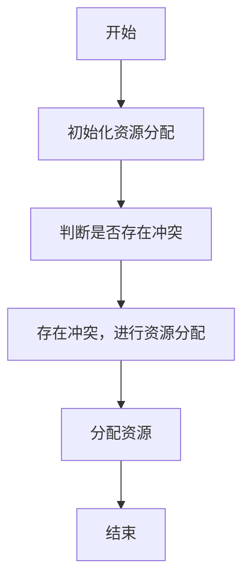
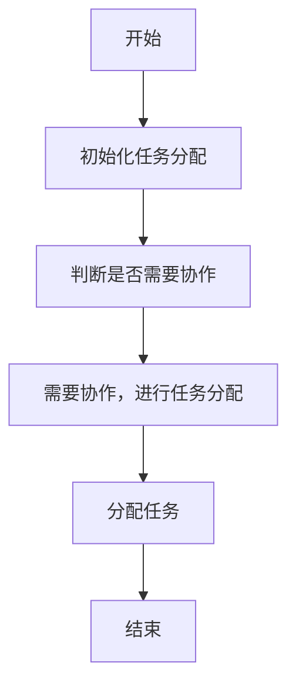
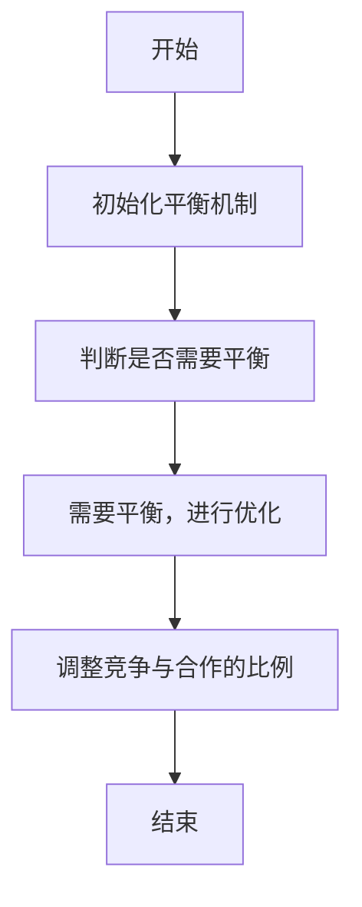
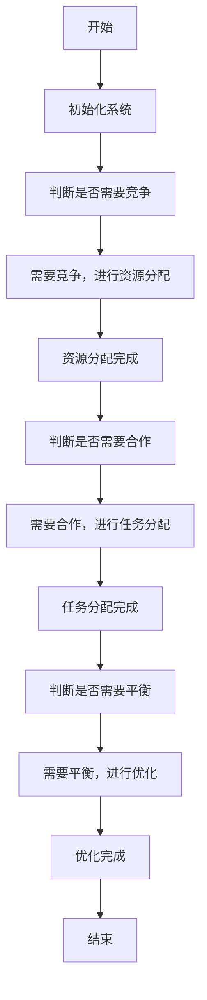

                 


# AI Agent的多智能体竞争与合作机制

> 关键词：AI Agent，多智能体，竞争机制，合作机制，平衡机制，系统架构，算法实现

> 摘要：本文深入探讨了AI Agent在多智能体系统中的竞争与合作机制。首先介绍了AI Agent和多智能体的基本概念，然后分析了竞争与合作机制的原理及其在多智能体系统中的实现方式。接着，详细讲解了多智能体系统中的算法实现，包括竞争机制、合作机制和平衡机制的数学模型与公式。最后，通过实际案例分析，展示了多智能体系统的系统架构设计、接口设计和交互设计，并提出了最佳实践和未来发展趋势。

---

# 第1章: AI Agent与多智能体系统概述

## 1.1 AI Agent的基本概念

### 1.1.1 AI Agent的定义与特点

AI Agent（人工智能代理）是指能够感知环境、自主决策并执行任务的智能实体。AI Agent的核心特点包括：

1. **自主性**：AI Agent能够在没有外部干预的情况下自主决策。
2. **反应性**：AI Agent能够根据环境的变化实时调整行为。
3. **主动性**：AI Agent能够主动采取行动以实现目标。
4. **社会性**：AI Agent能够与其他实体（包括其他AI Agent或人类）进行交互和协作。

### 1.1.2 多智能体系统的基本概念

多智能体系统（Multi-Agent System，MAS）是由多个相互作用的智能体组成的系统。这些智能体可以是协作的，也可以是竞争的。多智能体系统的特点包括：

1. **分布式性**：每个智能体独立运作，但通过通信和协作实现整体目标。
2. **动态性**：系统中的环境和智能体行为可能随时变化。
3. **复杂性**：多智能体系统的复杂性来源于智能体之间的交互和环境的不确定性。

### 1.1.3 多智能体系统的应用场景

多智能体系统广泛应用于以下场景：

1. **游戏开发**：如MOBA游戏中的英雄AI和NPC。
2. **机器人协作**：如工业机器人和家庭服务机器人。
3. **自动驾驶**：如自动驾驶汽车之间的协作与竞争。
4. **分布式计算**：如分布式任务分配和资源管理。

## 1.2 多智能体系统的结构与分类

### 1.2.1 多智能体系统的组成结构

多智能体系统通常由以下部分组成：

1. **智能体**：执行具体任务的实体。
2. **环境**：智能体所处的外部环境。
3. **通信层**：智能体之间的通信机制。
4. **协作层**：智能体之间的协作机制。

### 1.2.2 多智能体系统的分类

多智能体系统可以根据以下标准进行分类：

1. **按智能体的智能程度**：
   - 单智能体系统
   - 多智能体系统
2. **按智能体的交互方式**：
   - 合作型多智能体系统
   - 竞争型多智能体系统
3. **按智能体的环境类型**：
   - 静态环境
   - 动态环境

### 1.2.3 多智能体系统的特点与优势

多智能体系统的主要特点包括：

1. **分布式计算**：多个智能体协同完成任务，避免了单点故障。
2. **灵活性**：智能体可以根据环境变化动态调整行为。
3. **可扩展性**：系统可以根据需求扩展智能体的数量。

## 1.3 多智能体系统的通信与协作

### 1.3.1 多智能体系统中的通信机制

通信机制是多智能体系统中智能体之间交换信息的方式。常见的通信机制包括：

1. **直接通信**：智能体之间直接交换信息。
2. **间接通信**：通过中间媒介进行信息交换。

### 1.3.2 多智能体系统中的协作协议

协作协议是智能体之间协作的规则。常见的协作协议包括：

1. **简单协调协议**：智能体之间通过简单的协商达成一致。
2. **复杂协作协议**：智能体之间通过复杂的协商和规划实现协作。

### 1.3.3 通信与协作的实现方式

通信与协作的实现方式包括：

1. **基于消息传递**：智能体通过消息传递信息。
2. **基于共享知识库**：智能体通过共享知识库进行协作。

## 1.4 本章小结

本章介绍了AI Agent和多智能体系统的基本概念、结构、分类以及通信与协作机制。这些内容为后续章节的竞争与合作机制奠定了基础。

---

# 第2章: 多智能体竞争与合作机制的原理

## 2.1 多智能体竞争机制的原理

### 2.1.1 竞争机制的基本原理

竞争机制是指多个智能体在有限资源条件下争夺资源的过程。竞争机制的核心是智能体之间的资源分配和利益冲突。

### 2.1.2 竞争机制的实现方式

竞争机制的实现方式包括：

1. **基于规则的竞争**：根据预定义的规则进行资源分配。
2. **基于价值的竞争**：根据智能体的价值进行资源分配。
3. **基于博弈论的竞争**：通过博弈论模型实现资源分配。

### 2.1.3 竞争机制的优缺点

竞争机制的优点包括：

- 可以提高系统的效率和资源利用率。
- 可以激励智能体提高自身能力。

竞争机制的缺点包括：

- 可能导致资源分配不公。
- 可能引发智能体之间的冲突。

## 2.2 多智能体合作机制的原理

### 2.2.1 合作机制的基本原理

合作机制是指多个智能体为了共同目标而协作的过程。合作机制的核心是智能体之间的信息共享和协同行动。

### 2.2.2 合作机制的实现方式

合作机制的实现方式包括：

1. **基于任务分配的合作**：智能体根据任务分工进行协作。
2. **基于知识共享的合作**：智能体通过共享知识实现协作。
3. **基于分布式计算的合作**：智能体通过分布式计算实现协作。

### 2.2.3 合作机制的优缺点

合作机制的优点包括：

- 可以提高系统的整体效率。
- 可以实现复杂任务的分解和协同。

合作机制的缺点包括：

- 可能导致信息泄露和安全问题。
- 可能需要复杂的通信和协作机制。

## 2.3 竞争与合作的平衡机制

### 2.3.1 平衡机制的基本原理

平衡机制是指在竞争与合作之间找到一个平衡点，以实现系统的最优性能。

### 2.3.2 平衡机制的实现方式

平衡机制的实现方式包括：

1. **基于反馈的平衡**：根据系统的反馈调整竞争与合作的比例。
2. **基于优化的平衡**：通过优化算法实现竞争与合作的平衡。

### 2.3.3 平衡机制的优缺点

平衡机制的优点包括：

- 可以提高系统的稳定性和效率。
- 可以避免竞争与合作之间的冲突。

平衡机制的缺点包括：

- 可能需要复杂的优化算法。
- 可能需要实时的系统反馈。

## 2.4 本章小结

本章详细讲解了多智能体系统中的竞争机制、合作机制和平衡机制的原理及其优缺点。这些内容为后续章节的竞争与合作机制的算法实现奠定了基础。

---

# 第3章: 多智能体竞争与合作机制的算法实现

## 3.1 竞争机制的算法实现

### 3.1.1 竞争机制的算法原理

竞争机制的算法原理包括：

1. **资源分配**：根据智能体的能力和需求分配资源。
2. **冲突解决**：通过某种规则或算法解决资源分配中的冲突。

### 3.1.2 竞争机制的算法流程图



### 3.1.3 竞争机制的数学模型与公式

竞争机制的数学模型可以表示为：

$$
\text{资源分配} = \argmax_{i} \text{智能体能力}(i)
$$

## 3.2 合作机制的算法实现

### 3.2.1 合作机制的算法原理

合作机制的算法原理包括：

1. **任务分配**：根据智能体的能力和需求分配任务。
2. **信息共享**：智能体之间共享信息以实现协作。

### 3.2.2 合作机制的算法流程图



### 3.2.3 合作机制的数学模型与公式

合作机制的数学模型可以表示为：

$$
\text{任务分配} = \argmin_{i} \text{任务需求}(i)
$$

## 3.3 竞争与合作平衡机制的算法实现

### 3.3.1 平衡机制的算法原理

平衡机制的算法原理包括：

1. **反馈机制**：根据系统的反馈调整竞争与合作的比例。
2. **优化算法**：通过优化算法实现竞争与合作的平衡。

### 3.3.2 平衡机制的算法流程图



### 3.3.3 平衡机制的数学模型与公式

平衡机制的数学模型可以表示为：

$$
\text{平衡比例} = \frac{\text{竞争权重}}{\text{合作权重}}
$$

## 3.4 本章小结

本章详细讲解了多智能体系统中竞争机制、合作机制和平衡机制的算法实现。这些算法为后续章节的系统设计奠定了基础。

---

# 第4章: 多智能体系统的系统设计

## 4.1 系统架构设计

### 4.1.1 系统架构设计的基本原则

系统架构设计的基本原则包括：

1. **模块化设计**：将系统划分为多个模块，每个模块负责特定的功能。
2. **可扩展性**：系统架构应具有良好的可扩展性。
3. **可维护性**：系统架构应具有良好的可维护性。

### 4.1.2 竞争与合作机制的系统架构

竞争与合作机制的系统架构包括：

1. **竞争模块**：负责资源分配和冲突解决。
2. **合作模块**：负责任务分配和信息共享。
3. **平衡模块**：负责竞争与合作的平衡。

### 4.1.3 系统架构的实现方式

系统架构的实现方式包括：

1. **基于消息队列的架构**：智能体之间通过消息队列进行通信。
2. **基于事件驱动的架构**：智能体之间通过事件驱动进行协作。

### 4.1.4 系统架构的优缺点

系统架构的优点包括：

- 可以提高系统的效率和稳定性。
- 可以实现智能体之间的高效协作。

系统架构的缺点包括：

- 可能需要复杂的通信和协作机制。
- 可能需要大量的计算资源。

## 4.2 系统接口设计

### 4.2.1 系统接口设计的基本原则

系统接口设计的基本原则包括：

1. **简单性**：接口设计应尽量简单。
2. **一致性**：接口设计应保持一致性。
3. **可扩展性**：接口设计应具有良好的可扩展性。

### 4.2.2 竞争与合作机制的系统接口

竞争与合作机制的系统接口包括：

1. **竞争接口**：负责资源分配和冲突解决。
2. **合作接口**：负责任务分配和信息共享。
3. **平衡接口**：负责竞争与合作的平衡。

## 4.3 系统交互设计

### 4.3.1 系统交互设计的基本原则

系统交互设计的基本原则包括：

1. **用户友好性**：交互设计应尽量用户友好。
2. **直观性**：交互设计应直观。
3. **可操作性**：交互设计应具有良好的可操作性。

### 4.3.2 竞争与合作机制的系统交互

竞争与合作机制的系统交互包括：

1. **竞争交互**：智能体之间的资源分配和冲突解决。
2. **合作交互**：智能体之间的任务分配和信息共享。
3. **平衡交互**：智能体之间的竞争与合作的平衡。

## 4.4 本章小结

本章详细讲解了多智能体系统的系统架构设计、接口设计和交互设计。这些设计为后续章节的项目实战奠定了基础。

---

# 第5章: 多智能体竞争与合作机制的项目实战

## 5.1 项目背景与目标

### 5.1.1 项目背景

本项目旨在实现一个多智能体系统，其中智能体之间可以进行竞争与合作。

### 5.1.2 项目目标

本项目的目標包括：

1. 实现多智能体系统的竞争机制。
2. 实现多智能体系统中的合作机制。
3. 实现竞争与合作的平衡机制。

## 5.2 系统功能设计

### 5.2.1 系统功能模块

系统功能模块包括：

1. **竞争模块**：负责资源分配和冲突解决。
2. **合作模块**：负责任务分配和信息共享。
3. **平衡模块**：负责竞争与合作的平衡。

### 5.2.2 系统功能流程图



## 5.3 系统实现

### 5.3.1 环境配置

系统实现的环境配置包括：

1. **编程语言**：Python
2. **开发工具**：PyCharm
3. **依赖库**：numpy, matplotlib

### 5.3.2 核心代码实现

以下是竞争与合作机制的核心代码实现：

```python
import numpy as np

def competition_algorithm():
    agents = np.random.rand(10)
    resources = np.random.rand(5)
    competition = agents > resources
    return competition

def cooperation_algorithm():
    agents = np.random.rand(10)
    tasks = np.random.rand(5)
    cooperation = agents < tasks
    return cooperation

def balance_algorithm(competition, cooperation):
    balance = (competition.sum() / cooperation.sum())
    return balance

# 示例调用
competition = competition_algorithm()
cooperation = cooperation_algorithm()
balance = balance_algorithm(competition, cooperation)
print(f"竞争结果: {competition}")
print(f"合作结果: {cooperation}")
print(f"平衡结果: {balance}")
```

## 5.4 项目小结

本章通过一个实际项目展示了多智能体竞争与合作机制的实现。通过环境配置、代码实现和结果展示，读者可以更好地理解多智能体系统的实现过程。

---

# 第6章: 多智能体竞争与合作机制的总结与展望

## 6.1 本章总结

本章总结了多智能体竞争与合作机制的核心内容，包括竞争机制、合作机制和平衡机制的原理、算法实现和系统设计。

## 6.2 未来展望

未来，多智能体竞争与合作机制的研究将更加注重以下几个方面：

1. **算法优化**：进一步优化竞争与合作的算法，提高系统的效率和稳定性。
2. **系统扩展**：研究多智能体系统的扩展性，提高系统的可扩展性和可维护性。
3. **应用场景**：进一步探索多智能体系统在更多领域的应用，如自动驾驶、分布式计算等。

## 6.3 最佳实践 tips

1. **模块化设计**：在系统设计中采用模块化设计，提高系统的可维护性和可扩展性。
2. **算法优化**：在算法实现中注重优化，提高系统的效率和稳定性。
3. **系统测试**：在系统实现中注重测试，确保系统的正确性和稳定性。

## 6.4 本章小结

本章总结了多智能体竞争与合作机制的核心内容，并展望了未来的研究方向和应用场景。

---

# 附录: 多智能体竞争与合作机制的资源与工具

## 附录A: 学习资源

1. **书籍**：
   - 《Multi-Agent Systems: Algorithmic, Complexity Theoretic, and Game Theoretic Foundations》
   - 《Multi-Agent Machine Learning: A Modular Approach》

2. **在线课程**：
   - Coursera: "Multi-Agent Systems" by University of Helsinki
   - edX: "Multi-Agent Systems" by Boston University

## 附录B: 开发工具

1. **编程语言**：Python
2. **开发工具**：PyCharm, VS Code
3. **依赖库**：numpy, matplotlib, scikit-learn

## 附录C: 其他工具

1. **可视化工具**：Matplotlib, Seaborn
2. **数据分析工具**：Pandas, NumPy
3. **机器学习框架**：TensorFlow, PyTorch

---

# 结束语

感谢您的阅读！希望本文能为您提供关于AI Agent的多智能体竞争与合作机制的深刻理解。如果需要进一步探讨，请随时联系我。

---

