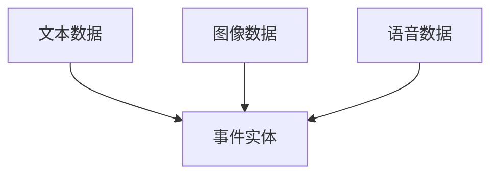
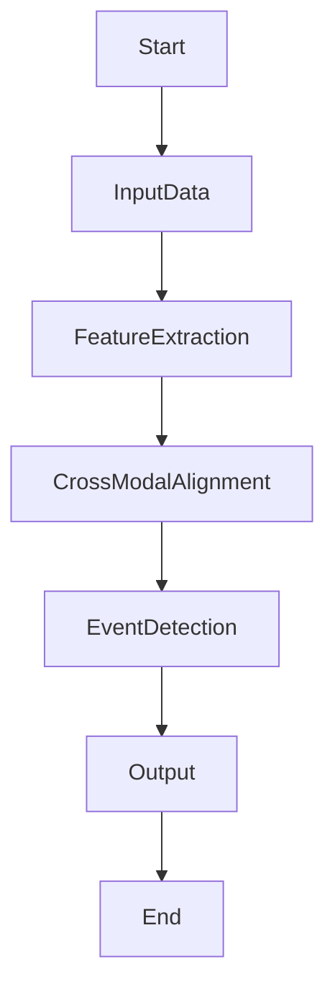
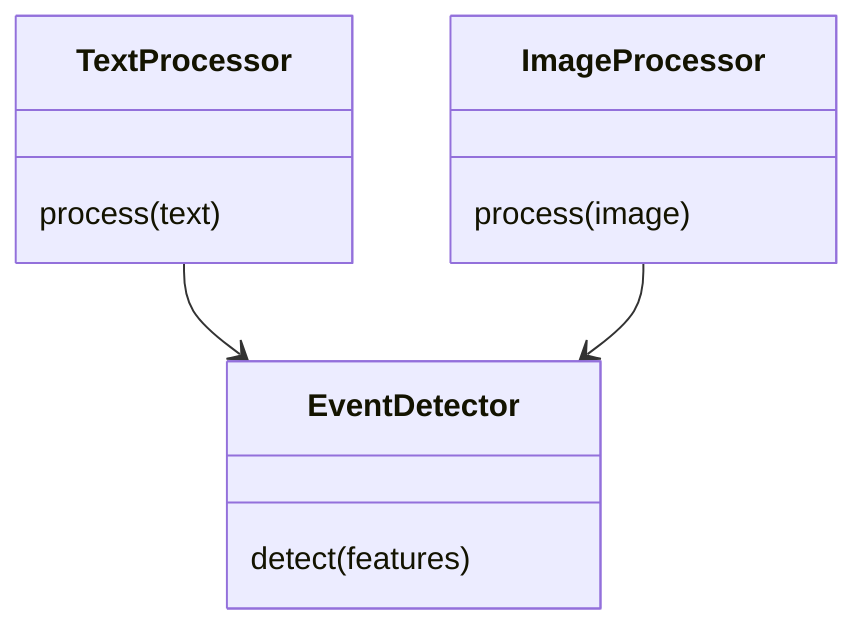
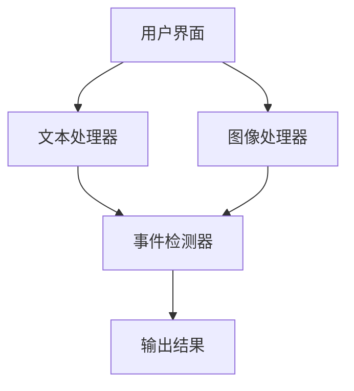

                 


```markdown
# AI Agent的多模态事件抽取技术

> 关键词：AI Agent，多模态事件抽取，自然语言处理，计算机视觉，深度学习

> 摘要：本文深入探讨了AI Agent在多模态事件抽取技术中的应用。通过分析多模态数据的整合、事件抽取算法的原理、系统架构设计以及实际案例，详细阐述了多模态事件抽取的核心概念、技术挑战和解决方案。本文旨在为AI Agent的研究者和开发者提供理论基础和实践指导。

---

## 第1章: 多模态事件抽取技术的背景与挑战

### 1.1 问题背景
多模态事件抽取技术是指从多种数据类型（如文本、图像、语音等）中识别和提取特定事件的技术。随着AI Agent的广泛应用，如何高效地处理和理解多模态数据成为一项重要挑战。

#### 1.1.1 多模态数据的定义与特点
- **多模态数据**：指包含多种数据类型的综合数据，如文本、图像、语音、视频等。
- **特点**：
  - 信息丰富性：多模态数据能够提供更全面的信息。
  - 复杂性：不同数据类型之间的关联性和一致性需要复杂的处理方法。
  - 实时性：多模态数据的处理通常需要实时或近实时的响应。

#### 1.1.2 问题描述
AI Agent需要从多模态数据中提取事件，例如从一段视频和配文文本中提取“一个人在跑步”这一事件。然而，多模态数据的复杂性和异质性使得事件抽取变得具有挑战性。

#### 1.1.3 解决方法
- **数据融合**：将不同数据类型的信息进行融合，提取共同特征。
- **跨模态对齐**：将不同模态的数据对齐到同一语义空间。
- **事件检测**：基于融合后的特征，检测和识别特定事件。

#### 1.1.4 技术边界与外延
- **边界**：事件抽取仅限于特定场景和数据类型，例如从图像和文本中抽取简单事件。
- **外延**：多模态事件抽取技术可以扩展到更复杂场景，例如视频流数据和实时语音识别。

---

## 第2章: 多模态事件抽取的核心概念与联系

### 2.1 核心概念原理
#### 2.1.1 多模态数据的整合方法
- **特征提取**：对文本、图像等数据进行特征提取，例如使用词向量表示文本，使用卷积神经网络提取图像特征。
- **跨模态对齐**：将不同模态的特征对齐，例如通过注意力机制将文本特征与图像特征对齐。

#### 2.1.2 事件抽取的模型框架
- **端到端模型**：直接从多模态输入到事件输出的模型，例如基于Transformer的多模态模型。
- **分阶段模型**：先分别处理每种模态，再进行跨模态融合。

#### 2.1.3 AI Agent的事件理解机制
- **上下文理解**：AI Agent需要理解事件发生的上下文，例如时间、地点、人物等。
- **语义推理**：通过推理不同模态数据之间的语义关系，准确识别事件。

### 2.2 核心概念对比表
| 概念 | 特征 |
|------|------|
| 单模态数据 | 单一数据类型，信息有限 |
| 多模态数据 | 多种数据类型，信息丰富 |
| 事件抽取 | 从数据中识别出特定事件 |
| 跨模态对齐 | 将不同数据类型的特征对齐到同一语义空间 |

### 2.3 ER实体关系图


---

## 第3章: 多模态事件抽取的算法原理

### 3.1 多模态融合模型

#### 3.1.1 模型输入与输出
- **输入**：多模态数据，例如文本和图像。
- **输出**：提取的事件信息，例如“一个人在跑步”。

#### 3.1.2 多模态特征提取
- **文本特征提取**：使用BERT模型提取文本特征。
- **图像特征提取**：使用ResNet模型提取图像特征。

#### 3.1.3 跨模态对齐技术
- **注意力机制**：通过注意力机制将文本和图像特征对齐。

### 3.2 多模态事件抽取算法流程图


### 3.3 算法实现代码示例
```python
import torch
import torch.nn as nn
from transformers import BertTokenizer, BertModel
import torch.nn.functional as F

class MultiModalEventExtractor:
    def __init__(self):
        self.text_model = BertModel.from_pretrained('bert-base-uncased')
        self.image_model = ResNet()

    def extract_event(self, text, image):
        # 提取文本特征
        text_features = self.text_model(text)
        
        # 提取图像特征
        image_features = self.image_model(image)
        
        # 跨模态对齐
        aligned_features = self.align_modalities(text_features, image_features)
        
        # 事件检测
        event = self.detect_event(aligned_features)
        return event

    def align_modalities(self, text_features, image_features):
        # 使用注意力机制对齐特征
        attention = F.softmax(torch.matmul(text_features, image_features.T), dim=-1)
        aligned_features = torch.sum(text_features.unsqueeze(1) * attention.unsqueeze(2), dim=1)
        return aligned_features

    def detect_event(self, aligned_features):
        # 使用分类器检测事件
        event_logits = self.text_model(aligned_features)
        event = F.softmax(event_logits, dim=-1)
        return event
```

### 3.4 数学模型与公式
#### 3.4.1 特征提取公式
$$ f(x) = Wx + b $$

#### 3.4.2 跨模态对齐公式
$$ y = \text{softmax}(xW) $$

---

## 第4章: 系统分析与架构设计

### 4.1 系统工作流程
1. **数据输入**：接收多模态数据，例如文本和图像。
2. **特征提取**：分别对文本和图像进行特征提取。
3. **跨模态对齐**：将文本和图像特征对齐到同一语义空间。
4. **事件检测**：基于对齐后的特征，检测并识别事件。
5. **结果输出**：输出提取的事件信息。

### 4.2 系统架构设计

#### 4.2.1 领域模型


#### 4.2.2 系统架构图


---

## 第5章: 项目实战

### 5.1 环境配置
```bash
pip install transformers torch torchvision
```

### 5.2 系统核心实现源代码
```python
import torch
from transformers import BertTokenizer, BertModel
import torch.nn as nn

class TextProcessor:
    def __init__(self):
        self.tokenizer = BertTokenizer.from_pretrained('bert-base-uncased')
        self.model = BertModel.from_pretrained('bert-base-uncased')

    def process(self, text):
        inputs = self.tokenizer(text, return_tensors='pt')
        outputs = self.model(**inputs)
        return outputs.last_hidden_state

class ImageProcessor:
    def __init__(self):
        self.model = ResNet()

    def process(self, image):
        features = self.model(image)
        return features

class EventDetector:
    def __init__(self):
        self.classifier = nn.Linear(100, 1)

    def detect(self, text_features, image_features):
        features = torch.cat((text_features, image_features), dim=-1)
        outputs = self.classifier(features)
        return F.softmax(outputs, dim=-1)
```

### 5.3 实际案例分析
假设我们有一个视频和配文文本：
- **文本**："一个人在公园跑步。"
- **图像**：一张公园中有人跑步的图片。

通过上述系统，我们可以提取出事件“一个人在跑步”。

---

## 第6章: 总结与展望

### 6.1 最佳实践 tips
- **数据质量**：确保输入数据的质量，例如清晰的图像和准确的文本。
- **模型调优**：通过实验调优模型参数，提高事件抽取的准确率。
- **实时性优化**：优化算法复杂度，提高处理速度。

### 6.2 小结
本文详细探讨了AI Agent在多模态事件抽取技术中的应用，从背景、核心概念、算法原理到系统设计和实际案例，全面分析了多模态事件抽取的关键技术。

### 6.3 注意事项
- 多模态事件抽取需要处理数据异质性问题。
- 注意模型的可解释性和鲁棒性。

### 6.4 拓展阅读
- 《Multi-modal Event Detection in Social Media》
- 《Deep Learning for Multi-modal Data Analysis》

---

## 参考文献
[1] BERT: Pre-training of Deep Bidirectional Transformers for Natural Language Processing.
[2] ResNet: Deep Convolutional Neural Networks for Redetecting.
[3] Multi-modal Learning with Deep Neural Networks.

---

以上是《AI Agent的多模态事件抽取技术》的技术博客文章，希望对您有所帮助！
```

