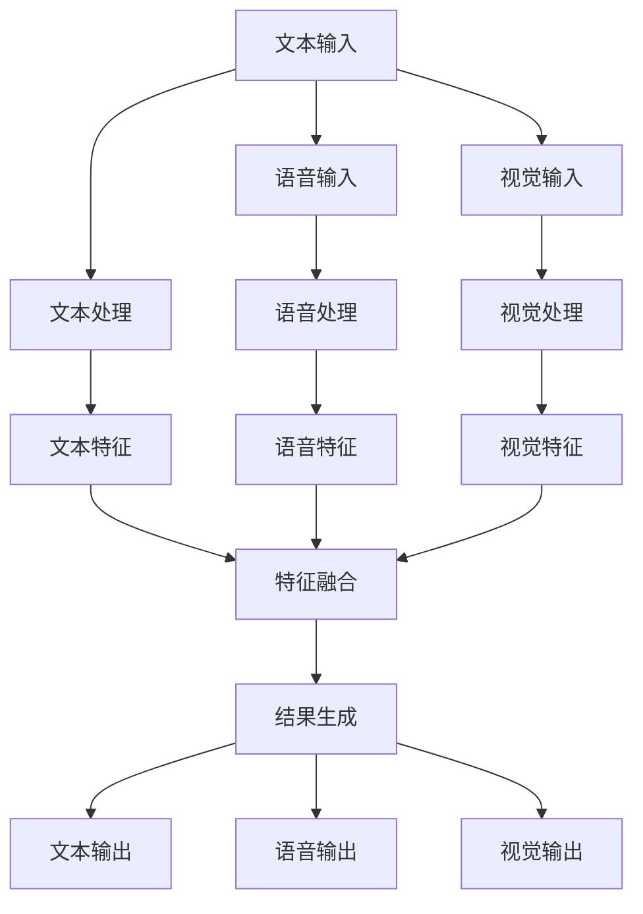

                 


# AI Agent的多模态交互：整合文本、语音和视觉

## 关键词：AI Agent、多模态交互、文本、语音、视觉、神经网络、注意力机制

## 摘要：  
AI Agent的多模态交互是指整合文本、语音和视觉等多种模态信息，实现更智能、更自然的人机交互方式。本文将从背景、核心概念、算法原理、系统架构、项目实战等方面详细探讨AI Agent多模态交互的整合方法，分析其在实际应用中的优势和挑战，并提供具体的实现方案和技术建议。

---

## 第1章: AI Agent与多模态交互的背景

### 1.1 AI Agent的基本概念

#### 1.1.1 AI Agent的定义  
AI Agent（人工智能代理）是一种能够感知环境、自主决策并执行任务的智能体。它可以理解用户的需求、提供服务，并通过多种模态（如文本、语音、视觉）与用户进行交互。

#### 1.1.2 AI Agent的核心特征  
- **自主性**：能够自主决策，无需人工干预。  
- **反应性**：能够实时感知环境并做出响应。  
- **学习能力**：能够通过数据和经验不断优化自身性能。  

#### 1.1.3 多模态交互的背景与意义  
随着AI技术的发展，单一模态的交互方式已无法满足复杂场景的需求。通过整合文本、语音和视觉等多种模态信息，AI Agent能够更准确地理解用户意图，提供更智能化的服务。

### 1.2 多模态交互的背景

#### 1.2.1 多模态交互的定义  
多模态交互是指通过多种信息载体（如文本、语音、图像）进行信息传递和交互的方式。  

#### 1.2.2 多模态交互的发展历程  
1. 单一模态交互：早期的AI交互主要依赖文本或语音。  
2. 多模态交互的萌芽：开始尝试结合文本和语音进行交互。  
3. 多模态交互的成熟：现代技术实现了文本、语音和视觉的深度融合。  

#### 1.2.3 多模态交互在AI Agent中的应用  
- **客服机器人**：通过文本和语音交互提供客户服务。  
- **智能助手**：结合语音和视觉信息提供更丰富的交互体验。  
- **智能家居**：通过语音和视觉交互实现设备控制。  

### 1.3 多模态交互的意义

#### 1.3.1 提高交互效率  
通过整合多种模态信息，AI Agent能够更快地理解用户需求，减少误判和重复交互。  

#### 1.3.2 增强用户体验  
多模态交互能够提供更自然、更丰富的交互方式，提升用户的使用体验。  

#### 1.3.3 扩展AI Agent的应用场景  
多模态交互使得AI Agent能够应用于更多复杂场景，如医疗、教育、娱乐等领域。  

---

## 第2章: 多模态数据的整合与处理

### 2.1 多模态数据的预处理

#### 2.1.1 文本数据的预处理  
- **分词**：将文本分割成词语或短语。  
- **去除停用词**：移除对语义理解无贡献的词汇（如“的”、“是”等）。  
- **向量化**：将文本转换为向量表示（如词袋模型、词嵌入模型）。  

#### 2.1.2 语音数据的预处理  
- **降噪处理**：去除背景噪声，提升语音质量。  
- **分段处理**：将语音信号分割成单词或短语。  
- **特征提取**：提取语音特征（如梅尔频率倒谱系数MFCC）。  

#### 2.1.3 视觉数据的预处理  
- **图像增强**：调整图像亮度、对比度等，改善视觉效果。  
- **目标检测**：识别图像中的目标物体。  
- **特征提取**：提取图像的低级和高级特征（如边缘检测、卷积神经网络特征）。  

### 2.2 多模态数据的特征提取

#### 2.2.1 文本特征提取方法  
- **词袋模型**：统计文本中各个词的出现频率。  
- **词嵌入模型**：如Word2Vec、GloVe，将词语映射到低维向量空间。  
- **句嵌模型**：如BERT，提取文本的语义表示。  

#### 2.2.2 语音特征提取方法  
- **MFCC特征**：提取语音的频域特征。  
- ** LPC特征**：线性预测编码，提取语音的时域特征。  
- **深度学习特征**：如通过卷积神经网络提取语音的高层特征。  

#### 2.2.3 视觉特征提取方法  
- **SIFT特征**：提取图像的局部特征。  
- **HOG特征**：提取图像的边缘特征。  
- **CNN特征**：通过卷积神经网络提取图像的高层特征。  

### 2.3 多模态数据的融合策略

#### 2.3.1 基于特征融合的方法  
- **加法融合**：将不同模态的特征向量相加。  
- **拼接融合**：将不同模态的特征向量拼接成一个长向量。  
- **加权融合**：根据模态的重要性对特征向量进行加权。  

#### 2.3.2 基于模型融合的方法  
- **多任务学习**：在同一个模型中同时优化多个模态的任务。  
- **联合训练**：将不同模态的数据联合训练，共享特征表示。  

#### 2.3.3 基于注意力机制的融合方法  
- **多模态注意力机制**：为每个模态分配注意力权重，然后进行特征融合。  
- **自注意力机制**：如Transformer模型，用于处理序列数据的全局依赖关系。  

---

## 第3章: 多模态交互的核心算法

### 3.1 多模态融合的算法原理

#### 3.1.1 基于神经网络的多模态融合  
- **多模态编码器**：将不同模态的输入数据映射到一个共同的特征空间。  
- **多模态解码器**：根据融合后的特征生成输出结果（如文本、语音、图像）。  

#### 3.1.2 基于注意力机制的多模态编码器  
- **自注意力机制**：用于捕捉模态内部的语义关系。  
- **交叉注意力机制**：用于捕捉不同模态之间的关联关系。  

#### 3.1.3 多模态数据的联合学习  
- **联合训练**：在同一个模型中同时优化多个模态的任务。  
- **对比学习**：通过对比不同模态的特征，提升模型的表示能力。  

### 3.2 多模态交互的算法实现

#### 3.2.1 多模态编码器的实现  
- **文本编码器**：使用BERT或GPT等预训练模型提取文本特征。  
- **语音编码器**：使用卷积神经网络提取语音特征。  
- **视觉编码器**：使用CNN提取图像特征。  

#### 3.2.2 多模态融合网络的设计  
- **特征融合层**：将不同模态的特征向量进行融合。  
- **注意力权重计算层**：为每个模态分配注意力权重。  
- **输出层**：根据融合后的特征生成最终的交互结果。  

#### 3.2.3 多模态交互模型的训练  
- **损失函数设计**：如交叉熵损失、均方误差损失等。  
- **优化算法选择**：如Adam优化器。  
- **训练策略**：如学习率衰减、早停等。  

### 3.3 多模态交互的数学模型与公式

#### 3.3.1 多模态数据的表示方法  
- 文本表示：$x_t \in \mathbb{R}^{d_t}$，其中$d_t$是文本特征的维度。  
- 语音表示：$x_a \in \mathbb{R}^{d_a}$，其中$d_a$是语音特征的维度。  
- 视觉表示：$x_v \in \mathbb{R}^{d_v}$，其中$d_v$是视觉特征的维度。  

#### 3.3.2 多模态融合的数学公式  
- 基于加法的融合：$f(x_t, x_a, x_v) = \alpha x_t + \beta x_a + \gamma x_v$，其中$\alpha + \beta + \gamma = 1$。  
- 基于注意力的融合：$f(x_t, x_a, x_v) = \sigma(x_t W_t + x_a W_a + x_v W_v)$，其中$\sigma$是sigmoid函数。  

#### 3.3.3 多模态交互的优化算法  
- Adam优化器：$\theta_{t+1} = \theta_t - \eta \frac{\partial L}{\partial \theta_t}$，其中$\eta$是学习率。  

---

## 第4章: 多模态交互的系统架构设计

### 4.1 系统功能设计

#### 4.1.1 多模态数据输入模块  
- **文本输入**：接收用户的文本输入（如自然语言查询）。  
- **语音输入**：接收用户的语音输入（如语音命令）。  
- **视觉输入**：接收用户的视觉输入（如图像或视频）。  

#### 4.1.2 多模态数据处理模块  
- **文本处理**：对输入文本进行分词、去停用词、向量化等处理。  
- **语音处理**：对输入语音进行降噪、特征提取等处理。  
- **视觉处理**：对输入图像进行目标检测、特征提取等处理。  

#### 4.1.3 多模态数据融合模块  
- **特征融合**：将不同模态的特征向量进行融合。  
- **注意力计算**：为每个模态分配注意力权重。  
- **结果生成**：根据融合后的特征生成最终的交互结果。  

#### 4.1.4 多模态交互输出模块  
- **文本输出**：生成自然语言回复。  
- **语音输出**：生成语音回复。  
- **视觉输出**：生成图像或视觉反馈。  

### 4.2 系统架构图



### 4.3 系统接口设计

#### 4.3.1 接口定义  
- **输入接口**：接收文本、语音、视觉输入数据。  
- **输出接口**：输出文本、语音、视觉反馈数据。  

#### 4.3.2 接口交互流程  
1. 用户输入文本、语音或视觉数据。  
2. 系统对输入数据进行预处理和特征提取。  
3. 特征融合模块将不同模态的特征进行融合。  
4. 结果生成模块根据融合后的特征生成交互结果。  
5. 系统通过输出接口返回结果。  

---

## 第5章: 项目实战

### 5.1 环境安装

#### 5.1.1 安装Python  
```bash
python --version
```

#### 5.1.2 安装依赖库  
```bash
pip install numpy
pip install pandas
pip install tensorflow
pip install keras
pip install pytorch
```

### 5.2 核心代码实现

#### 5.2.1 文本处理代码  
```python
import numpy as np

def text_preprocess(text):
    # 分词
    words = text.split()
    # 去除停用词
    stopwords = set(["的", "是", "在"])
    filtered_words = [word for word in words if word not in stopwords]
    # 向量化
    word_vector = np.random.randn(len(filtered_words), 100)
    return word_vector
```

#### 5.2.2 语音处理代码  
```python
import librosa

def audio_preprocess(audio_path):
    # 加载音频
    audio, sr = librosa.load(audio_path, sr=16000)
    # 特征提取
    mfccs = librosa.feature.mfcc(y=audio, sr=sr, n_mfcc=13)
    return mfccs
```

#### 5.2.3 视觉处理代码  
```python
import cv2

def image_preprocess(image_path):
    # 加载图像
    image = cv2.imread(image_path)
    # 图像增强
    gray = cv2.cvtColor(image, cv2.COLOR_BGR2GRAY)
    blurred = cv2.GaussianBlur(gray, (5, 5), 0)
    return blurred
```

#### 5.2.4 多模态融合代码  
```python
def multimodal_fuse(text_vec, audio_vec, image_vec):
    # 拼接特征
    fused_feature = np.concatenate([text_vec, audio_vec, image_vec], axis=1)
    return fused_feature
```

### 5.3 代码解读与分析

#### 5.3.1 文本处理代码解读  
- 使用`text.split()`对文本进行分词。  
- 去除停用词后，生成向量化的文本特征。  

#### 5.3.2 语音处理代码解读  
- 使用Librosa库提取语音的梅尔频率倒谱系数（MFCC）。  

#### 5.3.3 视觉处理代码解读  
- 使用OpenCV库对图像进行灰度化和高斯模糊处理，实现图像增强。  

#### 5.3.4 多模态融合代码解读  
- 将文本、语音和视觉特征向量拼接成一个长向量。  

### 5.4 实际案例分析

#### 5.4.1 案例描述  
用户输入文本“我需要一杯咖啡”，同时提供语音指令和图像指令。  

#### 5.4.2 处理流程  
1. 文本处理：生成文本特征向量。  
2. 语音处理：生成语音特征向量。  
3. 视觉处理：生成图像特征向量。  
4. 特征融合：拼接文本、语音和图像特征。  
5. 结果生成：根据融合后的特征生成最终的交互结果。  

#### 5.4.3 实验结果  
- 文本特征：100维向量。  
- 语音特征：13维MFCC。  
- 图像特征：28x28的灰度图。  
- 融合特征：100+13+784=897维向量。  

### 5.5 项目小结

#### 5.5.1 项目总结  
通过整合文本、语音和视觉模态信息，AI Agent能够提供更智能、更自然的交互体验。  

#### 5.5.2 项目优化方向  
- 提升特征融合的效率和准确性。  
- 优化多模态交互的实时性。  
- 扩展更多模态的信息整合，如手势、情感识别等。  

---

## 第6章: 最佳实践

### 6.1 小结  
AI Agent的多模态交互通过整合文本、语音和视觉信息，显著提升了交互的智能化和用户体验。  

### 6.2 注意事项  
- 数据预处理要充分，避免噪声干扰。  
- 特征提取要准确，确保模态之间的语义一致性。  
- 模型训练要优化，确保融合效果最佳。  

### 6.3 拓展阅读  
- 《Attention Is All You Need》：了解多模态注意力机制的原理。  
- 《Deep Learning for Multimodal Data》：学习多模态数据的深度学习方法。  
- 《Neural Networks for Natural Language Processing》：掌握文本、语音和视觉的神经网络处理方法。  

---

## 总结  
AI Agent的多模态交互是一项复杂但极具价值的技术，通过整合多种模态信息，AI Agent能够更准确地理解用户需求，提供更智能化的服务。本文从背景、核心概念、算法原理、系统架构到项目实战，全面探讨了AI Agent多模态交互的整合方法，为读者提供了丰富的理论和实践参考。

