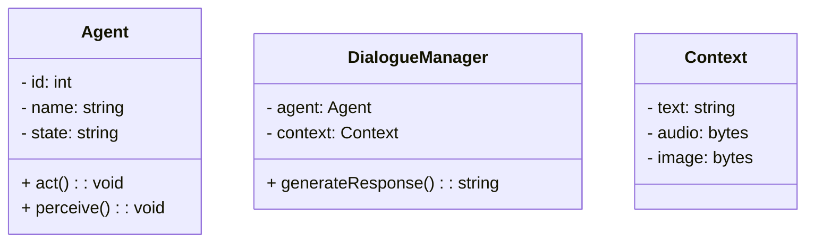
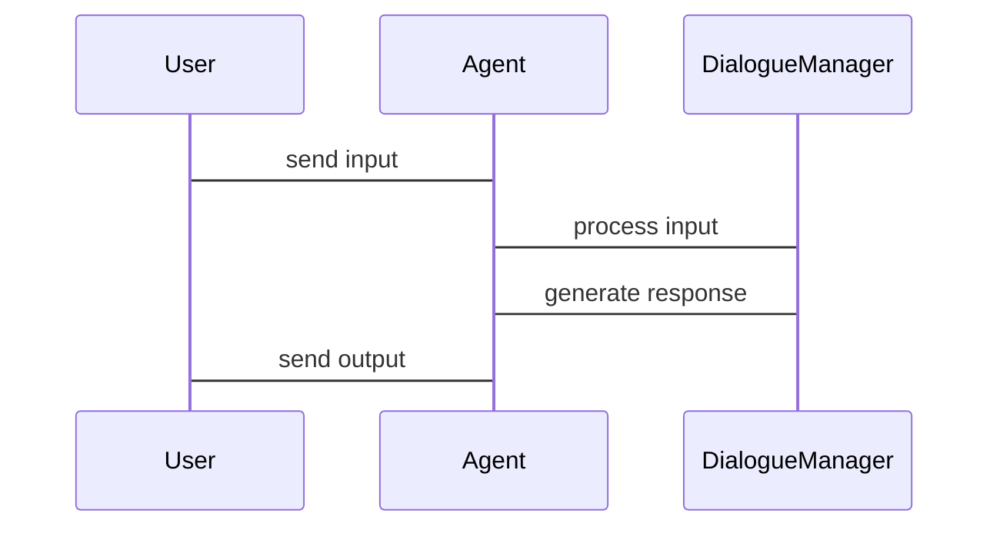

                 


# AI Agent的多模态对话生成能力开发

## 关键词
AI Agent, 多模态对话生成, 生成式模型, 系统架构设计, 项目实战

## 摘要
随着人工智能技术的快速发展，AI Agent在多模态对话生成领域的应用日益广泛。本文将详细探讨AI Agent的多模态对话生成能力开发的关键点，涵盖核心概念、算法原理、系统架构设计以及项目实战等内容，帮助读者全面理解并掌握这一技术。

---

## 第1章: AI Agent与多模态对话生成概述

### 1.1 AI Agent的基本概念
AI Agent（智能体）是指在计算机系统中，能够感知环境并采取行动以实现目标的实体。它具备自主性、反应性、社会性、持续性和学习性等特性。

#### 1.1.1 AI Agent的定义与特点
- **自主性**：AI Agent能够在没有外部干预的情况下自主决策。
- **反应性**：能够实时感知环境变化并做出反应。
- **社会性**：能够与其他Agent或人类进行交互和协作。
- **持续性**：能够持续运行并适应环境变化。
- **学习性**：具备从经验中学习和改进的能力。

#### 1.1.2 多模态对话生成的背景与意义
多模态对话生成是指在对话过程中，AI Agent能够结合文本、语音、图像等多种模态信息，生成更加自然、丰富的对话内容。这种能力在智能客服、虚拟助手、教育机器人等领域具有重要意义。

#### 1.1.3 本章小结
本章介绍了AI Agent的基本概念及其在多模态对话生成中的应用背景，为后续内容奠定了基础。

---

### 1.2 多模态对话生成的核心概念
多模态对话生成涉及多个模态数据的整合与分析，旨在提高对话的准确性和用户体验。

#### 1.2.1 多模态数据的定义与类型
- **文本**：包括自然语言文本，如对话中的文字内容。
- **语音**：包括语音信号和音调信息，用于情感分析和语气识别。
- **图像**：包括视觉信息，如用户提供的图片或视频。

#### 1.2.2 对话生成的挑战与目标
- **挑战**：多模态数据的整合与协调、对话生成的实时性和准确性。
- **目标**：生成自然、连贯且符合上下文的对话内容，提升用户体验。

#### 1.2.3 本章小结
本章详细介绍了多模态对话生成的核心概念，为后续技术实现提供了理论基础。

---

## 第2章: 多模态对话生成的核心概念与联系

### 2.1 多模态数据的整合与分析
#### 2.1.1 文本、语音、图像的特征对比
| 特性 | 文本 | 语音 | 图像 |
|------|------|------|------|
| 信息类型 | 文字内容 | 音调、语速 | 图像内容 |
| 处理方式 | 文本处理 | 语音信号处理 | 图像识别 |
| 应用场景 | 对话内容生成 | 情感分析 | 图像描述生成 |

#### 2.1.2 多模态数据的融合方法
多模态数据的融合方法包括特征级融合、决策级融合和语义级融合。特征级融合将不同模态的特征向量进行线性组合，决策级融合结合各个模态的决策结果，语义级融合则通过语义理解将不同模态的信息进行整合。

#### 2.1.3 ER实体关系图架构
以下是多模态对话生成的ER实体关系图：

```mermaid
er
actor(Agent)
     many-to-many
     role-plays
     entity(Dialogue)
     entity(User)
     entity(Context)
```

---

### 2.2 多模态对话生成的原理
#### 2.2.1 对话生成的基本流程
对话生成的基本流程包括数据预处理、特征提取、模型训练和模型推理。

#### 2.2.2 多模态信息的交互机制
多模态信息的交互机制通过注意力机制和门控机制实现不同模态信息的权重分配和信息融合。

#### 2.2.3 本章小结
本章详细探讨了多模态数据的整合与分析方法，以及对话生成的基本原理。

---

## 第3章: 多模态对话生成的算法原理

### 3.1 基于生成式模型的对话生成
#### 3.1.1 Transformer模型的原理
Transformer模型通过自注意力机制实现全局上下文的捕捉，适用于长文本的生成任务。

#### 3.1.2 扩散模型的应用
扩散模型通过逐步生成图像或文本的细节，实现高质量的生成效果。

#### 3.1.3 深度学习算法的数学模型
以下是Transformer模型的注意力机制公式：

$$
\text{Attention}(Q, K, V) = \text{softmax}\left(\frac{QK^T}{\sqrt{d_k}}\right)V
$$

其中，$Q$、$K$、$V$分别是查询、键和值向量，$d_k$是键的维度。

### 3.2 多模态对话生成的实现流程
#### 3.2.1 数据预处理与特征提取
数据预处理包括文本清洗、语音信号的特征提取和图像的特征提取。

#### 3.2.2 模型训练与优化
模型训练采用端到端的训练方式，通过反向传播算法优化模型参数。

#### 3.2.3 模型推理与结果分析
模型推理通过生成策略生成对话内容，并通过困惑度等指标评估生成结果的质量。

---

## 第4章: 多模态对话生成的数学模型与公式

### 4.1 生成式模型的数学基础
#### 4.1.1 Transformer的注意力机制
注意力机制的计算公式为：

$$
\text{Attention}(Q, K, V) = \text{softmax}\left(\frac{QK^T}{\sqrt{d_k}}\right)V
$$

#### 4.1.2 激活函数的作用与选择
常用的激活函数包括ReLU、Sigmoid和Tanh，其中ReLU在大多数情况下表现最佳。

#### 4.1.3 损失函数的计算与优化
交叉熵损失函数的计算公式为：

$$
\mathcal{L} = -\sum_{i=1}^{N} y_i \log(p(y_i))
$$

---

### 4.2 多模态融合的数学模型
#### 4.2.1 模态融合的线性组合
多模态融合的线性组合公式为：

$$
f(x) = \sum_{i=1}^{n} w_i x_i
$$

其中，$w_i$是模态$i$的权重，$x_i$是模态$i$的特征向量。

#### 4.2.2 模态权重的自适应调整
模态权重的自适应调整通过门控机制实现，公式为：

$$
w_i = \sigma(x_i W + b)
$$

其中，$\sigma$是sigmoid函数，$W$和$b$是模型参数。

---

## 第5章: 多模态对话生成系统的架构设计

### 5.1 系统功能设计
#### 5.1.1 领域模型的设计与实现
领域模型包括对话管理、自然语言理解和生成模块。

#### 5.1.2 对话生成模块的功能划分
对话生成模块包括文本生成、语音合成和图像生成功能。

#### 5.1.3 系统交互流程的优化
系统交互流程包括用户输入、多模态数据处理和生成结果输出。

### 5.2 系统架构设计
#### 5.2.1 分层架构的实现
分层架构包括数据层、业务逻辑层和表现层。

#### 5.2.2 系统架构的类图设计
以下是系统架构的类图设计：



#### 5.2.3 系统交互的序列图
以下是系统交互的序列图：



---

## 第6章: 项目实战

### 6.1 环境安装与配置
安装必要的依赖库，如TensorFlow、PyTorch和一些NLP库。

### 6.2 系统核心实现
#### 6.2.1 数据预处理代码
```python
import numpy as np
import tensorflow as tf

def preprocess_data(data):
    # 文本处理
    text_data = data['text']
    # 语音处理
    audio_data = data['audio']
    # 图像处理
    image_data = data['image']
    return text_data, audio_data, image_data
```

#### 6.2.2 模型训练代码
```python
def train_model():
    # 模型定义
    model = build_model()
    # 模型训练
    model.fit(train_data, epochs=10, batch_size=32)
    # 模型保存
    model.save('dialogue_generator.h5')
```

#### 6.2.3 模型推理代码
```python
def generate_response():
    model = load_model('dialogue_generator.h5')
    response = model.predict(input_data)
    return response
```

### 6.3 案例分析与代码解读
通过实际案例分析，解读代码实现和模型优化方法。

### 6.4 项目总结
总结项目实现的经验和教训，提出改进建议。

---

## 第7章: 最佳实践与总结

### 7.1 小结
本章总结了多模态对话生成的关键技术和发展趋势。

### 7.2 注意事项
在开发过程中，需要注意模型的训练效率和生成结果的准确性。

### 7.3 拓展阅读
推荐一些相关的技术书籍和论文，供读者进一步学习。

---

## 附录: 常见问题解答
- **Q1**：如何处理多模态数据的异构性？
- **A1**：通过特征提取和模态融合技术，将不同模态的数据转换为同一空间进行处理。

- **Q2**：如何提高对话生成的准确率？
- **A2**：通过增加训练数据量、优化模型结构和引入外部知识库等方法提高生成准确率。

---

通过以上内容，读者可以全面了解AI Agent的多模态对话生成能力开发的关键点，并掌握相关技术的实现方法。

