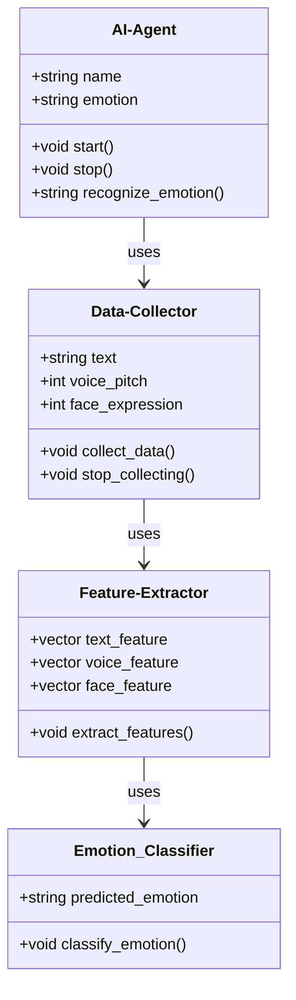
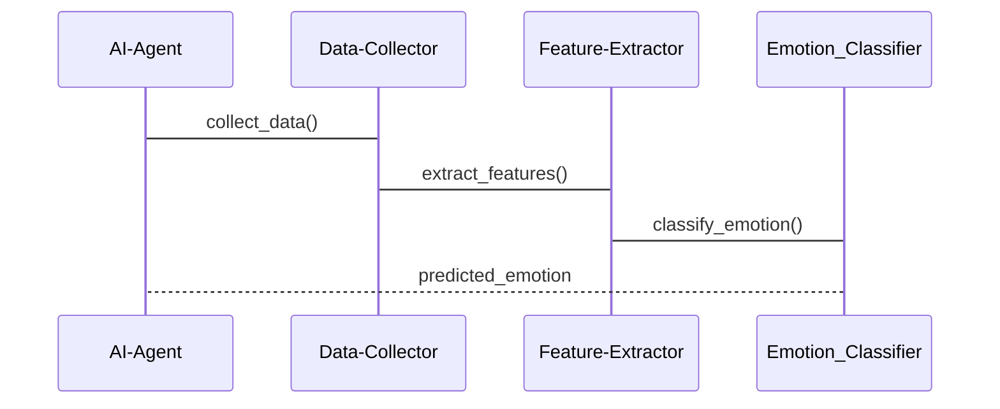

                 


# AI Agent的多模态情感识别技术

## 关键词：
- AI Agent
- 多模态情感识别
- 深度学习
- 情感计算
- 多模态数据融合

## 摘要：
本文深入探讨了AI Agent在多模态情感识别技术中的应用，分析了多模态数据的特征提取、情感分类算法的实现原理，以及系统架构设计。通过结合文本、语音、图像等多种数据模态，本文提出了一种基于深度学习的多模态情感识别方法，能够有效提升情感识别的准确性和鲁棒性。本文还通过实际案例分析，展示了该技术在智能客服、虚拟助手等场景中的应用潜力。

---

# 第一部分: 多模态情感识别技术的背景与应用

## 第1章: 多模态情感识别技术的背景与应用

### 1.1 情感识别技术的背景

#### 1.1.1 情感计算的基本概念
情感计算（Affective Computing）是研究如何通过计算机技术来识别、理解和模拟人类情感的一门新兴学科。其核心目标是让计算机能够像人类一样感知和处理情感信息。情感计算的研究范围包括面部表情、语音语调、文本情感等方面。

#### 1.1.2 多模态数据的定义与特点
多模态数据是指来自不同感官渠道的数据，例如文本、语音、图像、视频等。相比于单一模态数据，多模态数据能够提供更全面的信息，从而更准确地反映人类的情感状态。多模态数据的特点包括：
- **互补性**：不同模态的数据可以互相补充，提供更丰富的信息。
- **鲁棒性**：通过多模态数据的融合，可以降低单一模态数据的局限性。
- **复杂性**：多模态数据的处理需要复杂的融合算法。

#### 1.1.3 情感识别技术的演进历程
情感识别技术经历了从单一模态到多模态的发展过程：
1. **单一模态阶段**：早期的情感识别主要基于文本或语音单一模态数据，识别准确率有限。
2. **多模态融合阶段**：随着技术的发展，研究者开始尝试将文本、语音、图像等多种模态数据进行融合，以提高识别准确率。
3. **深度学习阶段**：近年来，深度学习技术的引入，使得情感识别技术取得了显著进展，尤其是在多模态数据的处理方面。

### 1.2 AI Agent与情感识别的结合

#### 1.2.1 AI Agent的基本概念
AI Agent（智能体）是一种能够感知环境并采取行动以实现目标的实体。它可以是一个软件程序，也可以是一个物理设备。AI Agent的核心能力包括感知、决策、执行和学习。

#### 1.2.2 情感识别在AI Agent中的作用
情感识别是AI Agent实现人机交互的重要组成部分。通过情感识别技术，AI Agent能够更好地理解用户的情感状态，从而提供更加个性化的服务。例如，在智能客服系统中，AI Agent可以通过情感识别判断用户的满意度，并根据结果调整响应策略。

#### 1.2.3 多模态情感识别的优势
多模态情感识别通过结合多种数据模态，能够更准确地识别用户的情感状态。例如，结合文本和语音模态数据，可以通过语调和语气进一步判断用户的情感倾向。

### 1.3 应用场景与挑战

#### 1.3.1 多模态情感识别的主要应用场景
- **智能客服**：通过分析用户的语音和文本，判断用户的情感状态，提供更加个性化的服务。
- **虚拟助手**：通过分析用户的语音、表情和行为，提供更加智能的交互体验。
- **教育领域**：通过分析学生的语音和表情，判断其情感状态，提供个性化的教学方案。

#### 1.3.2 技术实现中的主要挑战
- **数据获取难度**：多模态数据的获取需要综合考虑多种因素，例如数据采集设备的限制。
- **数据融合问题**：如何有效地融合多种模态数据，是一个复杂的技术挑战。
- **模型训练难度**：多模态数据的处理需要复杂的模型设计和训练策略。

#### 1.3.3 未来发展的趋势与方向
随着人工智能技术的不断进步，多模态情感识别技术将更加智能化和个性化。未来的研究方向可能包括更高效的多模态数据融合方法、更强大的深度学习模型，以及更广泛的应用场景。

---

## 第2章: 多模态情感识别的核心概念与原理

### 2.1 多模态数据的整合与分析

#### 2.1.1 文本、语音、图像等模态数据的特征提取
- **文本特征提取**：通过自然语言处理技术，提取文本中的情感倾向、关键词等特征。
- **语音特征提取**：通过语音信号处理技术，提取音调、语速、停顿等特征。
- **图像特征提取**：通过计算机视觉技术，提取面部表情、姿态等特征。

#### 2.1.2 多模态数据融合的方法与策略
- **特征级融合**：将不同模态的特征向量进行融合。
- **决策级融合**：将不同模态的情感识别结果进行融合。
- **混合融合**：结合特征级和决策级融合方法。

#### 2.1.3 数据预处理与标准化
- **数据清洗**：去除噪声数据，确保数据质量。
- **数据标准化**：将不同模态的数据进行标准化处理，使其具有可比性。

### 2.2 情感识别的数学模型与算法

#### 2.2.1 基于统计的方法
- **朴素贝叶斯（Naive Bayes）**：基于概率统计的方法，通过计算条件概率进行情感分类。
- **支持向量机（SVM）**：通过构建超平面，将数据分成不同的类别。

#### 2.2.2 基于深度学习的方法
- **卷积神经网络（CNN）**：常用于图像特征提取。
- **循环神经网络（RNN）**：常用于序列数据的处理。
- **Transformer**：近年来在自然语言处理领域取得了显著进展。

#### 2.2.3 模态间信息交互的机制
- **注意力机制**：通过注意力机制，让模型关注重要模态的信息。
- **跨模态关联**：通过关联不同模态的信息，实现信息的有效融合。

### 2.3 多模态情感识别的系统架构

#### 2.3.1 系统功能模块划分
- **数据采集模块**：负责采集多模态数据。
- **特征提取模块**：负责提取各模态的特征。
- **情感分类模块**：负责基于特征进行情感分类。
- **结果融合模块**：负责将不同模态的情感识别结果进行融合。

#### 2.3.2 各模块之间的交互关系
- 数据采集模块向特征提取模块提供原始数据。
- 特征提取模块将特征传递给情感分类模块。
- 情感分类模块将结果传递给结果融合模块。
- 结果融合模块输出最终的情感识别结果。

#### 2.3.3 系统的整体架构设计
- **数据流**：数据采集 → 特征提取 → 情感分类 → 结果融合 → 输出。
- **模块划分**：清晰的模块划分，便于系统的扩展和维护。

---

## 第3章: 多模态情感识别算法的实现原理

### 3.1 基于深度学习的特征提取

#### 3.1.1 CNN在图像处理中的应用
- **卷积层**：通过卷积操作提取图像的局部特征。
- **池化层**：通过池化操作降低计算复杂度，同时保留特征的重要信息。
- **全连接层**：将提取的特征向量进行分类。

#### 3.1.2 Transformer在文本处理中的应用
- **自注意力机制**：通过自注意力机制，捕捉文本中的长距离依赖关系。
- **前馈网络**：对输入的特征进行非线性变换。

#### 3.1.3 跨模态特征融合的方法
- **对齐策略**：通过对齐策略，将不同模态的特征对齐到同一个空间。
- **融合策略**：通过融合策略，将不同模态的特征进行融合。

### 3.2 情感分类的数学模型

#### 3.2.1 基于概率的分类模型
- **贝叶斯定理**：通过计算条件概率，进行情感分类。
- **概率分布**：通过概率分布模型，描述不同情感类别之间的关系。

#### 3.2.2 基于神经网络的分类模型
- **损失函数**：通过定义损失函数，衡量模型预测结果与真实结果之间的差异。
- **优化算法**：通过优化算法，调整模型参数，最小化损失函数。

#### 3.2.3 混合模型的构建与优化
- **混合模型**：结合基于统计的方法和深度学习方法，构建混合模型。
- **模型优化**：通过模型优化，提高情感分类的准确率和鲁棒性。

### 3.3 算法实现的流程与步骤

#### 3.3.1 数据采集与标注
- **数据来源**：通过公开数据集或自建数据集，获取多模态数据。
- **数据标注**：对数据进行标注，标注内容包括情感类别等。

#### 3.3.2 模型训练与验证
- **训练数据**：将数据集分为训练集、验证集和测试集。
- **模型训练**：通过训练数据，训练情感分类模型。
- **模型验证**：通过验证集，评估模型的性能。

#### 3.3.3 模型优化与部署
- **模型优化**：通过调整模型参数、优化算法等，提高模型性能。
- **模型部署**：将模型部署到实际应用场景中，提供情感识别服务。

---

## 第4章: 多模态情感识别系统的分析与设计

### 4.1 问题场景介绍

#### 4.1.1 系统目标
- 实现多模态情感识别功能。
- 提供高准确率的情感识别服务。
- 支持多种应用场景。

#### 4.1.2 系统功能需求
- 数据采集与处理。
- 特征提取与融合。
- 情感分类与输出。

### 4.2 系统功能设计

#### 4.2.1 领域模型设计（Mermaid 类图）


#### 4.2.2 系统架构设计（Mermaid 架构图）


#### 4.2.3 系统接口设计
- 数据采集接口：提供数据采集功能。
- 特征提取接口：提供特征提取功能。
- 情感分类接口：提供情感分类功能。

#### 4.2.4 系统交互流程（Mermaid 序列图）


---

## 第5章: 多模态情感识别技术的项目实战

### 5.1 环境安装与配置

#### 5.1.1 系统需求
- 操作系统：Windows、Linux、macOS。
- 硬件要求：具备一定的计算能力，推荐使用 GPU。
- 软件要求：Python 3.8 或更高版本，TensorFlow、Keras、OpenCV 等库。

#### 5.1.2 环境配置
```bash
pip install tensorflow==2.5.0
pip install keras==2.5.0
pip install opencv-python==1.0.0
pip install numpy==1.21.0
```

### 5.2 核心代码实现

#### 5.2.1 数据采集模块
```python
import cv2
import speech_recognition as sr

def collect_data():
    # 图像采集
    cap = cv2.VideoCapture(0)
    while True:
        ret, frame = cap.read()
        cv2.imshow('Camera', frame)
        if cv2.waitKey(1) & 0xFF == ord('q'):
            break
    cap.release()
    cv2.destroyAllWindows()

    # 语音采集
    r = sr.Recognizer()
    with sr.Microphone() as source:
        print("Please say something:")
        audio = r.listen(source)
        try:
            text = r.recognize_google(audio)
            print("You said:", text)
        except sr.UnknownValueError:
            print("Could not understand audio")
```

#### 5.2.2 特征提取模块
```python
import tensorflow as tf
import numpy as np

def extract_features(image_path):
    # 图像特征提取
    model = tf.keras.models.load_model('face_model.h5')
    image = tf.keras.preprocessing.image.load_img(image_path, target_size=(224, 224))
    image = tf.keras.preprocessing.image.img_to_array(image)
    image = np.expand_dims(image, axis=0)
    features = model.predict(image)
    return features

def extract_text_features(text):
    # 文本特征提取
    model = tf.keras.models.load_model('text_model.h5')
    features = model.predict(tf.keras.preprocessing.text.one_hot(text, vocab_size))
    return features
```

#### 5.2.3 情感分类模块
```python
import tensorflow as tf

def classify_emotion(features):
    # 情感分类
    model = tf.keras.models.load_model('emotion_model.h5')
    predicted_emotion = model.predict(features)
    return predicted_emotion
```

### 5.3 实际案例分析与实现

#### 5.3.1 案例背景
- 数据集：使用公开的多模态情感数据集，例如AffectNet。
- 案例目标：通过多模态数据融合，提高情感识别的准确率。

#### 5.3.2 数据预处理
- 数据清洗：去除噪声数据，确保数据质量。
- 数据标准化：将不同模态的数据进行标准化处理。

#### 5.3.3 模型训练
- 训练数据：将数据集分为训练集、验证集和测试集。
- 模型训练：使用深度学习模型进行训练，优化模型参数。

#### 5.3.4 模型评估
- 评估指标：准确率、召回率、F1值等。
- 模型优化：通过调整模型参数、优化算法等，提高模型性能。

### 5.4 项目小结

#### 5.4.1 核心实现总结
- 数据采集与预处理。
- 多模态特征提取与融合。
- 情感分类模型的训练与优化。

#### 5.4.2 实验结果分析
- 情感识别准确率的提升。
- 不同模态数据对情感识别的影响。

#### 5.4.3 项目总结
- 通过多模态情感识别技术，能够显著提高情感识别的准确率。
- 在实际应用中，需要结合具体场景，优化模型和系统设计。

---

## 第6章: 多模态情感识别技术的最佳实践

### 6.1 项目开发经验总结

#### 6.1.1 数据获取与处理
- 数据来源：优先选择高质量的公开数据集。
- 数据预处理：确保数据的完整性和一致性。

#### 6.1.2 模型选择与优化
- 模型选择：根据具体任务需求，选择合适的深度学习模型。
- 模型优化：通过调整超参数、优化算法等，提高模型性能。

### 6.2 系统设计与实现

#### 6.2.1 系统设计要点
- 模块划分：清晰的模块划分，便于系统的扩展和维护。
- 数据流设计：合理设计数据流，提高系统的效率。

#### 6.2.2 开发注意事项
- 代码规范：遵循代码规范，提高代码的可读性和可维护性。
- 文档编写：编写详细的开发文档，便于团队协作。

### 6.3 模型部署与应用

#### 6.3.1 模型部署策略
- 模型压缩：通过模型压缩技术，降低模型的计算复杂度。
- 模型优化：通过模型优化技术，提高模型的运行效率。

#### 6.3.2 应用场景扩展
- 智能客服：通过情感识别，提供个性化的客户服务。
- 虚拟助手：通过情感识别，提供更加智能的交互体验。

### 6.4 拓展阅读与深入学习

#### 6.4.1 推荐书籍
- 《Deep Learning》（Ian Goodfellow）
- 《Affective Computing》（M. B.hci）

#### 6.4.2 推荐论文
- "AffectNet: A dataset for affect recognition in images"（发表在《IEEE Transactions on Image Processing》）
- "End-to-end attention-based deep models for emotion recognition from speech and text"（发表在《ACM Transactions on Speech and Language Processing》）

---

## 第7章: 小结与展望

### 7.1 小结
本文系统地介绍了AI Agent在多模态情感识别技术中的应用，分析了多模态数据的特征提取、情感分类算法的实现原理，以及系统架构设计。通过结合文本、语音、图像等多种模态数据，本文提出了一种基于深度学习的多模态情感识别方法，能够有效提升情感识别的准确性和鲁棒性。

### 7.2 展望
随着人工智能技术的不断进步，多模态情感识别技术将更加智能化和个性化。未来的研究方向可能包括更高效的多模态数据融合方法、更强大的深度学习模型，以及更广泛的应用场景。通过持续的研究和实践，多模态情感识别技术将为人类与计算机之间的交互带来更加丰富和智能的体验。

---

通过本文的系统介绍和详细分析，读者可以全面了解AI Agent的多模态情感识别技术的核心原理和实现方法，为实际应用提供重要的理论和技术支持。

