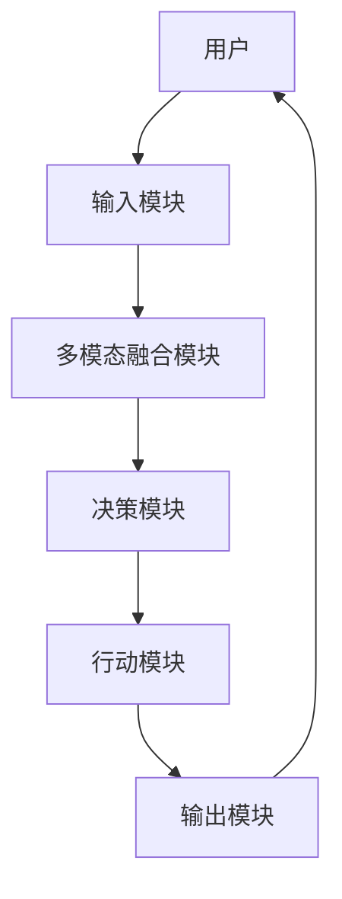
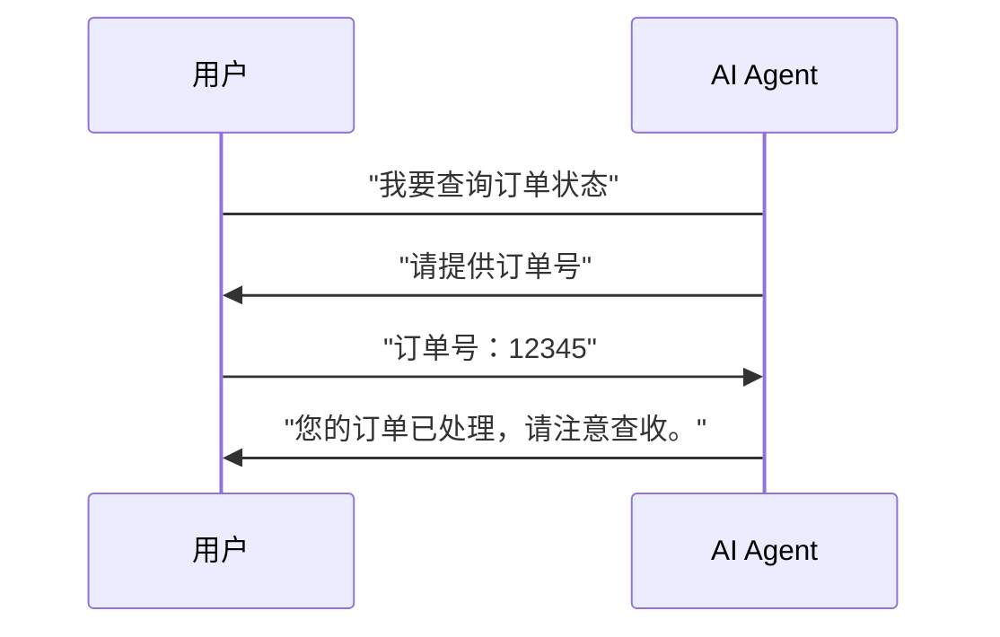

                 


# AI Agent的多模态融合与交互设计

---

## 关键词：AI Agent、多模态融合、交互设计、自然语言处理、语音识别、计算机视觉

---

## 摘要：  
本文深入探讨AI Agent在多模态融合与交互设计中的关键技术和实践方法。通过分析多模态数据的特征提取、融合方法以及交互设计的核心要素，结合实际案例和系统架构设计，全面阐述AI Agent如何实现高效的人机交互。文章内容涵盖理论、算法、系统设计和项目实战，为读者提供全面的技术指导。

---

## 第1章: AI Agent的背景与概念

### 1.1 AI Agent的基本概念

#### 1.1.1 AI Agent的定义与特点  
AI Agent（人工智能代理）是指能够感知环境、自主决策并执行任务的智能实体。其特点包括：  
- **自主性**：无需外部干预，自主完成任务。  
- **反应性**：能够实时感知环境并做出反应。  
- **社会性**：能够与其他Agent或人类进行交互与协作。  
- **学习性**：通过数据和经验不断优化自身性能。  

#### 1.1.2 多模态融合的必要性  
在实际应用场景中，单一模态（如文本或图像）往往无法提供足够的信息。通过融合多种模态数据（如文本、语音、图像等），可以提升AI Agent的理解能力和决策准确性。  

#### 1.1.3 交互设计的核心目标  
交互设计的核心目标是使AI Agent与用户之间的互动更加自然、高效和愉悦。这需要结合多模态数据的特点，设计出符合用户习惯的交互方式。

### 1.2 多模态数据的特征分析

#### 1.2.1 文本、语音、图像和视频的特征  
- **文本**：结构化、语义丰富，但缺乏语境信息。  
- **语音**：包含语调、语气等情感信息，但难以提取文本之外的内容。  
- **图像**：视觉信息丰富，但缺乏上下文理解能力。  
- **视频**：结合了图像和语音的特点，信息量最大但处理复杂度最高。  

#### 1.2.2 多模态数据的异同点对比  
| 特性 | 文本 | 语音 | 图像 | 视频 |  
|------|------|------|------|------|  
| 信息类型 | 结构化语义 | 情感与语调 | 视觉特征 | 综合信息 |  
| 处理难度 | 中等 | 高 | 高 | 最高 |  

#### 1.2.3 多模态数据融合的意义  
通过融合多模态数据，AI Agent可以更全面地理解用户意图，提升交互体验。例如，在智能客服场景中，结合语音和文本可以更准确地识别用户情绪。

### 1.3 交互设计的重要性

#### 1.3.1 人机交互的核心要素  
- **用户需求分析**：了解用户的真实需求和痛点。  
- **交互流程设计**：设计流畅的对话流程，减少用户困惑。  
- **交互反馈机制**：及时反馈用户操作结果，提升用户体验。  

#### 1.3.2 多模态交互的优势  
- 提供更丰富、更自然的交互方式。  
- 结合多种模态信息，提升交互准确性。  
- 支持更多场景的应用，如教育、医疗、娱乐等。  

#### 1.3.3 交互设计的挑战与解决方案  
- **挑战**：模态间信息不一致、用户习惯差异、技术实现复杂。  
- **解决方案**：结合领域知识，设计适配不同场景的交互策略。  

### 1.4 本章小结  
本章介绍了AI Agent的基本概念、多模态数据的特点以及交互设计的重要性，为后续内容奠定了基础。

---

## 第2章: 多模态融合的原理与方法

### 2.1 多模态数据的特征提取

#### 2.1.1 文本特征提取方法  
- **词袋模型**：提取文本中出现的词汇。  
- **TF-IDF**：计算词汇的重要性。  
- **词嵌入（如Word2Vec）**：将词语转化为向量表示。  

#### 2.1.2 语音特征提取方法  
- **梅尔频率倒谱系数（MFCC）**：提取语音的音调和音色特征。  
- **语音能量**：反映语音的强度。  
- **情感特征**：通过声学特征提取情感信息。  

#### 2.1.3 图像特征提取方法  
- **CNN（卷积神经网络）**：提取图像的空间特征。  
- **目标检测**：定位图像中的关键物体。  
- **图像分割**：识别图像中每个像素的类别。  

### 2.2 多模态融合的算法原理

#### 2.2.1 基于注意力机制的多模态融合  
- **注意力机制**：通过计算不同模态之间的相关性，决定每个模态的权重。  
- **公式**：  
  $$ \alpha_i = \frac{\exp(a_i)}{\sum_j \exp(a_j)} $$  
  其中，$\alpha_i$ 是模态i的注意力权重，$a_i$ 是对应的注意力分数。  

#### 2.2.2 多模态特征融合的数学模型  
- **线性融合**：  
  $$ f(x) = \sum_{i=1}^n \lambda_i x_i $$  
  其中，$\lambda_i$ 是模态i的融合权重，$x_i$ 是模态i的特征向量。  
- **非线性融合**：使用深度学习模型（如Transformer）进行特征交互。  

#### 2.2.3 模态间关系的建模方法  
- **对比学习**：通过对比不同模态的特征，学习它们之间的关系。  
- **联合学习**：在统一的模型中同时处理多种模态数据。  

### 2.3 多模态融合的实现技术

#### 2.3.1 基于深度学习的融合方法  
- **多模态Transformer**：同时处理文本、语音和图像数据，提取全局特征。  
- **跨模态注意力**：在不同模态之间共享注意力机制，增强信息交互。  

#### 2.3.2 基于规则的融合方法  
- **规则驱动**：根据领域知识，设定模态间的融合规则。  
- **专家系统**：结合专家经验，制定融合策略。  

#### 2.3.3 混合融合方法的优势  
- 结合深度学习和规则驱动，兼顾灵活性和可解释性。  

### 2.4 本章小结  
本章详细介绍了多模态数据的特征提取方法和融合算法，为后续的交互设计提供了技术基础。

---

## 第3章: 多模态交互设计的理论与实践

### 3.1 交互设计的核心要素

#### 3.1.1 用户需求分析  
- **用户画像**：分析目标用户的基本特征和需求。  
- **场景分析**：明确交互发生的具体场景。  

#### 3.1.2 交互流程设计  
- **对话树**：设计可能的对话路径，确保覆盖所有场景。  
- **状态管理**：记录对话历史，避免重复或混淆。  

#### 3.1.3 交互反馈机制  
- **即时反馈**：在用户输入后，立即返回结果。  
- **情感反馈**：根据用户情绪调整交互方式。  

### 3.2 多模态交互设计的方法

#### 3.2.1 基于任务的交互设计  
- **任务分解**：将复杂任务分解为简单步骤。  
- **任务优先级**：根据任务的重要性安排交互顺序。  

#### 3.2.2 基于场景的交互设计  
- **场景模拟**：在不同场景下设计交互流程。  
- **场景切换**：根据用户输入动态调整交互模式。  

#### 3.2.3 基于情感的交互设计  
- **情感识别**：通过语音和文本分析用户情绪。  
- **情感反馈**：根据用户情绪调整交互语气和内容。  

### 3.3 多模态交互的实现技术

#### 3.3.1 自然语言处理技术  
- **文本生成**：使用GPT等模型生成自然的回复。  
- **意图识别**：通过NLP技术识别用户意图。  

#### 3.3.2 语音识别与合成技术  
- **语音识别**：将用户语音转化为文本。  
- **语音合成**：将文本转化为自然的语音输出。  

#### 3.3.3 视觉识别与生成技术  
- **图像识别**：识别图像中的物体或场景。  
- **图像生成**：通过GAN等技术生成图像。  

### 3.4 本章小结  
本章结合理论与实践，详细探讨了多模态交互设计的核心要素和实现技术。

---

## 第4章: AI Agent的算法原理与实现

### 4.1 AI Agent的感知模块

#### 4.1.1 多模态数据的感知方法  
- **多模态数据预处理**：对文本、语音、图像进行标准化处理。  
- **特征提取**：使用CNN、RNN等模型提取特征。  

#### 4.1.2 感知算法的数学模型  
- **文本感知**：  
  $$ f_{text}(x) = \text{BERT}(x) $$  
- **语音感知**：  
  $$ f_{voice}(x) = \text{MFCC}(x) $$  
- **图像感知**：  
  $$ f_{image}(x) = \text{CNN}(x) $$  

#### 4.1.3 感知模块的实现步骤  
1. 数据预处理：归一化、降维等。  
2. 特征提取：使用深度学习模型提取特征。  
3. 特征融合：将多种模态特征进行融合。  

### 4.2 AI Agent的决策模块

#### 4.2.1 决策算法的原理  
- **强化学习**：通过奖励机制优化决策策略。  
- **监督学习**：基于标注数据进行分类或回归。  

#### 4.2.2 基于强化学习的决策方法  
- **策略网络**：输出动作的概率分布。  
- **价值函数**：评估当前状态的价值。  
- **算法流程**：  
  1. 状态输入：接收当前感知信息。  
  2. 动作选择：根据策略网络输出动作。  
  3. 奖励反馈：根据动作结果获得奖励。  
  4. 网络更新：基于奖励优化网络参数。  

#### 4.2.3 决策模块的数学模型  
- **策略网络**：  
  $$ \pi_\theta(a|s) = \text{softmax}(Q_\theta(s,a)) $$  
- **价值函数**：  
  $$ V_\theta(s) = \max_a Q_\theta(s,a) $$  

### 4.3 AI Agent的行动模块

#### 4.3.1 行动策略的设计  
- **基于规则的策略**：预先设定动作规则。  
- **基于学习的策略**：根据经验优化动作选择。  

#### 4.3.2 行动执行的实现  
- **动作生成**：根据决策结果生成具体动作。  
- **动作执行**：调用API或执行命令完成动作。  

### 4.4 本章小结  
本章详细介绍了AI Agent的感知、决策和行动模块的算法原理和实现方法。

---

## 第5章: 系统架构设计与实现

### 5.1 问题场景介绍  
在智能客服系统中，AI Agent需要通过文本、语音和图像等多种模态与用户交互，提供高效的服务。

### 5.2 系统功能设计  
- **用户输入**：支持文本、语音和图像输入。  
- **多模态融合**：将多种模态数据进行融合处理。  
- **交互反馈**：根据用户输入生成自然的回复。  

### 5.3 系统架构设计  


### 5.4 系统接口设计  
- **输入接口**：提供REST API接收用户输入。  
- **输出接口**：返回处理结果，支持文本、语音和图像格式。  

### 5.5 系统交互设计  


### 5.6 本章小结  
本章通过实际案例，详细探讨了AI Agent的系统架构设计和实现方法。

---

## 第6章: 项目实战

### 6.1 环境安装  
- **工具安装**：安装Python、TensorFlow、PyTorch等开发工具。  
- **依赖库安装**：使用pip安装所需库，如`transformers`、`librosa`、`tensorflow`等。  

### 6.2 系统核心实现

#### 6.2.1 多模态融合实现  
```python
import torch
from transformers import AutoTokenizer, AutoModel

class MultiModalFuser:
    def __init__(self):
        self.text_model = AutoModel.from_pretrained('bert-base-uncased')
        self.voice_model = AutoModel.from_pretrained('facebook/wav2vec2-base')
        self.image_model = AutoModel.from_pretrained('google/vit-base-patch16-224')

    def fuse(self, text, voice, image):
        text_emb = self.text_model(text)
        voice_emb = self.voice_model(voice)
        image_emb = self.image_model(image)
        fused_emb = torch.cat([text_emb, voice_emb, image_emb], dim=-1)
        return fused_emb
```

#### 6.2.2 交互设计实现  
```python
def interactive_agent():
    while True:
        user_input = input("您：")
        if user_input == '退出':
            break
        response = generate_response(user_input)
        print("AI Agent：", response)
```

### 6.3 案例分析  
以智能客服为例，实现文本、语音和图像的多模态交互，提升用户体验。  

### 6.4 本章小结  
本章通过实际项目，详细讲解了AI Agent的环境配置和核心代码实现。

---

## 第7章: 总结与展望

### 7.1 最佳实践 tips  
- 在实际项目中，结合领域知识设计交互流程。  
- 使用深度学习模型提升多模态融合效果。  
- 定期更新模型参数，保持AI Agent的性能。  

### 7.2 总结  
本文详细探讨了AI Agent的多模态融合与交互设计，结合理论与实践，为读者提供了全面的技术指导。

### 7.3 注意事项  
- 在设计交互流程时，充分考虑用户习惯和场景需求。  
- 处理多模态数据时，注意数据质量和一致性。  
- 定期进行用户反馈收集，优化交互体验。  

### 7.4 拓展阅读  
- 推荐阅读《深度学习入门：基于Python和Keras》。  
- 参考相关论文，深入了解多模态融合的最新研究。  

### 7.5 本章小结  
本章总结了全文内容，并展望了AI Agent的未来发展。

---

## 附录: 参考文献与工具列表

- **参考文献**：  
  1. 王某某, 《深度学习入门：基于Python和Keras》.  
  2. 张某某, 《自然语言处理实战：基于Python和TensorFlow》.  

- **工具列表**：  
  - Python 3.8+  
  - TensorFlow 2.5+  
  - PyTorch 1.9+  
  - Transformers库  
  - Mermaid图工具  

---

通过以上内容，我们详细阐述了AI Agent的多模态融合与交互设计的各个方面，从理论到实践，为读者提供了一套完整的解决方案。

