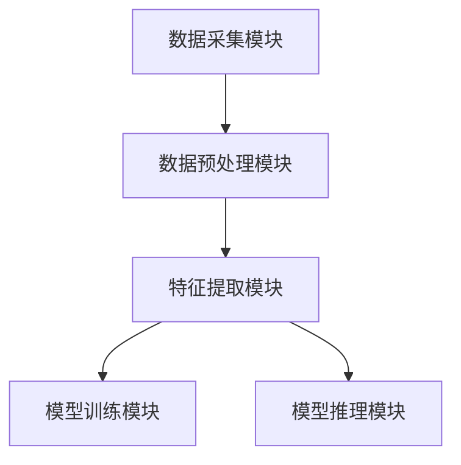

                 


# AI Agent的多模态融合学习技术

**关键词**：AI Agent, 多模态融合学习, 深度学习, 神经网络, 自然语言处理, 计算机视觉, 数据融合

**摘要**：  
AI Agent的多模态融合学习技术是当前人工智能领域的研究热点。随着多模态数据的广泛应用，如何有效地融合和处理这些数据，以提升AI Agent的智能性和决策能力，成为技术的核心挑战。本文从多模态数据的基本概念出发，深入分析其特征与优势，结合实际应用场景，探讨多模态融合学习的技术原理与实现方法。通过具体的算法实现与系统架构设计，本文为读者提供一套完整的多模态融合学习解决方案，帮助读者快速掌握该领域的核心技术和实践方法。

---

# 第1章: AI Agent与多模态融合学习概述

## 1.1 AI Agent的基本概念  
### 1.1.1 AI Agent的定义  
AI Agent（人工智能代理）是指能够感知环境、自主决策并执行任务的智能体。它能够通过与环境交互，完成特定目标，例如信息处理、数据分析、决策支持等。  

### 1.1.2 AI Agent的核心特征  
- **自主性**：能够自主决策，无需外部干预。  
- **反应性**：能够实时感知环境并做出响应。  
- **学习能力**：通过数据和经验提升自身的智能水平。  

### 1.1.3 多模态数据的定义与特点  
多模态数据是指来自不同感官渠道（如文本、图像、音频、视频等）的多样化数据。其特点包括：  
- **异构性**：不同模态的数据具有不同的特征和结构。  
- **互补性**：多种模态数据能够相互补充，提供更全面的信息。  
- **多样性**：能够覆盖更广泛的应用场景。  

## 1.2 多模态融合学习的背景与意义  
### 1.2.1 多模态数据的来源与类型  
- **文本数据**：包括自然语言文本、对话记录等。  
- **图像数据**：包括照片、视频帧等。  
- **音频数据**：包括语音、音乐等。  

### 1.2.2 多模态融合学习的必要性  
在单一模态数据下，AI Agent的能力有限。通过融合多种模态数据，可以显著提升模型的感知能力和决策能力。例如，在自然语言处理任务中，结合图像信息可以提高语义理解的准确性。  

### 1.2.3 多模态融合学习的应用场景  
- **智能助手**：如Siri、小爱同学等，通过语音和文本交互提供服务。  
- **智能客服**：结合语音和文本数据，提供更精准的客户支持。  
- **自动驾驶**：融合视觉、激光雷达等多种传感器数据，提升驾驶安全性和决策能力。  

## 1.3 多模态融合学习的技术挑战  
### 1.3.1 数据异构性问题  
不同模态的数据具有不同的特征空间，如何有效对齐这些数据是技术难点。  

### 1.3.2 跨模态对齐的难点  
- **语义鸿沟**：不同模态之间存在语义差异，难以直接对齐。  
- **数据量差异**：不同模态的数据量可能相差悬殊。  

### 1.3.3 计算效率与实时性问题  
多模态数据的处理需要较高的计算资源，如何在保证性能的前提下提升效率是关键。  

## 1.4 本章小结  
本章介绍了AI Agent的基本概念及其在多模态融合学习中的重要性，分析了多模态数据的特征与优势，并探讨了其在实际应用中的挑战与解决方案。

---

# 第2章: 多模态融合学习的核心概念与原理

## 2.1 多模态数据的特征分析  
### 2.1.1 文本数据的特征  
- **语义丰富性**：文本能够表达复杂的语义信息。  
- **结构多样性**：文本可以是句子、段落、篇章等多种形式。  

### 2.1.2 图像数据的特征  
- **视觉感知性**：图像能够提供丰富的视觉信息。  
- **空间结构**：图像具有二维空间结构，可以通过卷积神经网络进行处理。  

### 2.1.3 音频数据的特征  
- **时序性**：音频数据具有时序特性，可以通过循环神经网络进行处理。  
- **语调与情感**：音频信息可以传递语调和情感信息。  

## 2.2 多模态融合学习的原理  
### 2.2.1 多模态数据的表示方法  
- **模态独立表示**：分别对每种模态数据进行特征提取。  
- **联合表示**：将多种模态数据联合建模，提取全局特征。  

### 2.2.2 多模态特征的融合方式  
- **早融合（Early Fusion）**：在特征提取的早期阶段进行融合。  
- **晚融合（Late Fusion）**：在特征提取的后期阶段进行融合。  

### 2.2.3 多模态模型的构建流程  
1. 数据预处理：对多模态数据进行清洗和标准化。  
2. 特征提取：使用深度学习模型提取每种模态的特征。  
3. 特征融合：将提取的特征进行融合，生成联合特征。  
4. 模型训练：基于融合后的特征进行模型训练，完成任务目标。  

## 2.3 多模态融合学习的关键技术  
### 2.3.1 注意力机制在多模态融合中的应用  
- **多模态注意力网络**：通过注意力机制，动态地分配不同模态数据的权重。  

### 2.3.2 对比学习在多模态数据对齐中的作用  
- **对比学习**：通过最大化相似模态的相似性，最小化不相似模态的相似性，实现跨模态对齐。  

### 2.3.3 知识图谱在多模态数据中的应用  
- **知识图谱构建**：将多模态数据中的实体和关系构建为知识图谱。  
- **知识融合**：通过知识图谱实现跨模态数据的语义对齐。  

## 2.4 本章小结  
本章详细分析了多模态数据的特征及其在融合学习中的表现，探讨了多模态融合学习的核心原理与关键技术，为后续的算法实现奠定了基础。

---

# 第3章: 多模态融合学习的算法原理

## 3.1 多模态注意力机制  
### 3.1.1 注意力机制的基本原理  
- **自注意力机制**：通过计算序列中每个元素与其他元素的相关性，生成注意力权重。  

### 3.1.2 多模态注意力机制的实现  
1. 对每种模态数据分别计算自注意力权重。  
2. 将不同模态的注意力权重进行融合，生成联合注意力权重。  
3. 基于联合注意力权重，对多模态数据进行加权求和，生成融合特征。  

### 3.1.3 多模态注意力机制的优缺点  
- **优点**：能够捕捉到不同模态数据之间的关联性。  
- **缺点**：计算复杂度较高。  

## 3.2 多模态对比学习  
### 3.2.1 对比学习的基本原理  
- **对比损失函数**：通过最大化正样本的相似性，最小化负样本的相似性。  

### 3.2.2 多模态对比学习的实现  
1. 对每种模态数据分别提取特征。  
2. 将不同模态的特征对进行对比，计算对比损失。  
3. 基于对比损失，优化模型参数。  

### 3.2.3 多模态对比学习的优化策略  
- **负样本选择**：合理选择负样本，避免对比学习的偏差。  
- **温度调节**：通过调节温度参数，平衡正样本和负样本的相似性。  

## 3.3 多模态特征融合网络  
### 3.3.1 多模态特征融合网络的结构  
1. 输入层：接收多种模态的原始数据。  
2. 特征提取层：分别对每种模态数据进行特征提取。  
3. 融合层：将提取的特征进行融合，生成联合特征。  
4. 输出层：基于融合特征，输出任务结果。  

### 3.3.2 多模态特征融合网络的训练方法  
- **端到端训练**：通过反向传播算法，优化模型参数。  
- **联合优化**：在训练过程中，同时优化特征提取和融合模块。  

### 3.3.3 多模态特征融合网络的性能评估  
- **准确率**：分类任务中的正确分类比例。  
- **F1分数**：综合考虑精确率和召回率的指标。  
- **AUC曲线**：评估模型的分类性能。  

## 3.4 本章小结  
本章详细探讨了多模态融合学习的核心算法，包括注意力机制和对比学习，并分析了特征融合网络的结构与训练方法，为后续的系统设计提供了理论基础。

---

# 第4章: 多模态融合学习的系统架构设计

## 4.1 系统功能设计  
### 4.1.1 数据采集模块  
- **功能描述**：从多模态数据源中采集数据。  
- **输入输出**：输入为多种模态的原始数据，输出为预处理后的数据。  

### 4.1.2 数据预处理模块  
- **功能描述**：对采集的数据进行清洗、归一化等预处理操作。  
- **输入输出**：输入为原始数据，输出为标准化的特征数据。  

### 4.1.3 模型训练模块  
- **功能描述**：基于预处理后的数据，训练多模态融合模型。  
- **输入输出**：输入为特征数据，输出为训练好的模型参数。  

### 4.1.4 模型推理模块  
- **功能描述**：基于训练好的模型，对新的多模态数据进行推理。  
- **输入输出**：输入为多模态数据，输出为推理结果。  

## 4.2 系统架构设计  
### 4.2.1 系统架构图  


### 4.2.2 接口设计  
- **数据接口**：定义数据的输入格式和接口协议。  
- **模型接口**：定义模型的输入输出接口，方便模块化调用。  

### 4.2.3 交互流程  
1. 用户通过数据采集模块，输入多模态数据。  
2. 数据预处理模块对数据进行清洗和标准化。  
3. 特征提取模块对数据进行特征提取，生成特征向量。  
4. 模型训练模块基于特征向量，训练多模态融合模型。  
5. 模型推理模块基于训练好的模型，对新数据进行推理，输出结果。  

## 4.3 本章小结  
本章从系统架构的角度，详细设计了多模态融合学习的系统功能模块和交互流程，为实际应用提供了清晰的设计蓝图。

---

# 第5章: 多模态融合学习的项目实战

## 5.1 环境搭建  
### 5.1.1 安装依赖  
- **Python版本**：建议使用Python 3.7及以上版本。  
- **深度学习框架**：推荐使用TensorFlow或PyTorch。  
- **数据处理库**：如Pandas、NumPy等。  

### 5.1.2 安装步骤  
```bash
pip install tensorflow==2.5.0
pip install numpy==1.21.2
pip install pandas==1.3.5
```

## 5.2 核心实现  
### 5.2.1 数据预处理  
```python
import pandas as pd
import numpy as np

def preprocess_data(data):
    # 数据清洗
    data = data.dropna()
    # 标准化处理
    for col in data.columns:
        if data[col].dtype == 'float64':
            data[col] = (data[col] - data[col].mean()) / data[col].std()
    return data
```

### 5.2.2 多模态注意力机制实现  
```python
import tensorflow as tf
from tensorflow import keras

def multi_modal_attention(inputs):
    # 分别对每种模态计算自注意力
    attention_scores = []
    for modality in inputs:
        attention = keras.layers.Attention()([modality, modality])
        attention_scores.append(attention)
    # 融合注意力权重
    attention_weights = keras.layers.Dense(1, activation='sigmoid')(attention_scores)
    # 加权求和
    fused_features = tf.reduce_sum(tf.multiply(attention_scores, inputs), axis=1)
    return fused_features
```

### 5.2.3 模型训练  
```python
def train_model(train_data, train_labels):
    # 模型输入
    input_layer = keras.Input(shape=(input_dim,))
    # 特征提取
    dense_layer = keras.layers.Dense(64, activation='relu')(input_layer)
    # 模型输出
    output_layer = keras.layers.Dense(num_classes, activation='softmax')(dense_layer)
    # 模型编译
    model = keras.Model(inputs=input_layer, outputs=output_layer)
    model.compile(optimizer='adam', loss='sparse_categorical_crossentropy', metrics=['accuracy'])
    # 模型训练
    model.fit(train_data, train_labels, epochs=10, batch_size=32)
    return model
```

### 5.2.4 模型推理  
```python
def inference_model(test_data, model):
    predictions = model.predict(test_data)
    return np.argmax(predictions, axis=1)
```

## 5.3 项目小结  
本章通过一个具体的项目案例，展示了多模态融合学习技术的实际应用。从环境搭建到核心算法实现，再到模型训练和推理，为读者提供了完整的代码示例和详细的实现步骤。

---

# 第6章: 多模态融合学习的最佳实践与总结

## 6.1 最佳实践 tips  
- **数据预处理**：在多模态数据处理中，数据预处理是关键，建议先对数据进行清洗和标准化。  
- **模型选择**：根据具体任务需求，选择合适的模型结构和算法。  
- **计算资源**：多模态数据的处理需要较高的计算资源，建议使用GPU加速。  

## 6.2 本章小结  
本文从理论到实践，全面探讨了多模态融合学习技术的核心概念、算法实现和系统设计，并通过具体的项目案例，展示了其实际应用。读者可以通过本文快速掌握多模态融合学习的核心技术，并在实际项目中灵活应用。

---

# 结语  
多模态融合学习技术是AI Agent发展的关键技术，通过本文的系统讲解和实践示例，读者可以深入理解其原理和应用。未来，随着技术的不断发展，多模态融合学习将在更多领域发挥重要作用。希望本文能够为读者提供有价值的参考和启发。

