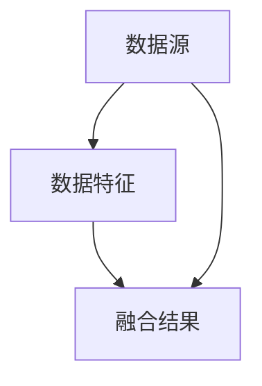
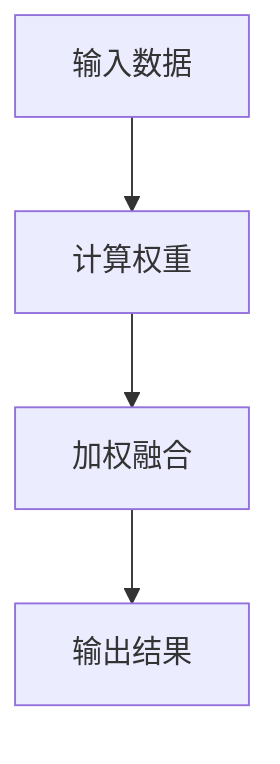
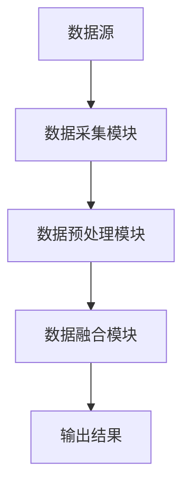

                 


# AI Agent的多源异构数据融合技术

## 关键词：AI Agent，多源异构数据，数据融合，算法原理，系统设计

## 摘要：  
本文深入探讨了AI Agent在处理多源异构数据融合中的技术细节。首先介绍了AI Agent的基本概念和多源异构数据融合的重要性，然后分析了数据融合的核心原理、算法实现和系统设计。通过实际案例展示了如何基于Python实现多源异构数据融合系统，并讨论了在实际应用中的注意事项和未来发展方向。

---

# 第1章: AI Agent与多源异构数据融合概述

## 1.1 AI Agent的基本概念  
AI Agent（人工智能代理）是一种能够感知环境、执行任务并做出决策的智能实体。它可以是软件程序、机器人或其他智能系统，通过与环境交互完成特定目标。  

### 1.1.1 多源异构数据的定义  
多源异构数据指的是来自不同数据源、具有不同格式、结构和语义的数据。例如，来自传感器、数据库、API接口等多种来源的数据，可能以文本、图像、表格等形式存在。  

### 1.1.2 数据融合的背景与意义  
在AI Agent中，数据融合是将多源异构数据整合为一致、准确、完整的数据的过程。其目的是为了提高数据的可用性和决策的准确性。  

## 1.2 多源异构数据融合的挑战与机遇  
### 1.2.1 数据异构性的挑战  
数据来源多样，格式和语义差异大，导致融合难度增加。  
### 1.2.2 数据融合的技术难点  
数据清洗、特征提取和融合策略的选择是数据融合的核心挑战。  
### 1.2.3 数据融合的未来发展  
随着技术的进步，数据融合将更加智能化和自动化，支持更复杂的决策任务。

---

# 第2章: 多源异构数据融合的核心概念与联系

## 2.1 数据融合的基本原理  
数据融合包括数据预处理、特征提取和融合策略选择三个主要步骤。  

### 2.1.1 数据预处理  
数据预处理包括数据清洗、格式转换和标准化。  
### 2.1.2 数据特征提取  
通过提取关键特征，降低数据维度并提高数据的可比性。  
### 2.1.3 数据融合策略  
选择合适的融合策略，如加权融合、基于图的融合等。  

## 2.2 数据融合的实体关系图  
以下是数据融合的实体关系图：  



## 2.3 数据融合方法对比  
以下是几种常见数据融合方法的对比表格：  

| 方法         | 基于统计 | 基于机器学习 | 基于图论 |
|--------------|----------|--------------|----------|
| 描述         | 统计分析 | 机器学习模型 | 图结构构建 |
| 优缺点       | 简单但效果有限 | 效果好但计算复杂 | 结构化数据效果好 |
| 应用场景       | 小型数据集 | 大规模数据 | 图结构数据 |

---

# 第3章: 多源异构数据融合的算法原理

## 3.1 数据融合的算法概述  
### 3.1.1 加权融合算法  
加权融合算法通过对不同数据源分配权重，计算最终的融合结果。  

### 3.1.2 基于图的融合算法  
基于图的融合算法通过构建图结构，利用节点之间的关系进行数据融合。  

## 3.2 加权融合算法的实现  

### 3.2.1 权重计算公式  
权重计算公式如下：  
$$w_i = \frac{1}{\sum_{j=1}^{n} |x_i - x_j|}$$  

### 3.2.2 数据融合流程  
以下是加权融合算法的流程图：  



### 3.2.3 代码实现示例  
以下是加权融合算法的Python代码示例：  

```python
def weighted_fusion(data_sources):
    weights = [1 / sum(abs(x - xj) for xj in data_sources) for x in data_sources]
    normalized_weights = weights / sum(weights)
    return sum(x * w for x, w in zip(data_sources, normalized_weights))
```

## 3.3 基于图的融合算法实现  

### 3.3.1 图结构构建  
构建图结构时，节点代表数据源，边表示数据之间的相似性。  

### 3.3.2 融合规则定义  
融合规则基于节点之间的相似性进行加权融合。  

### 3.3.3 代码实现示例  
以下是基于图的融合算法的Python代码示例：  

```python
def graph_based_fusion(data_graph):
    fused_value = 0
    for node in data_graph.nodes:
        weight = sum(data_graph.similarity(node, neighbor) for neighbor in data_graph.neighbors(node))
        fused_value += data_graph.value[node] * weight
    return fused_value
```

---

# 第4章: 系统分析与架构设计方案

## 4.1 系统问题场景介绍  
### 4.1.1 数据源多样性  
系统需要整合来自不同来源的数据。  
### 4.1.2 数据格式多样性  
数据可能以文本、图像或表格形式存在。  
### 4.1.3 数据量差异性  
数据量可能从少量到大规模不等。  

## 4.2 系统功能设计  
### 4.2.1 数据采集模块  
负责从不同数据源采集数据。  
### 4.2.2 数据预处理模块  
对采集的数据进行清洗和标准化。  
### 4.2.3 数据融合模块  
根据选择的融合策略进行数据融合。  

## 4.3 系统架构设计  
以下是系统的架构图：  



---

# 第5章: 项目实战——基于Python的多源异构数据融合系统

## 5.1 环境安装与配置  
### 5.1.1 Python安装  
安装Python 3.8及以上版本。  
### 5.1.2 库依赖安装  
安装必要的库，如NumPy、Pandas和networkx。  

## 5.2 系统核心代码实现  

### 5.2.1 数据采集代码  
```python
import requests

def fetch_data(url):
    response = requests.get(url)
    return response.json()
```

### 5.2.2 数据预处理代码  
```python
import pandas as pd

def preprocess_data(data):
    df = pd.DataFrame(data)
    df = df.dropna()
    return df
```

### 5.2.3 数据融合代码  
```python
def fuse_data(data_sources):
    # 加权融合
    weights = [sum(abs(x - xj) for xj in data_sources) for x in data_sources]
    normalized_weights = weights / sum(weights)
    fused_value = sum(x * w for x, w in zip(data_sources, normalized_weights))
    return fused_value
```

## 5.3 代码应用解读与分析  
通过上述代码，我们可以实现从数据采集到数据融合的完整流程。  

---

# 第6章: 最佳实践与小结

## 6.1 最佳实践 tips  
- 在数据融合前，确保数据的准确性和一致性。  
- 根据数据特点选择合适的融合算法。  
- 定期更新和优化融合模型。  

## 6.2 小结  
本文详细介绍了AI Agent在多源异构数据融合中的技术细节，从概念到实现，为读者提供了全面的指导。  

## 6.3 注意事项  
- 数据异构性可能导致融合困难。  
- 算法选择需根据具体场景调整。  
- 系统设计需考虑可扩展性和可维护性。  

## 6.4 拓展阅读  
推荐阅读《数据融合技术与应用》和《人工智能系统设计》等书籍。

--- 

通过以上内容，我们可以系统地掌握AI Agent的多源异构数据融合技术，并将其应用于实际项目中。

