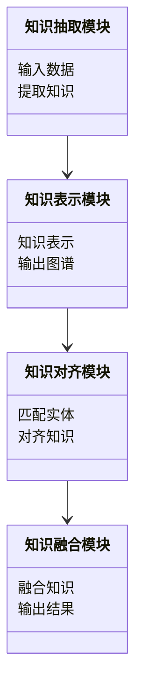

                 


# AI Agent的多源知识融合学习技术

> **关键词**：AI Agent, 多源知识融合, 知识表示, 知识对齐, 融合策略, 数学模型

> **摘要**：本文系统地探讨了AI Agent的多源知识融合学习技术，从基本概念到核心算法，再到系统设计和实际应用，进行了全面而深入的分析。文章首先介绍了AI Agent和多源知识融合的基本概念，随后详细讲解了知识表示与对齐、融合策略与算法、系统架构与设计，最后通过实际案例展示了多源知识融合技术的应用价值和未来发展方向。

---

## 第一部分: AI Agent的多源知识融合学习技术概述

### 第1章: AI Agent与多源知识融合概述

#### 1.1 AI Agent的基本概念

**1.1.1 AI Agent的定义与特点**

AI Agent（人工智能代理）是指在计算机系统中，能够感知环境、自主决策并执行任务的智能实体。AI Agent可以是软件程序、机器人或其他智能系统，其核心目标是通过感知和行动与环境交互，以实现特定目标。AI Agent具有以下特点：

- **自主性**：AI Agent能够在没有外部干预的情况下自主运作。
- **反应性**：能够感知环境并实时响应。
- **目标导向**：通过决策和行动实现预设目标。
- **学习能力**：能够通过经验改进性能。

**1.1.2 多源知识融合的必要性**

AI Agent的智能性依赖于对环境的深度理解，而多源知识融合技术能够帮助AI Agent从多个来源获取信息，消除信息冗余和矛盾，提高决策的准确性和全面性。例如，在智能助手、自动驾驶等领域，AI Agent需要整合来自传感器、数据库、用户输入等多种来源的信息，才能做出准确的决策。

**1.1.3 多源知识融合的应用价值**

多源知识融合技术能够提升AI Agent的智能性和适应性，使其在复杂环境中表现出更强的处理能力。例如，在医疗领域，AI Agent可以通过融合病历数据、医学知识库和实时监测数据，为医生提供更精准的诊断建议。

---

### 第2章: 多源知识融合的基本概念与背景

#### 2.1 多源知识融合的背景与问题背景

**2.1.1 知识表示与对齐**

知识表示是将信息以计算机可处理的形式表示出来，常见的表示方法包括符号逻辑、语义网络和图结构。知识对齐则是将不同来源的知识进行匹配和统一，例如将不同数据库中的实体关系对齐。

**2.1.2 多源知识融合的核心目标**

多源知识融合的核心目标是将来自多个来源、形式各异的知识进行整合，消除冲突，提高信息的准确性和一致性。例如，在自然语言处理中，多源知识融合可以帮助AI Agent从多个文档中提取和整合信息，形成更全面的理解。

**2.1.3 多源知识融合的边界与外延**

多源知识融合的边界在于如何处理信息的来源、形式和语义差异。其外延则包括数据清洗、知识抽取、语义理解等多个环节。

**2.2 多源知识融合的核心概念与联系**

**2.2.1 知识表示与融合的基本原理**

知识表示是多源知识融合的基础，常见的知识表示方法包括符号逻辑、语义网络和图结构。知识融合则是将不同表示形式的信息进行整合，形成统一的知识表示。

**2.2.2 知识对齐与融合策略**

知识对齐是通过匹配不同来源的知识，消除冗余和冲突。融合策略则是根据知识的来源和可靠性，选择适当的融合方法，例如加权平均、投票法等。

**2.2.3 ER实体关系图架构的Mermaid流程图**

```mermaid
erDiagram
    customer[顾客] {
        id : integer
        name : string
        address : string
    }
    order[订单] {
        id : integer
        date : date
        total : float
    }
    product[产品] {
        id : integer
        name : string
        price : float
    }
    customer --> order : 下订单
    order --> product : 订单包含
```

---

## 第二部分: 多源知识融合学习技术的核心原理

### 第3章: 多源知识融合的基本原理

#### 3.1 知识表示与对齐

**3.1.1 知识表示的多种形式**

知识表示的常见形式包括符号逻辑、语义网络和图结构。符号逻辑适合规则推理，语义网络适合语义理解，图结构适合复杂关系的表示。

**3.1.2 知识对齐的算法与方法**

知识对齐的算法包括基于规则的匹配和基于学习的匹配。基于规则的匹配通过预定义的规则进行匹配，基于学习的匹配则通过机器学习模型进行自动匹配。

**3.1.3 知识对齐的挑战与解决方案**

知识对齐的挑战包括语义歧义和信息不一致。解决方案包括引入外部知识库和使用对齐模型进行语义匹配。

#### 3.2 知识融合的策略与方法

**3.2.1 基于概率的融合方法**

基于概率的融合方法通过计算各知识源的可靠性，进行加权融合。例如，使用贝叶斯网络进行概率推理。

**3.2.2 基于规则的融合方法**

基于规则的融合方法通过预定义的规则进行知识融合，例如使用投票法选择多数意见。

**3.2.3 基于图结构的融合方法**

基于图结构的融合方法通过构建知识图谱，进行语义理解。例如，使用图嵌入方法进行知识融合。

---

### 第4章: 多源知识融合的数学模型与算法

#### 4.1 基于概率的融合算法

**4.1.1 贝叶斯网络模型**

贝叶斯网络是一种概率推理模型，可以通过条件概率进行知识融合。例如，计算各知识源的条件概率，进行加权融合。

**4.1.2 Dempster-Shafer证据理论**

Dempster-Shafer证据理论通过计算各知识源的证据权重，进行概率融合。例如，计算各知识源的证据权重，进行加权融合。

**4.1.3 基于概率的融合算法实现**

```python
import math

def DempsterShafer(weight1, weight2):
    # Dempster-Shafer证据理论计算融合结果
    return (weight1 + weight2) / (1 + weight1 * weight2)

# 示例
weight1 = 0.8
weight2 = 0.6
result = DempsterShafer(weight1, weight2)
print("融合结果:", result)
```

---

## 第三部分: 系统架构与设计

### 第5章: 系统架构与设计

#### 5.1 系统功能设计

**5.1.1 领域模型设计**

领域模型设计通过类图展示系统模块划分。例如，设计一个知识融合系统，包括知识抽取、知识表示、知识对齐和知识融合四个模块。



#### 5.2 系统架构设计

**5.2.1 系统架构设计**

系统架构设计通过架构图展示系统的模块划分和交互流程。例如，设计一个基于微服务架构的知识融合系统，包括知识抽取服务、知识表示服务、知识对齐服务和知识融合服务。

```mermaid
server
    [知识抽取服务]
        [
            输入数据
            提取知识
        ]
    [知识表示服务]
        [
            知识表示
            输出图谱
        ]
    [知识对齐服务]
        [
            匹配实体
            对齐知识
        ]
    [知识融合服务]
        [
            融合知识
            输出结果
        ]
```

---

## 第四部分: 项目实战

### 第6章: 项目实战

#### 6.1 环境安装

**6.1.1 环境配置**

安装必要的依赖库，例如Python的numpy、pandas、networkx等。

```bash
pip install numpy pandas networkx
```

#### 6.2 核心代码实现

**6.2.1 知识抽取模块**

```python
import pandas as pd

def extract Knowledge(text):
    # 知识抽取算法
    return pd.DataFrame({'实体': ['A', 'B', 'C'], '关系': ['属于', '关联', '包含']})
```

**6.2.2 知识表示模块**

```python
import networkx as nx

def represent Knowledge(extracted_data):
    # 知识表示算法
    G = nx.Graph()
    G.add_edges_from(extracted_data['关系'])
    return G
```

---

## 第五部分: 最佳实践与小结

### 第7章: 最佳实践与小结

#### 7.1 最佳实践

**7.1.1 数据质量的重要性**

数据质量直接影响知识融合的效果，因此在项目中需要重视数据清洗和预处理。

**7.1.2 算法选择与优化**

根据实际需求选择合适的融合算法，并通过实验进行优化。

#### 7.2 小结

本文系统地介绍了AI Agent的多源知识融合学习技术，从基本概念到核心算法，再到系统设计和实际应用，进行了全面而深入的分析。通过实际案例展示了多源知识融合技术的应用价值和未来发展方向。

---

## 第六部分: 拓展阅读与注意事项

### 第8章: 拓展阅读与注意事项

#### 8.1 拓展阅读

**8.1.1 关键词与参考资料**

- AI Agent
- 多源知识融合
- 知识表示
- 知识对齐
- 融合策略
- 数学模型

#### 8.2 注意事项

在实际项目中，需要注意数据隐私、算法的可解释性以及系统的实时性等问题。

---

通过以上结构和内容，读者可以系统地理解AI Agent的多源知识融合学习技术，并能够在实际项目中应用这些技术提升AI Agent的智能性和决策能力。

