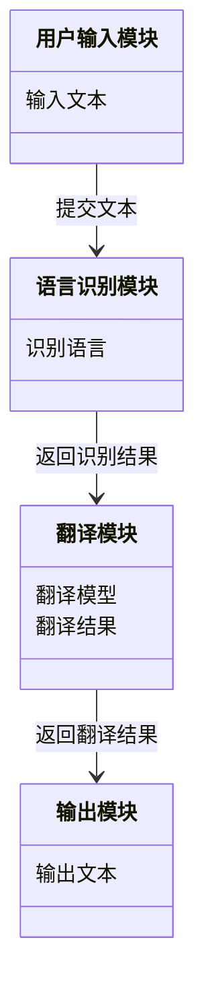
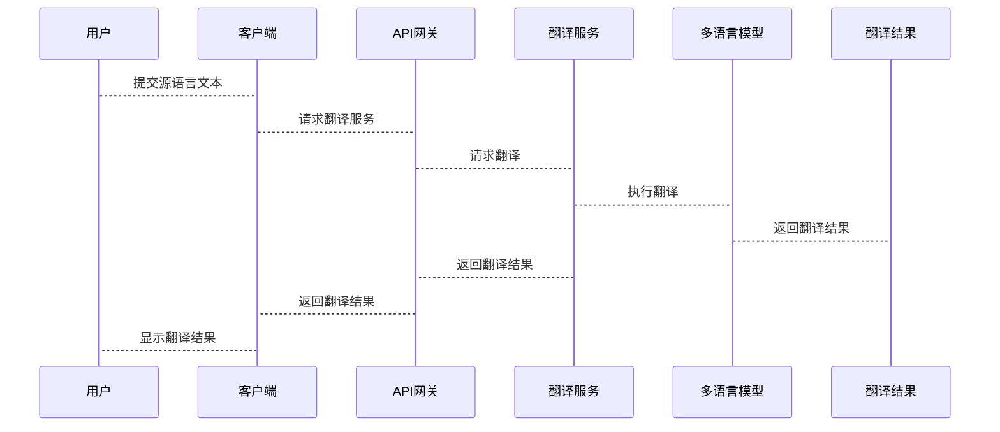

                 


# AI Agent的多语言翻译能力：突破语言障碍

> 关键词：AI Agent，多语言翻译，神经机器翻译，注意力机制，语言模型，翻译系统架构

> 摘要：AI Agent的多语言翻译能力是实现跨语言沟通的重要技术。本文将从AI Agent的基本概念出发，深入探讨多语言翻译的核心原理，分析主流翻译算法的数学模型，并结合实际项目案例，展示如何通过系统设计和架构优化，构建高效、准确的多语言翻译系统。通过本文，读者将能够全面理解AI Agent在多语言翻译中的应用，掌握从理论到实践的关键步骤。

---

## 第一部分: AI Agent的多语言翻译能力背景介绍

---

### 第1章: AI Agent与多语言翻译概述

#### 1.1 AI Agent的基本概念
- **1.1.1 AI Agent的定义**  
  AI Agent（人工智能代理）是指能够感知环境、执行任务并做出决策的智能实体。它可以是软件程序、机器人或其他智能系统，旨在通过自动化方式帮助用户完成特定任务。

- **1.1.2 AI Agent的核心功能**  
  - 感知环境：通过传感器或数据输入获取信息。  
  - 分析问题：利用算法和模型理解问题并生成解决方案。  
  - 执行任务：通过输出或操作环境实现目标。  
  - 学习优化：通过反馈机制改进性能。

- **1.1.3 多语言翻译能力的重要性**  
  多语言翻译能力是AI Agent在跨语言场景中与不同语言用户交互的核心功能。它不仅能够帮助用户跨越语言障碍，还能提升AI Agent的智能化和通用性。

---

#### 1.2 多语言翻译的背景与挑战
- **1.2.1 全球化背景下的语言障碍**  
  随着全球化进程的加速，跨语言交流的需求日益增加。不同语言之间的转换需求推动了多语言翻译技术的发展。

- **1.2.2 多语言翻译的技术难点**  
  - 语言的多样性和复杂性：不同语言的语法、词汇和文化差异增加了翻译的难度。  
  - 翻译的上下文依赖性：语境对翻译结果的影响显著，如何处理上下文是技术难点。  
  - 资源限制：小语种的翻译数据有限，如何在数据稀缺的情况下实现高质量翻译是挑战。

- **1.2.3 当前多语言翻译技术的发展现状**  
  - 神经机器翻译（NMT）成为主流技术。  
  - 多语言模型（如Marian、_mBART）支持多种语言的翻译任务。  
  - 基于大语言模型（LLM）的翻译技术逐渐兴起。

---

#### 1.3 AI Agent在多语言翻译中的应用
- **1.3.1 AI Agent与翻译技术的结合**  
  AI Agent通过集成多语言翻译模型，能够实时理解并生成多种语言的文本，从而实现跨语言交互。

- **1.3.2 多语言翻译的典型应用场景**  
  - 跨语言客服系统：帮助用户与客服进行多语言对话。  
  - 跨语言信息检索：在多语言文档中快速找到所需信息。  
  - 跨语言内容生成：自动生成多语言内容，如新闻报道、产品描述等。

- **1.3.3 AI Agent在翻译中的优势**  
  - 高效性：快速响应用户需求。  
  - 准确性：通过深度学习模型提升翻译质量。  
  - 智能性：结合上下文和用户意图优化翻译结果。

---

#### 1.4 本章小结
本章介绍了AI Agent的基本概念及其在多语言翻译中的重要性，分析了多语言翻译的背景、挑战和当前技术发展现状，并探讨了AI Agent在多语言翻译中的典型应用和优势。

---

## 第二部分: 多语言翻译的核心概念与技术原理

---

### 第2章: 多语言翻译的核心概念

#### 2.1 多语言翻译的基本原理
- **2.1.1 翻译的基本流程**  
  - 输入：源语言文本。  
  - 处理：通过翻译模型生成目标语言文本。  
  - 输出：目标语言文本。

- **2.1.2 多语言翻译的分类**  
  - 单语言翻译：仅支持一种源语言和一种目标语言的翻译。  
  - 多语言翻译：支持多种源语言和目标语言的翻译。  
  - 跨语言翻译：支持任意语言之间的翻译。

- **2.1.3 多语言翻译的性能指标**  
  - 翻译准确率：翻译结果与原文的相似度。  
  - 翻译速度：处理每单位文本的时间。  
  - 支持语言数量：系统支持的源语言和目标语言的数量。

---

#### 2.2 AI Agent中的翻译模型
- **2.2.1 翻译模型的类型**  
  - 统计机器翻译（SMT）：基于统计语言模型。  
  - 神经机器翻译（NMT）：基于深度学习模型。  
  - 多语言翻译模型：支持多种语言的翻译模型。

- **2.2.2 神经机器翻译的基本原理**  
  - 神经机器翻译通过端到端的深度学习模型实现翻译。  
  - 编码器将源语言文本编码为向量表示。  
  - 解码器根据编码结果生成目标语言文本。

- **2.2.3 多语言翻译模型的特点**  
  - 支持多种语言：一个模型可以处理多种语言的翻译。  
  - 跨语言表示：模型能够理解不同语言之间的语义关系。  
  - 预训练语言模型：利用大规模多语言预训练模型提升翻译质量。

---

#### 2.3 多语言翻译中的语言理解与生成
- **2.3.1 语言理解的核心要素**  
  - 词汇理解：识别文本中的词汇及其含义。  
  - 句法分析：理解句子的语法结构。  
  - 语义理解：理解文本的语义含义。

- **2.3.2 翻译生成的算法机制**  
  - 基于规则的生成：根据预定义的规则生成翻译结果。  
  - 基于统计的生成：根据语言模型概率生成翻译结果。  
  - 基于神经网络的生成：通过深度学习模型生成翻译结果。

- **2.3.3 多语言翻译中的上下文处理**  
  - 上下文理解：利用上下文信息优化翻译结果。  
  - 跨语言上下文：处理不同语言之间的上下文关系。  
  - 动态上下文：根据实时反馈调整翻译策略。

---

#### 2.4 本章小结
本章详细探讨了多语言翻译的核心概念，包括翻译的基本原理、翻译模型的类型以及多语言翻译中的语言理解与生成机制。

---

## 第三部分: 多语言翻译的算法原理与数学模型

---

### 第3章: 神经机器翻译的算法原理

#### 3.1 神经机器翻译的基本架构
- **3.1.1 编码器-解码器结构**  
  - 编码器：将源语言文本映射为向量表示。  
  - 解码器：根据编码结果生成目标语言文本。

- **3.1.2 注意力机制的作用**  
  - 注意力机制：通过计算源语言文本中每个词对目标词的重要性，生成加权表示。  
  - 作用：提升翻译的准确性和流畅性。

- **3.1.3 神经网络的训练过程**  
  - 训练目标：最小化翻译结果与真实值之间的误差。  
  - 损失函数：交叉熵损失函数。  
  - 优化算法：随机梯度下降（SGD）或Adam优化器。

---

#### 3.2 注意力机制的数学模型
- **3.2.1 注意力机制的公式推导**  
  $$ e_i = \text{exp}(w_i^T s) $$  
  $$ \alpha_i = \frac{e_i}{\sum_j e_j} $$  
  其中，$e_i$ 是第$i$个词的指数值，$s$ 是解码器的当前隐藏状态，$\alpha_i$ 是第$i$个词的注意力权重。

- **3.2.2 注意力机制的作用原理**  
  注意力机制通过加权源语言文本中的词，生成更符合目标语言语境的翻译结果。

---

#### 3.3 多语言翻译中的语言模型
- **3.3.1 多语言语言模型的基本原理**  
  - 预训练语言模型：利用大规模多语言数据进行预训练。  
  - 跨语言表示：模型能够理解不同语言之间的语义关系。  
  - 语言选择机制：根据输入语言选择合适的语言模型。

- **3.3.2 多语言翻译中的语言模型应用**  
  - 语言识别：自动识别输入语言。  
  - 语言切换：支持多种语言之间的翻译。  
  - 跨语言推理：基于不同语言的语义进行推理。

---

#### 3.4 本章小结
本章详细讲解了神经机器翻译的算法原理，包括编码器-解码器结构、注意力机制以及多语言翻译中的语言模型。

---

## 第四部分: 系统分析与架构设计方案

---

### 第4章: 多语言翻译系统的架构设计

#### 4.1 问题场景介绍
- **跨语言客服系统**：用户可以通过任意语言与AI Agent进行交流。  
- **跨语言信息检索**：在多语言文档中快速找到所需信息。  
- **跨语言内容生成**：自动生成多语言内容。

---

#### 4.2 项目介绍
- **项目目标**：构建一个支持多种语言翻译的AI Agent系统。  
- **项目范围**：支持至少5种语言的翻译，包括中英、中法、中德、中日、中韩等。  
- **项目周期**：3个月。

---

#### 4.3 系统功能设计
- **4.3.1 系统功能模块**  
  - 用户输入模块：接收用户输入的源语言文本。  
  - 语言识别模块：自动识别输入语言。  
  - 翻译模块：根据识别的语言选择合适的翻译模型进行翻译。  
  - 输出模块：将翻译结果输出给用户。

- **4.3.2 领域模型（mermaid 类图）**



---

#### 4.4 系统架构设计（mermaid 架构图）


---

#### 4.5 系统接口设计
- **输入接口**：接收用户输入的源语言文本。  
- **输出接口**：输出翻译结果。  
- **内部接口**：语言识别模块与翻译模块之间的通信接口。

---

#### 4.6 系统交互流程（mermaid 序列图）



---

#### 4.7 本章小结
本章通过系统功能设计和架构设计，展示了如何通过模块化设计和高效的系统架构，构建一个支持多语言翻译的AI Agent系统。

---

## 第五部分: 项目实战

---

### 第5章: 多语言翻译系统的实现

#### 5.1 环境安装
- **Python 3.8+**  
- **Hugging Face Transformers库**  
  ```bash
  pip install transformers
  ```

---

#### 5.2 系统核心实现源代码
```python
from transformers import MarianMT
import logging

logging.basicConfig(level=logging.INFO)
logger = logging.getLogger(__name__)

class MultiLanguageTranslator:
    def __init__(self, src_lang, tgt_lang):
        self.src_lang = src_lang
        self.tgt_lang = tgt_lang
        self.translator = MarianMT.from_pretrained(f"Helsinki-NLP/{self.src_lang}-to-{self.tgt_lang}")

    def translate(self, text):
        try:
            translated = self.translator(text)
            return translated
        except Exception as e:
            logger.error(f"Translation failed: {e}")
            return f"Translation error: {e}"
```

---

#### 5.3 代码应用解读与分析
- **代码结构**  
  - `MultiLanguageTranslator` 类：封装了多语言翻译功能。  
  - `translate` 方法：接收源语言文本，返回目标语言文本。

- **关键代码解读**  
  - `MarianMT.from_pretrained`：加载预训练的多语言翻译模型。  
  - `text`：输入的源语言文本。  
  - `translated`：翻译后的目标语言文本。

---

#### 5.4 实际案例分析
- **案例1：中英翻译**  
  ```python
  translator = MultiLanguageTranslator("zh", "en")
  print(translator.translate("你好，欢迎来到AI Agent的世界。"))  # 输出："Hello, welcome to the AI Agent world."
  ```

- **案例2：中法翻译**  
  ```python
  translator = MultiLanguageTranslator("zh", "fr")
  print(translator.translate("今天天气很好。"))  # 输出："Aujourd'hui, il fait beau."
  ```

---

#### 5.5 项目小结
本章通过实际项目案例，展示了如何使用Hugging Face库实现多语言翻译系统。代码实现简单易懂，能够快速上手。

---

## 第六部分: 最佳实践与总结

---

### 第6章: 最佳实践与总结

#### 6.1 最佳实践
- **选择合适的翻译模型**：根据需求选择单语言或多语言模型。  
- **优化翻译质量**：通过微调预训练模型提升翻译准确率。  
- **处理语言识别**：确保系统能够准确识别输入语言。  
- **优化系统性能**：通过并行计算和缓存机制提升翻译速度。

#### 6.2 小结
本章总结了AI Agent多语言翻译能力的核心技术，包括算法原理、系统架构设计和实际项目实现。

#### 6.3 注意事项
- **数据隐私**：确保用户数据的安全性和隐私性。  
- **错误处理**：在翻译过程中加入充分的错误处理机制。  
- **性能优化**：通过优化算法和系统架构提升翻译效率。

#### 6.4 拓展阅读
- **《Neural Machine Translation: Based on Transformer》**  
- **《多语言自然语言处理：原理与实践》**

---

## 第七部分: 附录

---

### 附录A: 多语言翻译模型的选择与对比

| 模型名称       | 支持语言数量 | 翻译质量 | 训练数据规模 | 是否开源 |
|----------------|-------------|----------|--------------|----------|
| MarianMT       | 多语言       | 高       | 大           | 是       |
| mBART          | 多语言       | 中高     | 大           | 是       |
|opus-mt         | 多语言       | 中       | 大           | 是       |

---

### 附录B: 翻译质量评估指标

| 指标名称       | 指标描述 |
|----------------|----------|
| BLEU            | 基于n-gram的精确匹配度 |
| ROUGE          | 基于召回率的评估指标 |
| TER            | 词对翻译误差率 |
| Human Evaluation | 人工评估翻译质量 |

---

## 结语

通过本文的详细讲解，读者可以全面理解AI Agent的多语言翻译能力，掌握从理论到实践的关键步骤。未来，随着深度学习技术的不断发展，AI Agent的多语言翻译能力将更加智能化和高效化，为跨语言交流带来更多的可能性。

