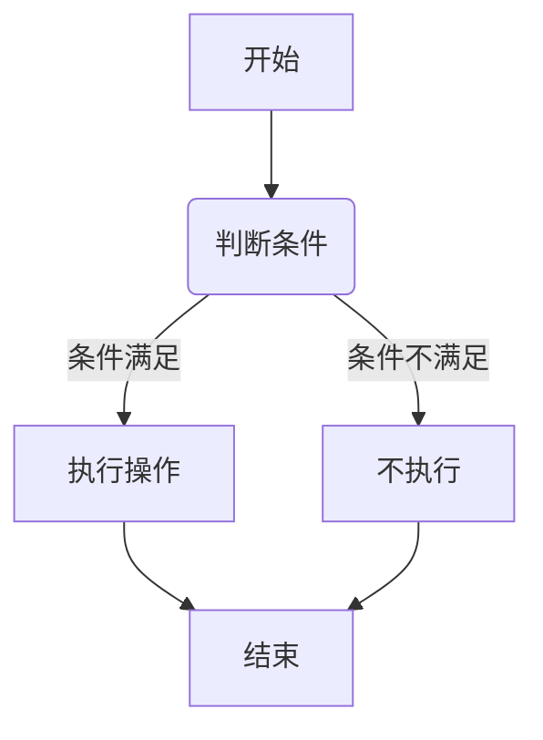
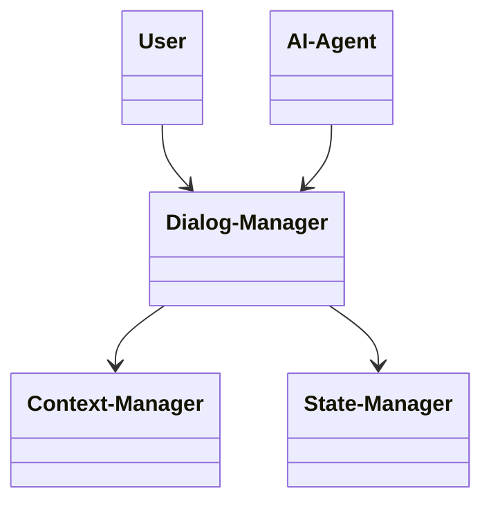
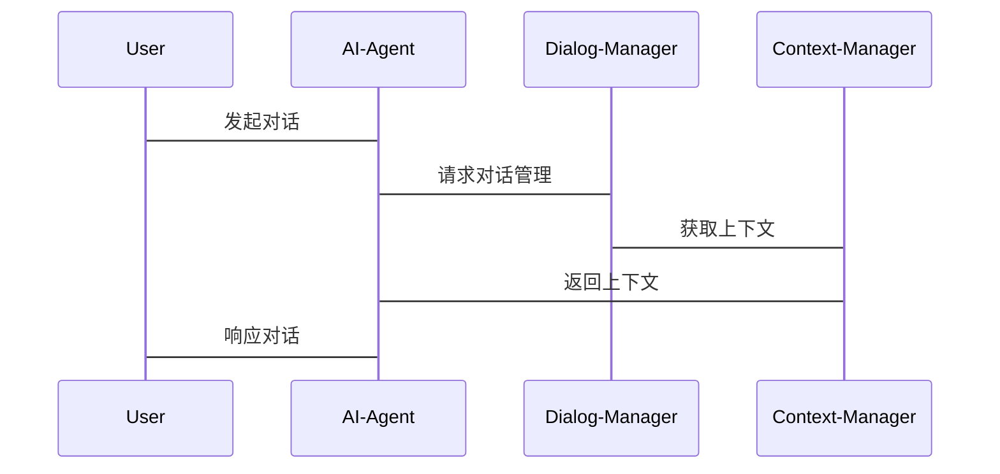

                 


# AI Agent的多轮对话管理系统设计

> 关键词：AI Agent, 多轮对话, 对话管理, 系统设计, 自然语言处理

> 摘要：本文系统地探讨了AI Agent多轮对话管理系统的背景、核心概念、算法原理、系统架构设计以及项目实战。通过详细的分析和实例，展示了如何设计和实现一个高效的多轮对话管理系统，帮助读者理解其技术要点和应用场景。

---

# 第一部分: AI Agent的多轮对话管理系统的背景与核心概念

## 第1章: AI Agent的多轮对话管理概述

### 1.1 AI Agent的基本概念

#### 1.1.1 AI Agent的定义与特点
AI Agent（人工智能代理）是一种智能体，能够感知环境、自主决策并执行任务。其特点包括自主性、反应性、目标导向性和学习能力。

#### 1.1.2 多轮对话管理的必要性
多轮对话管理使AI Agent能够理解上下文，保持对话连贯性，并提供更自然的交互体验。

#### 1.1.3 当前AI Agent在对话管理中的挑战
- 对话状态难以跟踪
- 上下文信息的有效管理
- 多轮对话中的语义理解复杂

### 1.2 多轮对话管理系统的背景与应用

#### 1.2.1 多轮对话管理的背景
随着自然语言处理技术的发展，多轮对话管理成为实现智能交互的关键技术。

#### 1.2.2 多轮对话管理的应用场景
- 智能客服
- 虚拟助手
- 智能聊天机器人

#### 1.2.3 多轮对话管理的未来发展趋势
- 更强的语义理解能力
- 自适应对话流
- 跨领域对话能力

---

## 第2章: 多轮对话管理系统的核心概念与原理

### 2.1 对话状态管理的核心概念

#### 2.1.1 对话状态的定义
对话状态是指在对话过程中，系统对当前对话内容的理解和记忆。

#### 2.1.2 对话状态的表示方法
- 基于关键词的表示
- 基于向量的表示
- 基于符号的表示

#### 2.1.3 对话状态的更新机制
- 基于规则的更新
- 基于概率的更新
- 基于学习的更新

### 2.2 对话上下文管理的原理

#### 2.2.1 上下文信息的收集与存储
收集用户输入、历史对话记录等信息，并存储在数据库中。

#### 2.2.2 上下文信息的关联与分析
通过关联规则挖掘或语义分析，理解上下文之间的关系。

#### 2.2.3 上下文信息的有效期管理
设定上下文信息的有效时间，超过时间自动清除。

### 2.3 对话历史记录与分析

#### 2.3.1 对话历史记录的存储方式
- 文本存储
- 数据库存储
- 分布式存储

#### 2.3.2 对话历史记录的检索与分析
- 基于时间的检索
- 基于内容的检索
- 基于用户的检索

#### 2.3.3 对话历史记录的可视化
通过图表展示对话趋势和关键词分布。

---

# 第二部分: 多轮对话管理系统的算法原理

## 第3章: 多轮对话管理系统的算法实现

### 3.1 对话状态管理的算法

#### 3.1.1 基于规则的对话状态管理
使用预定义的规则来判断对话状态。



#### 3.1.2 基于概率的对话状态管理
使用贝叶斯定理计算对话状态的概率。

$$P(state|message) = \frac{P(message|state)P(state)}{P(message)}$$

#### 3.1.3 基于深度学习的对话状态管理
使用序列模型（如LSTM）来学习对话状态。

---

### 3.2 对话上下文管理的算法

#### 3.2.1 基于关键词匹配的上下文管理
通过关键词匹配来识别上下文。

```python
def match_keywords(input_text, keywords):
    for keyword in keywords:
        if keyword in input_text:
            return True
    return False
```

#### 3.2.2 基于语义理解的上下文管理
使用自然语言处理技术理解语义。

#### 3.2.3 基于知识图谱的上下文管理
利用知识图谱进行语义关联。

---

### 3.3 对话历史记录的分析算法

#### 3.3.1 基于统计的对话历史分析
统计关键词出现频率。

#### 3.3.2 基于序列模型的对话历史分析
使用循环神经网络分析对话序列。

#### 3.3.3 基于图结构的对话历史分析
构建对话图结构，分析节点关系。

---

# 第三部分: 多轮对话管理系统的系统分析与架构设计

## 第4章: 系统分析与架构设计

### 4.1 系统分析

#### 4.1.1 问题场景介绍
用户与AI Agent进行多轮对话，系统需要管理对话状态和上下文。

#### 4.1.2 项目介绍
设计一个AI Agent，支持多轮对话管理。

### 4.2 系统功能设计

#### 4.2.1 领域模型


#### 4.2.2 系统架构


### 4.3 系统接口设计

#### 4.3.1 接口设计
- API接口定义
- 接口调用流程

#### 4.3.2 交互流程


---

# 第四部分: 项目实战

## 第5章: 项目实战

### 5.1 环境安装

#### 5.1.1 安装Python和相关库
```bash
pip install numpy
pip install scikit-learn
pip install spacy
```

### 5.2 核心实现

#### 5.2.1 对话状态管理代码
```python
def update_state(current_state, input_message):
    if 'intent' in input_message:
        return input_message['intent']
    else:
        return current_state
```

#### 5.2.2 上下文管理代码
```python
def manage_context(context, new_info):
    context.update(new_info)
    return context
```

### 5.3 案例分析

#### 5.3.1 智能客服系统
实现一个智能客服系统，展示对话管理流程。

### 5.4 项目小结
总结项目实现的关键点和经验。

---

# 第五部分: 最佳实践

## 第6章: 最佳实践

### 6.1 小结
总结全文内容。

### 6.2 注意事项
- 数据安全
- 对话流畅性
- 系统可扩展性

### 6.3 拓展阅读
推荐相关书籍和论文。

---

通过以上详细的设计和实现，我们可以构建一个高效且智能的AI Agent多轮对话管理系统，提升用户体验和系统性能。

