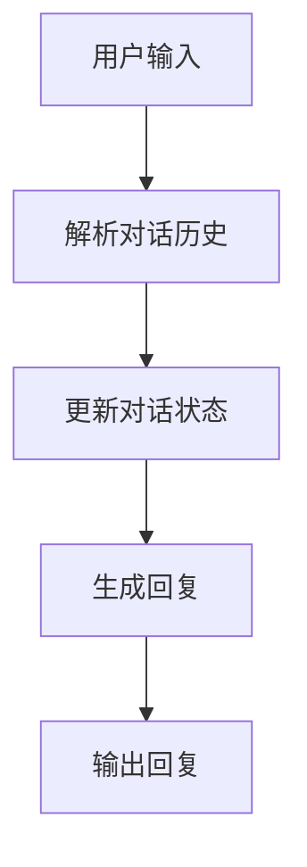
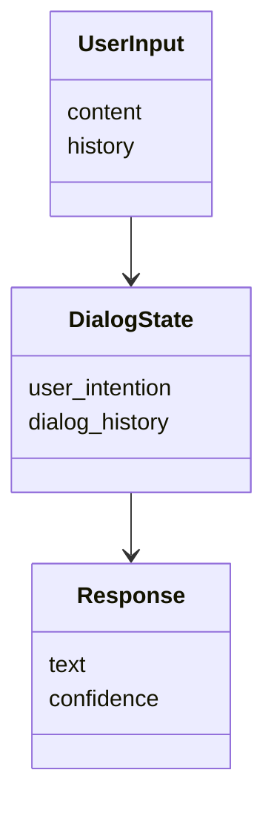
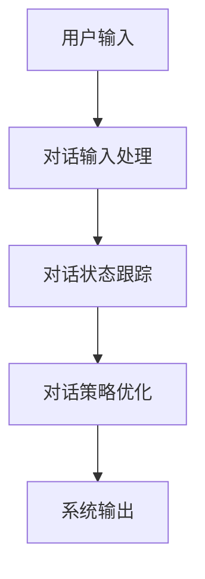

                 


# AI Agent的多轮对话能力增强

> 关键词：AI Agent, 多轮对话, 对话系统, 强化学习, 对话状态跟踪, 上下文管理, 对话策略优化

> 摘要：本文深入探讨了AI Agent在多轮对话中的能力增强方法，从背景分析、核心概念、算法原理、系统架构到项目实战，全面解析了如何提升AI Agent的多轮对话能力。文章结合理论与实践，通过详细的算法流程、系统设计和代码实现，帮助读者全面理解并掌握多轮对话能力增强的核心技术。

---

## 第1章: 多轮对话的背景与挑战

### 1.1 多轮对话的背景

#### 1.1.1 对话系统的演变
对话系统经历了从简单规则驱动到复杂深度学习模型的演变过程。早期的对话系统基于规则，通过预定义的关键词和规则进行简单的输入输出匹配。随着自然语言处理技术的发展，基于神经网络的对话系统逐渐成为主流，进一步推动了对话系统的智能化和个性化。

#### 1.1.2 多轮对话的重要性
在实际应用场景中，单轮对话难以满足复杂的需求。例如，在智能客服、智能助手等领域，用户通常需要通过多轮对话来完成复杂的任务，如问题咨询、信息查询、任务执行等。多轮对话能够更好地理解用户意图，提供更精准的服务。

#### 1.1.3 AI Agent在多轮对话中的角色
AI Agent作为对话系统的主体，负责接收用户的输入，理解用户意图，并通过多轮对话逐步解决问题。AI Agent的核心能力在于能够根据上下文信息，动态调整对话策略，提供更自然、更智能的对话体验。

---

### 1.2 多轮对话的核心问题

#### 1.2.1 对话目标的多样性
在多轮对话中，每个对话的目标可能不同，例如信息查询、任务执行、情感交流等。AI Agent需要能够识别和切换不同的对话目标，灵活应对用户的多样化需求。

#### 1.2.2 上下文的理解与记忆
多轮对话的关键在于对上下文的理解和记忆。AI Agent需要能够记住之前的对话内容，理解当前对话的上下文信息，并根据这些信息生成合适的回复。

#### 1.2.3 对话策略的复杂性
多轮对话中，对话策略的制定和执行面临较大的复杂性。AI Agent需要在每一轮对话中动态调整策略，考虑用户意图、对话历史、系统目标等多个因素。

---

### 1.3 当前挑战与解决方案

#### 1.3.1 现有技术的局限性
当前的对话系统在多轮对话中仍存在一些问题，例如上下文理解不准确、对话策略不够灵活、对话状态跟踪不够精确等。这些问题限制了AI Agent在复杂场景下的应用效果。

#### 1.3.2 增强多轮对话能力的关键技术
为了增强AI Agent的多轮对话能力，可以从以下几个方面入手：
1. 对话状态跟踪技术：准确记录和更新对话状态，帮助系统理解当前对话的上下文信息。
2. 上下文管理技术：通过记忆网络、注意力机制等方法，增强系统对上下文的理解和记忆能力。
3. 对话策略优化技术：通过强化学习、多目标优化等方法，提升对话策略的灵活性和适应性。

#### 1.3.3 解决方案的对比分析
本文将重点分析基于强化学习的对话状态跟踪和上下文管理技术，以及基于多目标优化的对话策略优化方法。通过对比不同解决方案的优缺点，帮助读者更好地理解如何增强AI Agent的多轮对话能力。

---

## 第2章: 多轮对话的核心概念与联系

### 2.1 对话系统的核心原理

#### 2.1.1 对话模型的输入输出机制
对话模型的输入通常包括用户的历史对话记录和当前输入，输出是系统的回复。为了增强多轮对话能力，输入需要包含丰富的上下文信息，输出则需要根据上下文生成合适的回复。

#### 2.1.2 对话状态的表示与更新
对话状态是多轮对话的核心，通常包括用户意图、对话历史、系统目标等信息。通过有效的对话状态表示方法，可以帮助系统更好地理解当前对话的上下文信息。

#### 2.1.3 对话策略的制定与执行
对话策略是AI Agent在每一轮对话中选择最佳回复的规则或模型。策略的制定需要考虑用户意图、对话历史、系统目标等多个因素。

---

### 2.2 多轮对话的关键属性对比

#### 2.2.1 基于规则的对话系统
基于规则的对话系统通过预定义的规则来生成回复，适用于简单的对话场景。其优点是实现简单、可解释性强，但灵活性较差，难以应对复杂的对话场景。

#### 2.2.2 基于模型的对话系统
基于模型的对话系统通过深度学习模型（如Transformer、BERT等）生成回复，能够更好地理解上下文信息，生成更自然的回复。其缺点是需要大量数据和计算资源，实现复杂。

#### 2.2.3 基于强化学习的对话系统
基于强化学习的对话系统通过强化学习算法优化对话策略，能够动态调整回复内容，适应不同的对话场景。其优点是灵活性高、适应性强，但训练过程复杂，需要大量的交互数据。

---

### 2.3 实体关系图与流程图

#### 2.3.1 多轮对话的ER实体关系图
```mermaid
erDiagram
    user <--> message
    message <--> dialog_history
    dialog_history <--> dialog_state
    dialog_state <--> response
```

#### 2.3.2 多轮对话的流程图分析


---

## 第3章: 对话状态跟踪算法

### 3.1 对话状态跟踪的原理

#### 3.1.1 对话历史的提取与处理
对话历史是对话状态跟踪的重要输入，需要对对话历史进行清洗、去重、序列化等处理，以便后续算法的使用。

#### 3.1.2 对话状态的表示方法
对话状态可以通过向量、图结构、文本等多种方式表示。常用的表示方法包括基于词嵌入的向量表示和基于注意力机制的图结构表示。

#### 3.1.3 对话状态的更新机制
对话状态的更新需要根据新的输入和对话历史进行调整。常用的更新机制包括基于RNN的序列更新和基于Transformer的注意力更新。

---

### 3.2 基于强化学习的对话状态跟踪

#### 3.2.1 强化学习的基本原理
强化学习通过定义奖励函数，引导AI Agent在对话过程中逐步优化对话策略。奖励函数通常基于对话的完成度、用户满意度等指标。

#### 3.2.2 对话状态跟踪的奖励机制
对话状态跟踪的奖励机制需要考虑多个因素，例如回复的准确性、对话的连贯性等。通过奖励机制的优化，可以提升对话状态跟踪的准确性和效率。

#### 3.2.3 算法实现与优化
基于强化学习的对话状态跟踪算法可以通过训练神经网络模型实现。常用的算法包括基于Actor-Critic的对话状态跟踪和基于PPO的对话状态跟踪。

---

## 第4章: 上下文管理与对话记忆

### 4.1 上下文管理的核心算法

#### 4.1.1 基于记忆网络的上下文管理
记忆网络是一种基于神经网络的上下文管理方法，通过记忆模块记录对话历史信息，帮助系统更好地理解上下文。

#### 4.1.2 基于注意力机制的上下文管理
注意力机制通过关注重要的对话历史信息，提升上下文理解的准确性和效率。

#### 4.1.3 基于图结构的上下文管理
图结构上下文管理通过构建对话历史的图结构，帮助系统更好地理解对话的逻辑关系。

---

### 4.2 对话记忆的实现方法

#### 4.2.1 基于神经网络的记忆模块
神经网络记忆模块通过训练神经网络模型，记录和更新对话历史信息。

#### 4.2.2 基于规则的记忆模块
基于规则的记忆模块通过预定义的规则，记录和更新对话历史信息。

#### 4.2.3 混合记忆模块的设计与实现
混合记忆模块结合神经网络和规则两种方法，通过互补的方式提升对话记忆的准确性和效率。

---

## 第5章: 对话策略优化算法

### 5.1 对话策略优化的基本原理

#### 5.1.1 基于规则的对话策略
基于规则的对话策略通过预定义的规则，生成回复内容。适用于简单的对话场景。

#### 5.1.2 基于模型的对话策略
基于模型的对话策略通过深度学习模型生成回复内容，适用于复杂的对话场景。

#### 5.1.3 基于强化学习的对话策略
基于强化学习的对话策略通过优化奖励函数，动态调整回复内容，适用于复杂的对话场景。

---

### 5.2 增强对话策略的具体方法

#### 5.2.1 基于反馈的策略优化
通过用户反馈优化对话策略，提升用户满意度和对话效果。

#### 5.2.2 基于多目标的策略优化
通过多目标优化，平衡不同的对话目标，例如准确性、流畅性等。

#### 5.2.3 基于对抗训练的策略优化
通过对抗训练，提升对话策略的多样性和鲁棒性。

---

## 第6章: 系统架构与项目实战

### 6.1 系统功能设计

#### 6.1.1 对话输入处理模块
对话输入处理模块负责接收用户的输入，并进行预处理，例如分词、去停用词等。

#### 6.1.2 对话状态跟踪模块
对话状态跟踪模块负责记录和更新对话状态，帮助系统理解上下文信息。

#### 6.1.3 对话策略优化模块
对话策略优化模块负责根据对话状态和用户反馈，优化对话策略，生成回复内容。

---

### 6.2 系统架构设计

#### 6.2.1 领域模型类图


#### 6.2.2 系统架构图


---

## 第7章: 项目实战

### 7.1 环境安装

#### 7.1.1 安装Python
```bash
python --version
```

#### 7.1.2 安装依赖库
```bash
pip install numpy matplotlib tensorflow
```

---

### 7.2 系统核心实现源代码

#### 7.2.1 对话状态跟踪模块
```python
class DialogStateTracker:
    def __init__(self):
        self.history = []
        self.current_state = {}

    def update_state(self, input_text):
        self.history.append(input_text)
        self.current_state['latest_input'] = input_text
        self.current_state['dialog_length'] = len(self.history)
```

#### 7.2.2 对话策略优化模块
```python
class DialogStrategyOptimizer:
    def __init__(self):
        self.rewards = []
        self.current_reward = 0

    def update_reward(self, reward):
        self.rewards.append(reward)
        self.current_reward = sum(self.rewards[-5:])/5
```

---

### 7.3 代码应用解读与分析

#### 7.3.1 对话状态跟踪模块解读
对话状态跟踪模块通过记录对话历史，更新对话状态，帮助系统理解上下文信息。每次新的输入都会更新对话状态，保持对话的连贯性。

#### 7.3.2 对话策略优化模块解读
对话策略优化模块通过动态调整奖励函数，优化对话策略。每次对话结束后，系统会根据用户反馈调整奖励函数，提升对话效果。

---

## 第8章: 最佳实践

### 8.1 小结
本文详细探讨了AI Agent的多轮对话能力增强方法，从背景分析、核心概念、算法原理到系统架构和项目实战，全面解析了如何提升AI Agent的多轮对话能力。

### 8.2 注意事项
在实际应用中，需要注意以下几点：
1. 对话状态跟踪的准确性是多轮对话的核心，需要通过不断优化算法提升准确率。
2. 对话策略的灵活性是多轮对话的关键，需要通过强化学习和多目标优化等方法提升系统的适应性。
3. 对话系统的可解释性是用户体验的重要因素，需要通过设计合理的反馈机制，提升用户的信任感和满意度。

### 8.3 拓展阅读
推荐以下几本书籍和论文，供读者深入学习：
1. 《深度学习》—— Ian Goodfellow
2. 《强化学习》—— Richard S. Sutton
3. 《自然语言处理实战》—— 袁春

---

通过本文的学习，读者可以全面掌握AI Agent的多轮对话能力增强的核心技术，并能够将这些技术应用到实际项目中，提升AI Agent的对话能力和用户体验。

