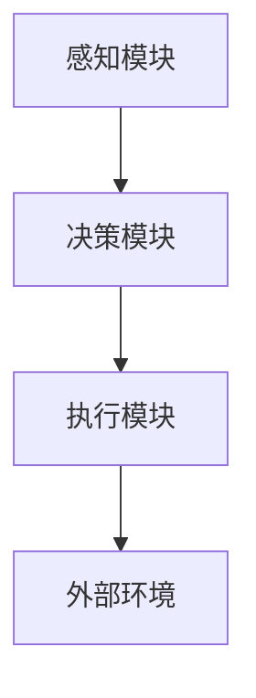

                 


# AI Agent的安全性设计：防御攻击和隐私保护

> 关键词：AI Agent, 安全性设计, 防御攻击, 隐私保护, 数据加密, 对抗样本, 安全威胁

> 摘要：本文深入探讨了AI Agent的安全性设计，从防御攻击到隐私保护，结合实际案例和系统架构设计，详细分析了AI Agent在安全性和隐私保护方面面临的挑战和解决方案。文章通过详细的算法原理和系统架构设计，展示了如何在实际项目中实现安全的AI Agent。

---

# 第1章: AI Agent的安全性概述

## 1.1 AI Agent的基本概念

### 1.1.1 AI Agent的定义与特点
AI Agent（人工智能代理）是一种能够感知环境、自主决策并执行任务的智能实体。AI Agent的特点包括自主性、反应性、目标导向性和社交能力。它们可以是软件程序、机器人或其他智能设备，广泛应用于自动驾驶、智能助手、推荐系统等领域。

### 1.1.2 AI Agent的类型与应用场景
AI Agent可以分为简单反射型、基于模型的反射型、目标驱动型和实用驱动型。应用场景包括自动驾驶（如特斯拉的Autopilot）、智能助手（如Siri、Alexa）、推荐系统（如Netflix的推荐算法）等。

### 1.1.3 AI Agent的安全性问题背景
随着AI Agent的应用越来越广泛，其安全性问题日益突出。例如，自动驾驶系统可能受到网络攻击，智能助手可能被恶意指令操控，推荐系统可能泄露用户隐私。这些问题可能导致严重的经济损失或隐私泄露。

## 1.2 AI Agent的安全威胁与风险

### 1.2.1 常见的安全威胁类型
AI Agent面临的主要安全威胁包括：
1. **网络攻击**：通过恶意代码或数据注入攻击AI Agent。
2. **对抗样本攻击**：攻击者通过修改输入数据，使AI Agent产生错误决策。
3. **隐私泄露**：AI Agent在处理数据时可能泄露用户隐私信息。
4. **数据中毒**：攻击者通过污染训练数据，降低AI Agent的性能或使其做出错误决策。

### 1.2.2 安全风险的来源与影响
安全风险的来源包括外部攻击者、数据泄露、内部恶意行为等。这些风险可能导致AI Agent的行为失控，造成严重的经济损失或社会危害。

### 1.2.3 安全性问题的边界与外延
AI Agent的安全性问题不仅涉及技术层面，还包括法律、伦理和用户信任等多个方面。例如，AI Agent的决策失误可能引发法律纠纷，隐私泄露可能破坏用户信任。

## 1.3 AI Agent的安全性目标与挑战

### 1.3.1 安全性目标的定义
AI Agent的安全性目标包括：
1. **完整性**：确保AI Agent的决策和行为符合预期。
2. **保密性**：保护AI Agent的隐私数据不被未经授权的访问。
3. **可用性**：确保AI Agent在遭受攻击时仍能正常运行。

### 1.3.2 实现安全性目标的挑战
实现AI Agent的安全性目标面临以下挑战：
1. **复杂性**：AI Agent涉及多个模块和复杂算法，难以全面保障安全性。
2. **动态性**：AI Agent的环境和任务可能动态变化，难以预测和防御所有威胁。
3. **资源限制**：AI Agent的计算资源有限，难以同时兼顾性能和安全性。

### 1.3.3 安全性设计的核心要素
安全性设计的核心要素包括：
1. **输入验证**：确保输入数据的合法性。
2. **访问控制**：限制未经授权的访问。
3. **异常检测**：及时发现和应对异常行为。
4. **隐私保护**：保护用户隐私数据不被滥用。

## 1.4 本章小结
本章介绍了AI Agent的基本概念、安全威胁与风险，以及安全性目标与挑战。接下来的章节将深入探讨AI Agent的核心概念与联系，防御攻击的算法原理，隐私保护的实现方法，系统架构设计，实际项目案例，以及最佳实践。

---

# 第2章: AI Agent的核心概念与联系

## 2.1 AI Agent的核心概念原理

### 2.1.1 AI Agent的组成与功能
AI Agent由感知模块、决策模块和执行模块组成。感知模块负责接收外部输入，决策模块负责处理信息并制定决策，执行模块负责执行决策并输出结果。

### 2.1.2 AI Agent的决策机制
AI Agent的决策机制包括基于规则的决策、基于模型的决策和基于强化学习的决策。每种决策机制都有其优缺点。

### 2.1.3 AI Agent的交互方式
AI Agent可以通过文本交互、图形交互和语音交互与用户进行互动。不同的交互方式会影响AI Agent的安全性设计。

## 2.2 核心概念属性特征对比

### 2.2.1 不同AI Agent类型的安全性对比
下表对比了不同AI Agent类型的安全性特点：

| AI Agent类型 | 安全性特点                |
|---------------|--------------------------|
| 简单反射型     | 安全性较低，易受攻击      |
| 基于模型的反射型 | 安全性较高，但复杂性高    |
| 目标驱动型     | 安全性中等，目标明确      |
| 实用驱动型     | 安全性较高，注重效益最大化 |

### 2.2.2 安全威胁与防御策略的对比
下表对比了常见安全威胁与防御策略：

| 安全威胁       | 防御策略                 |
|----------------|--------------------------|
| 网络攻击       | 加密通信、防火墙         |
| 对抗样本攻击   | 对抗训练、鲁棒优化       |
| 隐私泄露       | 数据加密、匿名化处理     |
| 数据中毒       | 数据清洗、鲁棒训练       |

### 2.2.3 隐私保护与数据处理的对比
下表对比了隐私保护与数据处理的不同方式：

| 隐私保护技术     | 数据处理方式             |
|------------------|--------------------------|
| 数据加密         | 加密存储、加密传输       |
| 差分隐私         | 隐私保护、数据模糊化处理 |
| 匿名化处理       | 去标识化、数据脱敏       |

## 2.3 ER实体关系图架构

```mermaid
er
  actor: 用户
  agent: AI Agent
  threat: 安全威胁
  defense: 防御策略
  privacy: 隐私数据
  relation1: 用户 -> AI Agent
  relation2: 安全威胁 -> 防御策略
  relation3: 隐私数据 -> 防御策略
```

## 2.4 本章小结
本章通过对比分析，展示了AI Agent的核心概念与联系，为后续的安全性设计奠定了基础。接下来的章节将详细讲解AI Agent的防御攻击算法原理。

---

# 第3章: AI Agent的防御攻击算法原理

## 3.1 常见的攻击类型与防御策略

### 3.1.1 注入攻击与防御
注入攻击是通过恶意输入数据，使AI Agent执行 unintended 操作。防御策略包括输入验证和过滤敏感字符。

### 3.1.2 对抗样本攻击与防御
对抗样本攻击是通过修改输入数据，使AI Agent产生错误决策。防御策略包括对抗训练和鲁棒优化。

### 3.1.3 操纵攻击与防御
操纵攻击是通过操控AI Agent的决策过程，使其做出有利于攻击者的决策。防御策略包括行为监控和异常检测。

## 3.2 防御攻击的算法实现

### 3.2.1 输入验证算法
输入验证算法通过正则表达式验证输入数据的合法性。代码示例如下：

```python
import re

def validate_input(input_str):
    pattern = r'^[a-zA-Z0-9@#$%^&*()_+{}[\]]{8,}$'
    if re.match(pattern, input_str):
        return True
    else:
        return False
```

### 3.2.2 对抗训练算法
对抗训练算法通过生成对抗样本，增强AI Agent的鲁棒性。数学模型如下：

$$
\min_{\theta} \max_{\alpha} \mathcal{L}(x, y) + \lambda \mathcal{L}(x', y')
$$

其中，$\theta$是模型参数，$\alpha$是对抗扰动，$\lambda$是正则化系数。

## 3.3 算法实现的数学模型

### 3.3.1 对抗训练的数学模型
对抗训练的数学模型如下：

$$
\min_{\theta} \max_{\alpha} \mathcal{L}(x, y) + \lambda \mathcal{L}(x', y')
$$

其中，$\mathcal{L}(x, y)$是原始损失函数，$\mathcal{L}(x', y')$是对抗样本的损失函数。

### 3.3.2 鲁棒优化的数学模型
鲁棒优化的数学模型如下：

$$
\min_{\theta} \mathbb{E}_{x \sim \mathcal{D}} \max_{\alpha} \mathcal{L}(x + \delta, y)
$$

其中，$\delta$是对抗扰动，$\mathcal{D}$是数据分布。

## 3.4 本章小结
本章详细讲解了AI Agent的防御攻击算法原理，包括常见的攻击类型、防御策略和算法实现。接下来的章节将深入探讨隐私保护的实现方法。

---

# 第4章: AI Agent的隐私保护算法与技术

## 4.1 隐私保护的核心技术

### 4.1.1 数据加密技术
数据加密技术包括对称加密（如AES）和非对称加密（如RSA）。加密算法可以保护数据的 confidentiality。

### 4.1.2 数据脱敏技术
数据脱敏技术通过去标识化和数据模糊化处理，保护用户隐私。

### 4.1.3 差分隐私技术
差分隐私技术通过添加噪声，保护数据的隐私性。数学模型如下：

$$
\text{Privacy Amplification Factor} = \epsilon \cdot \text{Sensitivity}
$$

其中，$\epsilon$是隐私预算，Sensitivity是数据敏感性。

## 4.2 隐私保护的实现方法

### 4.2.1 数据加密实现
数据加密实现代码示例如下：

```python
from cryptography.fernet import Fernet

key = Fernet.generate_key()
cipher = Fernet(key)
encrypted_data = cipher.encrypt(b"Sensitive data")
```

### 4.2.2 差分隐私实现
差分隐私实现代码示例如下：

```python
import numpy as np

def add_noise(data, epsilon, sensitivity):
    noise = np.random.laplace(0, sensitivity / epsilon)
    return data + noise
```

### 4.2.3 数据脱敏实现
数据脱敏实现代码示例如下：

```python
def anonymize_data(data):
    return data.anonymize()
```

## 4.3 本章小结
本章详细讲解了AI Agent的隐私保护技术，包括数据加密、数据脱敏和差分隐私。接下来的章节将探讨系统架构设计。

---

# 第5章: AI Agent的系统架构与设计方案

## 5.1 系统架构设计

### 5.1.1 系统功能模块
AI Agent的系统功能模块包括感知模块、决策模块和执行模块。模块化设计有助于提高系统的可维护性和扩展性。

### 5.1.2 系统架构图
下图展示了AI Agent的系统架构：



### 5.1.3 系统交互流程
系统交互流程如下：

1. 感知模块接收外部输入。
2. 决策模块处理输入并制定决策。
3. 执行模块执行决策并输出结果。
4. 外部环境反馈结果，系统进入下一个循环。

## 5.2 本章小结
本章通过系统架构设计，展示了AI Agent的安全性设计的整体框架。接下来的章节将通过实际案例，详细讲解AI Agent的实现过程。

---

# 第6章: AI Agent的项目实战

## 6.1 项目背景与目标

### 6.1.1 项目背景
本项目旨在设计一个具备高安全性的AI Agent，能够防御网络攻击并保护用户隐私。

### 6.1.2 项目目标
项目目标包括：
1. 实现输入验证和数据加密。
2. 实现对抗训练和差分隐私。
3. 实现系统架构设计和异常检测。

## 6.2 系统核心实现

### 6.2.1 输入验证实现
输入验证实现代码示例如下：

```python
import re

def validate_input(input_str):
    pattern = r'^[a-zA-Z0-9@#$%^&*()_+{}[\]]{8,}$'
    if re.match(pattern, input_str):
        return True
    else:
        return False
```

### 6.2.2 对抗训练实现
对抗训练实现代码示例如下：

```python
import numpy as np

def generate_adversarial_sample(x, y, model, epsilon=0.1):
    with tf.GradientTape() as tape:
        tape.watch(x)
        y_pred = model(x)
        loss = tf.keras.losses.sparse_categorical_crossentropy(y, y_pred)
    gradient = tape.gradient(loss, x)
    x_adv = x - epsilon * gradient
    return x_adv
```

### 6.2.3 差分隐私实现
差分隐私实现代码示例如下：

```python
import numpy as np

def add_noise(data, epsilon, sensitivity):
    noise = np.random.laplace(0, sensitivity / epsilon)
    return data + noise
```

## 6.3 项目小结
本章通过实际案例，展示了AI Agent的安全性设计的实现过程。接下来的章节将总结最佳实践和注意事项。

---

# 第7章: AI Agent的安全性设计最佳实践

## 7.1 小结

### 7.1.1 核心概念总结
AI Agent的安全性设计需要综合考虑完整性、保密性和可用性。

### 7.1.2 技术总结
AI Agent的安全性设计需要结合输入验证、数据加密、对抗训练和差分隐私等多种技术。

## 7.2 注意事项

### 7.2.1 安全性设计的注意事项
1. 定期进行安全评估和漏洞测试。
2. 避免过度依赖单一安全技术。
3. 保持系统的可扩展性和可维护性。

### 7.2.2 隐私保护的注意事项
1. 遵守相关法律法规，保护用户隐私。
2. 透明化处理数据使用情况。
3. 定期更新隐私保护策略。

## 7.3 最佳实践

### 7.3.1 代码审查
定期进行代码审查，确保代码的安全性和可维护性。

### 7.3.2 日志监控
实时监控系统日志，及时发现异常行为。

### 7.3.3 安全培训
定期进行安全培训，提高开发人员的安全意识。

## 7.4 拓展阅读
推荐阅读以下书籍和论文：
1. 《深度学习安全》
2. 《差分隐私：理论与应用》
3. 《人工智能的伦理与安全》

## 7.5 本章小结
本章总结了AI Agent的安全性设计的最佳实践，为实际应用提供了参考。希望读者能够结合实际需求，灵活运用这些方法，设计出更安全的AI Agent。

---

# 结语
通过本文的详细讲解，读者可以全面了解AI Agent的安全性设计，包括防御攻击和隐私保护的核心技术与实际应用。希望本文能够为AI Agent的安全性设计提供有价值的参考和指导。

---

**关键词**：AI Agent, 安全性设计, 防御攻击, 隐私保护, 数据加密, 对抗样本, 安全威胁

