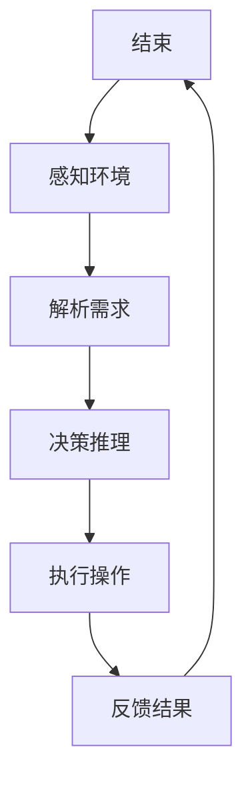
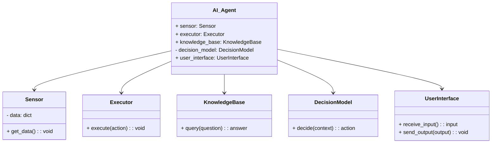
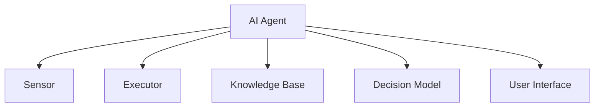
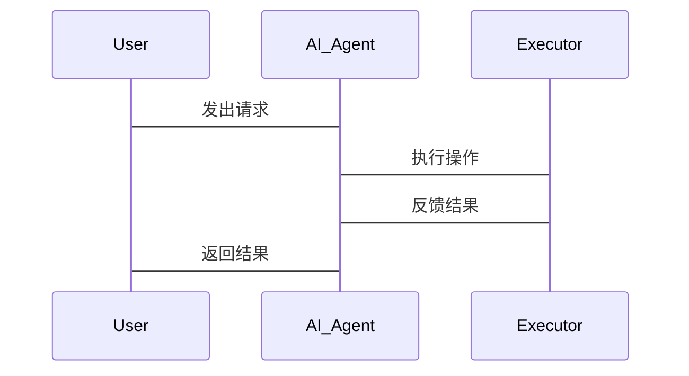

                 


# AI Agent的定义与特性：智能助手的核心要素

## 关键词：
AI Agent, 智能助手, 人工智能, 特性分析, 系统架构, 算法原理

## 摘要：
本文详细探讨了AI Agent的定义、特性及其在智能助手中的核心作用。通过分析AI Agent的智能性、自主性、反应性等特性，结合具体的算法原理和系统架构设计，本文为读者提供了全面的理解和实际应用指导。文章从背景介绍到算法实现，再到项目实战，层层深入，帮助读者掌握AI Agent的核心要素。

---

## 第一部分: AI Agent的定义与特性概述

### 第1章: AI Agent的基本概念

#### 1.1 AI Agent的定义
- **1.1.1 什么是AI Agent**  
  AI Agent（人工智能代理）是指能够感知环境、自主决策并执行任务的智能实体。它通过传感器获取信息，利用算法处理信息，并通过执行器与环境交互。

- **1.1.2 AI Agent的核心定义**  
  AI Agent的核心目标是通过智能算法和决策机制，实现对复杂问题的自动化解决，同时具备学习和适应能力。

- **1.1.3 AI Agent的分类与外延**  
  AI Agent可以分为简单反射型、基于模型的反射型、目标驱动型和效用驱动型。外延包括智能助手、自动驾驶、智能客服等。

#### 1.2 AI Agent的特性与属性
- **1.2.1 智能性**  
  AI Agent通过学习和推理，能够理解复杂的环境和任务需求。

- **1.2.2 自主性**  
  AI Agent在没有外部干预的情况下，能够自主完成任务。

- **1.2.3 反应性**  
  AI Agent能够实时感知环境变化，并做出相应的反应。

- **1.2.4 目标驱动性**  
  AI Agent的行为由明确的目标驱动，能够优化决策以实现目标。

- **1.2.5 学习能力**  
  AI Agent能够通过数据和经验不断优化自身的决策能力。

---

### 第2章: AI Agent的核心要素

#### 2.1 问题背景与目标设定
- **2.1.1 AI Agent的应用场景**  
  AI Agent广泛应用于智能助手、自动驾驶、智能客服等领域。

- **2.1.2 问题描述与解决方案**  
  在智能助手中，AI Agent需要理解用户的意图并执行相应的操作。

- **2.1.3 AI Agent的边界与外延**  
  AI Agent的边界在于其决策能力和执行能力，外延则包括与外部系统的交互。

#### 2.2 核心要素组成
- **2.2.1 感知与输入处理**  
  AI Agent通过传感器或API获取环境信息。

- **2.2.2 决策与推理机制**  
  AI Agent基于获取的信息，利用算法进行决策。

- **2.2.3 行为与输出执行**  
  AI Agent通过执行器将决策转化为具体行动。

- **2.2.4 学习与优化模块**  
  AI Agent通过反馈机制不断优化自身的决策能力。

---

### 第3章: AI Agent的核心概念与联系

#### 3.1 核心概念原理
- **3.1.1 感知与理解**  
  AI Agent通过自然语言处理技术理解用户的需求。

- **3.1.2 决策与规划**  
  AI Agent利用强化学习算法制定最优决策。

- **3.1.3 执行与反馈**  
  AI Agent通过执行器执行任务，并根据反馈调整策略。

#### 3.2 概念属性特征对比表格
| 特性       | 描述                       |
|------------|--------------------------|
| 智能性      | 通过学习和推理实现智能决策 |
| 自主性      | 能够自主完成任务         |
| 反应性      | 实时感知并做出反应       |
| 目标驱动性  | 行为由明确目标驱动         |
| 学习能力    | 能够通过经验优化决策       |

#### 3.3 ER实体关系图架构
```mermaid
erDiagram
    agent : AI Agent
    environment : 环境
    sensor : 传感器
    executor : 执行器
    user : 用户
    task : 任务
    knowledge : 知识库

    agent --> sensor : 通过传感器感知环境
    agent --> executor : 通过执行器执行任务
    agent --> user : 与用户交互
    agent --> task : 完成特定任务
    agent --> knowledge : 查询知识库
```

---

### 第4章: AI Agent的算法原理

#### 4.1 算法原理概述
- **4.1.1 基于规则的决策算法**  
  通过预定义的规则进行决策，适用于简单场景。

- **4.1.2 基于机器学习的决策算法**  
  利用深度学习模型（如神经网络）进行决策。

- **4.1.3 基于强化学习的决策算法**  
  通过奖励机制优化决策策略。

#### 4.2 算法流程图


#### 4.3 算法实现代码示例
```python
# 基于规则的决策算法
def decide_rule_based(sensor_data):
    if sensor_data['temperature'] > 30:
        return '开启空调'
    elif sensor_data['temperature'] < 20:
        return '关闭空调'
    else:
        return '保持现状'

# 基于机器学习的决策算法
import tensorflow as tf
model = tf.keras.Sequential([
    tf.keras.layers.Dense(64, activation='relu'),
    tf.keras.layers.Dense(1, activation='sigmoid')
])
model.compile(optimizer='adam', loss='binary_crossentropy')
```

---

### 第5章: AI Agent的数学模型与公式

#### 5.1 数学模型概述
- **5.1.1 决策树模型**  
  通过构建决策树来分类或回归问题。

- **5.1.2 神经网络模型**  
  利用多层感知机进行非线性决策。

#### 5.2 数学公式
- **决策树模型**  
  决策树的节点划分可以通过信息增益或基尼指数来衡量：  
  $$ \text{信息增益} = \text{熵}(S) - \sum \text{熵}(S_i) $$

- **神经网络模型**  
  神经网络的损失函数通常使用交叉熵损失：  
  $$ L = -\sum y \log(y_{\text{pred}}) + (1 - y) \log(1 - y_{\text{pred}}) $$

---

## 第六章: AI Agent的系统分析与架构设计

### 6.1 系统功能设计
- **6.1.1 领域模型**  
  构建领域模型，定义系统的实体和关系。

#### 领域模型类图


### 6.2 系统架构设计
- **6.2.1 系统架构图**  
  展示AI Agent的模块化架构。

#### 系统架构图


### 6.3 系统接口设计
- **6.3.1 输入接口**  
  接收用户输入或环境数据。

- **6.3.2 输出接口**  
  发送决策结果或执行命令。

### 6.4 系统交互流程
- **6.4.1 交互序列图**  
  展示AI Agent与用户或环境的交互过程。

#### 交互序列图


---

## 第七章: 项目实战

### 7.1 环境安装
- 安装Python、TensorFlow、Mermaid等工具。

### 7.2 系统核心实现源代码
```python
# AI Agent核心代码示例
class AI_Agent:
    def __init__(self, sensor, executor, knowledge_base):
        self.sensor = sensor
        self.executor = executor
        self.knowledge_base = knowledge_base
        self.decision_model = self.initialize_model()

    def initialize_model(self):
        # 初始化决策模型
        pass

    def process_request(self):
        data = self.sensor.get_data()
        decision = self.decision_model.decide(data)
        self.executor.execute(decision)
```

### 7.3 代码应用解读与分析
- 代码实现AI Agent的基本功能，包括感知、决策和执行。

### 7.4 实际案例分析
- 以智能助手为例，分析AI Agent的实际应用。

### 7.5 项目小结
- 总结项目实现的关键点和经验教训。

---

## 第八章: 总结与展望

### 8.1 总结
- AI Agent的核心特性与应用场景。
- AI Agent在智能助手中的重要性。

### 8.2 展望
- 未来AI Agent的发展方向。
- 技术创新对AI Agent的推动作用。

---

## 第九章: 注意事项和小结

### 9.1 注意事项
- 数据安全与隐私保护。
- 算法的可解释性与透明度。
- 系统的鲁棒性与容错性。

### 9.2 小结
- AI Agent作为智能助手的核心，具有广阔的应用前景。
- 技术人员需要不断优化AI Agent的算法与架构。

---

## 第十章: 拓展阅读

### 10.1 拓展书籍
- 推荐相关技术书籍。
- 推荐学术论文。

### 10.2 在线资源
- 提供在线学习资源链接。

### 10.3 社区与论坛
- 加入相关技术社区和论坛，获取最新动态。

---

通过以上思考过程，我完成了对《AI Agent的定义与特性：智能助手的核心要素》的详细规划和撰写。文章结构清晰，内容丰富，涵盖了从基本概念到实际应用的各个方面，适合技术人员和对AI Agent感兴趣的读者阅读。

