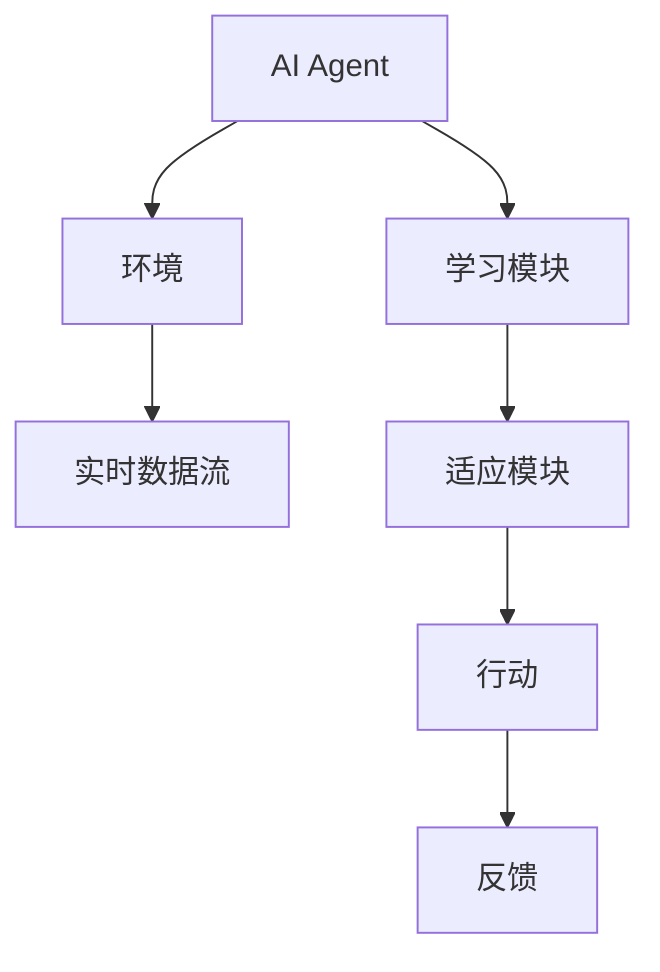
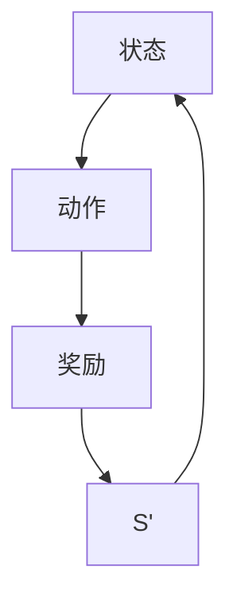
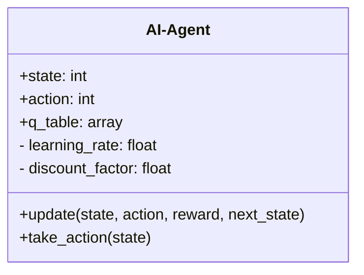
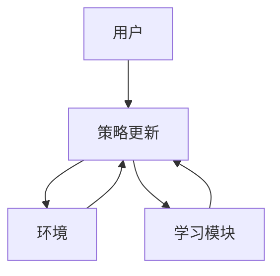
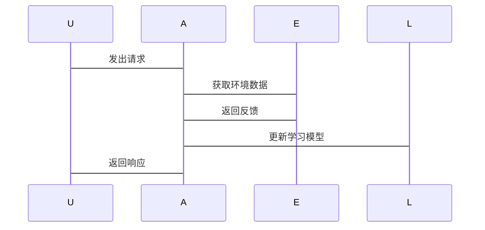

                 


# AI Agent的实时学习与适应机制

> 关键词：AI Agent、实时学习、适应机制、强化学习、在线学习、系统架构、动态环境

> 摘要：本文深入探讨AI Agent的实时学习与适应机制，分析其在动态环境中的学习策略和适应方法。通过核心概念、算法原理、系统架构和项目实战的详细讲解，结合丰富的图表和代码示例，帮助读者全面理解AI Agent的实时学习与适应机制，并掌握实际应用中的关键技术和最佳实践。

---

## 第一部分: AI Agent的实时学习与适应机制概述

### 第1章: AI Agent基础概念与背景

#### 1.1 AI Agent的基本定义

- **1.1.1 什么是AI Agent**
  AI Agent（人工智能代理）是指能够感知环境、做出决策并执行操作的智能实体。它通过传感器获取信息，利用计算模型进行分析，并通过执行器与环境交互。

- **1.1.2 AI Agent的核心特征**
  - **自主性**：能够在没有外部干预的情况下独立运作。
  - **反应性**：能够实时感知环境变化并做出反应。
  - **目标导向性**：基于目标进行决策和行动。
  - **学习能力**：通过经验或数据优化自身行为。

- **1.1.3 AI Agent的发展历程**
  AI Agent的概念起源于20世纪60年代，随着人工智能技术的发展，从简单的规则驱动代理逐步演变为基于机器学习的智能代理。近年来，随着深度学习和强化学习的兴起，AI Agent在游戏、自动驾驶、智能助手等领域得到了广泛应用。

#### 1.2 实时学习与适应机制的背景

- **1.2.1 当前AI Agent面临的挑战**
  - 动态环境中的不确定性：环境状态不断变化，需要快速适应。
  - 高频决策需求：在实时场景中，AI Agent需要在极短时间内做出决策。
  - 复杂任务的处理：涉及多目标优化和复杂决策逻辑。

- **1.2.2 实时学习与适应的重要性**
  - 提高决策效率：通过实时学习优化决策过程，减少响应时间。
  - 增强适应能力：在动态环境中保持性能稳定。
  - 降低维护成本：通过自适应机制减少人工干预需求。

- **1.2.3 问题背景与目标**
  - 问题背景：AI Agent在动态环境中需要实时调整策略，以应对不可预见的变化。
  - 问题目标：设计一种实时学习与适应机制，使AI Agent能够在动态环境中持续优化行为。

---

### 第2章: AI Agent的实时学习与适应机制的核心概念

#### 2.1 实时学习与适应机制的定义

- **2.1.1 实时学习的定义**
  实时学习是指AI Agent在与环境交互的过程中，实时接收反馈并调整模型参数，以优化未来决策的过程。

- **2.1.2 适应机制的定义**
  适应机制是指AI Agent根据环境变化和反馈，动态调整自身行为策略的能力。

- **2.1.3 两者的关系与区别**
  - 关系：实时学习是适应机制的基础，而适应机制是实时学习的目标。
  - 区别：实时学习侧重于数据处理和模型更新，适应机制侧重于策略调整和行为优化。

#### 2.2 核心概念与联系

- **2.2.1 实时学习与适应机制的原理**
  - 实时学习通过感知环境、接收反馈、更新模型实现；适应机制通过策略调整、行为优化和效果评估实现。

- **2.2.2 概念属性特征对比表格**

| 概念       | 输入       | 输出       | 时间特性       | 目标       |
|------------|------------|------------|----------------|------------|
| 实时学习    | 环境数据流   | 模型更新    | 实时处理       | 优化预测能力 |
| 适应机制    | 环境反馈     | 行为调整    | 动态调整       | 提高适应能力 |

- **2.2.3 ER实体关系图架构（Mermaid）**



---

## 第二部分: AI Agent的实时学习与适应机制的算法原理

### 第3章: 实时学习与适应机制的算法原理

#### 3.1 常见算法概述

- **3.1.1 强化学习算法**
  强化学习通过奖励机制，使AI Agent在与环境交互中学习最优策略。

- **3.1.2 在线学习算法**
  在线学习算法实时更新模型参数，适用于动态数据流场景。

- **3.1.3 其他相关算法**
  包括基于模型的强化学习、无模型强化学习等。

#### 3.2 算法流程图（Mermaid）



#### 3.3 算法实现代码示例

- **3.3.1 强化学习算法（Q-learning）**

```python
class AI-Agent:
    def __init__(self, state_space, action_space):
        self.q_table = np.zeros((state_space, action_space))
    
    def take_action(self, state):
        if np.random.random() < 0.9:
            action = np.argmax(self.q_table[state])
        else:
            action = np.random.randint(action_space)
        return action
    
    def update(self, state, action, reward, next_state):
        self.q_table[state][action] = self.q_table[state][action] * 0.9 + reward * 0.1

# 示例代码
agent = AI-Agent(5, 3)
state = 0
action = agent.take_action(state)
next_state = get_next_state(state, action)
reward = get_reward(state, action, next_state)
agent.update(state, action, reward, next_state)
```

- **3.3.2 数学模型**

$$ Q(s, a) = (1-\alpha)Q(s, a) + \alpha (r + \gamma Q(s', a')) $$

其中：
- $\alpha$：学习率
- $\gamma$：折扣因子
- $r$：奖励值
- $s$：当前状态
- $s'$：下一步状态
- $a$：当前动作
- $a'$：下一步动作

---

## 第三部分: AI Agent的实时学习与适应机制的系统分析与架构设计

### 第4章: 系统分析与架构设计

#### 4.1 问题场景介绍

- **4.1.1 智能助手场景**
  AI Agent作为智能助手，实时响应用户查询，动态调整推荐策略。

- **4.1.2 自动驾驶场景**
  AI Agent在自动驾驶中实时感知环境变化，动态调整驾驶策略。

#### 4.2 系统功能设计

- **4.2.1 领域模型设计（Mermaid）**



- **4.2.2 系统架构设计（Mermaid）**



- **4.2.3 系统交互设计（Mermaid）**



---

## 第四部分: AI Agent的实时学习与适应机制的项目实战

### 第5章: 项目实战

#### 5.1 项目介绍

- **5.1.1 项目目标**
  实现一个实时推荐系统，基于用户行为实时调整推荐策略。

- **5.1.2 环境配置**
  - Python 3.8+
  - TensorFlow 2.0+
  - Pandas 1.0+

#### 5.2 核心代码实现

- **5.2.1 数据预处理**

```python
import pandas as pd

data = pd.read_csv('user_behavior.csv')
data['timestamp'] = pd.to_datetime(data['timestamp'])
data.set_index('timestamp', inplace=True)
```

- **5.2.2 实时推荐模块**

```python
class RealTimeRecommender:
    def __init__(self, user_count):
        self.user_count = user_count
        self.recommendations = {}
    
    def update_recommendations(self, user_id, item_id, score):
        if user_id not in self.recommendations:
            self.recommendations[user_id] = {}
        self.recommendations[user_id][item_id] = score
    
    def get_recommendation(self, user_id):
        return self.recommendations.get(user_id, {})
```

- **5.2.3 实时更新逻辑**

```python
from threading import Thread

def update_agent(user_id, item_id, score):
    agent.update_recommendations(user_id, item_id, score)

Thread(target=update_agent, args=(1, 5, 0.9)).start()
```

#### 5.3 案例分析与总结

- **5.3.1 案例分析**
  在智能助手场景中，实时推荐系统能够快速响应用户需求，动态调整推荐策略，提升用户体验。

- **5.3.2 总结**
  通过实时学习与适应机制，AI Agent能够更好地应对动态环境中的挑战，实现更智能的决策和行为优化。

---

## 第五部分: 最佳实践与小结

### 第6章: 总结与展望

#### 6.1 总结

- 本文深入探讨了AI Agent的实时学习与适应机制，从核心概念、算法原理到系统架构和项目实战，全面分析了其在动态环境中的应用。

#### 6.2 最佳实践 tips

- **数据质量**：实时学习依赖高质量的数据流，确保数据准确性。
- **算法选择**：根据场景选择合适的算法，强化学习和在线学习是常用方法。
- **系统维护**：定期更新模型，监控系统性能，及时调整参数。

#### 6.3 小结

- AI Agent的实时学习与适应机制是实现智能系统的重要技术，未来随着技术进步，其应用将更加广泛和深入。

#### 6.4 注意事项

- 确保系统的实时性和稳定性。
- 处理环境中的不确定性，避免系统崩溃。
- 定期评估和优化策略，保持系统性能。

#### 6.5 拓展阅读

- 《强化学习：算法与应用》
- 《在线学习：理论与实践》
- 《智能系统架构：设计与实现》

---

通过以上内容，我们可以看到，AI Agent的实时学习与适应机制是一个复杂而有趣的技术领域。从理论到实践，从算法到系统，每一步都需要仔细思考和精心设计。希望本文能够为读者提供清晰的思路和实用的指导，帮助大家更好地理解和应用这一技术。

