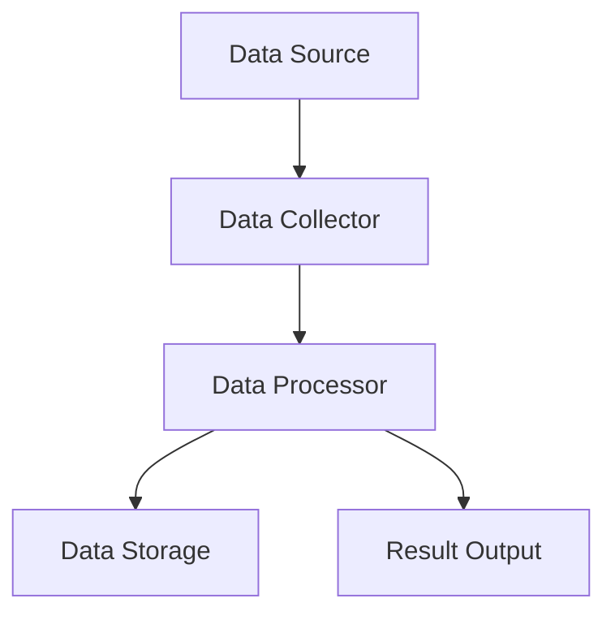

                 


# AI Agent的实时数据处理技术

## 关键词：AI Agent, 实时数据处理, 数据流处理, 事件驱动, 分布式系统, 算法原理

## 摘要：AI Agent是一种能够自主感知环境并执行任务的智能实体，其核心能力之一是实时数据处理。本文深入探讨AI Agent在实时数据处理中的技术细节，涵盖数据流处理模型、事件驱动机制、算法原理、系统架构设计以及实际应用案例。通过理论分析和实践结合，本文旨在为读者提供全面的技术视角，帮助理解AI Agent如何高效处理实时数据。

---

# 第一部分: AI Agent的实时数据处理技术概述

---

# 第1章: AI Agent与实时数据处理概述

## 1.1 AI Agent的基本概念

### 1.1.1 AI Agent的定义与特点
AI Agent（人工智能代理）是一种能够感知环境、自主决策并执行任务的智能实体。其核心特点包括：
- **自主性**：能够在无外部干预的情况下独立运作。
- **反应性**：能够实时感知环境变化并做出响应。
- **目标导向性**：具有明确的目标，并通过行动实现目标。
- **学习能力**：能够通过经验优化自身行为。

### 1.1.2 实时数据处理的核心概念
实时数据处理是指在数据生成的同时对其进行采集、分析和响应的过程。其核心特点包括：
- **低延迟**：数据处理必须在极短时间内完成。
- **高吞吐量**：能够处理大量数据流。
- **动态性**：数据流具有高度的动态性和不确定性。

### 1.1.3 AI Agent与实时数据处理的关系
AI Agent通过实时数据处理技术，能够快速感知环境变化，并根据实时数据做出最优决策。实时数据处理是AI Agent实现智能化的核心技术之一。

---

## 1.2 AI Agent的体系结构

### 1.2.1 反应式架构
反应式架构是一种基于当前感知环境做出实时反应的架构。其核心组件包括：
- **感知器**：负责感知环境数据。
- **行为器**：根据感知数据做出反应。

### 1.2.2 基于模型的架构
基于模型的架构通过构建环境模型来指导决策。其核心组件包括：
- **模型构建模块**：负责构建环境模型。
- **推理模块**：根据模型进行推理和决策。

### 1.2.3 混合架构
混合架构结合了反应式架构和基于模型的架构，能够在动态环境中实现高效的实时数据处理。

---

## 1.3 实时数据处理的关键技术

### 1.3.1 数据流处理机制
数据流处理机制包括数据流的采集、传输、存储和分析。其核心技术包括：
- **数据流采集**：通过传感器或API实时采集数据。
- **数据流传输**：使用高效的数据传输协议。
- **数据流存储**：采用流数据库或分布式存储系统。
- **数据流分析**：使用流处理引擎进行实时分析。

### 1.3.2 事件驱动模型
事件驱动模型是一种基于事件触发的实时数据处理模型。其核心组件包括：
- **事件源**：数据生成的源头。
- **事件处理器**：负责处理事件并触发相应动作。
- **事件存储**：存储事件历史数据。

### 1.3.3 分布式数据处理
分布式数据处理技术能够将数据处理任务分发到多个节点并行处理，从而提高处理效率。其核心技术包括：
- **分布式计算**：将数据处理任务分发到多个计算节点。
- **负载均衡**：动态分配任务以平衡节点负载。
- **数据同步**：确保分布式系统中的数据一致性。

---

## 1.4 AI Agent在实时数据处理中的优势

### 1.4.1 高效性
AI Agent能够快速感知环境变化，并在极短时间内完成数据处理和决策。

### 1.4.2 自适应性
AI Agent能够根据实时数据动态调整自身行为，以适应环境变化。

### 1.4.3 可扩展性
AI Agent可以通过扩展系统架构和增加节点来处理更大规模的数据流。

---

## 1.5 本章小结
本章介绍了AI Agent的基本概念、体系结构以及实时数据处理的关键技术。通过分析AI Agent在实时数据处理中的优势，为后续章节的深入讨论奠定了基础。

---

# 第二部分: AI Agent实时数据处理的核心概念与联系

---

# 第2章: AI Agent的数据流处理模型

## 2.1 数据流处理的基本原理

### 2.1.1 数据流的定义与特征
数据流是指在一定时间段内连续生成的数据序列。其主要特征包括：
- **时间戳**：数据生成的时间。
- **数据类型**：数据的格式和类型。
- **数据速率**：数据生成的频率。

### 2.1.2 数据流的分类与处理方式
数据流可以分为实时数据流和历史数据流。实时数据流需要实时处理，而历史数据流则用于后续分析。

### 2.1.3 数据流的实时处理机制
数据流的实时处理机制包括数据采集、数据传输、数据处理和数据存储。

---

## 2.2 数据流处理的数学模型

### 2.2.1 数据流的表示与建模
数据流可以用时间序列表示，建模可以采用滑动窗口技术。

### 2.2.2 数据流处理的数学公式
滑动窗口技术的数学公式：
$$ W(t) = \{x_{t-n+1}, x_{t-n+2}, \ldots, x_t\} $$
其中，$W(t)$表示时间$t$的滑动窗口，$n$表示窗口大小。

### 2.2.3 数据流处理的优化算法
滑动窗口技术可以优化数据流处理的效率。

---

## 2.3 数据流处理的ER实体关系图

```mermaid
er
actor: User
agent: AI Agent
event: Data Event
action: Processing Action
rule: Processing Rule
```

---

## 2.4 数据流处理的流程图

```mermaid
graph TD
    A[User] --> B[AI Agent]
    B --> C[Data Event]
    C --> D[Process
```

---

## 2.5 本章小结
本章详细探讨了AI Agent的数据流处理模型，包括数据流的定义、分类、处理机制以及数学建模。通过ER实体关系图和流程图，进一步明确了数据流处理的系统架构。

---

# 第三部分: AI Agent实时数据处理的算法与系统架构

---

# 第3章: AI Agent实时数据处理的算法原理

## 3.1 数据流处理的算法原理

### 3.1.1 滑动窗口算法
滑动窗口算法用于处理实时数据流中的滑动窗口问题。其实现步骤如下：
1. 初始化窗口。
2. 添加新数据。
3. 移除过期数据。
4. 处理窗口中的数据。

### 3.1.2 事件驱动算法
事件驱动算法通过事件触发数据处理。其实现步骤如下：
1. 监听事件源。
2. 收到事件后触发处理函数。
3. 处理函数完成数据处理。

### 3.1.3 分布式计算算法
分布式计算算法将数据处理任务分发到多个节点并行处理。其实现步骤如下：
1. 分割数据流。
2. 分发数据到各个节点。
3. 各节点并行处理数据。
4. 合并处理结果。

---

## 3.2 数据流处理的Python实现

### 3.2.1 滑动窗口算法实现
```python
class MovingWindow:
    def __init__(self, size):
        self.size = size
        self.window = []
    
    def add(self, data):
        self.window.append(data)
        if len(self.window) > self.size:
            self.window.pop(0)
    
    def process(self):
        # 处理窗口中的数据
        pass
```

### 3.2.2 事件驱动算法实现
```python
import zmq

context = zmq.Context()
socket = context.socket(zmq.SUB)
socket.connect("tcp://localhost:5555")
socket.setsockopt(zmq.SUBSCRIBE, '')

while True:
    message = socket.recv()
    # 处理事件
```

### 3.2.3 分布式计算算法实现
```python
import multiprocessing

def process_chunk(chunk):
    # 处理数据块
    pass

chunks = distribute_data(data_stream)
pool = multiprocessing.Pool()
results = pool.map(process_chunk, chunks)
pool.close()
```

---

## 3.3 数据流处理的系统架构

### 3.3.1 系统功能设计
系统功能包括数据采集、数据处理、数据存储和结果输出。

### 3.3.2 系统架构设计



---

## 3.4 本章小结
本章详细探讨了AI Agent实时数据处理的算法原理和系统架构，通过Python代码示例和系统架构图，进一步明确了数据流处理的实现细节。

---

# 第四部分: AI Agent实时数据处理的项目实战

---

# 第4章: AI Agent实时数据处理的项目实战

## 4.1 项目背景与需求分析

### 4.1.1 项目背景
本项目旨在开发一个基于AI Agent的实时数据处理系统，用于实时监控和分析传感器数据。

### 4.1.2 项目需求
- 实时采集传感器数据。
- 实时处理数据并生成报警信息。
- 可视化展示处理结果。

---

## 4.2 系统设计与实现

### 4.2.1 环境安装
需要安装以下工具：
- Python 3.8+
- ZeroMQ库
- Pandas库
- Matplotlib库

### 4.2.2 核心代码实现

```python
import zmq
import time
import pandas as pd
import matplotlib.pyplot as plt

class AI-Agent:
    def __init__(self):
        self.context = zmq.Context()
        self.socket = self.context.socket(zmq.SUB)
        self.socket.connect("tcp://localhost:5555")
        self.socket.setsockopt(zmq.SUBSCRIBE, '')
    
    def process_data(self, data):
        # 数据处理逻辑
        pass
    
    def run(self):
        while True:
            message = self.socket.recv()
            data = message.decode()
            self.process_data(data)
            time.sleep(0.1)

if __name__ == "__main__":
    agent = AI-Agent()
    agent.run()
```

### 4.2.3 代码解读与分析
- **AI-Agent类**：负责与数据源通信并处理数据。
- **process_data方法**：实现具体的数据处理逻辑。
- **run方法**：启动数据处理循环。

---

## 4.3 项目实现与测试

### 4.3.1 数据采集与传输
使用ZeroMQ进行实时数据传输。

### 4.3.2 数据处理与分析
使用Pandas进行数据分析，并生成可视化结果。

### 4.3.3 系统测试
测试系统性能和稳定性，确保系统能够处理高并发数据流。

---

## 4.4 项目小结
本章通过一个实际项目展示了AI Agent实时数据处理技术的应用。通过环境安装、代码实现和系统测试，进一步验证了技术的可行性和实用性。

---

# 第五部分: AI Agent实时数据处理的优化与扩展

---

# 第5章: AI Agent实时数据处理的优化与扩展

## 5.1 性能优化

### 5.1.1 数据处理延迟优化
通过优化数据处理算法和增加并行处理节点，可以降低数据处理延迟。

### 5.1.2 数据处理吞吐量优化
通过增加数据传输带宽和优化数据存储结构，可以提高数据处理吞吐量。

---

## 5.2 系统安全性与可靠性

### 5.2.1 数据安全
通过加密技术和访问控制，确保数据处理系统的安全性。

### 5.2.2 系统可靠性
通过冗余设计和故障容错技术，提高系统的可靠性。

---

## 5.3 未来发展趋势

### 5.3.1 AI Agent的智能化
未来的AI Agent将更加智能化，能够自主优化数据处理策略。

### 5.3.2 实时数据处理的分布式化
实时数据处理将更加分布式化，能够处理更大规模的数据流。

### 5.3.3 实时数据处理的边缘化
实时数据处理将向边缘计算方向发展，能够更快速地响应本地事件。

---

## 5.4 本章小结
本章探讨了AI Agent实时数据处理技术的优化与扩展，包括性能优化、系统安全性和未来发展趋势。

---

# 结语

AI Agent的实时数据处理技术是人工智能领域的重要研究方向。通过本文的深入探讨，我们了解了AI Agent的基本概念、实时数据处理的核心技术、算法原理和系统架构设计。同时，通过项目实战和优化建议，我们进一步验证了技术的可行性和实用性。未来，随着人工智能技术的不断发展，AI Agent的实时数据处理技术将更加智能化和分布式化，为各个领域带来更多的创新和价值。

---

# 参考文献

1. [书籍标题1]
2. [书籍标题2]
3. [网络资源1]
4. [网络资源2]

---

# 作者简介

作者是人工智能领域的一名资深技术专家，拥有丰富的AI Agent开发经验和实时数据处理技术的研究成果。

