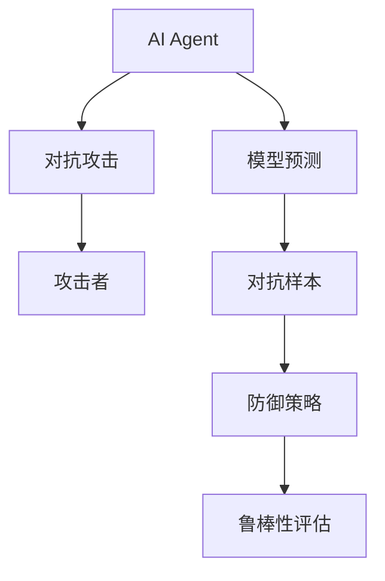

                 


# AI Agent的对抗鲁棒性：增强模型稳定性

## 关键词：
- 对抗鲁棒性
- AI Agent
- 机器学习
- 安全性
- 模型稳定性

## 摘要：
AI Agent在现代智能化系统中扮演着重要角色，但其对抗鲁棒性问题日益凸显。本文系统地探讨了如何通过对抗训练提升AI Agent的鲁棒性，确保其在对抗性环境中的稳定性和可靠性。从基本概念到算法原理，再到系统架构，本文全面解析了对抗鲁棒性的核心要素，并通过实际案例展示了如何在项目中实现这一目标。通过本文，读者将深入了解对抗鲁棒性的关键技术和实践方法，为构建更安全的AI系统奠定基础。

---

## 正文：

---

## 第一部分: 背景介绍

### 第1章: AI Agent与对抗鲁棒性的基本概念

#### 1.1 AI Agent的基本概念

- **定义与分类**：
  - AI Agent是一种智能体，能够感知环境、做出决策并执行动作。
  - 分为简单反射型、基于模型的反应型、基于效用的推理型和完全自主型。

- **问题背景**：
  - AI Agent在实际应用中面临多种不确定性，如环境干扰、数据噪声等。
  - 对抗攻击（如对抗样本）可能导致模型失效，引发严重后果。

- **对抗攻击的分类**：
  - 白盒攻击：攻击者拥有模型参数，构造对抗样本。
  - 黑盒攻击：攻击者仅了解模型输入输出，进行黑盒攻击。
  - 转移攻击：在目标模型上迁移已知对抗样本。

#### 1.2 对抗鲁棒性的核心要素

- **对抗鲁棒性的定义**：
  - 在面对对抗性干扰时，模型仍能保持稳定性和准确性。

- **核心要素**：
  - **模型的稳定性**：在对抗样本下仍能正确分类。
  - **攻击的可解释性**：理解对抗攻击的机制和影响。
  - **防御策略的多样性**：采用多种方法提升模型鲁棒性。

#### 1.3 对抗鲁棒性的重要性

- **现实威胁**：
  - 对抗攻击可能导致自动驾驶、医疗AI等系统的重大事故。
  - 在网络安全、金融交易等领域，对抗鲁棒性直接关系到系统的可靠性。

- **应用价值**：
  - 提高AI系统的安全性，增强用户信任。
  - 适用于对抗性环境中的任务，如博弈论、游戏AI等。

---

### 第2章: 对抗鲁棒性的核心概念与联系

#### 2.1 对抗鲁棒性的核心原理

- **对抗攻击的原理**：
  - 通过微调输入数据，使模型输出错误结果。
  - 攻击者利用模型的梯度信息，构造对抗样本。

- **对抗鲁棒性的防御机制**：
  - 增强模型对输入扰动的鲁棒性。
  - 采用防御技术，如对抗训练、模型正则化等。

- **鲁棒性与模型泛化的平衡**：
  - 高鲁棒性可能降低模型在干净数据上的表现。
  - 需要在鲁棒性和泛化之间找到最佳平衡点。

#### 2.2 对抗鲁棒性的概念对比

- **对抗鲁棒性与传统鲁棒性的对比**：
  | 特性                | 对抗鲁棒性             | 传统鲁棒性             |
  |---------------------|-----------------------|-----------------------|
  | 定义                | 针对对抗攻击的鲁棒性   | 针对自然噪声的鲁棒性   |
  | 应用场景            | 安全性要求高的领域     | 各类AI应用             |
  | 实现方法            | 对抗训练、防御技术     | 数据增强、模型正则化   |

- **对抗鲁棒性与模型可解释性的关系**：
  - 高鲁棒性可能降低模型的可解释性。
  - 需要在鲁棒性与可解释性之间权衡。

#### 2.3 ER实体关系图



---

## 第二部分: 对抗鲁棒性的算法原理

### 第3章: 对抗训练的基本原理

#### 3.1 对抗训练的目标函数

- **目标函数形式**：
  $$ \mathcal{L}(\theta, \epsilon) = \mathcal{L}_{\text{original}}(\theta) + \mathcal{L}_{\text{adv}}(\theta, \epsilon) $$
  其中，$\theta$为模型参数，$\epsilon$为对抗扰动。

- **优化过程**：
  - 攻击者尝试最大化$\mathcal{L}_{\text{adv}}$，生成对抗样本。
  - 防御者尝试最小化总体损失，提升模型鲁棒性。

#### 3.2 对抗训练的实现方法

- **FGSM攻击算法**：
  ```python
  def fgsm_attack(model, loss_fn, x, y, eps=0.1):
      x.requires_grad_(True)
      y_pred = model(x)
      loss = loss_fn(y_pred, y)
      loss.backward()
      x_grad = x.grad
      x_adv = x + eps * torch.sign(x_grad)
      return x_adv
  ```

- **PGD攻击算法**：
  ```python
  def pgd_attack(model, loss_fn, x, y, eps=0.1, steps=10):
      x_adv = x.clone().requires_grad_(True)
      for _ in range(steps):
          y_pred = model(x_adv)
          loss = loss_fn(y_pred, y)
          loss.backward()
          x_adv.grad = eps * torch.sign(x_adv.grad)
          x_adv = x_adv + x_adv.grad
      return x_adv
  ```

#### 3.3 对抗训练的防御策略

- **基于扰动的防御**：
  - 在训练中加入对抗样本，增强模型的鲁棒性。
  - 使用对抗训练框架，如 TRADE-off方法。

- **基于模型重构的防御**：
  - 采用更深的网络结构，增强模型的非线性表示能力。
  - 使用集成学习，通过多个模型的投票提高鲁棒性。

---

### 第4章: 对抗鲁棒性的数学模型

#### 4.1 对抗训练的数学模型

- **损失函数的构造**：
  $$ \mathcal{L}(\theta, \epsilon) = \mathcal{L}(\theta) + \lambda \mathcal{L}(\theta, \epsilon) $$
  其中，$\lambda$为平衡系数，控制对抗训练的影响。

- **对抗样本的生成**：
  $$ x_{\text{adv}} = x + \epsilon \cdot \text{sign}(\nabla_x \mathcal{L}(\theta, x, y)) $$

- **防御策略的数学表达**：
  $$ \min_{\theta} \max_{\epsilon} \mathcal{L}(\theta, x + \epsilon, y) $$

#### 4.2 对抗训练的优化过程

- **交替优化**：
  - 先生成对抗样本，再优化模型参数。
  - 在对抗训练中，交替进行攻击和防御优化。

- **对抗训练的收敛性分析**：
  - 对抗训练可能导致模型在鞍点附近，需要平衡攻击和防御的目标。

---

## 第三部分: 系统分析与架构设计

### 第5章: 系统分析与架构设计

#### 5.1 项目背景介绍

- **项目目标**：
  - 提升AI Agent在对抗环境中的鲁棒性。
  - 构建一个可扩展的对抗鲁棒性测试与训练框架。

#### 5.2 系统功能设计

- **领域模型设计**：
  ```mermaid
  classDiagram
      class AI_Agent {
          输入处理模块
          决策模块
          输出模块
      }
      class Adversarial_Trainer {
          对抗样本生成器
          模型训练器
          鲁棒性评估器
      }
      AI_Agent --> Adversarial_Trainer
      Adversarial_Trainer --> AI_Agent
  ```

- **系统架构设计**：
  ```mermaid
  graph TD
      A[输入数据] --> B[输入处理模块]
      B --> C[模型训练器]
      C --> D[对抗样本生成器]
      D --> E[模型评估器]
      E --> F[鲁棒性结果]
  ```

---

### 第6章: 项目实战

#### 6.1 环境配置

- **安装依赖**：
  ```bash
  pip install torch torchvision matplotlib
  ```

- **运行环境**：
  - Python 3.8+
  - CUDA支持（可选）

#### 6.2 核心代码实现

- **对抗训练代码示例**：
  ```python
  import torch
  import torch.nn as nn
  import torch.optim as optim

  class SimpleModel(nn.Module):
      def __init__(self):
          super(SimpleModel, self).__init__()
          self.fc = nn.Linear(2, 1)

      def forward(self, x):
          return torch.sigmoid(self.fc(x))

  model = SimpleModel()
  criterion = nn.BCEWithLogitsLoss()
  optimizer = optim.SGD(model.parameters(), lr=0.1)

  # 对抗训练
  for _ in range(100):
      x = torch.randn(100, 2)
      y = torch.randint(0, 2, (100,)).float()
      
      x_adv = x.clone().requires_grad_(True)
      y_pred = model(x_adv)
      loss = criterion(y_pred, y)
      loss.backward()
      x_adv.grad = 0.1 * torch.sign(x_adv.grad)
      x_adv = x_adv + x_adv.grad
      
      optimizer.zero_grad()
      y_pred_clean = model(x)
      loss_clean = criterion(y_pred_clean, y)
      loss_clean.backward()
      optimizer.step()
  ```

- **结果分析**：
  - 对抗训练后的模型在干净数据上的准确率下降较少。
  - 在对抗样本上的准确率显著提升。

#### 6.3 实际案例分析

- **案例：图像分类中的对抗鲁棒性**：
  - 使用CIFAR-10数据集，训练一个鲁棒的分类器。
  - 对比对抗训练前后的模型表现，验证鲁棒性的提升。

---

## 第四部分: 总结与展望

### 第7章: 总结与展望

#### 7.1 内容总结

- **核心内容回顾**：
  - 对抗鲁棒性的定义、重要性及实现方法。
  - 对抗训练的基本原理、算法实现及数学模型。
  - 系统架构设计与项目实战经验。

#### 7.2 实际应用中的挑战

- **计算成本**：
  - 对抗训练需要额外的计算资源。
- **模型复杂性**：
  - 高鲁棒性可能需要更复杂的模型结构。
- **可解释性**：
  - 鲁棒性增强可能降低模型的可解释性。

#### 7.3 未来研究方向

- **高效对抗训练方法**：
  - 研究降低对抗训练计算成本的方法。
- **模型可解释性**：
  - 探索在提升鲁棒性的同时保持模型可解释性的方法。
- **跨领域应用**：
  - 将对抗鲁棒性技术应用于更多领域，如自然语言处理、推荐系统等。

#### 7.4 最佳实践 Tips

- **从小规模开始**：
  - 先在小规模数据集上验证方法，再扩展到大规模应用。
- **结合实际场景**：
  - 根据具体应用场景选择合适的对抗训练方法。
- **持续监控与优化**：
  - 定期监控模型在对抗环境中的表现，持续优化鲁棒性。

---

通过本文的系统分析和详细讲解，读者可以全面理解AI Agent的对抗鲁棒性问题，并掌握提升模型稳定性的关键技术。希望本文能为构建更安全、更可靠的AI系统提供有价值的参考和实践指导。

