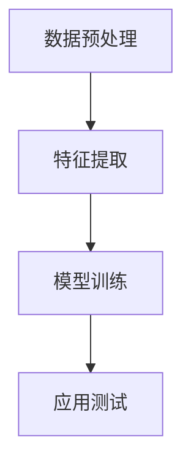

                 


# AI Agent的对比学习与表示学习

> 关键词：AI Agent, 对比学习, 表示学习, 联合学习, 系统架构, 实战案例

> 摘要：本文深入探讨了AI Agent中的对比学习与表示学习，从基础概念到算法原理，再到实际应用，结合系统架构设计和项目实战，详细分析了对比学习与表示学习的结合方式及其在不同场景中的应用效果。通过本文的学习，读者可以全面理解对比学习与表示学习在AI Agent中的作用，并掌握如何将它们结合到实际项目中。

---

# 第一部分: AI Agent的对比学习与表示学习基础

## 第1章: AI Agent基础

### 1.1 AI Agent的概念与定义

AI Agent（人工智能代理）是指在特定环境中能够感知环境、自主决策并执行任务的智能实体。AI Agent的核心特点包括自主性、反应性、目标导向性和社交能力。与传统AI相比，AI Agent更注重动态环境下的实时交互与适应性。

AI Agent的应用场景广泛，包括自动驾驶、智能助手、机器人控制、游戏AI等。

### 1.2 对比学习与表示学习的背景

对比学习是一种通过比较不同样本之间的相似性或差异性来学习特征表示的方法。其核心思想是通过最大化相似样本之间的相似性，同时最小化不相似样本之间的相似性。

表示学习的目标是将高维数据映射到低维空间，同时保留数据的语义信息。对比学习和表示学习的结合可以进一步提升特征表示的区分度和鲁棒性。

### 1.3 AI Agent中的对比学习与表示学习

在AI Agent中，对比学习可以帮助智能体区分不同状态或行为的相似性，而表示学习则可以将复杂的环境信息转化为简洁的特征表示。两者的结合可以显著提升AI Agent的感知能力和决策能力。

---

## 第2章: 对比学习的原理与算法

### 2.1 对比学习的基本原理

对比学习的核心思想是通过对比损失函数优化特征表示，使得相似样本的表示尽可能接近，而不同样本的表示尽可能远离。对比学习的数学模型通常基于Siamese网络或孪生网络。

对比学习的算法流程包括数据预处理、样本配对、特征提取、损失计算和模型优化。

### 2.2 常见的对比学习算法

- **SimCLR**：基于相似性对比学习的框架，通过数据增强生成正样本对，并使用非线性变换（如MLP）进行特征投影。
- **MoCo**：基于对比对称性的框架，通过引入队列机制优化负样本的利用效率。
- **知识蒸馏对比学习**：结合知识蒸馏技术，通过教师网络指导学生网络的对比学习过程。
- **对比学习的变体与改进**：包括基于图像、文本、图等多种数据类型的对比学习方法。

### 2.3 对比学习的优缺点分析

对比学习的优点包括能够有效提升特征表示的区分度和鲁棒性，适用于大规模数据集。缺点包括对数据增强的依赖较高，以及在某些场景下可能存在过拟合的风险。

### 2.4 本章小结

---

## 第3章: 表示学习的原理与算法

### 3.1 表示学习的基本原理

表示学习的目标是将高维数据映射到低维空间，同时保留数据的语义信息。表示学习的核心思想是通过优化目标函数，使得低维表示能够尽可能准确地反映原始数据的特征。

表示学习的数学模型通常基于神经网络，如卷积神经网络（CNN）或循环神经网络（RNN）。

### 3.2 常见的表示学习算法

- **Word2Vec**：基于上下文的词向量表示方法，通过skip-gram或CBOW模型训练词向量。
- **GloVe**：基于全局词向量的稀疏性假设，通过矩阵分解方法训练词向量。
- **BERT**：基于Transformer的预训练语言模型，通过自注意力机制生成语义表示。
- **图表示学习**：基于图结构数据的节点或边嵌入表示方法，如GraphSAGE、Node2Vec等。

### 3.3 表示学习的优缺点分析

表示学习的优点包括能够捕捉数据的语义信息，适用于多种数据类型。缺点包括对数据分布的敏感性较高，以及在某些场景下可能存在维度灾难问题。

### 3.4 本章小结

---

## 第4章: 对比学习与表示学习的结合

### 4.1 对比学习与表示学习的联系

对比学习与表示学习的联系主要体现在以下几个方面：
1. 对比学习通过优化特征表示的相似性，能够显著提升表示学习的效果。
2. 表示学习为对比学习提供了低维特征空间，使得对比学习更加高效。
3. 两者结合可以充分利用对比学习的优势，同时保留表示学习的语义信息。

### 4.2 对比学习与表示学习的联合学习框架

联合学习框架的核心思想是通过同时优化对比学习和表示学习的目标函数，使得两者能够相互促进。联合学习的数学模型通常包括对比损失和表示损失的加权组合。

### 4.3 对比学习与表示学习的结合案例

- **图像识别中的对比学习与表示学习结合**：通过对比学习优化图像特征表示，提升分类精度。
- **自然语言处理中的对比学习与表示学习结合**：通过对比学习优化文本特征表示，提升文本分类或生成任务的效果。

### 4.4 本章小结

---

## 第5章: AI Agent中的对比学习与表示学习应用

### 5.1 AI Agent中的对比学习应用

对比学习在AI Agent中的具体应用包括：
1. 状态空间的特征表示优化。
2. 行为决策的相似性度量。

### 5.2 AI Agent中的表示学习应用

表示学习在AI Agent中的具体应用包括：
1. 环境感知的特征提取。
2. 多模态数据的联合表示。

### 5.3 对比学习与表示学习在AI Agent中的协同作用

通过对比学习与表示学习的结合，AI Agent可以更高效地感知环境、优化决策策略，并提升整体的智能水平。

---

## 第6章: 项目实战：AI Agent的对比学习与表示学习实现

### 6.1 项目介绍

本项目旨在通过对比学习与表示学习的结合，实现一个具备环境感知和行为决策能力的AI Agent。

### 6.2 系统架构设计

系统功能设计：
- 数据预处理模块：负责将原始数据转换为模型输入格式。
- 特征提取模块：基于对比学习和表示学习算法，提取数据特征。
- 模型训练模块：优化对比学习与表示学习的联合损失函数。
- 应用测试模块：评估模型的性能。

系统架构图：


### 6.3 核心实现代码

```python
import torch
import torch.nn as nn
import torch.optim as optim

class ContrastiveLearning(nn.Module):
    def __init__(self, embedding_dim):
        super(ContrastiveLearning, self).__init__()
        self.embedding = nn.Linear(input_dim, embedding_dim)
        self.similarity = nn.CosineSimilarity(dim=1)

    def forward(self, x1, x2):
        x1_embed = self.embedding(x1)
        x2_embed = self.embedding(x2)
        similarity = self.similarity(x1_embed, x2_embed)
        return similarity

class RepresentationLearning(nn.Module):
    def __init__(self, embedding_dim):
        super(RepresentationLearning, self).__init__()
        self.embedding = nn.Linear(input_dim, embedding_dim)
        self.decoder = nn.Linear(embedding_dim, input_dim)

    def forward(self, x):
        x_embed = self.embedding(x)
        x_recon = self.decoder(x_embed)
        return x_recon

# 联合学习框架
class JointLearning(nn.Module):
    def __init__(self, embedding_dim):
        super(JointLearning, self).__init__()
        self.contrastive = ContrastiveLearning(embedding_dim)
        self.representation = RepresentationLearning(embedding_dim)

    def forward(self, x1, x2):
        contrastive_loss = ...
        representation_loss = ...
        total_loss = contrastive_loss + representation_loss
        return total_loss

# 训练过程
model = JointLearning(embedding_dim=128)
optimizer = optim.Adam(model.parameters(), lr=0.001)
criterion = nn.MSELoss()

for epoch in range(num_epochs):
    for batch in dataloader:
        x1, x2 = batch['x1'], batch['x2']
        optimizer.zero_grad()
        loss = model(x1, x2)
        loss.backward()
        optimizer.step()
```

### 6.4 案例分析

通过具体案例分析，详细解读对比学习与表示学习在AI Agent中的应用效果，包括模型性能提升、算法优化等方面。

---

## 第7章: 最佳实践与小结

### 7.1 最佳实践

- 合理选择对比学习和表示学习算法，根据具体场景调整参数。
- 注重数据增强和数据预处理，提升模型的泛化能力。
- 通过实验对比，选择最优的联合学习框架。

### 7.2 小结

通过对对比学习与表示学习的深入分析，我们可以看到它们在AI Agent中的巨大潜力。通过合理结合两种方法，可以显著提升AI Agent的感知能力和决策能力。

---

## 第8章: 注意事项与拓展阅读

### 8.1 注意事项

- 对比学习和表示学习的结合需要根据具体场景进行调整。
- 模型的训练过程需要大量计算资源，建议使用GPU加速。
- 数据质量和多样性对模型性能有重要影响。

### 8.2 拓展阅读

- 《Contrastive Learning: A Framework for Learning from Unlabeled Data》
- 《Representation Learning: A Review and New Perspectives》

---

通过本文的学习，读者可以全面理解对比学习与表示学习在AI Agent中的作用，并掌握如何将它们结合到实际项目中。

