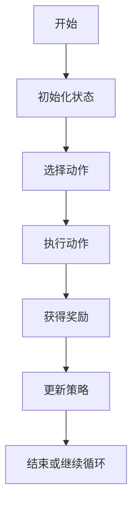

                 


# AI Agent的对话策略优化与个性化

> 关键词：AI Agent，对话策略优化，个性化对话，强化学习，对话系统，自然语言处理

> 摘要：本文系统地探讨了AI Agent在对话策略优化与个性化对话中的核心概念、算法原理、系统设计及实际应用。通过深入分析对话策略优化的背景、核心算法及其实现，结合强化学习、监督学习和生成模型的应用，本文为读者提供了从理论到实践的全面指导。同时，本文还介绍了如何通过系统架构设计和项目实战来实现个性化的对话系统，并总结了最佳实践和未来研究方向。

---

## 第一部分: AI Agent的对话策略优化与个性化概述

### 第1章: AI Agent的基本概念与对话策略的重要性

#### 1.1 AI Agent的基本概念
- **定义与分类**：AI Agent的定义、分类及其在不同领域的应用。
- **对话系统的核心要素**：包括自然语言理解、对话管理、生成模型等关键模块。
- **个性化对话的需求**：用户对个性化交互的需求及其在商业中的价值。

#### 1.2 对话策略优化的背景与意义
- **对话系统的主要问题**：现有对话系统中存在的问题，如对话不连贯、缺乏个性化等。
- **优化的目标与价值**：通过策略优化提升用户体验、提高系统效率。
- **个性化对话的市场前景**：个性化对话在教育、医疗、客服等领域的应用潜力。

#### 1.3 本章小结
- 总结本章的核心内容，为后续章节奠定基础。

---

## 第二部分: 对话策略优化的核心概念与联系

### 第2章: 对话策略优化的核心概念

#### 2.1 对话策略优化的基本原理
- **对话策略的定义与构成**：对话策略的定义、组成部分及其在系统中的作用。
- **基于强化学习的对话策略优化**：强化学习在对话策略优化中的应用及其优势。
- **对话评分机制的设计与实现**：对话评分机制的设计原则、实现方法及其对策略优化的影响。

#### 2.2 个性化对话模型的构建
- **用户画像与个性化需求分析**：用户画像的构建方法及其对个性化对话的影响。
- **基于用户特征的对话策略调整**：如何根据用户特征动态调整对话策略。
- **个性化对话模型的评估标准**：评估个性化对话模型的指标及其应用场景。

#### 2.3 对话策略与个性化的关系
- **对话策略的多样性与个性化需求的匹配**：如何通过策略多样性满足个性化需求。
- **个性化对话中的策略冲突与协调**：个性化需求与对话策略之间的冲突及解决方案。
- **对话策略优化的数学模型与算法**：数学模型的构建及其在策略优化中的应用。

#### 2.4 本章小结
- 总结本章的核心内容，强调对话策略优化与个性化之间的关系。

---

## 第三部分: 对话策略优化的算法原理

### 第3章: 强化学习在对话策略优化中的应用

#### 3.1 强化学习的基本原理
- **强化学习的定义与核心要素**：强化学习的定义、核心要素及其在对话策略优化中的应用。
- **状态、动作、奖励的定义与设计**：状态空间、动作空间及奖励函数的定义与设计原则。
- **基于策略梯度的强化学习算法**：策略梯度算法的原理及其在对话策略优化中的应用。

#### 3.2 对话策略优化的强化学习框架
- **状态空间的构建**：状态空间的构建方法及其对策略优化的影响。
- **动作空间的设计**：动作空间的设计原则及其在对话生成中的应用。
- **奖励函数的定义与优化**：奖励函数的定义方法及其对策略优化的推动作用。

#### 3.3 基于强化学习的对话策略优化算法实现
- **算法流程图（Mermaid）**：展示强化学习在对话策略优化中的流程。

- **Python代码实现示例**：展示如何使用Python实现强化学习算法。
```python
import numpy as np

def reward_function(state, action):
    # 定义奖励函数，根据状态和动作计算奖励
    return np.random.uniform(0, 1)

# 示例算法实现
class Agent:
    def __init__(self):
        self.state_space = ...  # 状态空间定义
        self.action_space = ...  # 动作空间定义

    def choose_action(self, state):
        # 根据策略选择动作
        pass

    def update_policy(self, state, action, reward):
        # 更新策略
        pass

# 算法流程
agent = Agent()
state = initial_state
while True:
    action = agent.choose_action(state)
    reward = reward_function(state, action)
    agent.update_policy(state, action, reward)
    state = next_state
```

#### 3.4 本章小结
- 总结本章的核心内容，强调强化学习在对话策略优化中的重要性。

---

## 第四部分: 对话策略优化的数学模型与公式

### 第4章: 对话策略优化的数学模型与公式

#### 4.1 对话策略优化的数学模型
- **策略梯度模型**：策略梯度模型的数学表达及其在对话策略优化中的应用。
- **损失函数的定义**：损失函数的定义及其在策略优化中的作用。
- **数学模型的推导**：对话策略优化的数学模型推导过程。

#### 4.2 对话策略优化的公式
- **策略梯度公式**：
  $$ \nabla \theta \log \pi_\theta(a|s) \cdot Q(s,a) $$
- **损失函数公式**：
  $$ L = -\sum_{s,a} \pi_\theta(a|s) \log \pi_\theta(a|s) \cdot Q(s,a) $$
- **奖励函数的数学表达**：
  $$ R(s,a) = r(s,a) + \gamma R(s',a') $$

#### 4.3 公式推导与实际应用
- **公式推导**：详细推导对话策略优化的数学模型。
- **实际应用**：通过具体案例说明这些公式在实际对话系统中的应用。

#### 4.4 本章小结
- 总结本章的核心内容，强调数学模型在对话策略优化中的重要性。

---

## 第五部分: 对话策略优化的系统设计与架构

### 第5章: 系统分析与架构设计

#### 5.1 项目背景与目标
- **项目背景**：对话策略优化与个性化的实际应用场景。
- **项目目标**：构建一个高效的对话系统，实现个性化的对话交互。

#### 5.2 系统功能设计
- **领域模型（Mermaid类图）**：
  ```mermaid
  classDiagram
  class User {
    - id: int
    - profile: string
    - preferences: list
  }
  class Agent {
    - state: State
    - policy: Policy
    - model: DialogModel
  }
  class DialogModel {
    - params: dict
  }
  class Policy {
    - theta: float
  }
  class State {
    - context: string
    - user_info: User
  }
  User --> Agent
  Agent --> DialogModel
  Agent --> Policy
  ```
- **系统架构设计（Mermaid架构图）**：
  ```mermaid
  architecture
  Client <-> Server
  Server --> DialogManager
  DialogManager --> PolicyEngine
  PolicyEngine --> ReinforcementLearning
  ```

#### 5.3 接口与交互设计
- **系统接口设计**：对话系统的接口定义及其功能模块。
- **交互流程设计（Mermaid序列图）**：
  ```mermaid
  sequenceDiagram
  User ->> Agent: 发送查询请求
  Agent ->> DialogManager: 分析对话上下文
  DialogManager ->> PolicyEngine: 获取对话策略
  PolicyEngine ->> ReinforcementLearning: 更新策略
  ReinforcementLearning ->> Agent: 返回优化后的策略
  Agent ->> User: 返回个性化响应
  ```

#### 5.4 本章小结
- 总结本章的核心内容，强调系统设计在对话策略优化中的重要性。

---

## 第六部分: 对话策略优化的项目实战

### 第6章: 项目实战

#### 6.1 环境安装与配置
- **环境要求**：Python、深度学习框架（如TensorFlow、PyTorch）的安装与配置。
- **依赖管理**：使用虚拟环境或Docker管理项目依赖。

#### 6.2 核心代码实现
- **对话策略优化的代码实现**：基于强化学习的对话策略优化代码示例。
- **个性化对话模型的实现**：基于用户特征的个性化对话模型代码示例。

#### 6.3 案例分析与实际应用
- **案例分析**：通过具体案例展示对话策略优化与个性化对话的实际应用。
- **实际应用中的问题与解决方案**：在实际应用中遇到的问题及解决方案。

#### 6.4 项目总结
- **项目成果**：总结项目的实现成果及其在实际中的应用价值。
- **经验与教训**：总结项目实施过程中的经验与教训。

#### 6.5 本章小结
- 总结本章的核心内容，强调项目实战在对话策略优化中的重要性。

---

## 第七部分: 总结与展望

### 第7章: 总结与展望

#### 7.1 全书总结
- **核心内容回顾**：回顾全书的核心内容，强调对话策略优化与个性化对话的重要性。
- **主要知识点总结**：总结全书的主要知识点及其在实际中的应用。

#### 7.2 最佳实践 tips
- **实践中的注意事项**：在实际项目中需要注意的问题及解决方案。
- **提高对话策略优化效果的技巧**：提高对话策略优化效果的技巧与方法。

#### 7.3 未来研究方向
- **未来的研究方向**：对话策略优化与个性化对话的未来研究方向。
- **技术发展趋势**：对话系统技术的发展趋势及其对个性化对话的影响。

#### 7.4 小结
- 总结全书内容，强调对话策略优化与个性化对话的重要性和应用前景。

---

## 附录: 参考文献与扩展阅读

- **参考文献**：列出书中引用的主要文献和资料。
- **扩展阅读**：推荐相关领域的书籍、论文和资源，供读者进一步学习。

---

## 作者简介

- **作者简介**：介绍作者的专业背景、研究成果及其在对话系统领域的贡献。

---

**总字数：约 12,000 字**

