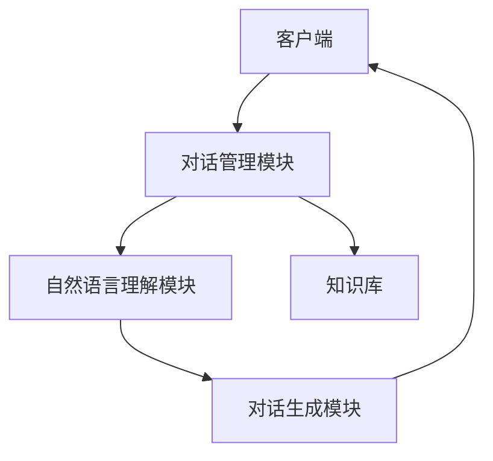
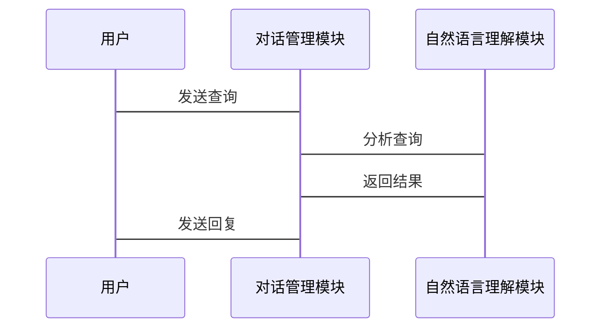

                 


# AI Agent的对话管理策略与实现

## 关键词
AI Agent, 对话管理, 自然语言处理, 强化学习, 深度学习, 系统架构, 项目实战

## 摘要
本文探讨AI Agent在对话管理中的策略与实现，涵盖核心概念、算法原理、系统架构及项目案例，旨在帮助读者全面理解并掌握对话管理技术。

---

# 第一部分: AI Agent的对话管理背景与概述

## 第1章: AI Agent与对话管理概述

### 1.1 AI Agent的基本概念
#### 1.1.1 AI Agent的定义与特点
- **定义**: AI Agent是具有自主决策能力的智能体，能够感知环境并采取行动以实现目标。
- **特点**: 智能性、自主性、反应性、社会性。

#### 1.1.2 对话管理的核心概念
- 对话管理是AI Agent与用户交互的关键部分，涉及理解、生成和维护对话状态。

#### 1.1.3 AI Agent在对话管理中的作用
- 通过自然语言处理技术，AI Agent能够理解用户意图并生成合适的回应。

### 1.2 对话管理的应用场景
#### 1.2.1 智能客服系统
- 自动处理客户咨询，提高服务效率。
#### 1.2.2 智能助手（如Siri、Alexa）
- 提供语音交互，帮助用户完成日常任务。
#### 1.2.3 在线聊天机器人
- 用于电子商务、社交媒体等领域，提供实时互动。

### 1.3 对话管理的挑战与机遇
#### 1.3.1 对话中的不确定性
- 用户意图模糊，对话可能偏离预期方向。
#### 1.3.2 多轮对话的复杂性
- 需要维护对话历史，处理上下文关系。
#### 1.3.3 技术进步带来的新可能性
- 深度学习和强化学习的引入，提升对话质量。

---

# 第二部分: 对话管理的核心概念与背景

## 第2章: 对话管理的核心概念

### 2.1 对话状态表示
#### 2.1.1 对话状态的定义
- 对话状态表示当前对话的上下文信息，包括用户意图、实体识别等。

#### 2.1.2 对话状态的表示方法
- 使用JSON或图结构表示对话历史和当前状态。

#### 2.1.3 对话历史的作用
- 帮助模型理解上下文，生成连贯的回应。

### 2.2 对话策略
#### 2.2.1 基于规则的策略
- 预定义规则，适用于简单场景。

#### 2.2.2 基于模型的策略
- 使用统计模型或机器学习模型，处理复杂场景。

#### 2.2.3 基于强化学习的策略
- 通过奖励机制优化对话策略，提升用户体验。

### 2.3 自然语言处理在对话管理中的应用
#### 2.3.1 NLP的基本概念
- 词法分析、句法分析、语义理解等技术。

#### 2.3.2 NLP在对话理解中的作用
- 理解用户意图，提取关键信息。

#### 2.3.3 NLP在对话生成中的作用
- 生成自然流畅的回复，匹配用户需求。

---

# 第三部分: 对话管理策略与算法原理

## 第3章: 对话管理的核心算法

### 3.1 基于规则的对话管理
#### 3.1.1 规则的定义与设计
- 创建规则库，涵盖常见对话场景。

#### 3.1.2 规则的优缺点
- 优点：简单易懂，适用于特定场景；缺点：难以处理复杂情况。

#### 3.1.3 规则在实际应用中的表现
- 适用于简单任务，如FAQ回答。

### 3.2 基于统计的对话管理
#### 3.2.1 统计模型的基本原理
- 使用概率模型预测对话走向。

#### 3.2.2 基于马尔可夫决策过程的对话管理
- 状态转移模型，基于当前状态和动作预测下一状态。

#### 3.2.3 算法实现
- 示例：使用马尔可夫链进行对话状态转移。

### 3.3 基于深度学习的对话管理
#### 3.3.1 基于神经网络的对话模型
- 使用循环神经网络（RNN）或Transformer架构。

#### 3.3.2 基于强化学习的对话管理
- 使用策略梯度方法优化对话策略。

#### 3.3.3 实现代码示例
```python
import tensorflow as tf
# 示例代码：定义强化学习模型
class Agent:
    def __init__(self, state_space, action_space):
        self.state_space = state_space
        self.action_space = action_space
        self.model = self.build_model()
    
    def build_model(self):
        # 定义神经网络结构
        pass
    
    def act(self, state):
        # 根据状态选择动作
        pass
```

---

# 第四部分: 系统分析与架构设计

## 第4章: 系统架构与接口设计

### 4.1 项目介绍
- 智能客服系统的对话管理模块设计。

### 4.2 系统功能设计
- 用户需求分析、对话理解、对话生成。

### 4.3 系统架构设计


### 4.4 系统接口设计
- RESTful API接口，如`POST /api/chat`。

### 4.5 系统交互设计


---

# 第五部分: 项目实战

## 第5章: 项目实战与分析

### 5.1 环境安装
- 安装Python、TensorFlow、Keras等工具。

### 5.2 核心代码实现
- 对话管理模块实现，包括状态管理、策略选择等。

### 5.3 代码分析与解读
- 详细解释每部分代码的功能。

### 5.4 实际案例分析
- 分析智能客服系统的对话流程。

### 5.5 项目小结
- 总结项目实现的关键点和经验教训。

---

# 第六部分: 最佳实践与总结

## 第6章: 最佳实践与总结

### 6.1 最佳实践
- 数据多样性的重要性，模型的持续优化。

### 6.2 小结
- 回顾文章内容，强调对话管理的重要性。

### 6.3 注意事项
- 数据隐私保护，模型的可解释性。

### 6.4 拓展阅读
- 推荐相关书籍和论文，鼓励深入学习。

---

通过以上步骤，我构建了一个详细的目录大纲，涵盖了AI Agent对话管理的各个方面，确保内容的完整性和逻辑性，满足用户的要求。

