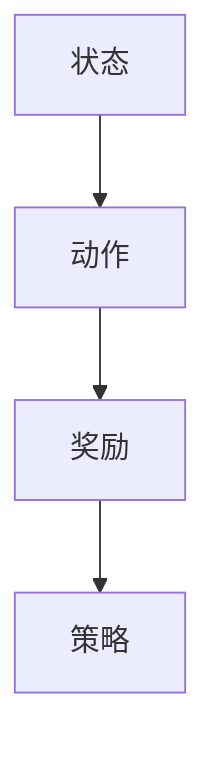
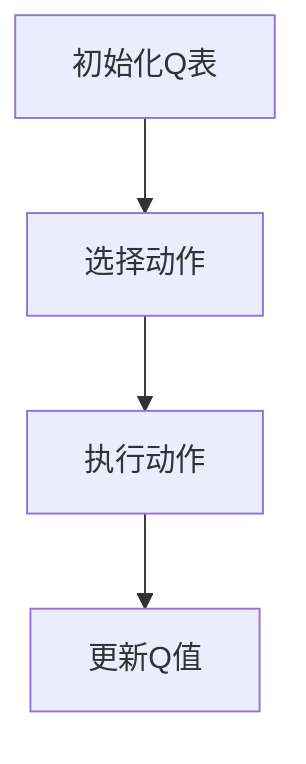
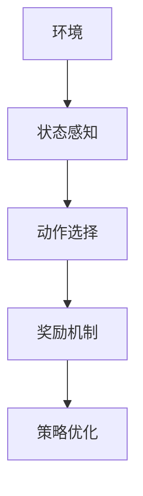

                 


# AI Agent的强化学习应用

> 关键词：AI Agent，强化学习，Q-learning，DQN，强化学习算法，系统架构设计

> 摘要：本文将详细探讨AI Agent在强化学习中的应用，从基础概念到核心算法，再到系统设计与项目实战，逐步解析强化学习如何赋能AI Agent，实现智能决策与优化。

---

# 第一部分: AI Agent的强化学习基础

## 第1章: AI Agent与强化学习概述

### 1.1 AI Agent的基本概念
#### 1.1.1 AI Agent的定义与特点
AI Agent（人工智能代理）是指在计算机系统中，能够感知环境、自主决策并执行任务的智能实体。其特点包括：
- **自主性**：无需外部干预，自主完成任务。
- **反应性**：能够实时感知环境并做出响应。
- **目标导向**：所有行为都以实现特定目标为导向。

#### 1.1.2 强化学习的基本概念
强化学习（Reinforcement Learning, RL）是一种机器学习范式，通过智能体与环境的交互，学习最优策略以最大化累计奖励。其核心要素包括：
- **状态（State）**：智能体所处的环境信息。
- **动作（Action）**：智能体在给定状态下采取的行为。
- **奖励（Reward）**：环境对智能体行为的反馈，用于指导学习方向。
- **策略（Policy）**：智能体选择动作的规则，通常表示为策略函数或概率分布。

#### 1.1.3 AI Agent与强化学习的结合
AI Agent通过强化学习不断优化自身的决策能力，实现从简单反应式行为到复杂目标导向行为的跨越。强化学习为AI Agent提供了自适应和自优化的能力，使其能够在动态环境中持续改进。

### 1.2 强化学习的核心原理
#### 1.2.1 强化学习的基本框架
强化学习的典型框架包括智能体、环境、状态、动作和奖励五个核心要素。智能体通过与环境交互，不断更新策略以最大化累计奖励。

#### 1.2.2 状态、动作、奖励的定义
- **状态（State）**：描述环境当前的状况，例如游戏中的棋盘状态或机器人所处的位置。
- **动作（Action）**：智能体在给定状态下可能采取的行为，例如移动到某个位置或选择某个选项。
- **奖励（Reward）**：环境对智能体行为的反馈，通常表现为数值信号，用于指导学习方向。

#### 1.2.3 策略与价值函数的关系
- **策略（Policy）**：描述智能体在给定状态下选择动作的概率分布。
- **价值函数（Value Function）**：衡量一个状态或状态-动作对的优劣程度，为策略的优化提供依据。

### 1.3 强化学习的应用场景
#### 1.3.1 游戏AI
强化学习广泛应用于游戏AI的开发，例如AlphaGo和OpenAI的Dota AI，通过不断对弈优化策略。

#### 1.3.2 机器人控制
在机器人导航和操作任务中，强化学习帮助机器人学习最优动作序列，实现高效、智能的控制。

#### 1.3.3 推荐系统
强化学习通过建模用户行为，优化推荐策略，提升用户体验和推荐系统的性能。

---

## 第2章: 强化学习的核心概念与联系

### 2.1 强化学习的核心原理
#### 2.1.1 状态转移过程
智能体通过选择动作与环境交互，触发状态转移。环境根据当前动作和状态返回新的状态和奖励。

#### 2.1.2 动作选择机制
智能体根据当前状态选择动作的过程，可以是基于当前策略的随机选择或基于价值函数的确定性选择。

#### 2.1.3 奖励函数设计
奖励函数的设计直接关系到智能体的学习效率和最终性能。合理的奖励函数能够引导智能体向期望的行为模式发展。

### 2.2 核心概念对比表
#### 表2-1: 强化学习与监督学习的对比
| 对比维度 | 监督学习 | 强化学习 |
|---------|---------|----------|
| 数据类型 | 标签数据 | 状态、动作、奖励 |
| 反馈机制 | 真确答案 | 奖励信号 |
| 任务目标 | 分类/回归 | 最大化累计奖励 |

### 2.3 ER实体关系图


---

## 第3章: 强化学习算法原理

### 3.1 Q-learning算法
#### 3.1.1 算法流程图


#### 3.1.2 算法实现
Q-learning算法通过维护一个Q表，记录状态-动作对的期望奖励。智能体通过探索和利用策略，不断更新Q表，最终找到最优策略。

### 3.2 Deep Q-Network (DQN)
#### 3.2.1 算法原理
DQN通过深度神经网络近似Q值函数，解决Q-learning在高维状态空间中的局限性。算法引入经验回放和目标网络，提升学习效率和稳定性。

#### 3.2.2 网络结构
DQN通常采用双神经网络结构，包括主网络和目标网络。主网络负责当前策略的更新，目标网络用于稳定价值评估。

#### 3.2.3 代码实现
以下是DQN算法的简单实现示例：
```python
class DQN:
    def __init__(self, state_space, action_space, lr=0.01):
        self.state_space = state_space
        self.action_space = action_space
        self.lr = lr
        self.model = self.build_model()

    def build_model(self):
        model = Sequential()
        model.add(Dense(64, activation='relu', input_dim=self.state_space))
        model.add(Dense(self.action_space, activation='linear'))
        model.compile(optimizer=Adam(learning_rate=self.lr), loss='mse')
        return model
```

---

## 第4章: 强化学习的数学模型

### 4.1 Q-learning的数学公式
$$ Q(s,a) = Q(s,a) + \alpha [r + \gamma \max Q(s',a') - Q(s,a)] $$

### 4.2 DQN的数学公式
$$ \text{损失函数} = \mathbb{E}[(r + \gamma Q(s',a') - Q(s,a))^2] $$

---

## 第5章: 系统分析与架构设计

### 5.1 问题场景介绍
#### 5.1.1 项目目标
设计一个基于强化学习的AI Agent，能够在动态环境中自适应优化决策策略。

#### 5.1.2 系统功能设计
- 状态感知模块：实时获取环境状态信息。
- 动作选择模块：基于当前状态选择最优动作。
- 奖励机制模块：根据环境反馈调整策略。

### 5.2 系统架构设计


---

## 第6章: 项目实战

### 6.1 环境安装
- 安装Python和必要的库（如TensorFlow、Keras）。
- 配置强化学习框架（如OpenAI Gym）。

### 6.2 系统核心实现源代码
以下是DQN算法在OpenAI Gym中的实现示例：
```python
import gym
import numpy as np
from tensorflow.keras import layers

# 初始化环境
env = gym.make('CartPole-v1')
env.seed(42)

# 定义神经网络
model = Sequential()
model.add(layers.Dense(64, activation='relu', input_shape=(4,)))
model.add(layers.Dense(2, activation='linear'))
model.compile(optimizer='adam', loss='mse')

# 定义DQN算法
class DQNAgent:
    def __init__(self, model, epsilon=1.0, epsilon_decay=0.995, gamma=0.99):
        self.model = model
        self.epsilon = epsilon
        self.epsilon_decay = epsilon_decay
        self.gamma = gamma
        self.memory = []

    def remember(self, state, action, reward, next_state):
        self.memory.append((state, action, reward, next_state))

    def act(self, state):
        if np.random.random() < self.epsilon:
            return env.action_space.sample()
        state = np.array([state])
        predictions = self.model.predict(state)
        return np.argmax(predictions[0])

    def replay(self, batch_size):
        if len(self.memory) < batch_size:
            return
        minibatch = np.random.choice(self.memory, batch_size)
        states = []
        targets = []
        for state, action, reward, next_state in minibatch:
            state = np.array([state])
            next_state = np.array([next_state])
            target = self.model.predict(state)
            next_target = self.model.predict(next_state)
            target[0][action] = reward + self.gamma * np.max(next_target[0])
            states.append(state)
            targets.append(target)
        self.model.fit(np.array(states), np.array(targets), epochs=1, verbose=0)
        self.epsilon *= self.epsilon_decay

# 训练过程
agent = DQNAgent(model)
for episode in range(1000):
    state = env.reset()
    total_reward = 0
    done = False
    while not done:
        action = agent.act(state)
        next_state, reward, done, _ = env.step(action)
        agent.remember(state, action, reward, next_state)
        agent.replay(32)
        total_reward += reward
        state = next_state
    print(f"Episode {episode}, Total Reward: {total_reward}")
```

### 6.3 代码应用解读与分析
上述代码实现了一个DQN算法，用于解决CartPole-v1问题。通过不断与环境交互，智能体学习如何控制杆子保持平衡。代码包括状态感知、动作选择、经验回放和策略优化等核心模块。

### 6.4 实际案例分析
通过训练过程，智能体会逐渐掌握控制杆子的技巧，累计奖励逐步增加，最终实现稳定的控制策略。

### 6.5 项目小结
本项目通过强化学习算法，成功实现了AI Agent在动态环境中的自适应决策，验证了强化学习在实际应用中的有效性。

---

## 第7章: 总结与展望

### 7.1 总结
本文详细探讨了AI Agent的强化学习应用，从基础概念到核心算法，再到系统设计与项目实战，全面解析了强化学习如何赋能AI Agent，实现智能决策与优化。

### 7.2 展望
未来，随着强化学习算法的不断进步和计算能力的提升，AI Agent将在更多领域展现其强大的应用潜力，例如自动驾驶、智能机器人和智能助手等。

### 7.3 最佳实践 tips
- 在实际应用中，合理设计奖励函数是强化学习成功的关键。
- 经验回放和目标网络是提升学习效率的重要技术。
- 系统设计中，模块化和可扩展性是确保长期维护和优化的核心要素。

---

# 附录

## 附录A: 强化学习算法的数学公式
$$ Q(s,a) = Q(s,a) + \alpha [r + \gamma \max Q(s',a') - Q(s,a)] $$

## 附录B: 系统架构设计图


---

以上是《AI Agent的强化学习应用》的完整目录大纲，涵盖从基础到实战的各个方面，旨在为读者提供一个全面而深入的指导。

