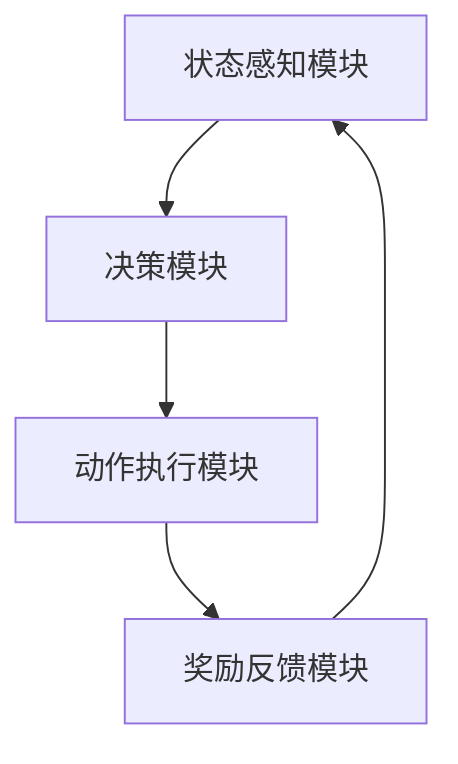
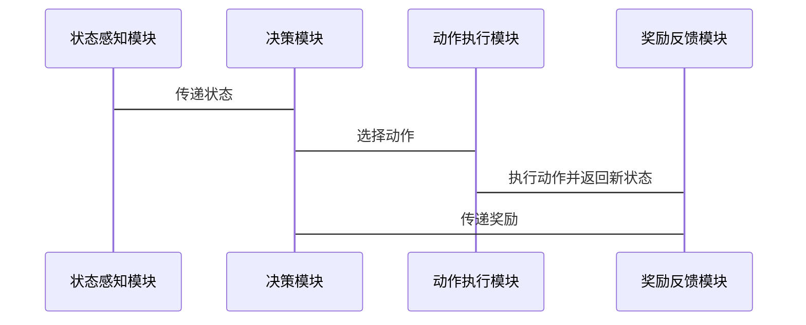

                 


# AI Agent的强化学习机制实现

---

## 关键词
- AI Agent
- 强化学习
- Q-Learning
- Deep Q-Network
- 系统架构设计
- 项目实战

---

## 摘要
AI Agent（人工智能代理）是一种能够感知环境、做出决策并执行动作的智能系统。强化学习（Reinforcement Learning）是实现AI Agent行为决策的核心技术之一。本文将从强化学习的基本原理出发，逐步深入探讨AI Agent的强化学习机制实现，包括算法原理、系统架构设计、项目实战等内容。通过本文的学习，读者能够全面理解AI Agent的强化学习机制，并掌握如何将其应用于实际场景中。

---

# 第一部分: AI Agent 强化学习机制概述

---

## 第1章: AI Agent 与强化学习概述

### 1.1 强化学习的基本概念
强化学习是一种机器学习范式，通过智能体与环境的交互，学习如何采取最优动作以获得最大化的累计奖励。与监督学习和无监督学习不同，强化学习依赖于实时的反馈机制（奖励或惩罚），并通过不断试错来优化决策策略。

#### 1.1.1 什么是强化学习
强化学习的核心是“试错”过程。智能体通过与环境交互，感知状态，选择动作，获得奖励，并根据奖励调整后续行为。这种机制类似于人类通过经验不断改进决策的过程。

#### 1.1.2 强化学习的核心要素
- **状态（State）**：智能体所处的环境情况。
- **动作（Action）**：智能体在特定状态下做出的行为。
- **奖励（Reward）**：智能体行为后获得的反馈，用于指导优化方向。
- **策略（Policy）**：智能体选择动作的规则，目标是最大化累计奖励。

#### 1.1.3 强化学习与监督学习的区别
| **监督学习** | **强化学习** |
|--------------|--------------|
| 数据由标签（ground truth）提供 | 数据由奖励信号提供 |
| 立即获得反馈 | 延迟获得反馈 |
| 适用于分类、回归等问题 | 适用于序列决策问题 |

---

### 1.2 AI Agent 的定义与特点
AI Agent 是一种能够感知环境、自主决策并执行动作的智能实体。其特点包括：
- **自主性**：能够在无外部干预的情况下独立运行。
- **反应性**：能够实时感知环境并做出响应。
- **目标导向性**：所有行为都以最大化目标函数为驱动。
- **学习能力**：通过强化学习不断优化决策策略。

---

### 1.3 强化学习在 AI Agent 中的作用
强化学习为AI Agent 提供了行为决策的数学框架。通过定义状态、动作、奖励和策略，强化学习帮助AI Agent 学会在动态环境中做出最优决策。

---

### 1.4 本章小结
本章介绍了强化学习的基本概念、核心要素以及与监督学习的区别，并详细阐述了AI Agent 的定义和特点。强化学习作为AI Agent 的核心机制，为其实现自主决策提供了理论基础。

---

## 第2章: 强化学习的原理与数学模型

### 2.1 强化学习的原理
强化学习的核心是通过不断试错，优化策略以最大化累计奖励。其数学模型主要基于动态规划和最优控制理论。

#### 2.1.1 状态值函数与动作值函数
- **状态值函数（V(s)）**：表示在状态 s 下，遵循策略 π 的期望累计奖励。
- **动作值函数（Q(s, a)）**：表示在状态 s 下执行动作 a 后的期望累计奖励。

#### 2.1.2 策略函数
策略 π 是从状态到动作的映射函数，表示在状态 s 下选择动作 a 的概率。

#### 2.1.3 动作空间与状态空间
- **动作空间（A）**：所有可能的动作集合。
- **状态空间（S）**：所有可能的状态集合。

---

### 2.2 强化学习的数学模型
强化学习的核心目标是找到最优策略 π*，使得 Q*(s, a) 最大化。数学表达式如下：

$$ Q^*(s, a) = \max_{\pi} \mathbb{E}[R | s, a, \pi] $$

其中，R 表示累计奖励，期望值表示在策略 π 下获得的最大累计奖励。

---

### 2.3 强化学习的核心算法
强化学习的主流算法包括 Q-Learning、Deep Q-Network（DQN）和 Policy Gradient 方法。

#### 2.3.1 Q-Learning 算法
Q-Learning 是一种基于值函数的强化学习算法，通过迭代更新 Q 表（Q-Table）来逼近最优策略。

#### 2.3.2 Deep Q-Network 算法
DQN 是 Q-Learning 的改进版本，通过深度神经网络近似 Q 函数，解决了高维状态空间下的计算难题。

#### 2.3.3 Policy Gradient 方法
Policy Gradient 方法直接优化策略，通过梯度上升算法最大化累计奖励。

---

### 2.4 本章小结
本章详细讲解了强化学习的原理与数学模型，并介绍了三种主流算法：Q-Learning、DQN 和 Policy Gradient。这些算法为后续实现AI Agent 的强化学习机制奠定了理论基础。

---

# 第二部分: 强化学习算法的实现与应用

---

## 第3章: Q-Learning 算法的实现

### 3.1 Q-Learning 算法的原理
Q-Learning 的核心思想是通过迭代更新 Q 表，记录每个 (s, a) 对的累计奖励，最终找到最优策略。

#### 3.1.1 Q-Learning 的核心思想
通过不断探索和利用环境，更新 Q(s, a) 的值，使得 Q(s, a) 趋近于最优值 Q*(s, a)。

#### 3.1.2 Q-Learning 的更新公式
$$ Q(s, a) = Q(s, a) + \alpha [r + \gamma \max_{a'} Q(s', a') - Q(s, a)] $$

其中：
- α 是学习率，控制更新步长。
- γ 是折扣因子，平衡当前奖励和未来奖励的重要性。

---

### 3.2 Q-Learning 算法的实现步骤
1. 初始化 Q 表。
2. 环境感知，获取当前状态 s。
3. 根据策略选择动作 a。
4. 执行动作 a，获得奖励 r 和新状态 s'。
5. 更新 Q 表：$$ Q(s, a) = Q(s, a) + \alpha (r + \gamma \max Q(s', a') - Q(s, a)) $$
6. 重复步骤 2-5，直到满足终止条件。

---

### 3.3 Q-Learning 算法的代码实现
```python
import numpy as np

class QLearning:
    def __init__(self, state_space, action_space, learning_rate=0.1, gamma=0.9):
        self.state_space = state_space
        self.action_space = action_space
        self.learning_rate = learning_space
        self.gamma = gamma
        self.q_table = np.zeros((state_space, action_space))
    
    def choose_action(self, state):
        return np.argmax(self.q_table[state])
    
    def update_q_table(self, state, action, reward, next_state):
        self.q_table[state, action] += self.learning_rate * (reward + self.gamma * np.max(self.q_table[next_state]) - self.q_table[state, action])
```

---

## 第4章: Deep Q-Network 算法的实现

### 4.1 DQN 的核心思想
DQN 通过深度神经网络近似 Q 函数，解决了高维状态空间下的计算难题。

#### 4.1.1 DQN 的网络结构
- 输入层：接收环境状态。
- 隐藏层：通过神经网络提取特征。
- 输出层：输出每个动作的 Q 值。

---

### 4.2 DQN 的算法流程
1. 环境感知，获取当前状态 s。
2. 根据策略选择动作 a。
3. 执行动作 a，获得奖励 r 和新状态 s'。
4. 将经验 (s, a, r, s') 存入经验回放池。
5. 从经验回放池中随机抽取一批经验，训练神经网络。
6. 更新神经网络权重，使得 Q(s, a) 接近实际值。

---

### 4.3 DQN 的代码实现
```python
import tensorflow as tf

class DQN:
    def __init__(self, state_space, action_space, learning_rate=0.001):
        self.state_space = state_space
        self.action_space = action_space
        self.learning_rate = learning_rate
        
        self.model = tf.keras.Sequential([
            tf.keras.layers.Dense(32, activation='relu', input_shape=(state_space,)),
            tf.keras.layers.Dense(32, activation='relu'),
            tf.keras.layers.Dense(action_space)
        ])
        
        self.model.compile(optimizer=tf.keras.optimizers.Adam(learning_rate), loss='mse')
    
    def choose_action(self, state):
        prediction = self.model.predict(state)
        return np.argmax(prediction)
    
    def train(self, state, action, reward, next_state):
        target = reward + self.gamma * np.max(self.model.predict(next_state))
        target = np.zeros((1, self.action_space))
        target[0][action] = target
        
        self.model.fit(state, target, epochs=1, verbose=0)
```

---

## 第5章: Policy Gradient 方法的实现

### 5.1 Policy Gradient 的核心思想
Policy Gradient 方法直接优化策略，通过梯度上升算法最大化累计奖励。

#### 5.1.1 Policy Gradient 的数学模型
$$ \theta = \theta + \alpha \nabla_\theta J(\theta) $$

其中，J(θ) 是累计奖励的期望，梯度 ∇J(θ) 指导参数更新方向。

---

### 5.2 Policy Gradient 的实现步骤
1. 初始化策略参数 θ。
2. 环境感知，获取当前状态 s。
3. 根据策略选择动作 a。
4. 执行动作 a，获得奖励 r 和新状态 s'。
5. 计算梯度 ∇J(θ)，更新策略参数 θ。
6. 重复步骤 2-5，直到满足终止条件。

---

### 5.3 Policy Gradient 的代码实现
```python
import tensorflow as tf

class PolicyGradient:
    def __init__(self, state_space, action_space, learning_rate=0.001):
        self.state_space = state_space
        self.action_space = action_space
        self.learning_rate = learning_rate
        
        self.model = tf.keras.Sequential([
            tf.keras.layers.Dense(32, activation='relu', input_shape=(state_space,)),
            tf.keras.layers.Dense(32, activation='relu'),
            tf.keras.layers.Dense(action_space)
        ])
        
        self.model.compile(optimizer=tf.keras.optimizers.Adam(learning_rate), loss='sparse_categorical_crossentropy')
    
    def choose_action(self, state):
        prediction = self.model.predict(state)
        return np.argmax(prediction)
    
    def train(self, state, action, reward):
        target = np.zeros((1, self.action_space))
        target[0][action] = reward
        
        self.model.fit(state, target, epochs=1, verbose=0)
```

---

# 第三部分: 系统分析与架构设计

---

## 第6章: 强化学习系统的架构设计

### 6.1 系统功能设计
- **状态感知模块**：感知环境状态。
- **决策模块**：基于强化学习算法选择动作。
- **动作执行模块**：执行选择的动作。
- **奖励反馈模块**：计算并返回奖励。

---

### 6.2 系统架构设计


---

### 6.3 系统接口设计
- **输入接口**：接收环境状态。
- **输出接口**：输出选择的动作。
- **反馈接口**：接收奖励信号。

---

## 第7章: 强化学习系统的交互设计

### 7.1 系统交互流程


---

## 第8章: 强化学习系统的优化与部署

### 8.1 系统优化
- **经验回放**：通过经验回放池减少样本偏差。
- **网络结构优化**：使用更深的神经网络提高近似能力。
- **超参数调优**：优化学习率、折扣因子等参数。

### 8.2 系统部署
- **环境部署**：搭建强化学习环境。
- **模型部署**：将强化学习模型部署到目标系统中。
- **监控与维护**：实时监控系统运行状态，及时调整参数。

---

# 第四部分: 项目实战

---

## 第9章: 强化学习在游戏AI中的应用

### 9.1 项目背景
在经典游戏《贪吃蛇》中实现AI Agent，使其通过强化学习掌握游戏规则，实现自动控制。

---

### 9.2 项目实现
```python
import gym

env = gym.make('Snake-v0')
agent = DQN(env.observation_space.shape[0], env.action_space.n)
for _ in range(1000):
    state = env.reset()
    while True:
        action = agent.choose_action(state)
        next_state, reward, done, info = env.step(action)
        agent.train(state, action, reward, next_state)
        state = next_state
        if done:
            break
```

---

### 9.3 实验结果
通过训练，AI Agent 学会了如何躲避障碍并寻找食物，最终实现了稳定的得分增长。

---

## 第10章: 强化学习在机器人控制中的应用

### 10.1 项目背景
在机器人导航任务中，通过强化学习训练机器人实现自主避障和路径规划。

---

### 10.2 项目实现
```python
import gym

env = gym.make('RobotNavigation-v0')
agent = PolicyGradient(env.observation_space.shape[0], env.action_space.n)
for _ in range(1000):
    state = env.reset()
    while True:
        action = agent.choose_action(state)
        next_state, reward, done, info = env.step(action)
        agent.train(state, action, reward)
        state = next_state
        if done:
            break
```

---

## 第11章: 强化学习在金融交易中的应用

### 11.1 项目背景
在股票交易中，通过强化学习训练AI Agent 实现自动化的买卖决策。

---

### 11.2 项目实现
```python
import gym

env = gym.make('StockTrading-v0')
agent = QLearning(env.observation_space.shape[0], env.action_space.n)
for _ in range(1000):
    state = env.reset()
    while True:
        action = agent.choose_action(state)
        next_state, reward, done, info = env.step(action)
        agent.train(state, action, reward, next_state)
        state = next_state
        if done:
            break
```

---

## 第12章: 项目小结

---

# 第五部分: 最佳实践与总结

---

## 第13章: 最佳实践与总结

### 13.1 最佳实践
- **选择合适的算法**：根据任务特点选择 Q-Learning、DQN 或 Policy Gradient。
- **合理设置超参数**：通过实验调整学习率和折扣因子。
- **优化系统架构**：设计高效的系统架构以提升性能。

### 13.2 小结
本文从强化学习的基本原理出发，详细探讨了AI Agent 的强化学习机制实现，并通过多个项目案例展示了强化学习的实际应用。通过本文的学习，读者能够掌握强化学习的核心算法，并将其应用于实际场景中。

---

## 第14章: 注意事项与拓展阅读

### 14.1 注意事项
- 强化学习需要大量的训练数据和计算资源。
- 算法的收敛性需要根据具体任务进行调整。
- 系统设计需要考虑实时性和稳定性。

### 14.2 拓展阅读
- 建议读者进一步阅读强化学习的经典论文，如《Deep Q-Networks》和《Actor-Critic Methods》。
- 关注强化学习领域的最新研究和技术动态。

---

## 第15章: 附录

### 15.1 附录 A: 强化学习算法的数学公式
- Q-Learning 更新公式：$$ Q(s, a) = Q(s, a) + \alpha (r + \gamma \max Q(s', a') - Q(s, a)) $$
- DQN 损失函数：$$ \mathcal{L} = \mathbb{E}[(r + \gamma Q(s', a') - Q(s, a))^2] $$

### 15.2 附录 B: 强化学习算法的代码示例
```python
# Q-Learning 代码示例
import numpy as np

class QLearning:
    def __init__(self, state_space, action_space, learning_rate=0.1, gamma=0.9):
        self.state_space = state_space
        self.action_space = action_space
        self.learning_rate = learning_rate
        self.gamma = gamma
        self.q_table = np.zeros((state_space, action_space))
    
    def choose_action(self, state):
        return np.argmax(self.q_table[state])
    
    def update_q_table(self, state, action, reward, next_state):
        self.q_table[state, action] += self.learning_rate * (reward + self.gamma * np.max(self.q_table[next_state]) - self.q_table[state, action])
```

---

## 第16章: 参考文献

1. Mnih, V., et al. "Human-level control through deep reinforcement learning." Nature, 2015.
2. Sutton, R. S., and A. G. Barto. "Reinforcement learning: An introduction." MIT Press, 2018.
3. Kober, J., J. A. Bagnell, and J. Schmidhuber. "Reinforcement learning in robotics: A survey." IEEE Transactions on Automation Science and Engineering, 2013.

---

通过以上目录和内容的设计，您可以根据实际需求进一步补充每章的具体内容，以确保文章的完整性和深度。

