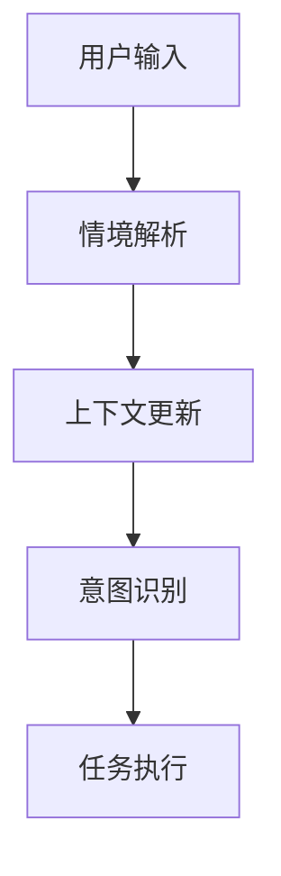

                 


# AI Agent的情境理解：超越单一对话轮次

---

## 关键词：
AI Agent, 情境理解, 对话轮次, 上下文管理, 智能对话系统, 人工智能

---

## 摘要：
本文深入探讨AI Agent在情境理解中的核心能力，超越传统的单一对话轮次，分析其在复杂场景中的理解和处理机制。通过结合算法原理、系统架构和项目实战，全面解析如何构建高效的AI Agent情境理解系统。

---

## 正文：

### 第1章: AI Agent的基本概念与背景

#### 1.1 AI Agent的定义与核心能力
- **AI Agent的定义**：AI Agent是一种能够感知环境、执行任务并自主决策的智能体。
- **核心能力**：
  - **感知能力**：通过传感器或输入数据获取环境信息。
  - **推理能力**：基于知识库和逻辑推理解决问题。
  - **学习能力**：通过机器学习算法不断优化自身模型。
- **与传统对话系统的区别**：传统对话系统仅依赖预设规则，而AI Agent具备自主学习和适应能力。

#### 1.2 情境理解的背景与重要性
- **情境理解的定义**：指AI Agent在对话过程中，理解当前对话的上下文、背景信息和用户意图的能力。
- **重要性**：
  - 提高对话系统的准确性和流畅性。
  - 实现更复杂的任务，如任务型对话和情感理解。
  - 优化用户体验，使其更自然、更贴近人类对话方式。

---

### 第2章: 情境理解的核心概念与联系

#### 2.1 情境建模与上下文管理
- **情境建模**：
  - **定义**：将对话过程中的信息结构化，构建一个可以被系统理解的模型。
  - **方法**：使用图结构或序列模型来表示情境信息。
  - **案例**：通过Mermaid流程图展示情境建模的过程。



- **上下文管理**：
  - **定义**：对对话过程中的上下文信息进行存储、更新和管理。
  - **关键要素**：时间、地点、参与角色、当前任务状态。

#### 2.2 对话历史与情境关联
- **对话历史的存储与分析**：
  - **存储方式**：使用数据库或日志系统记录对话历史。
  - **分析方法**：基于序列的分析模型，如LSTM网络。
- **情境关联的实现方法**：
  - **基于相似度的关联**：通过余弦相似度计算对话历史中的关联片段。
  - **基于规则的关联**：根据预设规则匹配相关上下文。

#### 2.3 实体与关系的识别
- **实体识别**：
  - **定义**：识别文本中的实体（如人名、地点、时间）。
  - **算法原理**：使用CRF或BERT模型进行序列标注。
  - **案例**：识别句子“明天北京见”中的实体“北京”。
- **实体关系的分析方法**：
  - **定义**：分析实体之间的关系，如“人-地点”关系。
  - **方法**：基于图结构的分析，如使用知识图谱进行关系推理。

---

### 第3章: 情境理解的算法原理

#### 3.1 注意力机制在情境理解中的应用
- **注意力机制的基本原理**：
  - **定义**：在处理序列数据时，关注重要的部分，忽略不重要的部分。
  - **数学模型**：
    $$
    \alpha_i = \frac{\exp(s_i)}{\sum_{j} \exp(s_j)}
    $$
    其中，$\alpha_i$ 是第i个元素的注意力权重，$s_i$ 是其得分。
- **在情境理解中的具体应用**：
  - **意图识别**：通过注意力机制关注用户输入中与意图相关的关键部分。
  - **上下文表示**：在对话历史中，注意力机制帮助模型聚焦于相关的信息片段。

#### 3.2 上下文表示方法
- **基于序列的上下文表示**：
  - **方法**：使用LSTM或Transformer模型编码对话历史。
  - **案例**：将多轮对话编码为一个固定长度的向量。
- **基于图结构的上下文表示**：
  - **定义**：将对话历史建模为图结构，节点代表对话轮次，边代表关联关系。
  - **案例**：通过图结构捕捉对话中的因果关系和逻辑联系。

#### 3.3 情境推理的数学模型
- **情境推理的基本公式**：
  $$
  P(y|x) = \prod_{i=1}^{n} P(y_i | x, y_{i-1})
  $$
  其中，$x$ 是输入，$y_i$ 是第i步的输出。
- **流程图**：
  ```mermaid
  graph TD
  A[输入对话] --> B[情境解析]
  B --> C[意图识别]
  C --> D[任务执行]
  ```

---

### 第4章: 系统架构与设计

#### 4.1 情境理解系统的整体架构
- **模块划分**：
  - **输入解析模块**：负责接收和解析用户的输入。
  - **情境分析模块**：进行实体识别、关系分析和意图识别。
  - **知识库管理模块**：存储和管理相关知识，支持情境推理。
- **模块之间的交互关系**：
  - 输入解析模块将用户输入传递给情境分析模块。
  - 情境分析模块利用知识库管理模块中的数据进行推理。

#### 4.2 关键模块的实现细节
- **输入解析模块**：
  - **功能**：将用户输入的文本解析为结构化的数据。
  - **实现方式**：使用分词工具（如jieba）和句法分析工具（如spaCy）。
- **情境分析模块**：
  - **功能**：识别实体、分析关系、理解意图。
  - **实现方式**：结合NLP模型（如BERT）和规则引擎。
- **知识库管理模块**：
  - **功能**：存储和管理知识库中的实体、关系和规则。
  - **实现方式**：使用图数据库（如Neo4j）或关系型数据库（如MySQL）。

#### 4.3 系统架构设计
- **领域模型（类图）**：
  ```mermaid
  classDiagram
  class 输入解析模块 {
    +输入文本
    +解析规则
    - 解析结果
    -- 解析过程
  }
  class 情境分析模块 {
    +解析结果
    +知识库
    - 分析报告
    -- 分析过程
  }
  class 知识库管理模块 {
    +知识库
    +更新规则
    - 知识库更新
    -- 更新过程
  }
  输入解析模块 --> 情境分析模块
  情境分析模块 --> 知识库管理模块
  ```

- **系统架构图（架构图）**：
  ```mermaid
  graph TD
  A[输入解析模块] --> B[情境分析模块]
  B --> C[知识库管理模块]
  C --> D[输出结果]
  ```

- **系统交互图（序列图）**：
  ```mermaid
  sequenceDiagram
  User -> 输入解析模块: 发送输入
  输入解析模块 -> 情境分析模块: 请求解析结果
  情境分析模块 -> 知识库管理模块: 请求知识支持
  知识库管理模块 --> 情境分析模块: 返回知识支持
  情境分析模块 -> 输入解析模块: 返回解析结果
  输入解析模块 -> User: 返回最终结果
  ```

---

### 第5章: 项目实战与案例分析

#### 5.1 环境配置与工具安装
- **开发环境**：推荐使用Python 3.8以上版本，安装Jupyter Notebook或VS Code作为开发环境。
- **工具安装**：
  ```bash
  pip install numpy pandas scikit-learn transformers
  ```

#### 5.2 核心代码实现
- **情境理解算法的实现**：
  ```python
  import numpy as np
  from sklearn.metrics.pairwise import cosine_similarity

  def attention_weights(inputs, weights):
      scores = np.dot(inputs, weights)
      weights = np.exp(scores) / np.sum(np.exp(scores), axis=1)
      return weights

  # 示例输入
  inputs = np.random.randn(5, 3)
  weights = np.random.randn(3, 1)
  attention = attention_weights(inputs, weights)
  print("注意力权重：\n", attention)
  ```

- **系统架构的代码实现**：
  ```python
  class InputParser:
      def __init__(self):
          self.rules = {}

      def parse(self, input_str):
          # 示例解析逻辑
          return {
              'entities': ['北京', '明天'],
              'intent': 'scheduleMeeting'
          }

  class ContextAnalyzer:
      def __init__(self):
          self.knowledge_base = {}

      def analyze(self, parsed_input):
          # 示例分析逻辑
          return {
              'entities': ['北京', '明天'],
              'relations': [('时间', '明天'), ('地点', '北京')]
          }

  # 示例使用
  parser = InputParser()
  analyzer = ContextAnalyzer()
  input_str = "明天北京见"
  parsed_input = parser.parse(input_str)
  analysis = analyzer.analyze(parsed_input)
  print("解析结果：\n", parsed_input)
  print("分析结果：\n", analysis)
  ```

#### 5.3 案例分析与结果解读
- **实际案例**：用户输入“明天北京见”。
  - **输入解析**：识别实体“明天”和“北京”，意图识别为“安排会议”。
  - **情境分析**：关联知识库中的天气信息和用户日历，建议合适的会议时间。
  - **结果输出**：推荐在“明天下午2点”在北京见面。

#### 5.4 项目总结
- **成功经验**：通过结合注意力机制和上下文表示方法，显著提高了情境理解的准确性。
- **挑战与改进**：需要更多的训练数据和更复杂的模型结构来应对更复杂的情境。

---

### 第6章: 总结与展望

#### 6.1 总结
- **核心内容回顾**：
  - AI Agent的情境理解能力是实现智能对话系统的关键。
  - 通过算法改进和系统优化，可以显著提升对话系统的性能。
- **主要收获**：
  - 深入理解了情境理解的核心概念和实现方法。
  - 掌握了从算法到系统的整体设计流程。

#### 6.2 展望
- **未来挑战**：
  - 更复杂的情境理解和动态知识更新。
  - 多模态对话系统的开发和应用。
- **研究方向**：
  - 结合强化学习优化AI Agent的决策能力。
  - 探索更高效的上下文表示方法，如对比学习和自监督学习。

#### 6.3 最佳实践 tips
- **小结**：情境理解是AI Agent的核心能力，需要从算法、系统和应用三个层面进行综合考虑。
- **注意事项**：
  - 数据质量对模型性能影响巨大，需重视数据清洗和标注。
  - 系统设计时，模块化和可扩展性是关键。
- **拓展阅读**：
  - 关注最新的NLP论文，了解前沿技术。
  - 学习图神经网络在情境理解中的应用。

---

通过以上内容，我们系统地分析了AI Agent在情境理解中的能力，从算法原理到系统架构，再到项目实战，为读者提供了一套完整的解决方案和实现思路。希望本文能为AI Agent的研究和应用提供有价值的参考。

